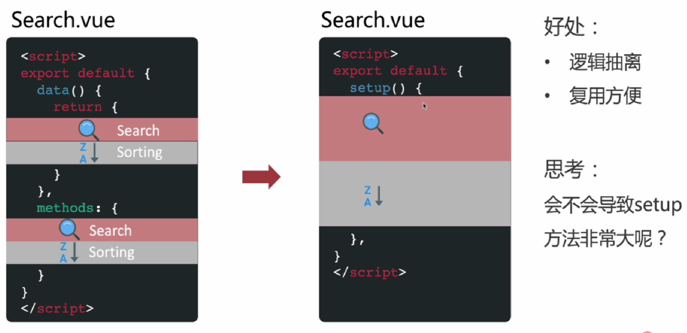

## 为什么会产生 Composition API?


## Vue2 逻辑复用方式

**缺点**

- Mixin (命名空间冲突、逻辑不清晰、不易复用)
- scoped slot 作用域插槽 (配置项多、代码分裂、性能差)
- Vue2 对 TS 支持不充分


## Composition API

**优点**

- 逻辑代码更少, 更集中, 更易扩展
- 更加丰富的 API 集成
- 对 TS 来说, 非常友好 (利于类型推导)


## Vue2 与 Vue3 编写风格上的区别



data 的变量定义 与 methods 的方法定义 -> 整合成一个 setup 中 


**会不会导致 setup 方法非常大?**

不会, 方法和变量可以被定义到不同的 js 文件中


**setup 选项中没有 this, 无法访问组件声明中的属性, 但是 Methods 中有**

主要原因是在执行 setup 时, 尚未创建组件的实例, 因此在 setup 中没有 this


**setup 函数接收两个参数 props 与 context**


**props 不可解构, context 有 attrs/slots/emit 属性** 

```typescript
// context 没解构的使用
setup (props, ctx) {
    console.log('🚀 ~ file: HomeChild.vue:15 ~ setup ~ attrs:', ctx.attrs)
}
// context 解构的使用
setup (props, { emit, attrs }) {
    console.log('🚀 ~ file: HomeChild.vue:15 ~ setup ~ attrs:', attrs)
}
```


**TS 类型推导在组合式 API 中非常的好用**


**使用组合式 API 可以很方便的抽离逻辑代码进行复用**


