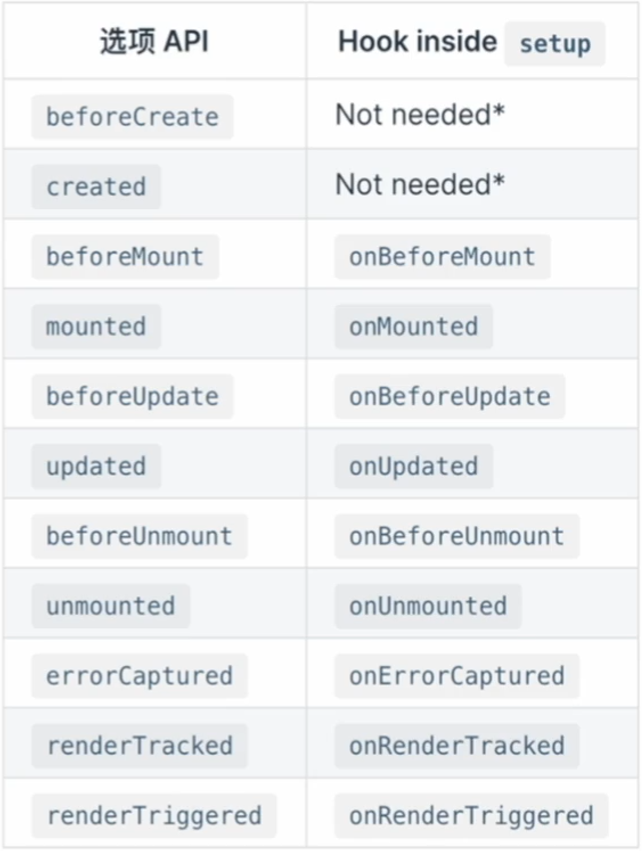

## Vue3 性能提升

与 Vue2.x 相比, mount 50% 提升, 内存占用小 120%


## Vue3 框架体积减少

- 核心代码 + Composition API: 13.5kb, 最小 11.75kb
- 所有 Runtime: 22.5kb (Vue2 是 32kb)


## Vue3 新特性

- TS 重写 Diff 算法, 使用 Proxy 性能更优, 框架体积更小
- 新的 Compiler, 通过注释标记提升框架性能
- Composition API, 模块化功能代码, 摒弃 `this`
- 更好的按需加载 (得益于 Tree Shaking), Webpack 打包时能更好的按需打包
- 新增: Fragment、Teleport、Suspense
- Vite 开发工具


> 为什么摒弃 `this` ?
>
> `this` 的指向不明确, 不清楚代码的调用在哪里
>
> 采用函数式编程, 虽然比较偏激, 但是带来的好处就是类型推导变得非常简单, 而且容易理解, 类似于 `python`


## 响应式原理

**Proxy 原理**

- proxy 代替 Object.defineProperty() 实现数据响应
- Proxy 是 ES6 的语法, 有浏览器兼容性问题


**Proxy 介绍**

MDN: Proxy 对象用于定义基本操作的自定义行为 (如属性查找、赋值、枚举、函数调用等)

- 拦截功能
- 提供对象访问
- 可以重写属性或者构造函数


**Proxy 为什么 比 Object.defineProperty 更好**

我们创建一个对象且声明属性, 使用 Object.defineProperty 去监听属性的变化, 也就是为每个属性赋予 get、set 方法, 因为对象可能是多层对象, 所以它需要深度去遍历每个属性, 这个时候遍历已经完成了。 但是新增，删除属性, 这个时候不会对新增、删除属性赋予 get、set 方法。所以, Vue2 才无法对对象属性进行新增、删除。所以开发的时候使用, Vue2 都是先声明属性, 再对数据进行操作。


Proxy 是不是对原始个对象进行监听, 而是去监听原始对象的代理对象, 代理对象只要变化, 就会触发对应 get、set 函数。


**ref vs reactive 用法与区别**

如何定义一个响应式变量或数组、对象?

使用 ref、reactive

```typescript
// 定义
const total = ref('Lin')
const state = reactive({
    lists: [
      {
        id: 1,
        text: 'zhang san'
      },
      {
        id: 2,
        text: 'li si'
      }
    ]
 })

// 使用
total.value = 'Pin'
state.lists.id = 3
```


**对于数组的操作**

vue2 中不能直接操作数组, 如 `this.arr[0] = 233`, 这样做的话, 数组改变了, 但是视图不会渲染

但是 vue3 中就可以直接操作数组, 且视图会渲染, 这是 vue3 的一个新的特点


**readonly 使用方法及场景**

```typescript
const original = reactive({ count: 0 })

const copy = readonly(original)

watchEffect(() => {
  // 用来做响应性追踪
  console.log(copy.count)
})

// 更改源属性会触发其依赖的侦听器
original.count++

// 更改该只读副本将会失败，并会得到一个警告
copy.count++ // warning!
```

场景: 比如, 子组件使用父组件的数据, 但是不想子组件去修改这个数据, 就可以使用这个属性了


**toRefs 的使用**

主要作用是从组合逻辑函数中返回一个响应式的对象


**reactive `深` 转换响应式副本, readonly 创建只读对象**


**isProxy/isReactive/isReadonly & toRaw/toRef/toRefs**

toRaw: 将响应式对象转换为普通对象

toRefs: 将非响应式对象转换为响应式的映射

- [ ] 其他 API 代补充


## Compiler 原理篇

**优化 - 1**

- 静态 Node 不再作更新处理 (hoistStatic -> SSR优化)
- 静态绑定的 class, id 不再作更新处理
- 结合打包标记 PatchFlag, 进行更新分析 (动态绑定)


**优化 - 2**

- 事件监听器 Cache 缓存处理 (cacheHandles)
- hoistStatic 自动针对多静态节点进行优化, 输出字符串


## Diff 算法比较

**Vue2 Diff 算法**

- 新旧节点对比, 先从前面对比, 再从后面对比, 抽离出一样的部分
- 从第一元素开始对比, 通过移位, 新增来实现更新


---


**Vue3 Diff 算法**

- patchChildren 根据是否存在 key 进行真正的 diff (静态标记 - 标记会动态改变的节点)
- 复用真实的 dom 节点, 避免不必要的性能开销
- 乱序时, 先找到最长递增子序列作为参考, 然后再移动, 减少比较次数, 提高了性能 (重点)


**核心就是子节点之间的对比, 主要分为两种情况**

- 子节点无 key (只作长度对比)
- 子节点有 key 


**无 key 时, 我们希望尽可能复用老节点**

- 比较新老 children 的 length 获取最小值
- 对于公共部分, 进行从新 patch 工作
- 如果长于旧, 则新增; 如果短于旧, 则删除


## watch 与 watchEffect

**watch 在 vue2、vue3 中区别**

```typescript
// vue3 中的写法
setup () {
    watch(count, (count, prevCount) => {
      /* ... */
    })
}

// vue2 中的写法
watch: {
    counter (newval:number, oldval:number) {
       console.log(newval, oldval)
    }
 }
```

[vue2.x中Watch 和 vue3.x中Watch使用和区别](https://blog.csdn.net/Liushiliu104/article/details/119987818)


**watchEffect 的使用**

```typescript
watchEffect(() => {
    const total = counter.value * 2
    console.log('total is:' + total)
}, {
    flush: 'pre', // pre | post | sync (触发的时机设置)
    onTrack: (e) => {
      console.log('onTrack -> e', e)
    }
})
```


**watch vs watchEffect**

- 都可以监听响应式对象的变化, 从而执行回调
- watchEffect 会默认执行一次, 而 watch 不会, 必须事件触发
- watchEffect 只接收函数作为回调函数


## 计算属性 (computed) 的使用

```typescript
// vue3 
let sum = computed(()=>{
   return num1.value + num2.value
})

let sum = computed({
 	get:()=>{
  	return num1.value *10
 	},
 	set:(value)=>{
  	return num1.value = value/10
 	}
})

// vue2
computed: {
    total () {
      console.log('🚀 ~ file: HomeView.vue:39 ~ total ~ counter:', this.counter)
      return this.counter * 2
    }
  	total:{
      get(){ // num1值改变时触发
       	return this.num1 * 10
      },
      set(value){ // mul值被改变时触发
       	this.num1 = value /10
      }
 	}
}

// 传递参数
const sltEle = computed(() => {
  return function (index) {
   	console.log('index', index) 
  }
}) 
```

[Vue2、Vue3 中 computed 的使用与不同 ](https://www.cnblogs.com/web-learn/p/15601335.html#:~:text=在vue2中，computed 写法： computed%3A { sum () {,return this.num1%2B this.num2 } } 在vue3 如果使用选项式API也可以这样写，主要看下组合式API的使用。)


## 如何在 ts 中配置  this 指向问题

```json
// tsconfig.json
"lib": [
  "esnext",
  "dom",
  "dom.iterable",
  "scripthost"
],
"noImplicitThis": false // 配置这个属性为 false 就不会再检查 this 指向问题
```


## implicitly has an ‘any‘ type 解决方法

```json
// tsconfig.json
"compilerOptions": {
    "target": "esnext",
    "module": "esnext",
    "noImplicitAny": false, // 配置这个属性就可以忽略 any 报错了
    "strict": true,
    "jsx": "preserve",
    "moduleResolution": "node",
    "skipLibCheck": true,
    "esModuleInterop": true,
    "allowSyntheticDefaultImports": true,
    "forceConsistentCasingInFileNames": true,
    "useDefineForClassFields": true,
    "sourceMap": true,
    "baseUrl": ".",
    "types": [
      "webpack-env"
    ],
}
```


## Vue3 生命周期钩子函数

**调试时使用的钩子函数**

onRenderTracked() 当组件渲染过程中追踪到响应式依赖时调用 (调用一次)

onRenderTriggered() 当响应式依赖的变更触发了组件渲染时调用 (改变就调用)


**Vue3 选项式 API 名称的改动**

destroy 改为 unmounted

beforeDestroy 改为 beforeUnmounted


**setup() 优先于 beforeCreate 执行**


**选项式 API 的生命周期, 及钩子函数 (钩子函数就是在 生命周期前面 加上 `on` 而已)**

	


## Suspense 简介 & 封装ErrorCapture组件

**Suspense 的基本使用**

```vue
<template>
  <div>
    <Suspense>
      <template #default> <!-- 异步加载的组件 -->
        <User />
      </template>
      <template #fallback> <!-- 加载过程中的提示 -->
        loadding ...
      </template>
    </Suspense>
  </div>
</template>
```


**封装 ErrorCapture 组件**

```vue
<!-- ErrorCapture 组件 -->
<template>
    <slot v-if="error" name="error" :err="error"></slot>
    <Suspense v-else>
        <template #default>
           <slot name="default"></slot>
        </template>
        <template #fallback>
            <slot name="fallback"></slot>
        </template>
    </Suspense>
</template>

<script lang="ts">
import { defineComponent, onErrorCaptured, ref } from 'vue'

export default defineComponent({
    setup () {
        const error = ref('')

        onErrorCaptured((err) => {
            error.value = err as unknown as string
            return true
        })


        return {
            error
        }
    }
})
</script>

<style scoped>

</style>
```

```vue
<!--使用 ErrorCapture 组件-->
<template>
  <SuspenseWithError>
      <template #error="{err}">
        {{ err }}
      </template>
      <template #default>
        <User /> <!-- 这个是自己定义的组件 -->
      </template>
      <template #fallback>
        loadding ...
      </template>
  </SuspenseWithError>
</template>

<script lang="ts">
import { defineComponent } from 'vue'
import User from '@/components/User.vue'
import SuspenseWithError from './components/SuspenseWithError.vue'

export default defineComponent({
  name: 'App',
  components: {
    User,
    SuspenseWithError
  }
});
</script>

<style>

</style>

```


## teleport 组件介绍

**使用场景**

有时候我们需要放置元素到根节点以外的位置 ( 例如 全屏遮罩 )


**teleport 组件**

- 控制部分 DOM 脱离根节点
- 可以使用本地化逻辑控制组件
- 适用于 fixed 或者 绝对定位的组件


**Teleport 的 to 属性可以指定的对象格式**

- id -> `<teleport to = “#id” >`
- claass -> `<teleport to = “.className” >`
- data -> `<teleport to = "[data-meta]" >`
- 动态 -> `<teleport :to = "props" >`


**Teleport 的基本能使用**

```vue
<!-- 使用 -->
<template>
  <teleport to='#end-of-body' > <!-- 通过 id 标签 -->
    hello teleport to end of body
  </teleport>
  <div>
    This should be at the top. 
  </div>
</template>
```

```html
<!-- 指定标签 -->
<body>
    <div id="app"></div>
    <div id="end-of-body"></div> <!-- 设置 id -->
 </body>
```


**Teleport 相关特性**

- `:disabled = true` (显示在 app 中)

- `:disabled = false` (显示在指定元素内)

- `disable` 不会隐藏元素, 要隐藏元素可以使用 `v-if`

```vue
<template>
  <teleport to='#end-of-body' :disabled="!toggle" v-if="toggle">
    hello from teleport
  </teleport>
  <div>toggle value: {{ toggle }}</div>
  <div>
    This should be at the top.
  </div>
  <button type="button" @click="toggleHandle">toggleHandle</button>
</template>
```


**总结**

- teleport 传送 DOM 到 to 属性指定的绑定位置
- teleport 是保持状态的 (比如视频播放状态会被保持, 不会中断播放), 使用 disbled 属性关闭传送, `disble = true` 关闭
- teleport 中可以传送多组 DOM, 按照先后顺序 `append`


# Vue2 与 Vue3 的总结

## 为什么用 Proxy API 代替 defineProperty API

Vue2 defineProperty API 对一个对象进行增加与删除属性都没有响应式, 用 API (pop、push) 操作数组也没有响应式, 数组用下标修改就可以 `arr[0] = 100`


Vue3 Proxy API 解决了 defineProperty 的不足, 可以对对象增加、删除属性, 可以使用数组操作 API


## API 上的区别 或者说 语法上的区别

setup 中没有 this

具有类型推导, 也就是在编辑器中鼠标放在变量或者方法上能显示其类型, 也就是说 vue3 能自动推导出类型


## Vue3 API 分类

**选项式 API (Options API)**

这类 API 主要是原来 vue2 里的一些 API, 如 watch, computed 写在 export default 里面的


**组合式 API (Composition API)**

该类 API 是指 vue3 可以抽离出来的 API, 如 setup 里面的 watch、watchEffect、computed


## 性能上的优化

**diff 算法优化**


**静态提升**


**事件监听缓存**

默认情况下 “绑定事件” 会被视为动态绑定，所以每次都会追踪他的变化。但是函数还是同一个函数所以没必要追踪，直接缓存起来复用就好了，这就是所说的事件监听缓存


**SSR 优化**


