## 使用 vue/cli 搭建 Vue3 基本框架

1. **全局安装 vue/cli**

```shell
npm install -g @vue/cli
```


2. **查看 vue/cli 版本**

```shell
vue --version
```

如果大于 4.5 就可以直接进行下面的步骤, 小于 4.5 就安装最新的 node 稳定版, 重新安装 vue/cli


3. 创建 **项目文件** 并 **选择配置**

**法一**

创建 项目文件

```shell
vue create vue3-dome
```

选择最后一个 `手动安装`

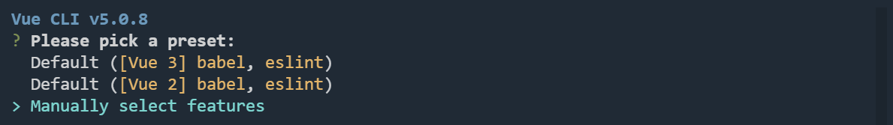

使用 `空格` 可选择选项

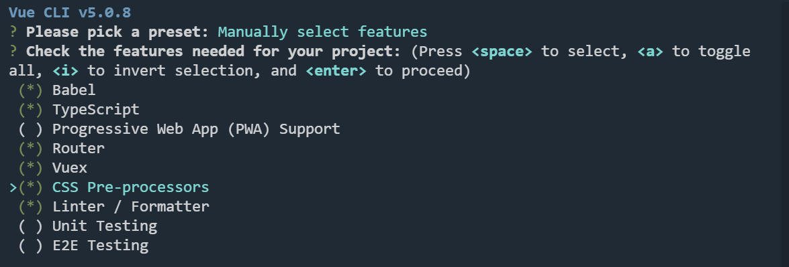

选择 3.x 版本

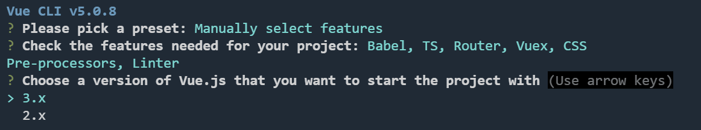

不使用 `class-style component`

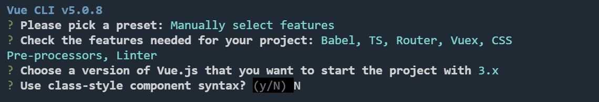

启动用 `TypeScript`

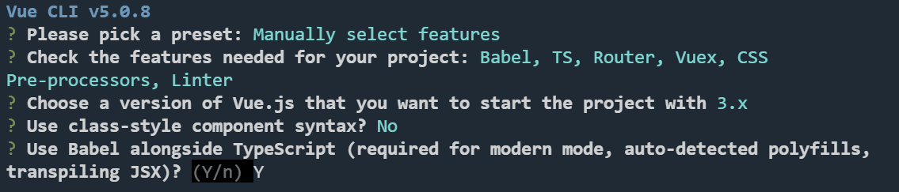

使用 `history` 模式

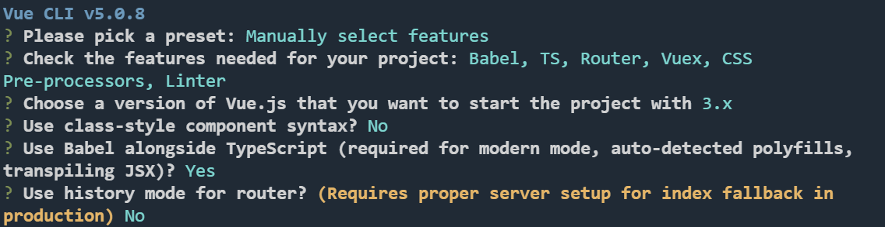

使用 默认的 `dart-sass`

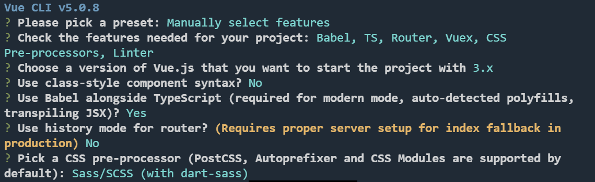

使用 `Standard config` 的 `ESLint`

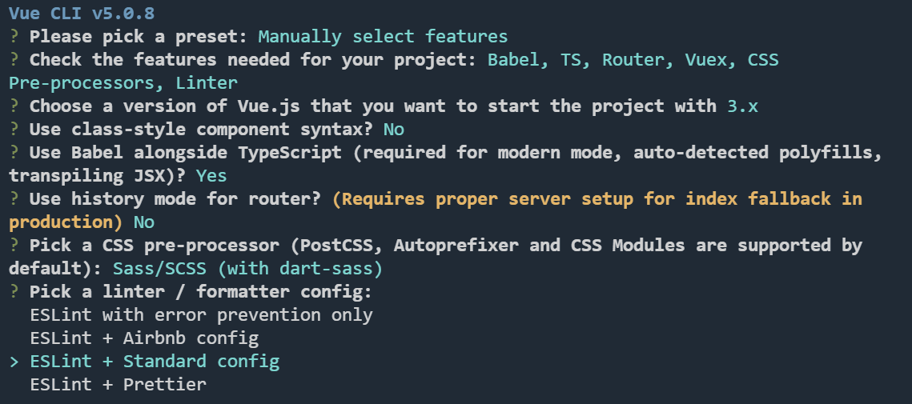

后面三个默认即可

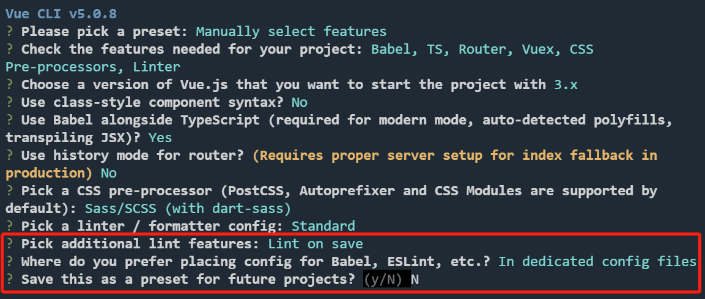

-- 等待最终完成即可 --


**法二**

1. 在当前项目, 创建项目文件

```shell
vue create .
```

2. 选择 默认 Vue3 安装简易安装即可

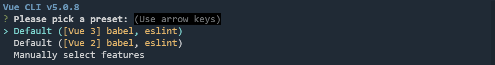	

3. 等待安装完成即可	

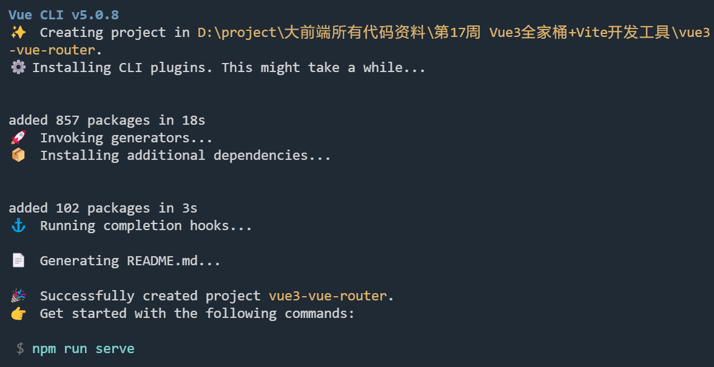	


## 使用 vite 搭建 Vue3 基本框架

1. **初始化项目**

```shell
npm init vite-app <project-name> //npm init vite-app vue3-vite-demo
```

2. **安装依赖**

进入文件夹中

```shell
cd vvue3-vite-demo
```

安装依赖

```shell
npm install
```


vite 具有热更新 与 冷启动

热更新: 模块的替换

冷启动: 没有编译的过程, 相当于启动一个 http 服务器, 只有当代码发生变化的时候, 才会去编译


Vite 提供打包构建命令, 按需进行打包


大型项目不建议使用 vite, 小项目可以先使用尝试下


## Vue-cli 重新安装原有默认配置

```shell
vue add typescript/router
```


## pnpm 使用 vite 构建项目

1. 构建项目

```shell
pnpm create vite vite-pinia-todolist -- --template vue-ts
```

2. 安装依赖

```shell
pnpm install
```

3. 安装 eslint、prettier 等插件

```shell
pnpm i -D eslint prettier vue-eslint-parser @typescript-eslint/eslint-plugin eslint-config-prettier eslint-plugin-prettier eslint-plugin-vue @typescript-eslint/parser
```

4. 初始化 eslint

```shell
npx eslint --init
```

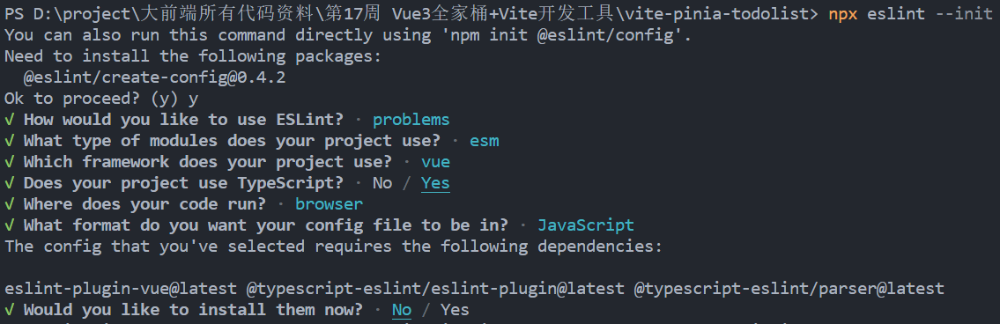	

根据上面配置选择即可

5. 修改 `.eslintrc.cjs` 文件

```javascript
module.exports = {
  env: {
    browser: true,
    es2021: true,
  },
  extends: ["eslint:recommended", "plugin:vue/vue3-recommended", "prettier"],
  overrides: [],
  parser: "vue-eslint=parser",
  parserOptions: {
    ecmaVersion: "latest",
    sourceType: "module",
  },
  plugins: ["vue", "@typescript-eslint"],
  rules: {
    'vue/script-setup-uses-vars': 'error',
    '@typescript-eslint/ban-ts-ignore': 'off',
    '@typescript-eslint/explicit-function-return-type': 'off',
    '@typescript-eslint/no-explicit-any': 'off',
    '@typescript-eslint/no-var-requires': 'off',
    '@typescript-eslint/no-empty-function': 'off',
    'vue/custom-event-name-casing': 'off',
    'no-use-before-define': 'off',
    '@typescript-eslint/no-use-before-define': 'off',
    '@typescript-eslint/ban-ts-comment': 'off',
    '@typescript-eslint/ban-types': 'off',
    '@typescript-eslint/no-non-null-assertion': 'off',
    '@typescript-eslint/explicit-module-boundary-types': 'off',
    '@typescript-eslint/no-unused-vars': [
      'error',
      {
        argsIgnorePattern: '^_',
        varsIgnorePattern: '^_'
      }
    ],
    'no-unused-vars': [
      'error',
      {
        argsIgnorePattern: '^_',
        varsIgnorePattern: '^_'
      }
    ],
    'space-before-function-paren': 'off',

    'vue/attributes-order': 'off',
    'vue/one-component-per-file': 'off',
    'vue/html-closing-bracket-newline': 'off',
    'vue/max-attributes-per-line': 'off',
    'vue/multiline-html-element-content-newline': 'off',
    'vue/singleline-html-element-content-newline': 'off',
    'vue/attribute-hyphenation': 'off',
    'vue/require-default-prop': 'off',
    'vue/require-explicit-emits': 'off',
    'vue/html-self-closing': [
      'error',
      {
        html: {
          void: 'always',
          normal: 'never',
          component: 'always'
        },
        svg: 'always',
        math: 'always'
      }
    ],
    'vue/multi-word-component-names': 'off'
  },
};
```


> 【注意】如果 安装目录下是 `.eslintrc.js` 需要改为 `.eslintrc.cjs`, 不然到第九步就会报错
>
> 因为你的项目被创建为 ES module。你可以看下 `package.json`，里面应该有 `type: module` 的项目
>
> 于是 `.js` 被默认为使用了 ES module 规范，如果自动生成的配置文件使用了 CommonJS，就会出错。`.cjs` 的 js 会告诉 node.js 它使用了 CommonJS 规范，所以就不会出错


6. 重新启动扩展数组, 让 `eslint` 工作, 按 `Ctrl + Shift + P` 打开控制面板, 输入 `restart`, 选择重启扩展宿主

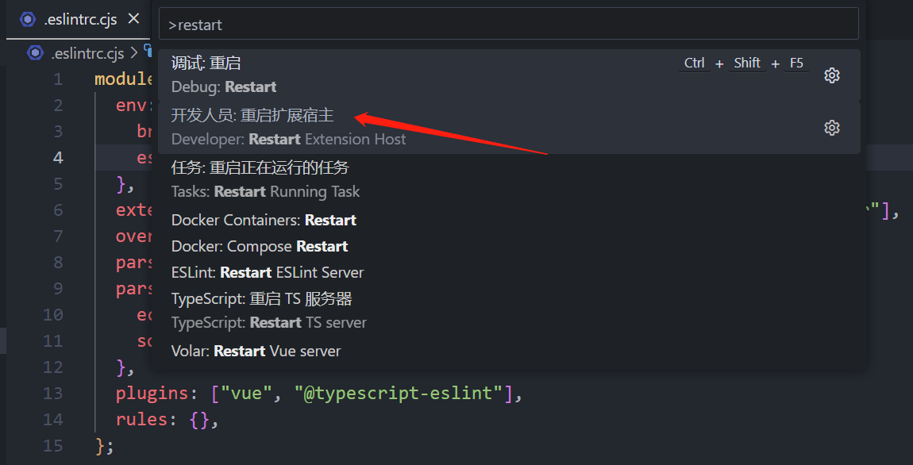	

7. 创建 `.prettierrc.cjs` (配置一些检测) `.prettierignore` (prettier 忽略一些文件) `.eslintignore` (eslint 忽略一些文件)

```javascript
// .prettierrc.js
module.exports = {
  printWidth: 100,
  tabWidth: 2,
  useTabs: false,
  semi: false, //未尾逗号
  vueIndentScriptAndStyle: true,
  singleQuote: true, // 单引号
  quoteProps: "as-needed",
  bracketSpacing: true,
  trailingComma: "none", //未尾分号
  jsxBracketSameLine: false,
  jsxSingleQuote: false,
  arrowParens: "always",
  insertPragma: false,
  requirePragma: false,
  proseWrap: "never",
  htmlWhitespaceSensitivity: "strict",
  endOfLine: "lf",
};
```

```javascript
// .prettierignore
/dist/*
.local
.output.js
/node_modules/**

**/*.svg
**/*.sh

/public/*

src/components/**/*.json
*-lock.yaml
```

```javascript
// .eslintignore
*.sh
node_modules
*.md
*.woff
*.ttf
.vscode
.idea
dist
/public
/docs
.husky
.local
/bin
Dockerfile
*-lock.yaml
```

8. 设置 `eslint` 、`prettier` 格式化命令

```json
{
  "name": "vite-pinia-todolist",
  "private": true,
  "version": "0.0.0",
  "type": "module",
  "scripts": {
    "dev": "vite",
    "build": "vue-tsc && vite build",
    "preview": "vite preview",
    "lint:eslint": "eslint --cache --max-warnings 0  \"{src,mock}/**/*.{vue,ts,tsx}\" --fix", // eslint 格式化
    "lint:prettier": "prettier --write  \"src/**/*.{js,json,tsx,css,less,scss,vue,html,md}\"" // prettier 格式化
  },
  "dependencies": {
    "vue": "^3.2.45"
  },
  "devDependencies": {
    "@typescript-eslint/eslint-plugin": "^5.54.0",
    "@typescript-eslint/parser": "^5.54.0",
    "@vitejs/plugin-vue": "^4.0.0",
    "eslint": "^8.35.0",
    "eslint-config-prettier": "^8.6.0",
    "eslint-plugin-prettier": "^4.2.1",
    "eslint-plugin-vue": "^9.9.0",
    "prettier": "^2.8.4",
    "typescript": "^4.9.3",
    "vite": "^4.1.0",
    "vue-eslint-parser": "^9.1.0",
    "vue-tsc": "^1.0.24"
  }
}
```

9. 使用 `prettier` 格式化, 出现下面结果表示, 格式化成功

```shell
npm run lint:prettier
```

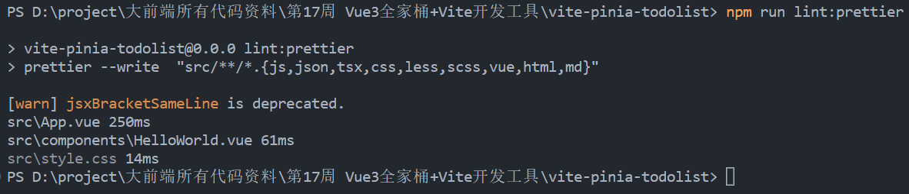	

10. 配置可以使用 `@` 路径, 配置 `vite.config.ts`、`tsconfig.json`, 并安装 `@types/node`

```json
// vite.config.ts
import { defineConfig } from 'vite'
import vue from '@vitejs/plugin-vue'
import { resolve } from 'path';

const pathResolve = (dir) => resolve(process.cwd(), '.', dir)

export default defineConfig({
  plugins: [vue()],
  resolve: {
    // 配置路径别名
    alias: {
      '@': pathResolve('src')
    },
  },
})
```

```json
// tsconfig.json
{
  "compilerOptions": {
    "target": "ESNext",
    "useDefineForClassFields": true,
    "module": "ESNext",
    "moduleResolution": "Node",
    "strict": true,
    "jsx": "preserve",
    "resolveJsonModule": true,
    "isolatedModules": true,
    "esModuleInterop": true,
    "lib": ["ESNext", "DOM"],
    "skipLibCheck": true,
    "noEmit": true,
    "baseUrl": ".", // 配置基础路径
    "paths": { // 用 @ 代替原来的路径
      "@/*": ["src/*"]
    }
  },
  "include": ["src/**/*.ts", "src/**/*.d.ts", "src/**/*.tsx", "src/**/*.vue"],
  "references": [{ "path": "./tsconfig.node.json" }]
}
```

安装 @types/node

```shell
pnpm i -D @types/node
```


## 使用 vue 专门的工具去构建 vue3 项目

### 1. 初始化构建

```shell
npm init vue@laster
```

### 2. 使用 一些配置

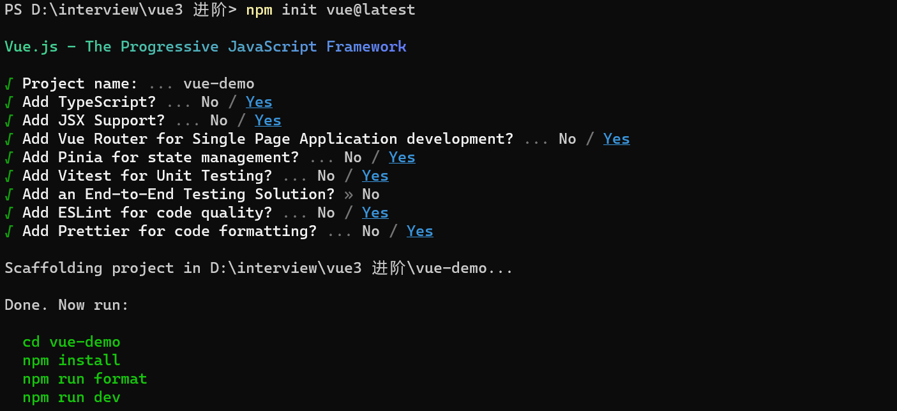


## Rollup 打包工具

压缩代码插件: `rollup-plugin-terser`

使用方法

```javascript
import { terser } from "rollup-plugin-terser"; // 引入

export default [
  {
    input: "src/main.js",
    output: {
      file: "dist/bundle.js",
      format: "cjs",
    },
    plugins: [terser()], // 使用
  },
  {
    input: "src/main.js",
    output: {
      file: "dist/bundle-es.js",
      format: "es",
    },
    plugins: [terser()],
  },
];
```


## npm run dev 的过程

- npm run dev 会先去本地的 node_moduels 的 bin 中找有没有 bin 可执行的 vite

- 没有的话会去 npm install -g (全局包进行查找)
- 还没有会去 环境变量中找
- 如果 环境变量里 还没有就会给你个报错
