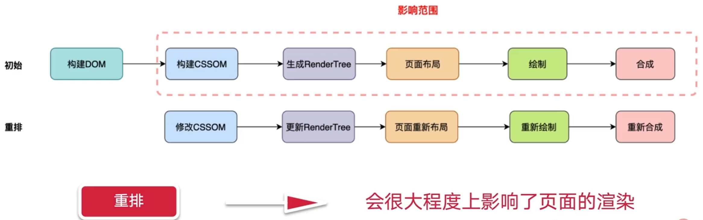

# 前端性能优化

## 简介

性能优化过程: 结合性能检测工具, 得到具体网站的性能瓶颈, 发现一个网站的性能的痛点

## 理解页面的生命周期

### 经典面试题

从浏览器地址栏输入URL后，到页面渲染出来，整个过程都发生了什么?

### 不同级别的回答

初级:首先浏览器发起请求，然后服务器返回数据，最后浏览器执行脚本和页面渲染

中级:知道浏览器输入 url 后会建立 tcp 链接，进行 http 的请求和响应在浏览器接收到服务器返回数据之后了解 html, css 构建渲染树以及 js 引擎解析和执行等

高级: 如何回答?

### 整个链路的流转 (整个页面的生命周期)

生命周期就是当用户输入 url 到页面渲染出来的整个链路过程

学习性能优化, 不能只知道具体方法, 要会部分性能优化缺乏全面的知识体系

### 从页面生命周期出发, 得出优秀的性能分析方案

1. http 请求优化

- 加载优化 (如 懒加载) -> 直接减少 http 请求, 减少不需要在首屏展示的非关键性信息占用了页面加载时间

- 构建优化 -> 合并资源减少 http 请求数量

2. DNS 解析优化

- DNS 解析是通过 递归、迭代去查询, 这样的话就比较耗时
- 可以采用 DNS 缓存技术, 优化 DNS 解析的时间

3. TCP 连接优化

- 复用 TCP 连接 - 升级 http 协议
- http 1.0 请求过程, 会不断创建 tcp 连接
- http 1.1 到 2.0 都是可以复用 tcp 连接的

4. 前后端交互优化

- 构建优化 -> 压缩资源, 减少响应数据包体积
- 缓存技术 -> 使用 http 缓存技术可以避免重复发送请求, 减少前后端资源的消耗

5. 关键路径优化

- 渲染优化 (减少重绘、重排) -> 提升渲染过程中性能优化

> **小结**
>
> 加载优化: 通过懒加载可以直接减少 http 请求，减少不需要在首屏展示的非关键性信息占用了页面加载时间
>
> 构建优化: 结合主流的构建工具 webpack，可以合并资源，压缩资源等减少 http 请求数量以及数据包体积
>
> 缓存优化: 避免重复请求
>
> 渲染优化: 是否存在不必要的重绘和回流

## 性能优化实例

### 加载性能优化

1. 什么是首屏时间?

浏览器显示第一屏页面所消耗的时间

2. 为什么要优化首屏时间

过长的等待时间，会让用户变得烦躁，i更轻易跳出或者关闭这个网站

3. 怎么优化首屏时间？

针对不是首屏的资源进行懒加载

4. 为什么一般都进行懒加载?

资源文件较大，加载完既费时又费力，用户也不一定会浏览到全部页面内容

### 构建优化

- 资源压缩 - 体积变小所传输的时间响应就会变少, 代码压缩、图片压缩
- 资源合并 - 将请求的多条资源合并成少量的请求，从而减少 http 请求数量

1. 压缩 JS -- 基于 webpack5

- 基于 ES6 推出了 Tree-shaking, 根据 import、export 的模块导入导出语法, 确定是否删除代码
- 配置 mode = production, 自动压缩
- ES6 -> terser-webpack-plugin 默认会开启多线程压缩来加速我们的构建压缩速度

2. 压缩 CSS

- 压缩 CSS 之前需要导出到独立的 css 文件
- 为什么不需要使用 style-loader  嵌入到 html 里面？
  - HTML CSS 的资源是无法并行的加载的, 降低了页面的性能
  - HTML CSS 任意代码的变更都会导致缓存的失效

3. 资源合并

- 是否把所有的is资源都合并到一个is文件中比较好? 这样只需要发送个请求
  - 初始 js 过大, 会影响首页加载
  - 无法有效的利用浏览器的缓存, 特别对于 npm 包变动较小的代码, 改了一点代码, 都会导致 npm 包缓存的失效
  - http 2.0 复用 tcp 连接, 并行发送多个请求, 请求之间高度独立, 解决了 http1.0、1.1 请求之间阻塞的问题
  - 所以, 实际开发中是不会把所有 js 合并到一个文件中
- 生产环境中 - 实践原则
  - 针对 node_modules 资源
    - 将 `node_modules` 模块打包成单独文件
    - 配置 `maxSize` 设定阈值, 防止 `vendor` 包过大
  - 针对业务代码
    - 设置 `common` 分组, 通过 `minChunks`配置项使用率较高的资源合并为 `Common` 资源
    - 对于可以懒加载的资源, 可以通过异步方式引入

- 使用打包结果可视化工具 (webpack bundle analyzer)
  - Bundle 包所包含的模块内容 -> 推断产物是否包含预期之外的模块
  - 确定模块体积大小与占比 -> 从而确定是否还存在优化空间

## 渲染优化

浏览器获取到资源之后进行渲染部分的相关性能优化

1. 浏览器渲染 ”黑盒“

**因为 dom 节点之间会相互关联，如果修改其中某一个 dom 节点的几何属性，其他元素的几何属性以及位置同样会受到相关的影响，这样就会发生重排**

**当我们对 DOM 的修改导致了样式的变化，类似于 颜色、背景色字体这些，这样的改变，浏览器就不需要重新计算元素的几何属性也就少了重新布局这一步骤了**

### 渲染性能 - 减少重排的操作

很简单相比较重绘，**重排更加消耗性能**，我们需要减少重排的操作

- DOM 元素几何属性的修改，例如 width、height、padding、margin、left、top 等
- 修改 dom 树的结构，增加删除移动 dom 节点
- 获取特定的属性值，例如 offsetTop、 scrollTop、clientWidth、clientHeight 等

### 渲染性能 - 避免样式频繁修改

### 渲染性能 - 动画优化

**一般动画为什么会设置16.6ms?**

- 屏慕的刷新频率为60Hz，也就是1s内刷新的帧数，通过换算1000ms / 60 = 16.6ms也就是 16.6ms 刷新一次
- 但是不同设备的刷新频率可能有所不同,  一直使用 16.6ms 刷新一次, 会导致动画的随机丢帧

**定时器做动画还会有哪些问题?**

- 可能会造成动画的卡顿
- 因为 浏览器的 Eevent Loop 机制, 先去执行主进程, 再执行异步任务队列, 如果主线程同步任务过长, 会导致定时器执行比预定的时间要晚一些

**引入 window 中的 requestAnimationFrame 方案**

- requestAnimationFrame 回调函数的执行机制, 是完全交由系统的刷新频率来决定的, 能保证回调函数在屏幕的刷新间隔都会调用一次, 避免了随机丢帧造成的卡顿现象
- 节省了 CPU 的开销, 当浏览器页面被隐藏 或 最小化之后, requestAnimationFrame 回调任务就会被暂停, 定时器需要主动的关闭

**节流 & 防抖**

节流防抖, 本身就是用于控制事件频率进行的优化

**本质**: 两者并不会减少事件的触发，而是减少事件触发时回调函数的执行次数

节流: 顾名思义，就是将短时间的函数调用以一个固定的频率间隔执行 (图片资源懒加载)

防抖：抖动现象本质就是指短时间内高频次触发。因此，我们可以把短时间内的多个连续调用合并成一次，也就是只触发一次回调函数。

(模糊搜索, 输入搜索 改为 按下确认键触发)

**Web Worker**

- 多计算的场景, 可使用 Web Worker 进行计算, 再将计算结果传回主进程

## 缓存性能优化

### http缓存优化关注点
缓存技术主要是针对重复请求的处理，是对已经获取资源的重用，提升网站性能和用户体验

### 浏览器缓存 - 强缓存

在再次请求的时候进行 缓存字段的检查，如果没有过期，直接从`浏览器本地缓存`中返回资源

	

### 浏览器缓存 - 协商缓存

在浏览器使用本地的缓存之前，`向服务器发送请求`，判断一下浏览器`本地的缓存是否过期`

