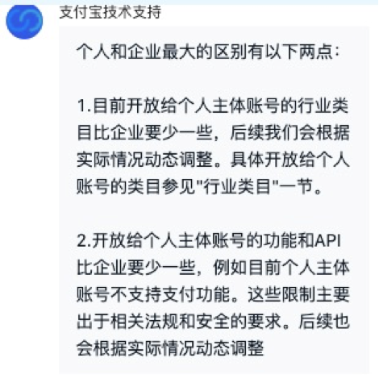
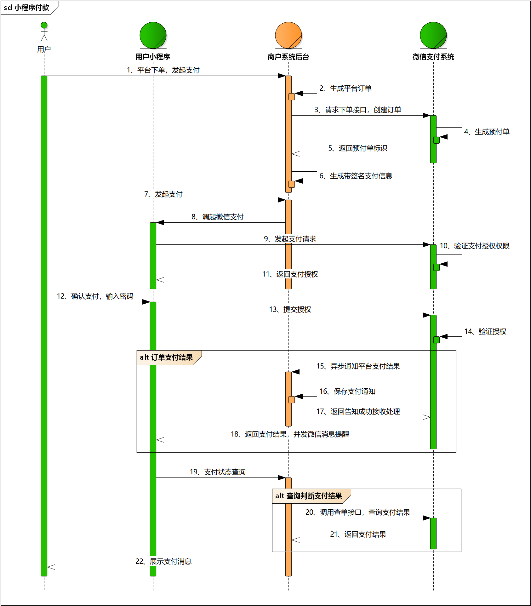
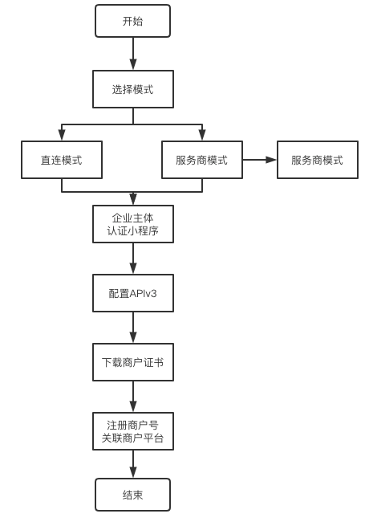
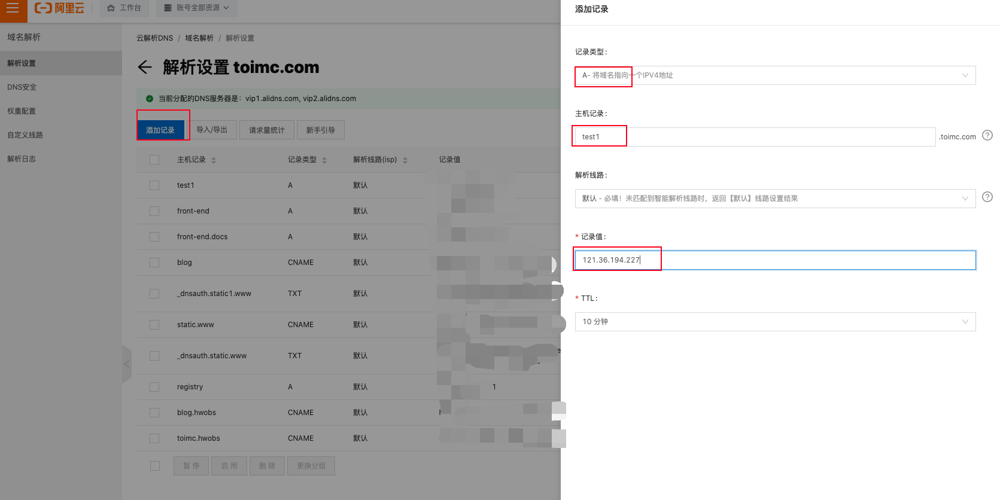
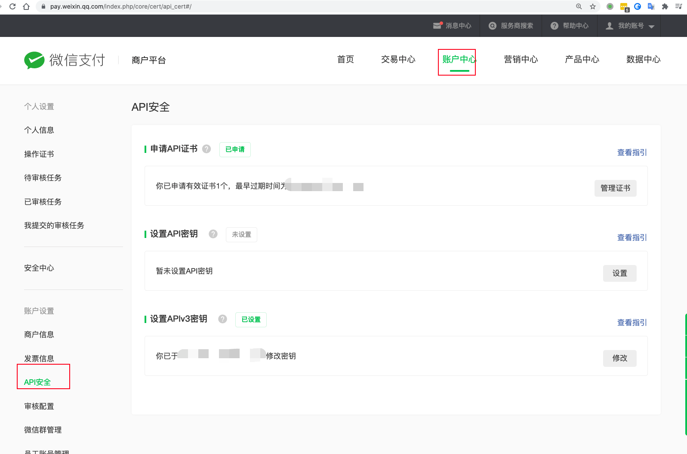
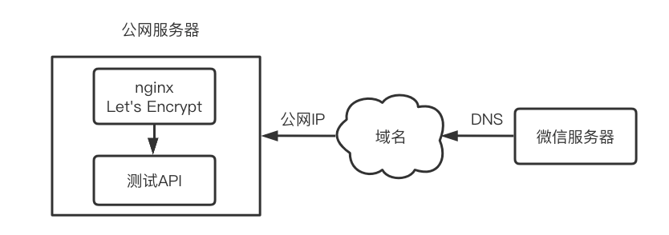
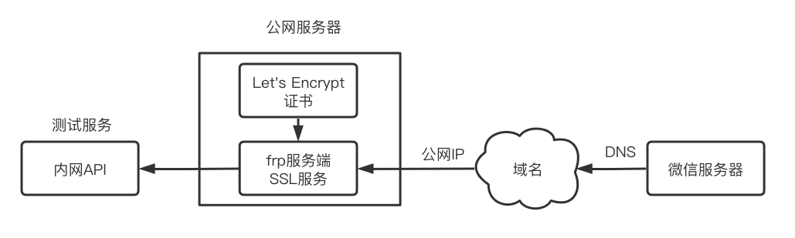
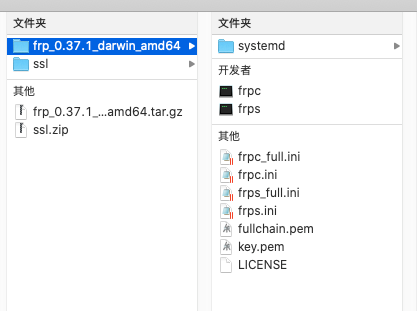
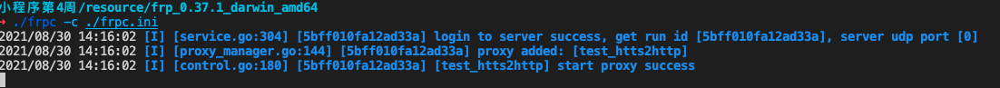
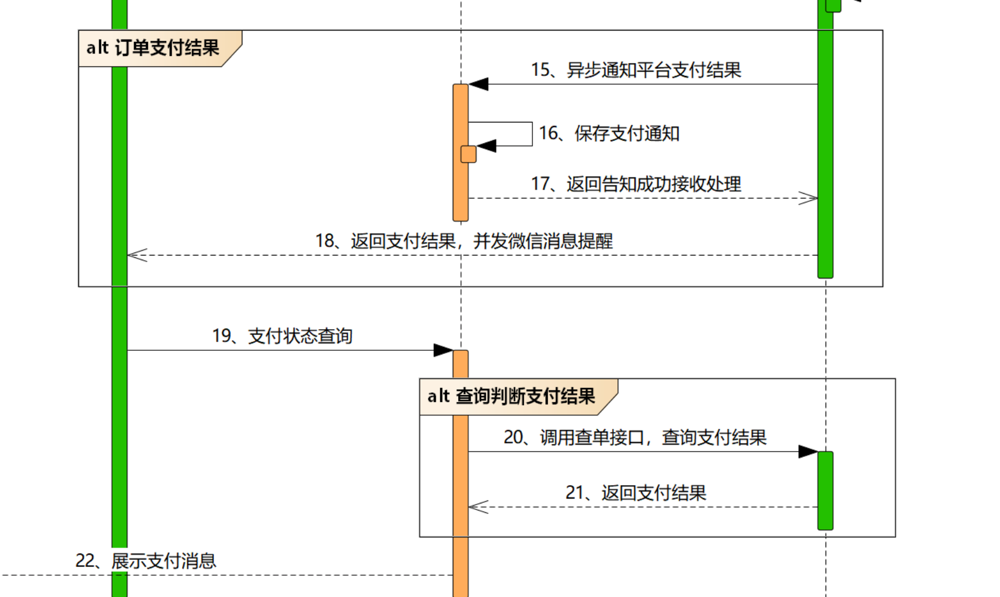

# 支付专题

支付作为工作中最常见的一个核心业务场景，前端同学其实需要做的东西有限，基本的流程、逻辑与难点都是在服务端。为了让前端同学，也能自己后续开发支付功能（Node.js），在本篇介绍了详细的从企业主体 -> 支付必要条件 ->微信小程序支付完整的闭环。

支付业务支撑：

- 商城应用
- 金融产品
- 充值应用（会员、点券）
- ...

支付应用场景：

- H5支付 -> 扫码、跳转App
- 小程序
- 移动App

支付的技术难点：

- 多平台（微信、支付宝、银联）
- 安全性（HTTPS、全流程日志、交易备案、数据安全性如灾备...）

常见的问题：

- 支付的开发流程，是不是前端不用管？只用调接口——是的，举例：小程序前端，其实上只是wx.requestPayment调起支付即可；
- 支付功能的开通容易吗？——容易，但是针对于个人，无法开通微信支付；个人能开通吗？——不行，但是可以使用第三方服务，比如JSAPI；
- 服务端对接常见的支付功能的流程是怎样的？——基本步骤如下：
  1. 申请微信小程序账号
  2. 微信小程序认证
  3. 申请商户平台账号
  4. 信小程序关联商户号
  5. 接入微信支付

## [#](https://front-end.toimc.com/notes-page/project/community-miniapp/12-支付专题.html#企业注册与税务)企业注册与税务

开办企业需要注意：

- 财税问题，如果零报税，则需要企业年报每年需要申报。

  开办企业不是玩，一定要负责任。而且，不良的企业负债，可能会影响到个人的征信，最终无法贷款、乘车等。

- 股份问题：如果多人开办，千万不要对半

  多人入股不能均分，不能0资金入股，分股用期权；

  设计退股机制，分红机制，以及债务问题解决办法；

  股权主要的目的是激励；

- 利益分配问题：天下熙熙皆为利来，天下攘攘皆为利往；

无论是支付宝还是微信，能够支持的支付主体只有企业、个体工商户和政府及事业单位等，共同点是**非个人**。

> 个人开发者，如果需要接入支付功能，也可以选择第三方服务商：
>
> - PayJS：开通费用300+手续费0.38%+服务费2%
> - PaysApi：月付手续费30-199+单笔费率从0.3~0.1%不等
> - PayBob：开通费用300+手续费0.38%+服务费1-2%
> - xorpay：月付手续费0-60+手续费0.38%+单笔手续费1.2%~0.5%不等

了解企业的注册流程及税务相关的知识，有助于学习支付相关的内容，扩展知识面。

企业注册比较麻烦的地方：

- 设立登记可能要跑几躺
- 税务登记 + 银行开户 折腾个10几天
- 报税：有季报+年报（工商年报次年6月前、汇缴清算不定）

但是，开办企业也是有好处的，举例：

- 作为团队出去接项目
- 大多数网上的服务针对的是企业
- 国家政府对于小微企业现在有大力的扶持

### [#](https://front-end.toimc.com/notes-page/project/community-miniapp/12-支付专题.html#注册企业流程)注册企业流程

企业注册流程中，需要注意的点：

- 准备工作（场地、人员、名称）

  公司查名各地有各地的查询网址或者在工商管理部门办事大厅进行现场查重（因为可能会重名，所以需要多准备几个）

  湖北企业查名查重：http://scjg.hubei.gov.cn/ICPSP/newNamecheck/nameCheck.action

  企业经营范围查询网址：https://jyfwyun.com/

- 提交资料（章程、住所证明）

  可以在当地的区（县）政务中心领取材料 或者在其网站上下载对应的模板文件，自行打印与复印。

- 办理税务+银行开户

  当办理完企业登记，并核发营业执照之后，可以输税务与企业银行开户。

  各家银行的开户费用大体相同，只是服务可能不一样，大家可以选择几家对比一下。推荐：招商与中兴。

  选择银行需要注意：

  - 服务问题；
  - 便利性——不要选择一家离自己办公点或者家很远的地方；

### [#](https://front-end.toimc.com/notes-page/project/community-miniapp/12-支付专题.html#个人工商户与企业区别)个人工商户与企业区别

共同点：

- 流程：个体要记账、交税、年检、审批，也会被抽查
- 税费：与小微企业无异

不同点：

- 债务：个体负责到底-无限，公司申请破产保护-有限责任
- 规模：个体8人不能上市，公司可以设立分机构、上市
- 业务：个体不能做进出口业务
- 经营 ：个体限制经营范围
- 税费：税种不一样，征收方式不一样

### [#](https://front-end.toimc.com/notes-page/project/community-miniapp/12-支付专题.html#自己注册vs代注册)自己注册vs代注册

**自己注册：**

优点：

- 没有费用

缺点：

- 需要花时间
- 需要了解整体流程
- 需要去税务、银行

**代注册：**

优点：

- 省时间
- 省事（办证、税务、企业银行、注册地、资料准备一条龙）

缺点：

- 费用不等，从3000-6000，甚至更多；
- 后续可能会有代账、年租费用等；
- 开票&办税也会收费；

### [#](https://front-end.toimc.com/notes-page/project/community-miniapp/12-支付专题.html#报税-开票)报税&开票

大多数企业会找一个代账会计或者找一个代账公司，而企业前期是无需会计的，完全可以零报税，操作流程非常的简单。

如果不清楚报税的流程，可以在税务机关处进行现场报税。

代账费用：从200元到300元/月不等。

找了代账的企业需要会看如下的几个表格，了解概念：

- 利润表：你赚了多少钱！
- 资产负债表：有没有欠你的钱、你欠的钱，余下的钱

除了找代账公司以外，Brain更推荐自己在前期进行记账与报税，流程不复杂，而且软件非常的智能，只用填入自己的收入与支出，财务软件可以自动形成报表。

财务软件推荐：

- 金碟
- 用友

云平台推荐：

- 柠檬云

> 季度+年度报税：3个月报季报，照着软件填

### [#](https://front-end.toimc.com/notes-page/project/community-miniapp/12-支付专题.html#企业日常的开销)企业日常的开销

主要分为如下几类：

- 资产：办公设备如打印机、办公桌椅、空调等
- 费用：租赁场地、水+电+网
- 费用：人员（会计、开发、产品等）
- ...

从上面的分类来看，注册企业没有什么费用，反而是维持一个企业的运转是需要大量费用的。大家在准备企业开办之前，需要有一定的准备。

> 不打没有准备的仗，也不要什么都准备好了，才开始！！

## [#](https://front-end.toimc.com/notes-page/project/community-miniapp/12-支付专题.html#支付前置必要条件)支付前置必要条件

下面以微信支付为例，来介绍，开发支付功能需要准备的前置条件：

- 选择合适的主体&场景（企业服务号）微信（支付宝）认证；
- 域名+公网IP+HTTPS；
- 云服务器ICP备案；

微信支付：

- 主体问题：订阅号非媒体号无法支付，推荐企业服务号；
- 小程序：必须HTTPS + ICP备案；
- 开通商户号，也需要企业主体，与公众号&小程序同一主体；

支付宝支付：

- 主体问题：企业主体；

- 行业类目及资质要求，[文档 (opens new window)](https://opendocs.alipay.com/iot/multi-platform/material)；

  而且对于实体店铺审核要严格一些。

	

说明：

- 关于ICP备案，可以参考：[阿里云 (opens new window)](https://beian.aliyun.com/)、[腾讯云 (opens new window)](https://cloud.tencent.com/product/ba)（前置条件：域名、云服务器）；
- HTTPS：必须要有域名，必须要有一台云服务器；
- 微信商户号，对应的网址：https://pay.weixin.qq.com/

## [#](https://front-end.toimc.com/notes-page/project/community-miniapp/12-支付专题.html#小程序支付流程)小程序支付流程

### [#](https://front-end.toimc.com/notes-page/project/community-miniapp/12-支付专题.html#开发技巧)开发技巧

- 技术问题，先读文档，查找官方的社区；
- 比较主流的支付方案，可以搜索一下有没有Node.js侧的npm包，例如：[wechatpay-axios-plugin (opens new window)](https://www.npmjs.com/package/wechatpay-axios-plugin)是一个非常不错的支持v2/v3的npm包，ts风格；
- 问stackoverflow、知乎、csdn等；
- 最后，才考虑自己开发轮子；

如果是学习，也可以从0到1的开发，了解整个支付的流程。

### [#](https://front-end.toimc.com/notes-page/project/community-miniapp/12-支付专题.html#流程图)流程图

学会看时序图：

- 最上面的是角色
- 从左往右看，按照箭头的方向走
- 从上往下看，是时间关系流程的流转



重点步骤说明：

步骤3：用户下单发起支付，商户可通过[JSAPI下单 (opens new window)](https://pay.weixin.qq.com/wiki/doc/apiv3/apis/chapter3_5_1.shtml)创建支付订单。

步骤8： 用户可通过[小程序调起支付API (opens new window)](https://pay.weixin.qq.com/wiki/doc/apiv3/apis/chapter3_5_4.shtml)调起微信支付，发起支付请求。

步骤15：用户支付成功后，商户可接收到微信支付支付结果通知[支付通知API (opens new window)](https://pay.weixin.qq.com/wiki/doc/apiv3/apis/chapter3_5_5.shtml)。

步骤20：商户在没有接收到微信支付结果通知的情况下需要主动调用[查询订单API (opens new window)](https://pay.weixin.qq.com/wiki/doc/apiv3/apis/chapter3_5_2.shtml)查询支付结果。

## [#](https://front-end.toimc.com/notes-page/project/community-miniapp/12-支付专题.html#搭建开发环境)搭建开发环境

### [#](https://front-end.toimc.com/notes-page/project/community-miniapp/12-支付专题.html#支付准备)支付准备

	

按照上面的流程，准备相关的开发环境，参考指引：[官方链接(opens new window)](https://pay.weixin.qq.com/wiki/doc/apiv3/open/pay/chapter2_8_1.shtml)

### [#](https://front-end.toimc.com/notes-page/project/community-miniapp/12-支付专题.html#配置https-域名解析)配置Https+域名解析

说明：

- 前置的章节有介绍HTTPS介绍，[文章](https://front-end.toimc.com/notes-page/project/community-miniapp/07-安全域名相关.html#ssl证书申请)

- 域名解析以阿里云为例：

  

### [#](https://front-end.toimc.com/notes-page/project/community-miniapp/12-支付专题.html#配置api密钥)配置API密钥

[商户平台 (opens new window)](https://pay.weixin.qq.com/)-> 账户中心 -> API安全，分别配置API商户证书 + APIv3密钥



### [#](https://front-end.toimc.com/notes-page/project/community-miniapp/12-支付专题.html#配置frp内网穿透)配置frp内网穿透

为了方便测试微信支付通知，有两种方案：

- 上传API服务到测试服务器：

  	

- 使用本地的API服务，需要使用frp工具把远程的通知转发到本地：

  	

配置过程如下：

- 下载frp包到本地，见[release (opens new window)](https://github.com/fatedier/frp/releases)（darwin是mac系统、windows、Linux要分arm与amd）；

- SSH到远程服务端，新建配置文件`/home/frp/frps.ini`：

  ```nginx
  [common]
  bind_port = 10010
  vhost_https_port = 443
  ```

- 在服务器上运行frps，使用docker镜像：

  ```text
  docker run --restart=always --network host -d -v /home/frp/frps.ini:/etc/frp/frps.ini --name frps snowdreamtech/frps
  ```

- 下载let's encrypt创建的SSL证书 -> 一般在acme生成的目录中->放置到本地解压的frp目录中；

  	

- 在本地创建`frpc.ini`文件

  ```nginx
  [common]
  server_addr = 121.36.194.226
  server_port = 10010
  
  [test_htts2http]
  type = https
  custom_domains = test1.toimc.com
  
  plugin = https2http
  plugin_local_addr = 127.0.0.1:3000
  
  # HTTPS 证书相关的配置
  plugin_crt_path = ./fullchain.pem
  plugin_key_path = ./key.pem
  plugin_host_header_rewrite = 127.0.0.1
  plugin_header_X-From-Where = frp
  ; test1.toimc.com -> vhost_https_port 443
  ; test1.toimc.com:443 -> frp -> 127.0.0.1:3000
  ```

- 使用frpc运行该配置文件：

  ```text
  chmod +x frpc
  ./frpc -c ./frpc.ini
  ```

  运行成功的提示：

  

如果运行失败，可以在[官方网站 (opens new window)](https://gofrp.org/)上查询失败的原因：

- 官方FAQ：https://gofrp.org/docs/faq/
- 官方Issues：https://github.com/fatedier/frp/issues

## [#](https://front-end.toimc.com/notes-page/project/community-miniapp/12-支付专题.html#apiv3-vs-apiv2)APIv3 vs APIv2

为了在 保证支付 安全的前提下，带给商户 简单、一致且易用的开发体验，我们推出了全新的微信支付API v3。

相较于之前的微信支付API，主要区别是：

- 遵循统一的REST 的设计风格
- 使用JSON作为数据交互的格式，不再使用XML
- 使用基于非对称密钥的SHA256-RSA的数字签名算法，不再使用MD5或HMAC-SHA256
- 不再要求HTTPS客户端证书
- 使用AES-256-GCM，对回调中的关键信息进行加密保护

APIv3的文档：[官方链接(opens new window)](https://pay.weixin.qq.com/wiki/doc/apiv3/wechatpay/wechatpay-1.shtml)

两个接口的对接图：

| **V3**               | **规则差异** | **V2**             |
| -------------------- | ------------ | ------------------ |
| JSON                 | 参数格式     | XML                |
| POST、GET 或 DELETE  | 提交方式     | POST               |
| AES-256-GCM加密      | 回调加密     | 无需加密           |
| RSA 加密             | 敏感加密     | 无需加密           |
| UTF-8                | 编码方式     | UTF-8              |
| 非对称密钥SHA256-RSA | 签名方式     | MD5 或 HMAC-SHA256 |

**推荐：在没有接触v2的情况下，直接上手v3；如果有老旧业务，也可以对接到v3，或者不动原有的业务，直至v2的证书快过期，需要更换时，再切换到v3。**

## [#](https://front-end.toimc.com/notes-page/project/community-miniapp/12-支付专题.html#jsapi统一下单)JSAPI统一下单

### [#](https://front-end.toimc.com/notes-page/project/community-miniapp/12-支付专题.html#签名生成)签名生成

[官方文档(opens new window)](https://pay.weixin.qq.com/wiki/doc/apiv3/wechatpay/wechatpay4_0.shtml)

商户可以按照下述步骤生成请求的签名，微信支付API v3 要求商户对请求进行签名，微信支付会在收到请求后进行签名的验证。

**如果签名验证不通过，微信支付API v3将会拒绝处理请求，并返回`401 Unauthorized`。**

签名生成的步骤有：

- 构造签名串

  签名串一共有五行，每一行为一个参数。行尾以 `\n`（换行符，ASCII编码值为0x0A）结束，包括最后一行。如果参数本身以`\n`结束，也需要附加一个`\n`。

  ```js
  HTTP请求方法\n
  URL\n
  请求时间戳\n
  请求随机串\n
  请求报文主体\n 
  ```

- 计算签名值

  使用商户私钥对待签名串进行SHA256 with RSA签名，并对签名结果进行Base64编码得到签名值，示例：

  ```bash
  $ echo -n -e \
  "GET\n/v3/certificates\n1554208460\n593BEC0C930BF1AFEB40B4A08C8FB242\n\n" \
    | openssl dgst -sha256 -sign apiclient_key.pem \
    | openssl base64 -A
    uOVRnA4qG/MNnYzdQxJanN+zU+lTgIcnU9BxGw5dKjK+VdEUz2FeIoC+D5sB/LN+nGzX3hfZg6r5wT1pl2ZobmIc6p0ldN7J6yDgUzbX8Uk3sD4a4eZVPTBvqNDoUqcYMlZ9uuDdCvNv4TM3c1WzsXUrExwVkI1XO5jCNbgDJ25nkT/c1gIFvqoogl7MdSFGc4W4xZsqCItnqbypR3RuGIlR9h9vlRsy7zJR9PBI83X8alLDIfR1ukt1P7tMnmogZ0cuDY8cZsd8ZlCgLadmvej58SLsIkVxFJ8XyUgx9FmutKSYTmYtWBZ0+tNvfGmbXU7cob8H/4nLBiCwIUFluw==
  ```

第一步比较好实现：

```js
// HTTP请求方法\n
// URL\n  https://www.imooc.com/path1/path2/?query1=value
// 请求时间戳\n
// 请求随机串\n
// 请求报文主体\n
const tmpUrl = new URL(url)
const nonceStr = rand.generate(16)
const pathname = /http/.test(url) ? tmpUrl.pathname : url
const timestamp = Math.floor(Date.now() / 1000)
const message = `${method.toUpperCase()}\n${pathname + tmpUrl.search
  }\n${timestamp}\n${nonceStr}\n${body ? JSON.stringify(body) : ''}\n`
```

第二步的RSA的算法实现思路：

- 找一下微信社区有没有类似实现
- 找一下网上有没有类似实现
- 找一下有没有npm开源包
- 找一下stackoverflow或者百度
- ...

如果 以上都没有，那么就要自己造轮子了。但是这样的场景少之有少，哈哈，还轮不上大家自己上。

```js
export const rsaSign = (message) => {
  const keyPem = fs.readFileSync(
    path.join(__dirname, 'keys/apiclient_key.pem'),
    'utf-8'
  )
  const signature = crypto
    .createSign('RSA-SHA256')
    .update(message, 'utf-8')
    .sign(keyPem, 'base64')
  return signature
}
```

然后使用上面合成的message进行签名即可：

```js
const signature = rsaSign(message)
```

**如何验证呢？**

方案一：

Linux或者mac直接使用openssl来进行验证

```text
echo -n -e \
"GET\n/v3/certificates\n1554208460\n593BEC0C930BF1AFEB40B4A08C8FB242\n\n" \
  | openssl dgst -sha256 -sign apiclient_key.pem \
  | openssl base64 -A
```

方案二：

使用老师给大家准备的docker镜像进行验证`lw96/libressl`：

```bash
# 1.创建容器
docker run -itd --name ssl lw96/libressl

# 2.拷贝证书
docker cp 证书目录 容器id:/tmp

# 3.进入容器
docker exec -it ssl sh

# 4.使用上面的一样的命令
echo -n -e \
"GET\n/v3/certificates\n1554208460\n593BEC0C930BF1AFEB40B4A08C8FB242\n\n" \
  | openssl dgst -sha256 -sign /tmp/apiclient_key.pem \
  | openssl base64 -A
```

### [#](https://front-end.toimc.com/notes-page/project/community-miniapp/12-支付专题.html#authentication头部密钥串)Authentication头部密钥串

微信支付商户API v3要求请求通过`HTTP Authorization`头来传递签名。`Authorization`由*认证类型*和*签名信息*两个部分组成。

下面我们使用命令行演示如何生成签名。

```text
Authorization: 认证类型 签名信息
```

具体组成为：

1.认证类型，目前为WECHATPAY2-SHA256-RSA2048

2.签名信息

- 发起请求的商户（包括直连商户、服务商或渠道商）的商户号`mchid`
- [商户API证书 (opens new window)](https://pay.weixin.qq.com/wiki/doc/apiv3/wechatpay/wechatpay3_1.shtml)`serial_no`，用于[声明所使用的证书 (opens new window)](https://pay.weixin.qq.com/wiki/doc/apiv3/wechatpay/wechatpay3_1.shtml#part-3)（管理员账号登录微信商户管理后台，在API安全里面点击查看证书可以获取。）
- 请求随机串`nonce_str`
- 时间戳`timestamp`
- 签名值`signature`
- 注：以上五项签名信息，无顺序要求。

`Authorization` 头的示例如下：（注意，示例因为排版可能存在换行，实际数据应在一行）

```bash
Authorization: WECHATPAY2-SHA256-RSA2048 mchid="1900009191",nonce_str="593BEC0C930B
```

最终我们可以组一个包含了签名的HTTP请求了。

```bash
$ curl https://api.mch.weixin.qq.com/v3/certificates -H 'Authorization: WECHATPAY2-SHA256-RSA2048 mchid="1900009191",nonce_str="593BEC0C930BF1AFEB40B4A08C8FB242",signature="uOVRnA4qG/MNnYzdQxJanN+zU+lTgIcnU9BxGw5dKjK+VdEUz2FeIoC+D5sB/LN+nGzX3hfZg6r5wT1pl2ZobmIc6p0ldN7J6yDgUzbX8Uk3sD4a4eZVPTBvqNDoUqcYMlZ9uuDdCvNv4TM3c1WzsXUrExwVkI1XO5jCNbgDJ25nkT/c1gIFvqoogl7MdSFGc4W4xZsqCItnqbypR3RuGIlR9h9vlRsy7zJR9PBI83X8alLDIfR1ukt1P7tMnmogZ0cuDY8cZsd8ZlCgLadmvej58SLsIkVxFJ8XyUgx9FmutKSYTmYtWBZ0+tNvfGmbXU7cob8H/4nLBiCwIUFluw==",timestamp="1554208460",serial_no="1DDE55AD98ED71D6EDD4A4A16996DE7B47773A8C"'
```

代码示例：

```js
// config.js
const mchid = 'xxxxx'

const serialNo = 'xxxxx'

export default {
  // ...
  mchid,
  serialNo
}

// WxPay.js
export const getSignHeaders = (url, method, body) => {
  // HTTP请求方法\n
  // URL\n  https://www.imooc.com/path1/path2/?query1=value
  // 请求时间戳\n
  // 请求随机串\n
  // 请求报文主体\n
  const tmpUrl = new URL(url)
  const nonceStr = rand.generate(16)
  const pathname = /http/.test(url) ? tmpUrl.pathname : url
  const timestamp = Math.floor(Date.now() / 1000)
  const message = `${method.toUpperCase()}\n${pathname + tmpUrl.search
    }\n${timestamp}\n${nonceStr}\n${body ? JSON.stringify(body) : ''}\n`
  // const keyPem = fs.readFileSync(path.join(__dirname, 'keys/apiclient_key.pem'), 'utf-8')
  // const signature = crypto.createSign('RSA-SHA256').update(message, 'utf-8').sign(keyPem, 'base64')
  const signature = rsaSign(message)
  // 1.解决问题：windows上无openssl -> lw96/libressl
  // 2.需要传递apiclient_key.pem给镜像 -> 因为只有在容器里面才能执行openssl
  // 3.method1: docker cp  method2: -v
  // 4.使用openssl进行签名 -> 对比crypto产生的base64串

  return {
    headers: `WECHATPAY2-SHA256-RSA2048 mchid="${config.mchid}",nonce_str="${nonceStr}",signature="${signature}",timestamp="${timestamp}",serial_no="${config.serialNo}"'`,
    nonceStr,
    timestamp
  }
}
```

### [#](https://front-end.toimc.com/notes-page/project/community-miniapp/12-支付专题.html#接口说明)接口说明

接口文档：[JSAPI(opens new window)](https://pay.weixin.qq.com/wiki/doc/apiv3/apis/chapter3_5_1.shtml)

**请求URL：**https://api.mch.weixin.qq.com/v3/pay/transactions/jsapi

**请求方式：**POST

形成随机的商户订单号：

```js
export const getTradeNo = () => {
  // 服务端侧：out_trade_no -> 订单号 -> timestamp + type + id
  // 1.Date.now()  2.Moment/dayjs
  // 2. 01-小程序
  return (
    dayjs().format('YYYYMMDDHHmmssSSS') +
    '01' +
    Math.random().toString().substr(-10)
  )
}
```

最终，统一订单的接口：

```js
export const wxJSPAY = async (params) => {
  const {
    description,
    goodsTag,
    total,
    user: { openid },
    detail,
    sceneInfo,
    settleInfo
  } = params
  // https://api.mch.weixin.qq.com/v3/pay/transactions/jsapi
  // 小程序用户侧： description，amount:{total} -> token -> id -> openid

  // 参数准备
  const wxParams = {
    appid: config.AppID,
    mchid: config.mchid,
    description,
    out_trade_no: getTradeNo(),
    time_expire: dayjs().add(30, 'm').format(),
    attach: '',
    notify_url: 'https://test1.toimc.com/public/notify',
    goods_tag: goodsTag,
    amount: {
      total: parseInt(total),
      currency: 'CNY'
    },
    payer: {
      openid
    },
    detail,
    scene_info: sceneInfo,
    settle_info: settleInfo
  }
  const url = 'https://api.mch.weixin.qq.com/v3/pay/transactions/jsapi'
	// 头部签名  
  const { headers, nonceStr, timestamp } = getSignHeaders(
    url,
    'post',
    wxParams
  )
  try {
    const result = await instance.post(url, wxParams, {
      headers: {
        Authorization: headers
      }
    })
    console.log('🚀 ~ file: WxPay.js ~ line 53 ~ wxJSPAY ~ result', result)
    const { status, data } = result
    if (status === 200) {
      return { prepayId: data.prepay_id, nonceStr, timestamp }
    } else {
      logger.error(`wxJSPAY error: ${result}`)
    }
  } catch (error) {
    logger.error(`wxJSPAY error: ${error.message}`)
  }
}
```

## [#](https://front-end.toimc.com/notes-page/project/community-miniapp/12-支付专题.html#用户支付)用户支付

### [#](https://front-end.toimc.com/notes-page/project/community-miniapp/12-支付专题.html#支付步骤)支付步骤

前端步骤：

- 用户下单 -> 发起请求，让后端生成支付参数
- 用户支付 -> wx.requestPayment调起支付

后端步骤：

- 使用JSAPI统一下单，产生的prepay_id（预支付id）
- 构造签名串 -> 计算签名
- 返回前端支付参数

### [#](https://front-end.toimc.com/notes-page/project/community-miniapp/12-支付专题.html#准备支付参数)准备支付参数

第一步：

**造签名串**

```text
签名串一共有四行，每一行为一个参数。行尾以\n（换行符，ASCII编码值为0x0A）结束，包括最后一行。
如果参数本身以\n结束，也需要附加一个\n
```

**参与签名字段及格式：**

```text
小程序appId
时间戳
随机字符串
订单详情扩展字符串
```

第二步：

**计算签名：**

```bash
echo -n -e \
"wx8888888888888888\n1414561699\n5K8264ILTKCH16CQ2502SI8ZNMTM67VS\nprepay_id=wx201410272009395522657a690389285100\n" \
  | openssl dgst -sha256 -sign apiclient_key.pem \
  | openssl base64 -A
```

参数：

| 参数名             | 变量      | 类型[长度限制] | 必填 | 描述                                                         |
| :----------------- | :-------- | :------------- | :--- | :----------------------------------------------------------- |
| 时间戳             | timeStamp | string[1,32]   | 是   | 当前的时间，其他详见[时间戳规则 (opens new window)](https://pay.weixin.qq.com/wiki/doc/api/wxpay_v2/jiekouguize/chapter1_2.shtml#part-5)。 示例值：1414561699 |
| 随机字符串         | nonceStr  | string[1,32]   | 是   | 随机字符串，不长于32位。 示例值：5K8264ILTKCH16CQ2502SI8ZNMTM67VS |
| 订单详情扩展字符串 | package   | string[1,128]  | 是   | 小程序下单接口返回的prepay_id参数值，提交格式如：prepay_id=*** 示例值：prepay_id=wx201410272009395522657a690389285100 |
| 签名方式           | signType  | string[1,32]   | 是   | 签名类型，默认为RSA，仅支持RSA。 示例值：RSA                 |
| 签名               | paySign   | string[1,512]  | 是   | 签名，使用字段appId、timeStamp、nonceStr、package计算得出的签名值 示例值 |

### [#](https://front-end.toimc.com/notes-page/project/community-miniapp/12-支付专题.html#后端接口开发)后端接口开发

创建路由：

```js
// 微信用户下单
router.post('/wxOrder', userController.wxOrder)
```

创建`wxOrder`下单方法：

```js
async wxOrder (ctx) {
  const { body } = ctx.request
  // 为什么订单的total即商品的金额信息不能从前端传？
  // 从前端传商品的id -> 在后端查询对应id的商品价格
  const { description, total } = body
  const user = await User.findByID(ctx._id)
  const params = {
    description,
    total,
    user
  }
  // 1. 发起wxPay -> prepay_id
  const { prepayId, nonceStr, timestamp } = await wxJSPAY(params)
  // 小程序appId
  // 时间戳
  // 随机字符串
  // 订单详情扩展字符串
  const paySign = rsaSign(`${config.AppID}\n${timestamp}\n${nonceStr}\nprepay_id=${prepayId}\n`)
  // 2. 拼接数据返回前端
  ctx.body = {
    code: 200,
    data: {
      appId: config.AppID,
      timestamp,
      nonceStr,
      package: `prepay_id=${prepayId}`,
      signType: 'RSA',
      paySign
    }
  }
}
```

### [#](https://front-end.toimc.com/notes-page/project/community-miniapp/12-支付专题.html#前端模拟下单-支付)前端模拟下单&支付

```js
async order () {
  const res = await this.$u.api.orderGoods({
    description: 'toimc测试商品',
    total: 1 // 单位分
  })
  // console.log('🚀 ~ file: order.vue ~ line 23 ~ order ~ res', res)
  const { code, data } = res
  if (code === 200) {
    this.orderParams = data
    uni.showToast({
      icon: 'none',
      title: '下单成功',
      duration: 2000
    })
  }
},
pay () {
  uni.requestPayment({
    provider: 'weixin',
    orderInfo: {
      description: 'toimc测试商品',
      total: 1 // 单位分
    },
    timeStamp: this.orderParams.timestamp + '',
    nonceStr: this.orderParams.nonceStr,
    package: this.orderParams.package,
    signType: this.orderParams.signType,
    paySign: this.orderParams.paySign,
    complete: function (res) {
      console.log('🚀 ~ file: order.vue ~ line 47 ~ pay ~ res', res)
      // errMsg: "requestPayment:ok" -> 支付成功
      // errMsg: "requestPayment:fail cancel" -> 取消
    }
  })
}
```

## [#](https://front-end.toimc.com/notes-page/project/community-miniapp/12-支付专题.html#订单查询)订单查询

用户支付成功后，需要接受微信平台的被动通知或者是主动查询订单的支付状态。

原因：可能用户支付成功后，微信后台已经给了用户侧反馈，但是由于网络问题，商户平台可能未收到通知。



### [#](https://front-end.toimc.com/notes-page/project/community-miniapp/12-支付专题.html#微信主动通知)微信主动通知

frp转发通知，只需要创建对应的接口，然后在JSAPI统一下单的接口中指定回调的域名即可。

**请求方式：**POST

**回调URL：**该链接是通过基础下单接口中的请求参数“notify_url”来设置的，要求必须为https地址。请确保回调URL是外部可正常访问的，且不能携带后缀参数，否则可能导致商户无法接收到微信的回调通知信息。回调URL示例： “https://pay.weixin.qq.com/wxpay/pay.action”

**通知规则**

用户支付完成后，微信会把相关支付结果和用户信息发送给商户，商户需要接收处理该消息，并返回应答。

对后台通知交互时，如果微信收到商户的应答不符合规范或超时，微信认为通知失败，微信会通过一定的策略定期重新发起通知，尽可能提高通知的成功率，但微信不保证通知最终能成功。（通知频率为15s/15s/30s/3m/10m/20m/30m/30m/30m/60m/3h/3h/3h/6h/6h - 总计 24h4m）

**通知报文**

支付结果通知是以POST 方法访问商户设置的通知url，通知的数据以JSON 格式通过请求主体（BODY）传输。通知的数据包括了加密的支付结果详情。

下面详细描述对通知数据进行解密的流程：

1. 用商户平台上设置的APIv3密钥【[微信商户平台 (opens new window)](https://pay.weixin.qq.com/)—>账户设置—>API安全—>设置APIv3密钥】，记为key；
2. 针对resource.algorithm中描述的算法（目前为AEAD_AES_256_GCM），取得对应的参数nonce和associated_data；
3. 使用key、nonce和associated_data，对数据密文resource.ciphertext进行解密，得到JSON形式的资源对象；

**注：** AEAD_AES_256_GCM算法的接口细节，请参考[rfc5116 (opens new window)](https://tools.ietf.org/html/rfc5116)。微信支付使用的密钥key长度为32个字节，随机串nonce长度12个字节，associated_data长度小于16个字节并可能为空。

### [#](https://front-end.toimc.com/notes-page/project/community-miniapp/12-支付专题.html#主动通知后端接口)主动通知后端接口

解密方法：

```js
export const decryptByApiV3 = ({
  associate, // 加密参数 - 类型
  nonce, // 加密参数 - 随机数
  ciphertext // 加密密文
} = {}) => {
  ciphertext = decodeURIComponent(ciphertext)
  ciphertext = Buffer.from(ciphertext, 'base64')

  const authTag = ciphertext.slice(ciphertext.length - 16)
  const data = ciphertext.slice(0, ciphertext.length - 16)

  const decipher = crypto.createDecipheriv(
    'aes-256-gcm',
    config.apiV3Key,
    nonce
  )
  decipher.setAuthTag(authTag)
  decipher.setAAD(Buffer.from(associate))

  let decryptedText = decipher.update(data, null, 'utf8')
  decryptedText += decipher.final()
  return decryptedText
}
```

创建接口：

```text
// 获取支付通知
router.post('/notify', adminController.wxNotify)
```

接口详情`wxNotify`：

```js
// 微信支付回调通知
async wxNotify (ctx) {
  const { body } = ctx.request
  const { resource_type: type, resource } = body
  if (type === 'encrypt-resource') {
    const { ciphertext, associated_data: associate, nonce } = resource
    const str = decryptByApiV3({
      associate,
      nonce,
      ciphertext
    })
    console.log('🚀 ~ file: AdminController.js ~ line 326 ~ AdminController ~ wxNotify ~ str', str)
    // todo 入库，并修改订单的支付成功的状态
  }
  console.log(
    '🚀 ~ file: AdminController.js ~ line 294 ~ AdminController ~ wxNotify ~ body',
    body
  )
  ctx.body = {
    code: 200
  }
}
```

> 收到订单通知后，需要保存通知中的状态与数据（微信订单号）。

### [#](https://front-end.toimc.com/notes-page/project/community-miniapp/12-支付专题.html#订单查询接口)订单查询接口

[官方文档(opens new window)](https://pay.weixin.qq.com/wiki/doc/apiv3/apis/chapter3_5_2.shtml)

有两种方案：

- 微信支付订单号查询
- 商户订单号查询（一般采用这种）

**请求URL：** `https://api.mch.weixin.qq.com/v3/pay/transactions/out-trade-no/{out_trade_no}`

**请求方式：**GET

**请求参数**

| 参数名     | 变量         | 类型[长度限制] | 必填 | 描述                                                         |
| :--------- | :----------- | :------------- | :--- | :----------------------------------------------------------- |
| 直连商户号 | mchid        | string[1,32]   | 是   | query 直连商户的商户号，由微信支付生成并下发。 示例值：1230000109 |
| 商户订单号 | out_trade_no | string[6,32]   | 是   | path 商户系统内部订单号，只能是数字、大小写字母_-*且在同一个商户号下唯一。 特殊规则：最小字符长度为6 示例值：1217752501201407033233368018 |

示例：

```text
https://api.mch.weixin.qq.com/v3/pay/transactions/out-trade-no/1217752501201407033233368018?mchid=1230000109
```

> 这里要特别注意，url中有路径参数与query参数

后端代码：

```js
import qs from 'qs'

// 微信支付订单查询 out_trade_no
//  https://api.mch.weixin.qq.com/v3/pay/transactions/out-trade-no/{out_trade_no}
export const getNofityByTradeNo = async (id) => {
  try {
    let url = `https://api.mch.weixin.qq.com/v3/pay/transactions/out-trade-no/${id}?`
    const params = {
      mchid: config.mchid
    }
    url += qs.stringify(params)
    const { headers, nonceStr, timestamp } = getSignHeaders(url, 'get')
    const result = await instance.get(url, {
      headers: {
        Authorization: headers
      }
    })
    console.log(
      '🚀 ~ file: WxPay.js ~ line 147 ~ getNofityByTradeNo ~ timestamp',
      timestamp
    )
    console.log(
      '🚀 ~ file: WxPay.js ~ line 147 ~ getNofityByTradeNo ~ nonceStr',
      nonceStr
    )
    console.log('🚀 ~ file: WxPay.js ~ line 53 ~ wxJSPAY ~ result', result)
    // todo result.data -> trade_state trade_type -> 存储订单的其他信息
  } catch (error) {
    logger.error(`getNofityByTradeNo error: ${error.message}`)
  }
}
```

至此，完成的小程序支付的一个完整的闭环。

> 关于退款与退款通知与下单&订单通知是类似，不再提供示例。