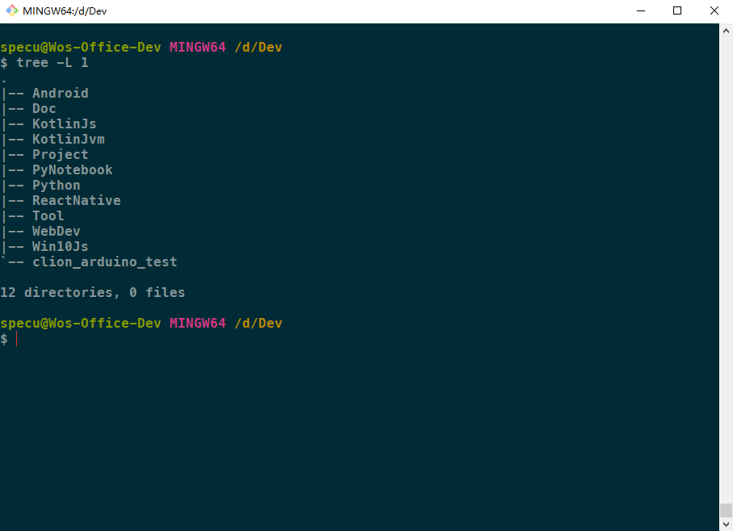

## 下载 tree 命令的 二进制包，安装 tree 命令工具

- 打开进入 [Tree for Windows](https://link.zhihu.com/?target=http%3A//gnuwin32.sourceforge.net/packages/tree.htm) 页面，选择下载 `Binaries zip` 文件。
- 解压压缩包，找到压缩包内的 `bin` 目录，将 `bin` 目录下的 `tree.exe` 复制
- 找到 `C:\\Program Files\Git\usr\bin` 目录，将 `tree.exe` 粘贴到该目录下，安装即完成

## 测试 tree 命令

进入 Git-Bash，输入 `tree` 命令，如果安装成功，命令可以正常执行。

	