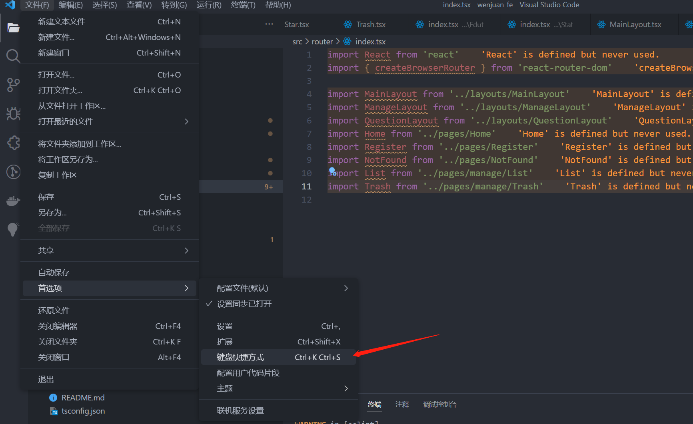
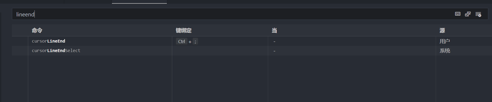

# vscode 常用快捷键

## 常用快捷键

打开 侧边栏 `Ctrl + B`

打开 终端工具 `Ctrl + J`

当然啦，也直接点击右上角进行操作

全选 选中字符快捷键 `Ctrl + F2`

选择 光标末尾快捷键 `Shift + End` (我的机械键盘的 3 个圆的符号)

选择一列光标 - 拖动鼠标中键

移动整段代码快捷键: `Alt + Up` 或者 `Alt + Down`

删除整行代码快捷键: `Ctrl + Shift + K`, 可以配合拖动鼠标中键实现多行删除

配置光标移动到 **行尾**

配置完，按 `Ctrl + ;` 自动跳到行尾
