# vscode 版本管理

## vscode 配置

1. vscode 要做可视化版本管理，主要安装两个插件 `Git History` `GitLens`

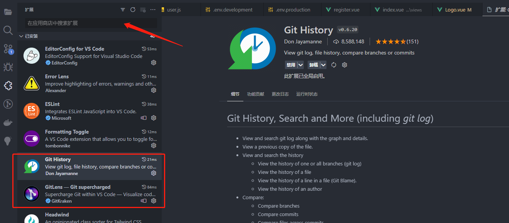


2. 直接搜索就可以找到了，安装完成后，你在最左边可以看到，分支管理图标

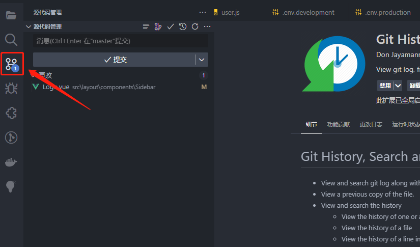	


3. [各插件集合文件](https://pan.baidu.com/s/1j7lAgJMgN9a7R7cJRdJMrg?pwd=89km)，下载后，点击导入文件，导入配置文件

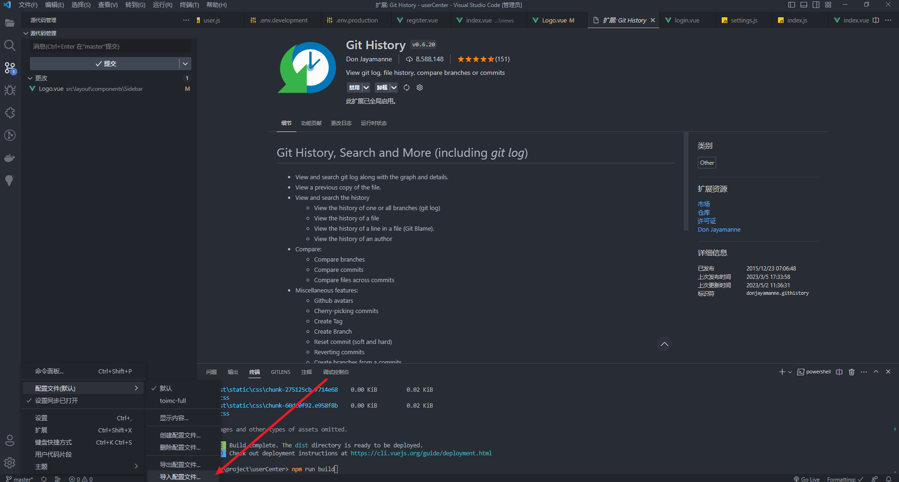


4. 选择配置文件为 `lin` 即可完成配置

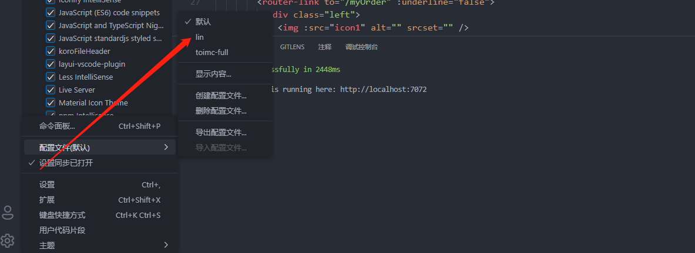


## git 配置

1. 配置全局用户名、邮箱、密码

```shell
git config --global user.name "Your Name" // 用户名
git config --global user.email "youremail@yourdomain.com" // 邮箱
git config --global user.password “abc0506abc” // 密码
```

2. 查看是否配置成功

```shell
git config --list
```


## 分支操作

1. 拉下远程仓库的代码，先拷贝链接

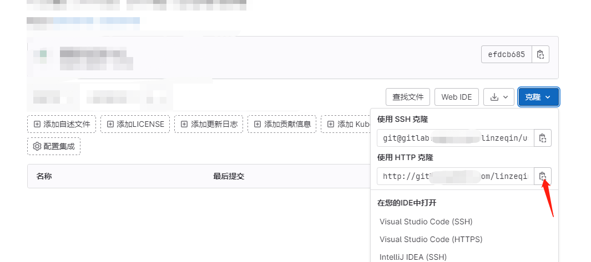	


2. 克隆远程仓库代码

git 命令方式 (推荐)

在本地找个文件夹，使用克隆命令, 克隆命令即可克隆下来

```shell
git clone http://gitlab.gwmvs.com/fsdgasgasg.git
```


vscode 插件克隆代码，点击克隆

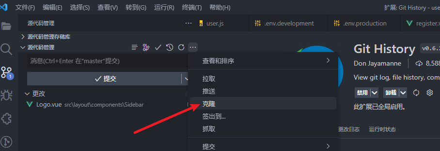	

输入克隆地址即可，完成克隆

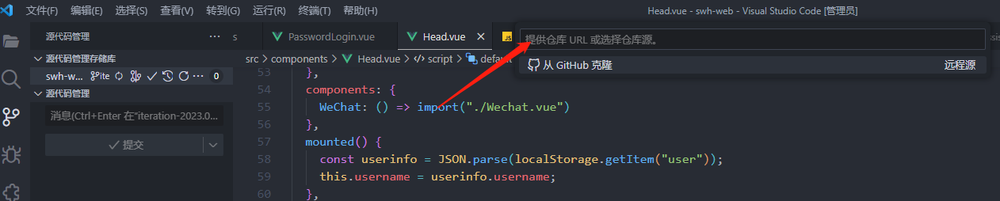


### 新增分支

新增，在原分支上，根据不同的提交记录，新增分支

当前操作就是在`修改域名`的提交记录，这个记录上新增新分支

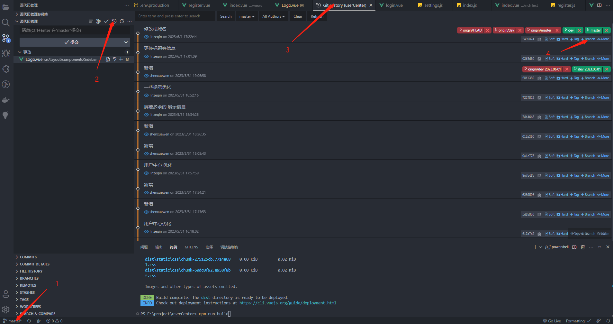

输入分支名称，分支名称通常为，你所需要迭代的 `dev + 需求名称`

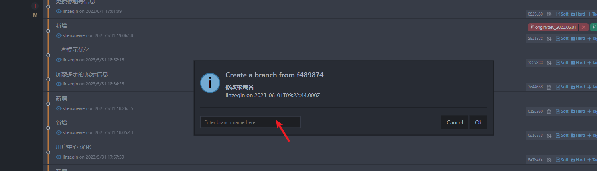


### 切换分支

切换 本地分支 与 远程分支

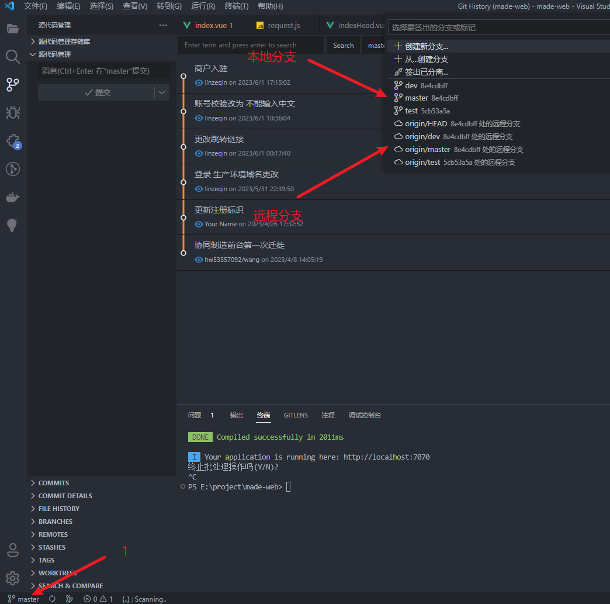	


### 删除分支

选择你要的删除的本地分支即可，只能删除本地分支，无法删除远程分支

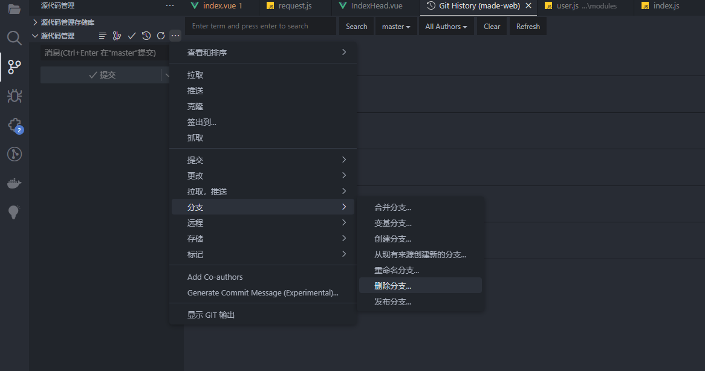

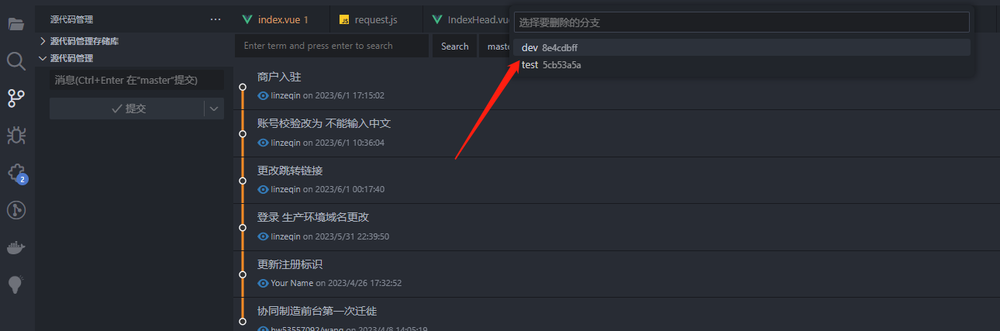


**[注]**

vscode 上主要删除本地分支，远程仓库的分支需要上 gitLab 上修改


4. 代码上传

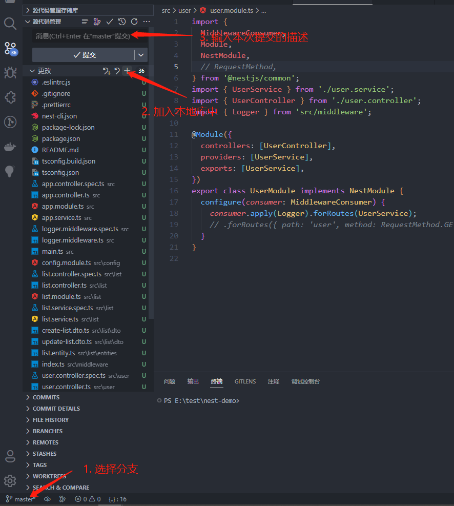	

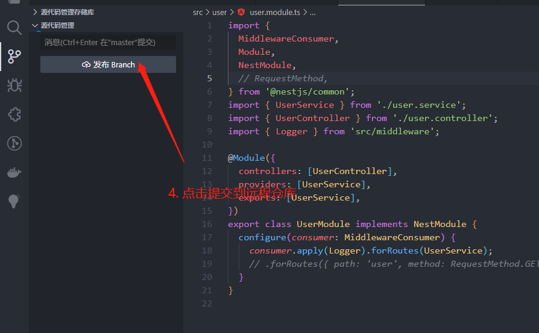	

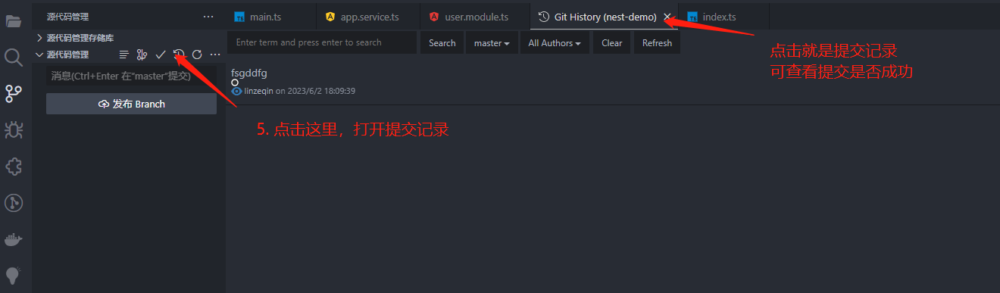


### 合并分支

1. 选择分支 `dev` ，将 `iteration-2023.06.02`，合到 `dev`

要把代码合到哪个分支，就切换到哪个分支

当前分支为 `dev`

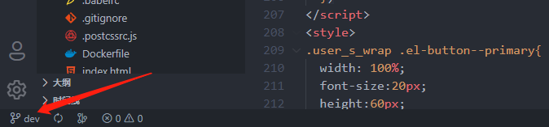	

将 `iteration-2023.06.02`，合到 `dev`

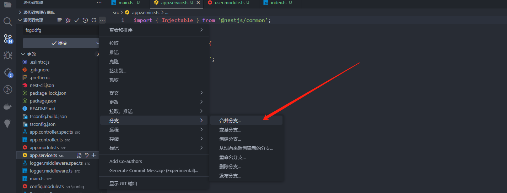

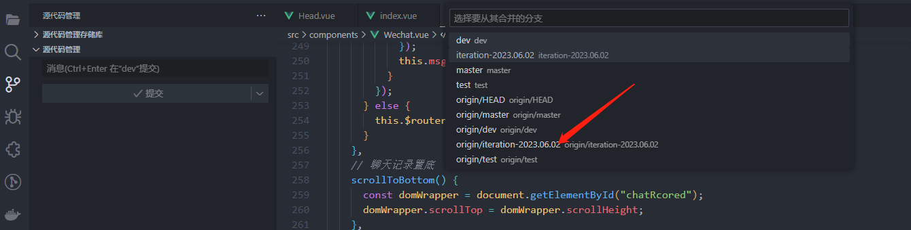


## 冲突解决

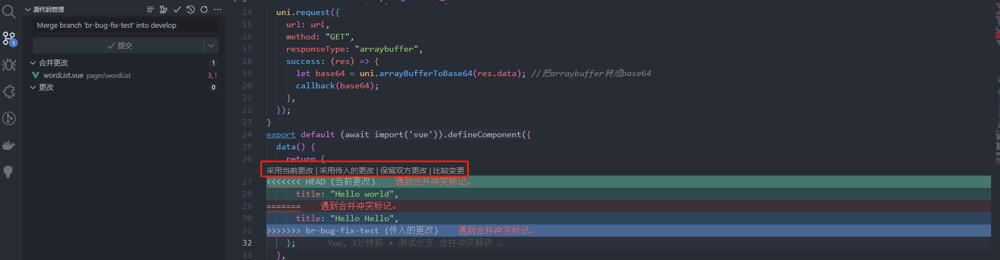

我们可以根据 两份代码更改时间 或 实际产品需求进行确定，保留哪部分的代码，或者都保留

因为，我们装入了 `Git History` 这个插件，我们将鼠标放在哪一行就可以知道是谁修改了代码，什么时间修改的，可以便于判断两份代码的提交时间

便于合并，与追踪问题


也可以，点击 **比较变更**，查看两份代码的差别，选择要保留哪份代码


中的 `=======` 是 **当前代码** 与 **传入代码** 的分割线


**[注]**

多解决几次冲突，就能基本熟悉其操作了


## 分支管理

### 分支命名

- `all-test` 测试分支
- `master` 生产分支
- `dev` 开发分支
- `br-bug-fix` bug 解决分支
- `br-emergency-online` 紧急上线分支


### 开发情况

1. 大版本更新开发 (有大需求，大功能，改动较大)

将 `dev` 分支复制一个分支下来，在复制下来的那个分支上开发

命名：`dev-迭代版本名称-时间`

开发完成之后，先合并到 `all-test` 分支上，由测试发布到线上测试环境，进行测试，测试完成后

等最终上线时间，由 `dev-迭代版本名称-时间`合并到 `dev`，将 `dev` 分支合并到 `master`


2. 紧急 bug 修复，需求上线

使用 `br-emergency-online`，分支进行开发，通常适用于 紧急线上 bug，紧急需求的情况，就在这个分支进行开发

开发完成后，合并到 `all-test` 分支上，由测试发布到线上测试环境，进行测试，测试完成后

等最终上线时间，由 `br-emergency-online`合并到 `dev`，将 `br-emergency-online` 分支合并到 `master`


3. 日常更新，优化

使用 `br-bug-fix` ，分支进行开发，使用于 平常日常更新优化，比如 改改不重要的小 bug、修改文字、修改一点样式、增加小功能等等

开发完成后, 合并到 `all-test` 分支上，由测试发布到线上测试环境，进行测试，测试完成后

等最终上线时间，由 `br-bug-fix`合并到 `dev`，将 `br-bug-fix` 分支合并到 `master`


**这样做分支管理的优点 ！！！**

大版本更新，如果延期不会影响到，日常更新迭代

同理，1、2 延期也不会影响其他开发


**为什么都要和到 `dev` 再到 `master` ，其他几个分支，而不是直接合并到 `master`?**

如果出现紧急 bug，可以立马回退 `master` 分支代码，并使用 `dev` 分支部署到测试环境进行测试，解决问题


**[注]**

每次版本上线后，都需要把 `master` 再合到 `dev`

再将 `dev` 合到`br-bug-fix`、`br-emergency-online` 


### 当前代码暂时存储
选择储藏

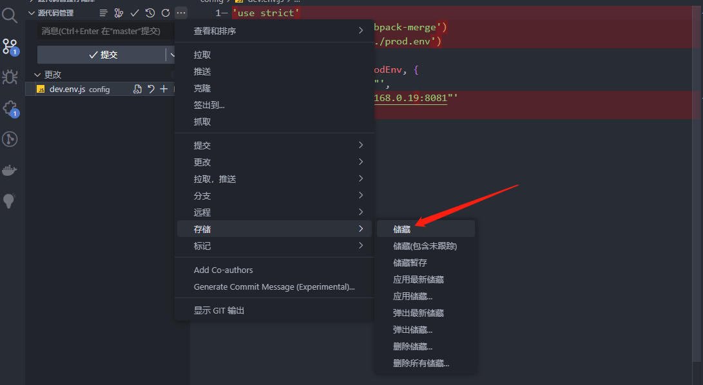	

将当前代码 储藏起来

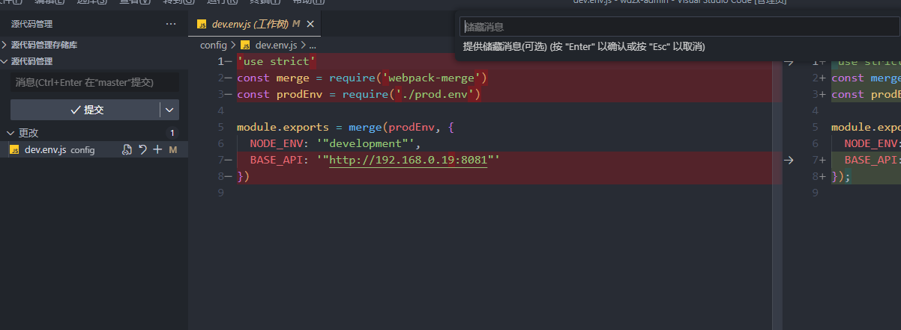

拉取代码后，再次应用储藏

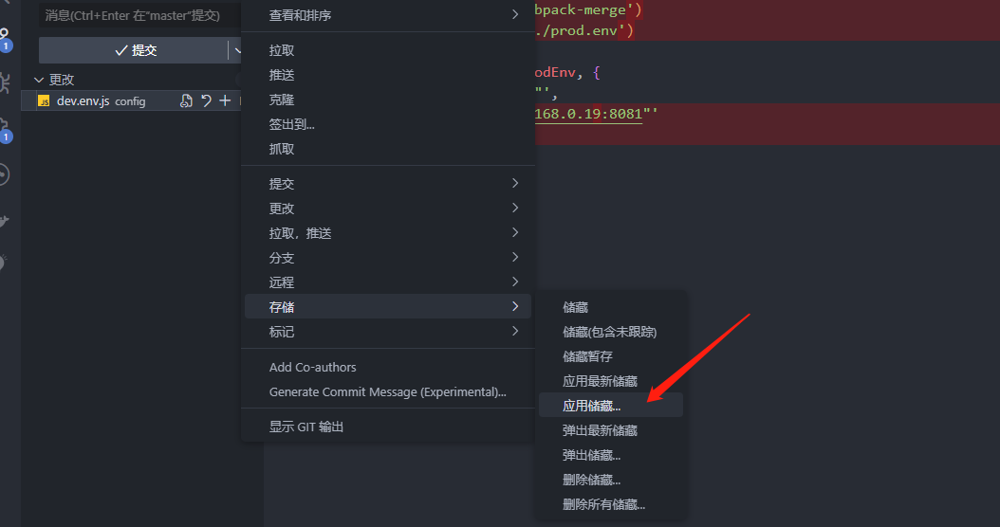	

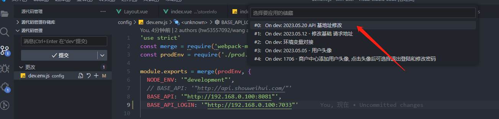


## 常见问题解决

### 1. 本地提交代码了，但是还没提交到远程仓库，想撤回怎么办？

选择撤销上次提交即可

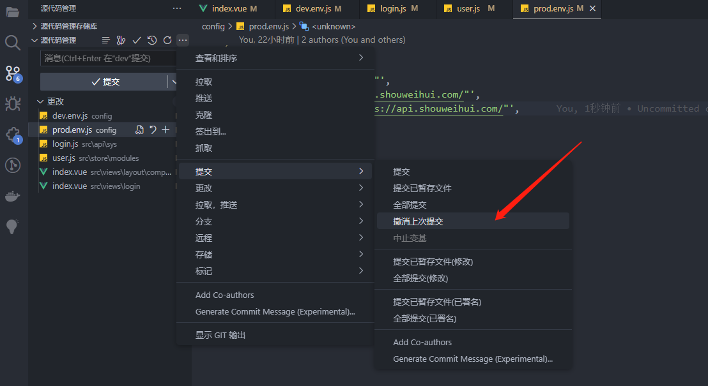	

### 2. 代码已经提交到远程仓库了，想撤回怎么办？

使用 `revert commit`, 回退这一块代码

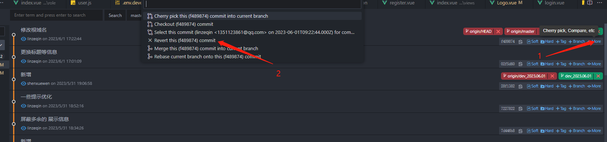

### 3. 我当前分支有代码还没写完，需要切换分支去解决紧急问题怎么办？

以下情况，也可以使用同样方法解决

- 在当前分支写代码，但是当前分支有人提交了代码，你无法拉取代码，如何解决？

	

将当前代码 储藏起来


拉取代码后，再次应用储藏

	


**[注]**

当然也会导致，冲突情况，需要解决冲突


### 4. 写了很多代码，只先提交其中一部分代码到远程仓库怎么办？

选择你先提交的代码，点击 + 号，暂存更改

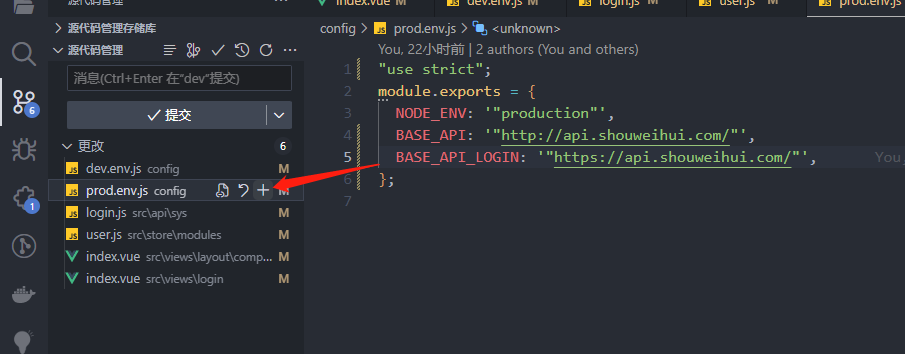	

点击加完了，输入提交描述信息，点击提交，同步即可

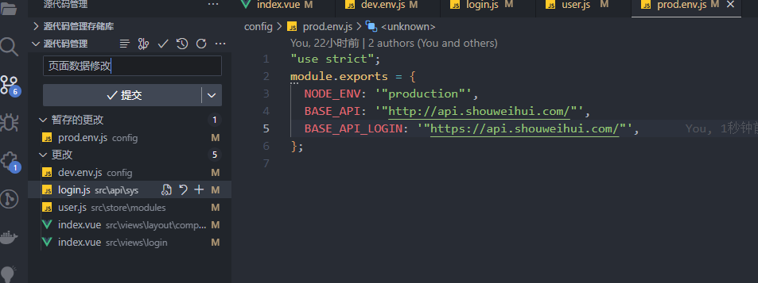	


### 5. 只将其中当前分支的一部分，合并到其他分支

当前 `master` 分支，我想把 `dev` 中一提交记录的内容，合并到 `master` 分支上

可以使用 `cherry pick`


1. 切换到 `master` 分支
2. 选择 `dev` 分支数据 (dev 分支上的属性需要已经 拉取过的)
3. 选择 `dev` 分支记录，`cherry pick` 到当前分支


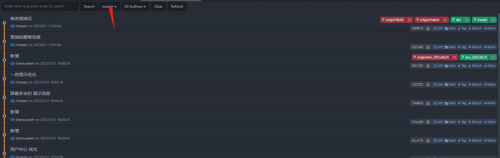

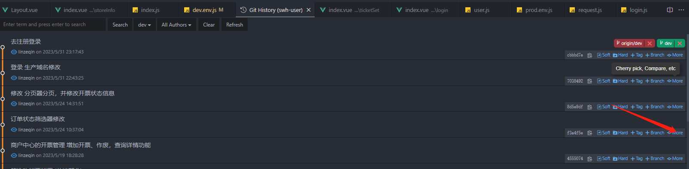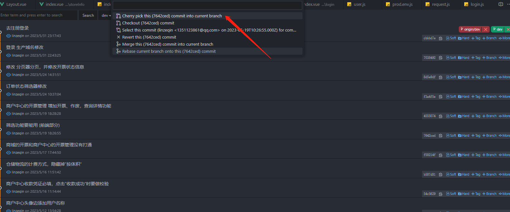


### 6. 多人同个分支，如何进行开发

开发前，先 拉取下代码之后，再进行开发

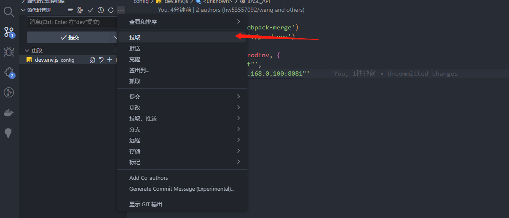

开发后，提交代码, 报错了！

可能其他人已经在分支上修改代码，可以先将代码进行存储后，先拉代码，再进行提交


