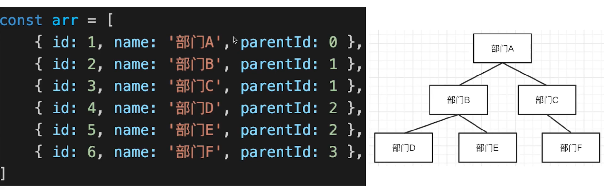
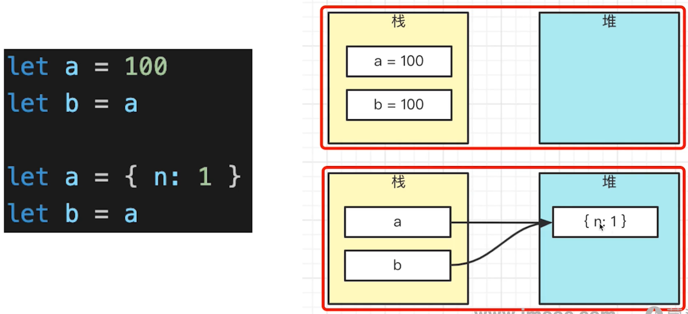
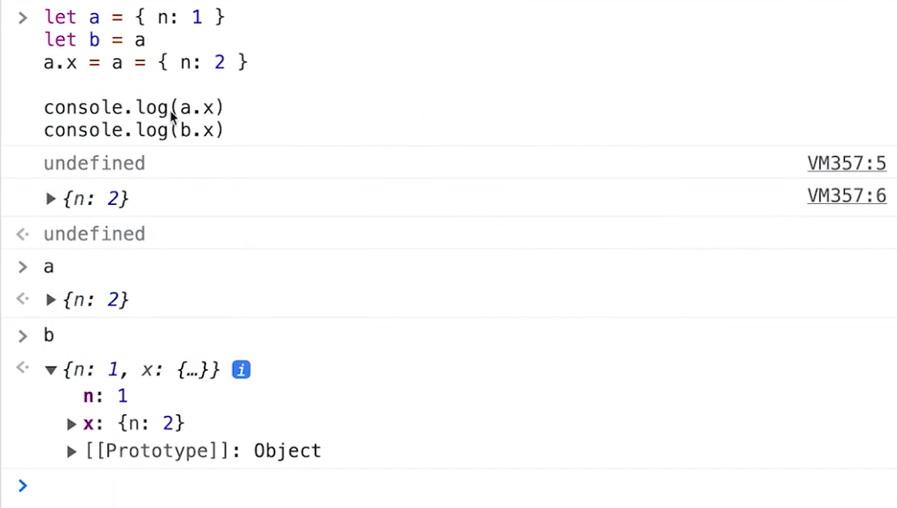

# 分析和解决问题的思路-可以独立解决问题

## 1. 以下代码输出什么？(parseInt)

```javascript
['1', '2'. '3'].map(parseInt)
```

 

parseInt(str, radix)

- 解析有一个字符串，并返回 十进制 整数
- 第一个参数 str, 即要解析的字符串
- 第二个参数 radix, 基数 (进制), 范围 2-36


--- 代码演示 (parseInt 用法) ---

```javascript
parseInt('11', 2) // 3
parseInt('11', 3) // 4
parseInt('11', 10) // 11
```


没有 radix 

- 当 str 以 ‘0x’ 开头, 则按照 16 进制处理
- 当 str 以 ‘0’ 开头, 则按 8 进制处理 (但 ES5 取消了!!!)
- 其他情况按 10 进制处理
- 在 eslint 的情况下, 必须有两个参数


--- 代码 解析 ---

```javascript
// ['1', '2', '3'].map(parseInt) 等同于下面的写法
const nums = ['1', '2', '3']
const res = nums.map((item),index => {
    // item: '1', index: 0
    // item: '2', index: 1
    // item: '3', index: 2
    return parseInt(item, index)
    
    parseInt('1', 0) // 1
    parseInt('2', 1) // NaN
    parseInt('3', 2) // NaN
})

```


## 2. 函数修改形参，能否影响实参？

以下代码输出什么

```javascript
function changeArg(x) { x = 200 }

let num = 100
changeArg(num)
console.log('changeArg num', num)

let obj = { name: 'Lin' }
changeArg(obj)
console.log('changeArg obj', obj)
```


上面代码不会修改什么

```javascript
// 输出结果
// changeArg num 100
// changeArg obj { name: 'Lin' }
```


扩展

- 函数修改形参，通常不会影响实参除非下面特殊情况

- ```javascript
  function fn(x) { x.a = 'aaa'}
  let obj = { name: 'Lin' }
  fn1(obj)
  console.log(obj) // { x: 100, a:'aaa' }
  ```

- eslint 建议函数参数不要修改, 当做常量


## 3. 手写 convert 函数, 将数组转化为树 



树节点

```javascript
interface ITreeNode {
    id: number
    name: string
    children?: ITreeNode[]
}
```


思路

- 遍历数组
- 每个元素, 生成 tree node
- 找到 parentNode, 并加入它的 children


如何找到 parentNode

- 遍历数组去查找, 太慢
- 可用一个 Map 来维护关系, 便于查找


--- 代码演示 ---

```javascript
interface IArrayItem {
    id: number
    name: string
    parentId: number
}

interface ITreeNode {
    id: number
    name: string
    children?: ITreeNode[]
}

function convert(arr: IArrayItem[]): ITreeNode | null {
    // 用于 id 和 treeNode 的映射
    const idToTreeNode: Map<number, ITreeNode> = new Map()
    
    let root = null
    
    arr.forEach(item => {
        const { id, name, parentId } = item
        
        // 定义 tree node 并加入 map
        const treeNode: ITreeNode = { id, name }
        idToTreeNode.set(id, treeNode)
        
        // 找到 parentNode 并加入到它的 children
        const parentNode = idToTreeNode.get(parentId)
        if (parentNode) {
            if (parentNode.children == null) parentNode.children = []
            parentNode.children.push(treeNode)
        }
        
        // 找到根节点
        if (parentId === 0) root = treeNode
    })
    
    return root
}

const arr = [
    { id:1, name: '部门A', parentId: 0}, // 0 代表 顶点级节点, 无父节点
    { id:2, name: '部门B', parentId: 1},
    { id:3, name: '部门C', parentId: 1},
    { id:4, name: '部门D', parentId: 2},
    { id:5, name: '部门E', parentId: 2},
    { id:6, name: '部门F', parentId: 3},
]

const tree = convert(arr)
console.log(tree)
```


扩展

- 数组, 像是关系型数据库, 如 MySQL
- 树, 像是文档型数据库, 如 Mongodb


## 4. 树 转换成 数组

```javascript

interface IArrayItem {
    id: number
    name: string
    parentId: number
}

interface ITreeNode {
    id: number
    name: string
    children?: ITreeNode[]
}

function convert(root: ITreeNode): IArrayItem[] {
    // Map
    const nodeToParent: Map<ITreeNode, ITreeNode> = new Map()
    
    const arr: IArrayItem[] = []
    
    // 广度优先遍历, queue
    const queue: ITreeNode[] = []
    queue.unshift(root) // 根节点 入队
    
    while (queus.length > 0) {
        const curNode = queue.pop() // 出队
        if (curNode == null) break
        
        const { id, name, children = [] } = curNode
        
        // 创建数组 item 并 push
        const parentNode = nodeToParent.get(curNode)
        const parentId = parentNode?.id || 0
        const item = { id, name, parentId }
        arr.push(item)
        
        // 子节点入队
        children.forEach(child => {
            // 映射 parent
            nodeToParent.set(child, curNode)
            // 入队
            queus.unshift(child)
        })
    }
    
    return arr
}

const obj = {
    id: 1,
    name: '部门A',
    children: [
        {
            id: 2,
            name: '部门B',
            chidren: [
                { id: 4, name: '部门D' },
                { id: 5, name: '部门E'}
            ]
        },
        {
            id: 3,
            name: '部门C',
            children: [{ id: 6, name: '部门F' }]
        }
    ]
}

const arr1 =  convert1(obj)
console.info(arr1)
```


思路

- 遍历树节点 (广度优先)
- 讲树节点转为 Array Item, push 的数组
- 根据父子关系, 找到 Array Item 的 parentId


## 5. 构造函数和原型的重名属性

以下代码输出什么

```javascript
function Foo() {
    Foo.a = function() { console.log(1) }
    this.a = function() { console.log(2) }
}
Foo.prototype.a = function() { console.log(3) }
Foo.a = function() { console.log(4) }

Foo.a() // 4
let obj = new Foo() // { a: fn }
obj.a() // 2
obj.a() // 1
```


## 6. Promise 执行顺序 问题

```javascript
Promise.resolve().then(() => {
    console.log(0)
    return Promise.resolve(4)
}).then((res) => {
    console.log(res)
})

Promise.resolve().then(() => {
    console.log(1)
}).then(() => {
    console.log(2)
}).then(() => {
    console.log(3)
}).then(() => {
    console.log(5)
}).then(() => {
    console.log(6)
})

// 执行结果
// 0
// 1
// 2
// 3
// 4
// 5
// 6
```


then 交替执行

- 如果有多个 fulfilled promise 实例, 同时执行 then 链式调用

- then 会交替执行

- 这是编译的优化，防止一个 promise 占据太久时间

  

then 中返回 promise 实例

- 相当于多出一个 promise 实例
- 也会遵守 “交替执行”
- 但和直接声明一个 promise 实例, 结果有些差异


慢两拍

- then 中返回 promise 实例, 会出现 “慢两拍” 的效果
- 第一拍, promise 需要由 pending 变为 fulfilled/resolved
- 第二拍, then 函数挂载到 MicroTaskQueue 


## 7. 对象和属性的连续赋值

```javascript
let a = { n: 1 }
let b = a
a.x = a = { n: 2 }

console.log(a.x)
console.log(b.x)
```


值类型、引用类型



执行结果



重点

- 值类型是堆，引用类型是栈
- a.x 比赋值的优先级高
- 日常工作中不推荐连续赋值, 可读性差


## 8. 对象属性类型的问题

下列代码的输出结果是什么


```javascript
// example 1
let a = {}, b = '123', c = 123
a[b] = 'b'
a[c] = 'c'
console.log(a[b])

// 打印结果 (第二个覆盖第一个？)
// c
```


```javascript
// example 2
let a = {}, b = Symbol('123'), c = Symbol('123')
a[b] = 'b'
a[c] = 'c'
console.log(a[b])

// 打印结果 (Symbol类型, 每一次都是不一样的, 即使字符串一样也不行, 所以第二个不会覆盖第一个)
// b
```


```javascript
// example 3
let a = {}, b = { key: '123' }, c = { key: '456' }
a[b] = 'b' // ‘[Object Object]’
a[c] = 'c' // ‘[Object Object]’
console.log(a[b])

// 打印结果 (第二个覆盖第一个？)
// c 
```


JS 对象 key 的数据类型

- JS 对象 key 的数据类型, 只能是字符串和 Symbol 类型
- 其他类型会被转换为字符串
- 转换字符串会直接调用它的 toString() 方法


 Map 和 WeakMap 的 key

- Map 的 key 可以是各种类型
- WeakMap 的 key 只能是引用类型, 不能是值类型


