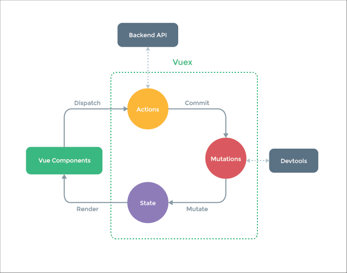

## 1. Ajax、Fetch、Axios 的区别？

三者都用于网络请求，是三个不同维度

- Ajax 是一种技术统称（实现请求的技术）

- Fetch, 一个原生 API

- Axios，一个第三方库


用XMLHttpRequest 实现 Ajax

```javascript
function ajax1 (url, successFn) {
    const xhr = new XMLHttpRequest()
    xhr.open('GET', url, false) // 建立连接 ---- 请求方法、请求链接、是否异步 (默认 true)
    xhr.onreadystatechange = function () { // 设置回调函数
        // 判断异步对象的状态
        if (xhr.readyState == 4) {
          	// 判断交互是否成功
            if (xhr.State == 200) {
                // 获取服务器响应的数据
                var res = xhr.responseText
                // 解析数据
                res = JSON.parse(res)
            }
        }
    }
  	// 异常处理
  	xhr.onerror = function() {
      console.log('error')
    }
    xhr.send(null) // body 没有指定值, 则默认值为 null
}
```


Fetch 的更详细解释

- 浏览器原生 API，用于网络请求
- 和 XMLHttpRequeset 一个级别
- Fetch 语法更加简洁、易用，支持 Promise

```javascript
// Fetch 实现 AJax 请求
function ajax2 (url) {
    return fetch(url).then(res => res.json())
}
```


 Axios 的更详细解释

- 最常用的网络请求第三方库`lib`（随着 Vue 火爆起来）
- 内部可用 XMLHttpRequest 和 Fetch 来实现


lib 和 API 的区别

- lib 是第三方库的英文名称，有很多个 API
- API 是一个功能，lib 是一个功能集合


> 实践项目中，使用现成的 lib, 尽量不要自己造轮子


## 2. 箭头函数

箭头函数有什么缺点？

- 没有 arguments `(arguments 就是函数的参数)`
- 无法通过 apply、call、bind 改变 this


什么时候不能使用箭头函数？

- 不适用于 对象方法 `（下面前 4 个问题都是第一个问题的延申）`
- 不适用于 原型方法
- 不适用于 构造函数
- 不适用于 动态上下文中的回调函数
- 不适用于 Vue 生命周期函数 和 method

```javascript
// 不适用 对象方法
const obj = {
    name: 'Lin',
    getName: () => {
        return this.name
    }
}
console.log( obj.getName ) // 打印不出来的
```

```javascript
// 不适用 原型方法
const obj = {
    name: 'Lin'
}
obj._proto_.getName = () => {
    return this.name
}
console.log( obj.getName() ) // 同样打印不出来
```

```javascript
// 不适用 构造函数
const Foo = ( name, age ) => {
    this.name = name
    this.age = age
}
const f = new Foo( ‘Lin’，20 ) // 报错 Foo is not a constructor
```

```javascript
// 不适用 动态上下文中的回调函数
const btn = document.getElementById('btn')
btn.addEventListener( 'click', () => {
    // console.log( this === window )
    // 如果不使用 this 就没有问题
    this.innerHTML = 'clicked'
})
```

```javascript
// 不适用 Vue 生命周期函数 和 method
// Vue 之所以不行，是因为 Vue 组件本质上是一个 JS 对象
// React 可以，因为 React 组件（ 非 Hooks ）它本质上是一个 ES6 class
methods: {
    getName: () => {
        // 报错 Cannot read properties of undefined (reading 'name')
        return this.name
    }
},
mounted: () => {
	// 报错 Cannot read properties of undefined (reading 'name')
    console.log( 'msg', this.name )
}
```

```javascript
// 在 Class 中使用 箭头函数是可以的
class Foo {
    constructor ( name, city ) {
        this.name = name
        this.city = city
    }
    getName = () => {
        return this.name
    }
}
const f = new Foo( 'Lin', '深圳' )
console.log( f.getName()) // 打印结果 Lin
```


> 箭头函数 this 都指向它的父作用域
>
> - 要熟练应用箭头函数，也要对函数 this arguments 敏感
> - 传统 Vue 组件是 JS 对象，传统 React 组件是 Class, 两者不同


## 3. Vue 组件通讯方式有几种？尽量说全面

总叙

- props 和 $emit
- 自定义事件
- $attrs
- $parent
- $refs
- provide/inject
- Vuex


不同场景

- 父子组件
- 上下级组件 (跨多级) 通讯
- 全局组件


-- props 和 $emit 方式 --

- 适用情况：父子组件通讯

```vue
// 父组件
<template>
	<HelloWorld msg="Welcome to Your Vue.js App" @showMsg="showMsg"></HelloWorld>
</template>
<script>
import HelloWorld from '@/components/HelloWorld.vue'
</script>
```

```vue
// 子组件
<template>
	<h1 @click="clickHander">{{ msg }}</h1>
</template>
<script>
export default {
    name: 'HelloWorld',
	props: {
    	msg: String
    },
    emits: ['showMsg'], // Vue3 新增加的
    methods: {
    	clickHandler() {
    		this.$emit('showMsg', 'hello world')
    	}
    }
}
</script>
```


-- 自定义事件方式 --

- 适用情况：兄弟组件、无关组件、一个触发多个响应、多对多

```vue
// 父组件
<template>
	<CustomEvent1/>
	<CustomEvent2/>
</template>
<script>
import CustomEvent1 from '@/components/CustomEvent1.vue'
import CustomEvent2 from '@/components/CustomEvent2.vue'
</script>
```

```vue
// 子组件 (一)
<template>
	<p><button @click="trigger">trigger custom event</button></p>
</template>
<script>
import event from '../utils/event.js'
    
export default {
    name: 'CustomEvent2',
    methods: {
        trigger() {
            event.emit('showMsg', 'hello custom event')
        }
    }
}
</script>
```

```Vue
// 子组件 (二)
<template>
	<p>receice custom event</p>
</template>
<script>
import event from '../utils/event.js'
    
export default {
    name: 'CustomEvent1',
    methods: {
        showMsg(msg) {
            console.log(msg)
        }
    },
    // 挂载vue实例后的 钩子函数
    mounted() {
        event.on('showMsg', this.showMsg)
    },
    // 组件销毁生命周期 Vue2.x 使用 beforeDestroy 这个生命周期，Vue3.x 使用下面这个生命周期
    beforeUnmount() {
        event.off('showMsg', this.showMsg)
    }
}
</script>
```


$atters 和 $listeners 的相关知识点

- Vue2 中 属性在 props 中定义 候补是 $attrs，方法在 emits 中定义 候补是 $listeners
- Vue3 移除 $listeners (将 $listeners 的功能合并到 $attrs)
- 如何将 Level1 的数据 经过 Level2 传给 Level3 呢? 在 Level2 中定义 v-bind="$attrs" 即可


-- 上下级别通讯（$atters 多级）--

```vue
// Home.vue
<template>
	<div class="home">
        <AttrsDemo/>
    </div>
</template>
<script>
import AttrsDemo from '@/components/AttrsAndListeners/Level1'
</script>
```

```vue
// Level1
<template>
	<p>Level1</p>
	<Level2
        :a='a'
        :b='b'
        :c='c'
        @getA="getA"
        @getB="getB"
        @getC="getC">
    </Level2>
</template>
<script>
import Level2 from './Level2'
    
export default {
	name: 'Level1',
    components: { Level2 },
    data() {
        return {
			a: 'aaa',
            b: 'bbb',
            c: 'ccc'
        }
    },
    methods: {
        getA() {
            rerurn this.a
        },
        getB() {
            return this.b
        },
        getC() {
            rerurn this.c
        }
    }
}
</script>
```

```vue
// Level2
<template>
	<p>Leve2</p>
	<Level3
        :x='x'
        :y='y'
        :z='z'
        @getX="getX"
        @getY="getY"
        @getZ="getZ"
        v-bind="$attrs" // 通过这个属性 就能把属性与方法继续往下一级传
    ></Level3>
</template>
<script>
import Level3 from './Level3'
    
export default {
	name: 'Level2',
    components: { Level3 },
    props: ['a'],
    emits: ['getA'],
    data() {
        return {
			x: 'xxx',
            y: 'yyy',
            z: 'zzz'
        }
    },
    methods: {
        getX() {
            rerurn this.x
        },
        getY() {
            return this.y
        },
        getZ() {
            rerurn this.z
        }
    },
    created() {
        console.log('level2', Object.keys(this.$attrs)) // 是 props 和 emits 后补
        // Level1 的 props 定义了 a, emits 定义了 getA，剩下的 b、c、getB、getC 就放在 $attrs
        // 打印结果: ['b', 'c', 'onGetB', 'onGetC']
    }
}
</script>
```

```vue
// Level3
<template>
	<p>Level3</p>
</template>
    
<script>  
export default {
	name: 'Level3',
    props: ['x'],
    emits: ['getX'],
    data() {
        return {}
    },
    created() {
        console.log('level3', Object.keys(this.$attrs))
        // 因为 Level2 中定义了 v-bind="$attrs"
        // 打印结果：['y', 'z', 'onGetY', 'onGetZ', 'b', 'c', 'onGetB', 'onGetC']
    }
}
</script> 
```


-- $parent 和 $refs ---

- $parent Vue2 中 用$chilren，在 Vue3 中建议用 $refs 获取
- 通过 this.$parent 可以获取 父组件的属性、方法
- 通过 this.$refs 获取子组件的属性、方法
- 方法的获取只能从 methods 得到
- 适用于 父子组件的使用

```vue
// 通过 $refs 使用示例
// 父组件
<template>
	<HelloWorld msg="Lin" ref="hello1" />
</template>
<script>
import HelloWorld from '../HelloWorld'
    
export default {
    mounted() {
        consolo.log(this.$refs.hello1.name)
    }
}
</script>
```

```vue
// 子组件 HelloWord.vue
<template>
	<h1 @click="clickHandler">{{ msg }}</h1>
</template>
<script>
export default {
    name: 'HelloWorld',
    props: {
		msg: String
    },
    emits: ['showMsg'],
    data() {
        return {
            name: 'hello-world'
        }
    },
    methods: {
        clickHandler() {
            this.$emit('showMsg', 'hello world')
        }
    }
}
</script>
```


-- provide inject --

- 最上级定义 provide, 存放数据，不管下面第几级都可以通过 inject 获取到
- 有 两种定义方法，一种静态的，一种动态的

```vue
// Level1
<template>
	<p>Level1: <input v-model="name" /></p>
	<Level2></Level2>
</template>
<script>
import { computed } from 'vue'
import Level2 from './Level2'
    
export default {
    name: 'Level1',
    components: { Level2 },
    data() {
        return {
            name: 'Lin'
        }
    },
    // 静态的定义
    provide: {
        info: 'aaa'
    }
    // 动态的定义
    provide() {
        return {
            info: computed(() => this.name)
        }
    }
}
</script>
```

```vue
// Level2
<template>
	<p>Level2 {{ info }}</p>
	<Level3></Level3>
</template>
<script>
import Level3 from './Level3'
    
export default {
    name: 'Level2',
    components: { Level3 },
    inject: ['info']
}
</script>
```

```vue
// Level3
<template>
	<p>Level3 {{ info }}</p>
</template>
<script> 
export default {
    name: 'Level3',
    inject: ['info']
}
</script>
```


## 4. 节流和防抖

两者有什么区别？

- 节流：限制执行频率，有节奏的执行
- 防抖：限制执行次数，多次密集的触发只执行一次
- 节流关注 “过程”，防抖关注 “结果”


-- 防抖 --

- 防止抖动 “你先抖动着，啥时候停了，再执行下一步”

- 例如，一个搜索输入框，等输入停止之后，再触发搜索，不能说，输一个马上搜索一次

```javascript
// 代码实现 防抖
function debounce (fn, delay = 200) {
    let timer = 0
    
    return function () {
        if (timer) clearTimeout(timer)
        
        timer = setTimeout(() => {
            // apply() 方法能劫持另一个对象的方法，继承另一个对象的属性
            fn.apply(this, arguments) // 遗传 this 和 参数
            timer = 0
        }, delay)
    }
}
```


-- 节流 --

- 节流，节省交互沟通。流，不一定指流量
- “别急，一个一个来，按时间节奏来，插队着无效”
- 例如，drag 或 scroll 期间触发某个回调，要设置一个时间间隔

```javascript
// 代码实现 节流
function throttle (fn, delay = 100) {
    let timer = 0
    
    return function () {
        if (timer) return
        
        timer = setTimeout(() => {
            // apply() 方法能劫持另一个对象的方法，继承另一个对象的属性
            fn.apply(this, arguments) // 遗传 this 和 参数
            timer = 0
        }, delay)
    }
}
```


> 实践项目中，我们去使用 [loadsh](https://loadsh.com) 实现 防抖、节流


## 5. apply、call、bind 的应用

#### call方法

改变函数内部this指向

call() 方法调用一个对象。简单理解为调用函数的方式，但是它可以改变函数的 this 指向。

写法：fun.call(thisArg, arg1, arg3, ...) ,thisArg为想要指向的对象，arg1,arg3为参数

call 的主要作用也可以实现继承

```javascript
function Person(uname, age) {
    this.uname = uname;
    this.age = age;
  }
  function Son(uname, age) {
    Person.call(this, uname, age);
  }
  var son = new Son("zhang", 12);
  console.log(son);  // {uname: 'zhang', age: 12}
```


#### apply方法

apply()方法调用一个函数。简单理解为调用函数的方式，但是它可以改变函数的this指向。

写法：fun.apply(thisArg, [argsArray])

- thisArg:在fun函数运行时指定的this值
- argsArray:传递的值，必须包含在数组里面
- 返回值就是函数的返回值，因为他就是调用函数

apply的主要应用，比如可以利用apply可以求得数组中最大值

```javascript
const arr = [1, 22, 3, 44, 5, 66, 7, 88, 9];
const max = Math.max.apply(Math, arr);
console.log(max);
```


#### bind方法

bind()方法不会调用函数，但是能改变函数内部this指向

写法：fun.bind(thisArg, arg1, arg2, ...)

- thisArg:在fun函数运行时指定的this值
- arg1,arg2:传递的其他参数
- 返回由指定的this值和初始化参数改造的原函数拷贝

```javascript
var o = {
    name: "lisa"
};
function fn() {
    console.log(this);
}
var f = fn.bind(o);
f();
```


#### bind应用

如果有的函数我们不需要立即调用，但是又需要改变这个函数的this指向，此时用bind再合适不过了

```javascript
const btns = document.querySelectorAll("button");
for (let i = 0; i < btns.length; i++) {
    btns[i].onclick = function() {
      this.disabled = true;
      setTimeout(
        function() {
          this.disabled = false;
        }.bind(this),
        2000
      );
    };
}
```


#### call、apply、bind 总结

#### 相同点：

1. 都可以改变函数内部的this指向。


#### 区别点：

1. call 和 apply 会调用函数，并且改变函数内部this指向。
2. call 和 apply 传递的参数不一样，call 传递参数arg1,arg2...形式 apply 必须数组形式[arg]
3. bind 不会调用函数，可以改变函数内部this指向。


#### 主要应用场景：

1. call 经常做继承。
2. apply 经常跟数组有关系，比如借助于数学对象实现数组最大值最小值。
3. bind 不调用函数，但是还想改变this指向，比如改变定时器内部的this指向。


## 6. px、%、em、rem、vw、vh 有什么区别？

px 和 %

- px 基本单位，绝对单位（其他都是相对单位）
- % 相对于父元素的宽度比例


em 和 rem

- em 相对于当前元素的 font-size
- rem 相对于根节点的 font-size


vw 和 vh

- 1vw = 浏览器视口的宽度的 1%
- 1vh = 浏览器视口的宽度的 1%

- vmin 两者的最小值，vmax 两者的最大值 `两者是指 vw、vh`


## 7. 请描述 TCP 三次握手 和 四次挥手

HTTP 传输过程

- 先建立连接（确保双方都有收发消息的能力）
- 再传输内容（如发送一个 get 请求）
- 网络连接是 TCP 协议，传输内容是 HTTP 协议


三次握手过程 - 建立连接

- Client发包，Server 接收。Server: 有 Client 要找我
- Server 发包，Client 接收。Client: Server 已经收到消息了
- Client 发包，Server 接收。Server：Client 要准备发送了


四次挥手的过程 - 关闭连接

- Client 发包，Server 接收。Server：Client 已请求结束
- Server 发包，Client 接收。Client：Server 已收到，我等待它关闭
- Server 发包，Client 接收。Client：Server 此时可以关闭连接了（其他要发送的数据已经发送完成了）
- Client 发包，Server 接收。Server：可以关闭了（然后关闭连接）


## 8. for...in 和 for...of 有什么区别？

key 和 value 的区别

- for...in 遍历得到 key
- for...of 遍历得到 value

```javascript
// -- 遍历数组 --
// for...in
const arr = [10, 20, 30]
for (let key in arr) {
    console.log(key) // 0 1 2
}
// for...of
const arr = [10, 20, 30]
for (let val of arr) {
    console.log(val) // 10 20 30
}
```

```javascript
// -- 遍历字符串 --
// for...in
const str = 'abc'
for (let c in str) {
    console.log(c) // 0 1 2
}
// for...of
const str = 'abc'
for (let c of arr) {
    console.log(c) // a b c
}
```

```javascript
// -- 遍历函数参数 -- 
// 因为 for...in 结果还是下标 就不演示了
// for...of
function fn () {
    for (let arg of arguments) {
        console.log(arg)
    }
}
fn (100, 200, 'aaa') // 100 200 aaa
```

```javascript
// -- 遍历 html 元素 --
// 同样只写 for...of
// for...of
const pList = document.querySelectarAll('p')
for (let p of pList) {
    console.log(p) // p p (遍历到的是整个元素，包括内容)
}
```


适用于不同的数据类型

- 遍历对象：for...in 可以，for...of 不可以
- 遍历 Map Set：for...of 可以，for...in 不可以
- 遍历 generator：for...of 可以，for...in 不可以

```javascript
// -- 遍历对象 --
const obj = {
    name:'Lin',
    city:'深圳'
}
// for...in
for (let key in obj) {
    console.log(key) // name city
}
// for...of
for (let val of obj) {
    console.log(val) // TypeError: obj is not iterable (obj 不可遍历)
}
```

```javascript
// -- 遍历 Set -- 
const set = new Set([10,20,30])
// for...in
for(let n in set) {
    console.log(n) // (直接是空 没东西被打印出来)
}
// for...of
for(let n of set) {
    console.log(n) // 10 20 30
}
```

```javascript
// -- 遍历 Map --
const map = new Map([
	['x', 100],
  ['y', 200],
  ['z', 300]
])
// for...in
for (let n in map) {
    console.log(n) // (直接是空 没东西被打印出来)
}
// for...of
for (let n of map) {
    console.log(n)
    // (2) ['x', 100]
    // (2) ['y', 200]
    // (2) ['z', 300]
}
```

```javascript
// -- 遍历 generator --
function* foo () {
    yield 10
    yield 20
    yield 30
}
// for...in
for (let n in foo()) {
    console.log(n) // (直接是空 没东西被打印出来)
}
// for...of
for (let n of foo()) {
    console.log(n) // 10 20 30
}

```


从 枚举 与 迭代 的角度去看

- for...in 用于可枚举数据，如对象、数组、字符串，得到 key
- for...of 用于可迭代数据，如数组、字符串、Map、Set，得到 value


## 9. for await...of 有什么作用？

for await...of 用于遍历多个 Promise

```javascript
// 解决多个异步访问问题
function createPromise (val) {
    return new Promise ((resolve) => {
        setTimeout (() => {
            resolve(val)
        }, 1000)
    })
}
(saync function () {
    const p1 = createPromise(100)
    const p2 = createPromise(200)
    const p3 = createPromise(300)
    
    // 一般情况的访问方法
    const res1 = await p1
    console.log(res1) // 100
    const res2 = await p2
    console.log(res2) // 200
    const res3 = await p3
    console.log(res3) // 300
    
    // 一个 Promise 列表的访问方法
    // 采用 .all Api 方式去写
    const list = [p1, p2, p3]
    Promise.all(list).then(res => console.log(res)) // 100 200 300
    // 采用 for await...of 去写，可以说 for await...of 是 .all 的代替品
    for await (let res of list) {
        console.log(res) // 100 200 300
    }
    
    // 采用异步调用 Promise, 一般写法
    const res1 = await createPromise(100)
    console.log(res1)
    const res2 = await createPromise(200)
    console.log(res2)
    const res3 = await createPromise(300)
    console.log(res3)
    
    // 采用异步调用 Promise, for 循环写法
    const arr = [10, 20, 30]
    for (let num of arr) {
        const res = await createPromise(num)
        console.log(res)
    }
})()
```


## 10. offsetHeight scrollHeight clientHeight 区别

计算规则

- offsetHeight offsetWidth: border + padding + content
- clientHeight clientWidth：padding + content
- scrollHeight scrollWidth: padding + 实际内容尺寸

```html
// 其中 scrollHeight scrollWidth 的实际内容尺寸就是指 content 中 width、height 的大小 
<head>
    <style>
        #container {
            width: 300px;
            height: 200px;
            padding: 20px;
            margin: 30px;
            border: 5px solid #ccc;
            box-sizing: border-box;
            overflow: auto;
            background-color: #fff;
        }
        #content {
            width: 600px;
            height: 500px;
            background-color: #f1f1f1;
            display: inline-block;
        }
    </style>
</head>
<body>
    <div id="container">
        <div id="content">
            <p>offsetHeight scrollHeight clientHeight</p>
        </div>
    </div>
</body>
```


> scrollTop scrollLeft 需滚动之后获取


## 11. 盒子模型

盒子模型包括哪些东西？

- width
- height
- padding
- margin
- border
- box-sizing（如何计算一个元素的总宽度和总高度的一个配置）


> box-sizing 有两个属性
>
> - content-box 标准盒子模型 - `width` 与 `height` 只包括 内容 的宽和高 (**默认值**)
> - border-box 怪异盒子 `width` 和 `height` 属性包括 内容，padding 和 border，但不包括 margin


## 12. HTMLCollection 和 NodeList 区别

Node 和 Element

- DOM 是一颗树，所有节点都是 Node
- Node 是 Element 的基类
- Element 是其他 HTML 元素的基类i，如 HTMLDivElement


HTMLCollection 和 NodeList

- HTMLCollection 是 Element 的集合
- NodeList 是 Node 集合


```javascript
const p1 = document.getElementById('p1')
// 获取 HTMLCollection 
console.log(p1.children)
// 获取 NodeList
console.log(p1.childNodes)
```


扩展：类数组 -> 数组

```javascript
// HTMLCollection 和 NodeList 都不是数组，而是 “类数组”
// 将类数组 转换为 数组 的三种方法
const arr1 = Array.from(list)
const arr2 = Array.prototype.slice.call(list)
const arr3 = [...list]
```


> - 获取 Node 和 Element 的返回结果可能不一样
> - 如 elem.childNodes 和 elem.children 不一样
> - 前者会包含 Text 和 Comment 节点，后者不会


## 13. Vue computed 和 watch 区别

两者用途不同

- computed 用于计算产生新的数据，有缓存
- watch 用于监听现有数据

```html
<template>
	<p>watch and computed</p>
    <p>姓名：<input v-model="name"> 城市：<input v-model="city"></p>
    <p>个人信息：{{userInfo}}</p>
</template>

<script>
export default {
    data() {
        return {
            name: ‘Lin’,
            city: '深圳'
        }
    },
    watch: {
        name(newValue, oldValue) {
            console.log('watch name', newValue, oldValue)
        }
    },
    computed: {
        userInfo() {
            return this.name + this.city
        }
    }
}
</script>
```


扩展：computed 与 methods 的区别

- computed 有缓存
- methods 没有缓存

```javascript
computed: {
    userInfo() {
        // 有缓存 只有 name、city 改变了，才会重新去计算
        return this.name + this.city
    }
},
methods: {
    getUserInfo() {
        // 无缓存 每次执行 都会去计算
        return this.name + this.city
    }
}
```


## 14. Vuex mutation action 、dispacth commit 区别

mutation action 区别

- mutation：原子操作；必须同步代码；
- action：可包含多个 mutation；可包含异步代码；


dispacth commit 区别

- 相同点：二者最终都是用来提交 mutation 来更改 state 的值的
- 不同点：`dispacth `用于异步操作修改state,`commit` 用于同步操作来修改state


异步和同步的区别

异步和同步的区别在于异步更新必须通过派发 action 来更新 mutation, 而同步更新可以直接提交 mutation 来更新 state


## 15. JS 严格模式有什么特点

开启严格模式

```javascript
'use strict' //全局开启
function fn() {
    'use strict' //某个函数开启
}
```


特点

- 全局变量必须先声明
- 禁止使用 with (使用with语句的JavaScript代码非常难于优化)
- 创建 eval 作用域
- 禁止 this 指向 window
- 函数参数不能重名


```javascript
// 禁止 this 指向 window
// 全局变量必须先声明
'use strict'
n = 10 // ReferenceError: n is not defined
```

```javascript
// 禁止使用 with
vat obj = { x: 10 }
// with 的作用类似于 obj.x
with (obj) {
    // Uncaught SyntaxError: Strict mode code may not include a with statement
	console.log(x)
}
```

```javascript
// 创建 eval 作用域
'use strict'
var x = 10
eval('var x = 20; console.log('in eval', x)') // eval 有自己的作用域，不推荐使用
console.log('out eval', x)
```
```javascript
// 禁止 this 指向 window
'use strict'
function fn() {
    console.log('this', this) //undefined
}
fn()
```

```javascript
// 函数参数不能重名
'use strict'
// Uncaught SyntaxError: Duplicate parameter name not allowed in this context
function fn(x, x, y) {
	return
}
```


## 16. HTTP 跨域请求时为何发送 options 请求

跨域请求

- 浏览器同源策略
- 同源策略一般限制 Ajax 网络请求，不能跨域请求 server
- 不会限制 `<link>` `` `<script>` `<iframe>` 加载第三方资源


跨域解决办法

- JSONP
- CORS 配置允许跨域 (服务端)


```html
<!-- JSONP 原理
script 里面是没有跨域限制的，所以 <script src="https://www.bbb.com/api/getData"></script> 
执行后，会返回一个字符串 ‘onSuccess({ errno: 0, data: { /* 数据内容 */ }})’
而 script 会将字符串当成 js 进行执行，而这个 我们又定义了 onSuccess 这个方法，那么就能拿到数据了 -->
<script>
	window.onSuccess = function (data) {
        console.log(data)
    }
    // CORS 配置允许跨域 (服务端)
    response.setHeader("Access-Control-Allow-Origin", "http://localhost:8011")
    response.setHeader("Access-Control-Allow-Headers", "X-Requested-With")
    response.setHeader("Access-Control-Allow-Headers", "PUT,POST,GET,DELETE,OPTIONS")
    response.setHeader("Access-Control-Allow-Credentials", "true") // 允许跨域接收 cookie
</script>
<script src="https://www.bbb.com/api/getData"></script>
```


"多余" 的 options 请求

- options 请求，是跨域请求之前的预检查
- 浏览器自行发起的，**无需**我们干预
- 不会影响实际的功能


## 17. ES6中 Set 和 Map 的区别

区别

- 初始化需要的值不一样，Map需要的是一个二维数组，而Set 需要的是一维 Array 数组

- Map 和 Set 都不允许键重复

- Map的键是不能修改，但是键对应的值是可以修改的；Set不能通过 迭代器 来改变Set的值，因为Set的值就是键
- Map 是键值对的存在，值也不作为健；而 Set 没有 value 只有 key，value 就是 key


优点

- 最大优点就是运行时间少大大提高了性能


## 18. Vuex 如何使用

Vuex 的基本使用

- state --- 数据仓库
- getters --- 用来获取数据的 (类似计算属性)
- mutation --- 用来修改数据的 (同步)
- action --- 用来提交 mutation (异步)


获取数据的简单方式

- this.$store.state.属性
- getters 去获取，类似计算属性


为什么不直接使用 this.$store.state.属性 去修改数据, 而是使用 mutation 定义 function 去修改数据？

- 因为这样方便记录每个数据改变的历史
- 从而方便, 监听回滚等一系列操作


mutation 通常用于同步修改数据, 而业务中通常需要异步 (请求) 修改数据, 从而用到了 action


state 辅助函数为 mapState

actions 辅助函数为 mapActions

mutations 辅助函数为 mapMutations


Vuex 中的辅助函数 (语法糖)

- dispatch (调用 actions 中的函数)
- commit (调用 mutations 中的函数)
- mapState (可以直接获取 state 的属性, 不需要通过 this.$store.state.属性 获取)
- mapGetters (可以直接获取 getters 的属性, 不需要通过 this.$store.getters.属性 获取)
- mapActions (直接调用 action 中的函数)
- mapMutations (直接调用 mutations 中的函数)


mapActions

简单来说 mapActions 就是**将组件中的函数映射为对应的 action**

一般情况下我们会在组件中使用 this.$store.dispatch() 来触发 action，想要调用多少个 action 就需要调用多少次 dispatch() ，而使用 mapActions 的话只需要**往 mapActions 中传入与 action 同名的函数，然后调用这些函数即可触发对应的 action**


mapMutations

mapMutations 是vuex 的 mutation 的辅助函数，用于在组件中映射 mutation 内的方法

以便在该组件中直接使用mutation里的方法 **(说白了，就是一语法糖)**


--- dispatch、commit 操作---

```javascript
// store 文件夹下的 index.js
import Vue from 'vue'
import Vuex from 'vuex'

Vue.use(Vuex)

export default new Vuex.Store({
    state: {
        count: 0
    },
    mutations: {
        increase() {
            this.state.count ++
        }
    },
    getters: {
        memberInfo(state) {
            switch (state.userStatus) {
                case 0:
                    return '普通会员'
                    break
                default:
                    return 'vip会员'
                    break
            }
        }
    },
    actions: {
        buyVip({commit}, e) {
            return new Promise((resolve, reject) => {
                // mock api 交互
                setTimeout(() => {
                    // 修改本地 state
                    commit('setMemberInfo', {
                        userStatus: e.userStatus
                    })
                    resolve('购买成功')
                }, 1000)
            })
        }
    }
})
```

```vue
<!-- index.vue -->
<template>
	<div>
        <p>{{ msg }}</p>
        <p>{{ this.$store.getters.memberInfo }} 用户</p>
    </div>
</template>
<script>
import store from '@/store/store'
export default {
    name: 'Index',
    data () {
      return {
          msg: store.state.count
      }  
    },
    store,
    methods: {
        print() {
          	const userStatus = this.$store.state.userStatus
            console.log(userStatus)
        },
        add() {
            console.log('add Event from info!')
            store.commit('increase', 1)
        },
        buy(e) {
            store.dispatch('buyVip', e).then(res => {
                alert(res)
            })
        }
    }
}
</script>
```


--- mapGetters、mapState、mapActions、mapMutations 操作示例 ---

```vue
<!-- 调用页 -->
<template>
	<div>
        <p>{{ memberInfo }}</p>
        <p>{{ userStates }}</p>
        <p>{{ vipLevel }}</p>
    </div>
</template>
<script>
import { mapState, mapGetters, mapActions } from "vuex"
export default {
    computed: {
        ...mapState(['userStates', 'vipLevel'])
        ...mapGetters(['memberInfo'])
        ...mapActions(['login', 'exits'])
    	...mapMutations(['INCREASE_SHOPCART'])
    },
    mounted() {
        // 在 js 中可以直接使用 this 调用, 模板中数据直接用名称即可
        console.log(this.userStates, this.vipLevel)
        this.login('登录')
        this.exit('退出')
        this.INCREASE_SHOPCART(id)
    }
}
</script>
```

```javascript
// store 页面
import Vue from 'vue'
import Vuex from 'vuex'

Vue.use(Vuex)

export default new Vuex.Store({
    getters: {
        memberInfo(state) {
            switch (state.userStatus) {
                case 0:
                    return '普通会员'
                    break
                default:
                    return 'vip会员'
                    break
            }
        }
    },
    actions: {
        login: function(context, data1) {
            console.log(data1)
        },
        exit: function(context, data2) {
            console.log(data2)
        }
    }
})
```


Vuex 的整个流程 (单向数据流)

	


流程描述

- Vue 组件去派发 Action

- Action 提交 Mutations

- Mutations 修改 State

- Vue 组件根据 State 来渲染页面


## 19. Axios 如何使用

特点

- 安全性更高，客户端支持防御 XSRF
- 支持 promise 所有API
- 可以拦截请求和响应
- 可以转换请求和响应数据

 

常用方法

- axios.get(url[, config])   //get请求用于列表和信息查询

- axios.delete(url[, config])  //删除

- axios.post(url[, data[, config]])  //post请求用于信息的添加

- axios.put(url[, data[, config]])  //更新操作

  

二次封装

- 请求拦截器, 每个请求加上 token
- 响应拦截器, 状态码的处理
- 比较完整的 axios 二次封装 (主要特点分出 **开发环境** 和 **生成环境** 的 baseUrl)

```javascript
// 请求拦截器
axios.interceptors.request.use(
  	config => {
	// 每次发送请求之前判断是否存在token
	// 如果存在，则统一在http请求的header都加上token，这样后台根据token判断你的登录情况，此处token一般是用户完成登录后储	存到localstorage里的
    token && (config.headers.Authorization = token)
    return config
},
    error => {
    return Promise.error(error)
})
```

```javascript
// 响应拦截器
axios.interceptors.response.use(response => {
  // 如果返回的状态码为200，说明接口请求成功，可以正常拿到数据
  // 否则的话抛出错误
  if (response.status === 200) {
    if (response.data.code === 511) {
      // 未授权调取授权接口
    } else if (response.data.code === 510) {
      // 未登录跳转登录页
    } else {
      return Promise.resolve(response)
    }
  } else {
    return Promise.reject(response)
  }
}, error => {
  // 我们可以在这里对异常状态作统一处理
  if (error.response.status) {
    // 处理请求失败的情况
    // 对不同返回码对相应处理
    return Promise.reject(error.response)
  }
})
```

```javascript
// 比较完整的 axios 二次封装
import axios from 'axios'
// 定义常见的错误信息
const TOKEN_ERROR = 'Token认证失败，请重新登录';
const NETWORK_ERROR = '网络异常，请检查网络后重试';

// 创建axios实例对象，添加全局配置
const service = axios.create({
	baseURL: process.env.VUE_APP_BASE_API,
	timeout: 8000
});

// 定义常见的错误信息
const TOKEN_ERROR = 'Token认证失败，请重新登录';
const NETWORK_ERROR = '网络异常，请检查网络后重试';

// 创建axios实例对象，添加全局配置
const service = axios.create({
	baseURL: process.env.VUE_APP_BASE_API,
	timeout: 8000
});

// 请求拦截
service.interceptors.request.use((config) => {
	// TODO
	const headers = config.headers;
	if (!headers.Authorization) {
		headers.Authorization = 'Bear Test'
	}
	return config;
});

// 响应拦截
service.interceptors.response.use((config) => {
	const {
		code,
		data,
		msg
	} = config.data;
	if (code === 200) {
		return data;
	} else if (code === 40001) { // 和后台约定的，Token 过期，code是40001
		ElMessage.error(TOKEN_ERROR);
		setTimeout(()=>{
			router.push({ path: '/login' })
		}, 1000);
		return Promise.reject(TOKEN_ERROR);
	} else {
		ElMessage.error(msg || NETWORK_ERROR);
		return Promise.reject(msg || NETWORK_ERROR);
	}
});

/**
 * 请求核心函数
 * @param {Object} options 请求配置
 */
function request(options) {
	options.method = options.method || 'get';  // 如果是get请求的话，则将data中的数据转移到params中
	if(options.method.toLowerCase() === 'get') {
		options.params = options.data;
	}
	
	if(process.env.NODE_ENV === 'production') {  // 在正式环境中，不管有没有开启moke开关，都使用正式环境base_url，以防万一
		service.defaults.baseURL = process.env.VUE_APP_BASE_API;
	} else { // VUE_APP_MOCK为1，代表开启moke模式
		service.defaults.baseURL = process.env.VUE_APP_MOCK == '1' ? process.env.VUE_APP_MOCK_API : process.env.VUE_APP_BASE_API;
	}
	
	return service(options);
}

/**
 * 可以通过 request.get() 方式调用
 */
['get', 'post', 'put', 'delete', 'patch'].forEach((item)=>{
	request[item] = (url, data, options)=>{
		return request({
			method: item,
			url, 
			data, 
			...options
		})
	}
});

export default request;
```


## 20. JS 操作数组有哪些 API?

**哪些 API (15种)**

- concat (连接两个数组)
- push (从后面追加一个)
- splice(index,长度,替换的片断)（数组的剪辑）
- pop (从后面删除一个)
- shift (从前面删除一个)
- unshift (从前面追加一个)
- join('-') (将数组元素拼接成一个字符串)
- slice(-1) (截取数组的某一部分, -1 表示截取最后一个) `split('-') 字符串转数组`
- sort (数组排序)
- indexOf (返回某个指定的字符串值在字符串中首次出现的位置)
- lastIndexOf (返回一个指定的字符串值最后出现的位置)
- forEach (循环遍历数组)
- map (创建一个新数组，这个新数组由原数组中的每个元素都调用一次提供的函数后的返回值组成)
- filter (数组过滤)
- reduce (对数组中的每个元素按序执行一个由您提供的 **reducer** 函数)


**哪些会改变数组本身**

- push
- splice
- pop
- shift
- unshift
- sort


--- map、filter、reduce 的使用 ---

```javascript
// map
/* 语法: Array.map(function(currentValue, index, arr), thisIndex)
*  currentValue：必须。当前元素的的值
*  index：可选。当前元素的索引
*  arr：可选。当前元素属于的数组对象
*/ 

var array = [1, 2, 3, 4, 5]

var newArray = array.map((item) => {
    return item * item
})

console.log(newArray) // [1, 4, 9, 16, 25]
```

```javascript
// filter
/* 语法: Array.filter(function(currentValue, indedx, arr), thisValue)
*  currentValue：必须。当前元素的的值
*  index：可选。当前元素的索引
*  arr：可选。当前元素属于的数组对象
*/ 

var nums = [1, 2, 3, 4, 5, 6, 7, 8, 9, 10]

var res = nums.filter((num) => {
  return num > 5
})

console.log(res)  // [6, 7, 8, 9, 10]
```

```javascript
// reduce
/* 语法: Arr.reduce(callback,[initialValue])
*  callback: 执行数组中每个值的函数，包含四个参数
*  	1、previousValue (上一次调用回调返回的值，或者是提供的初始值 initialValue)
*  	2、currentValue (数组中当前被处理的元素)
*  	3、index (当前元素在数组中的索引)
*  	4、array (调用 reduce 的数组)
*  initialValue: 作为第一次调用 callback 的第一个参数
*/ 

var arr = [1, 2, 3, 4]
var sum = arr.reduce((prev, cur, index, arr) => {
    console.log(prev, cur, index, arr)
    return prev + cur
})
// 1 2 1 [1, 2, 3, 4]
// 3 3 2 [1, 2, 3, 4]
// 6 4 3 [1, 2, 3, 4]
console.log(arr, sum) // [1, 2, 3, 4] 10
```


**注意**: reduce 回调函数中第一个参数就是上次返回的那个结果


## 21. vue-router 的使用

知识点

- 路由模式 (hash、H5 history)
- 路由配置 (动态路由、懒加载)


路由模式

- hash 默认 (默认) , 如 http://abc.com/#/user/10
- H5 history 模式, 如 http://abc.com/user/20
- 后者需要 server 端支持, 因此无特殊需求可选择前者


--- 路由模式 设置 ---

```javascript
const router = new VueRouter({
    mode: 'history', // 使用 H5 history 模式
    routes: [...]
})
```


--- 动态路由 ---

```javascript
// router文件夹下的 index.js
export default new Router({
    routers: [
        {
            // 动态路径参数 以冒号开头. 能命中 '/test/10' '/test/20' 等格式的路由
            path: '/test/:testId', // 定义动态路由要改变的参数
            name: 'HelloWorld',
            component: Test // 设置动态路由所属页面
        }
    ]
})
```

```vue
// test.vue
<template>
	<div>
        {{ $route.params.testId }}
    </div>
</template>
```


Vue-router 路由配置 懒加载 (三种方式)

```javascript
// vue-router
export default new VueRouter({
    routes: [
        {
            // 刚进来的时候异步加载
            path: '/',
            component: () => import {
            	'./../components/Navigator'
        	}
        },
        {
        	// 刚进来的时候不会加载, 路由改变到这个页面, 才会异步加载
        	path: '/feedback',
        	component: () => import {
    			'./../components/FeedBack'
			}
        }
    ]
})
```

```javascript
// ES6 import
import Vue from 'vue';
import Router from 'vue-router';
// 官网可知：下面没有指定webpackChunkName，每个组件打包成一个js文件。
const Foo = () => import('../components/Foo')
const Aoo = () => import('../components/Aoo')
// 下面2行代码，指定了相同的webpackChunkName，会合并打包成一个js文件。
// const Foo = () => import(/* webpackChunkName: 'ImportFuncDemo' */ '../components/Foo')
// const Aoo = () => import(/* webpackChunkName: 'ImportFuncDemo' */ '../components/Aoo')
export default new Router({
    routes: [
        {
            path: '/Foo',
            name: 'Foo',
            component: Foo
        },
        {
            path: '/Aoo',
            name: 'Aoo',
            component: Aoo
        }
    ]
})
```

```javascript
// webpac 提供的 require.ensure()
import Vue from 'vue';
import Router from 'vue-router';
const HelloWorld=resolve=>{
		require.ensure(['@/components/HelloWorld'],()=>{
			resolve(require('@/components/HelloWorld'))
		})
	}
Vue.use('Router')
export default new Router({
	routes:[{
		{
    	path:'./',
			name:'HelloWorld',
			component:HelloWorld
		}
	}]
})
```


[vue-router 路由懒加载以及三种实现方式](https://blog.csdn.net/czj1049561601/article/details/114120236)
