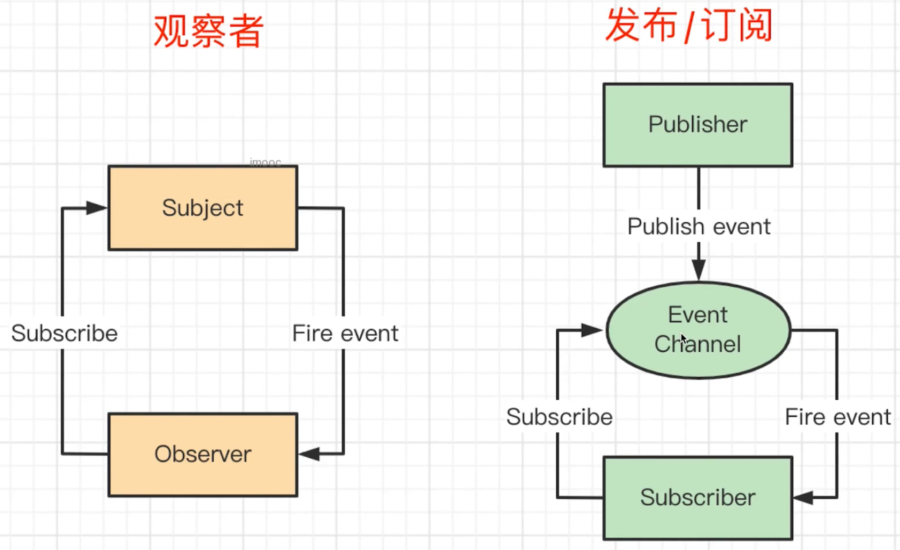
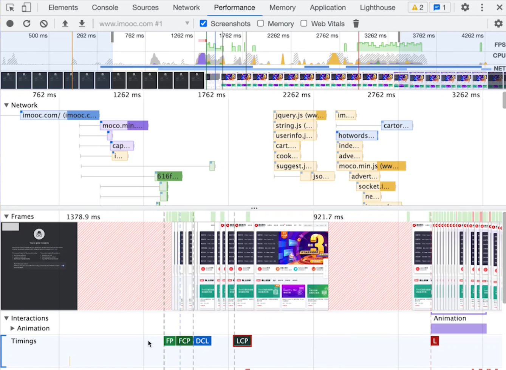
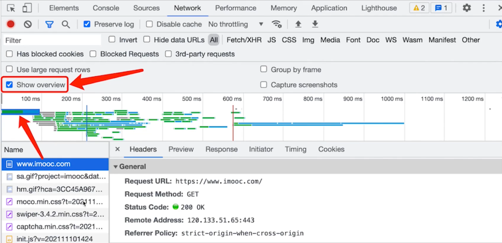
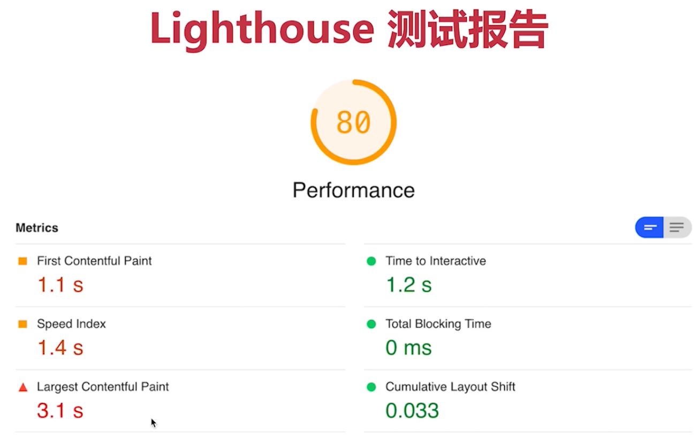
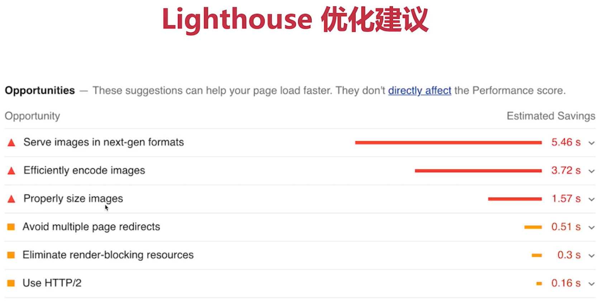
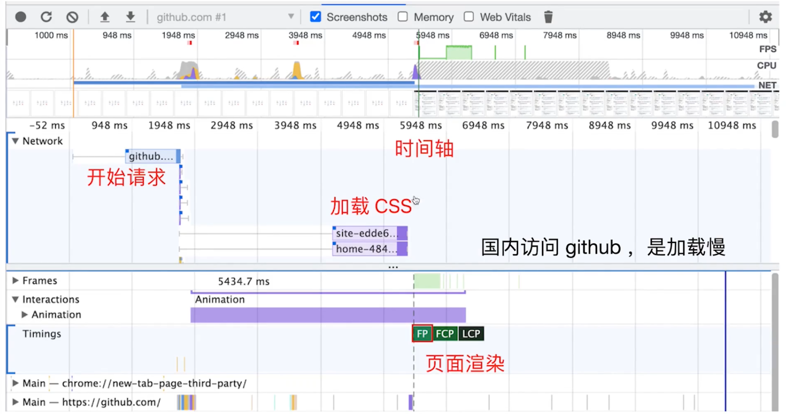

# 实践工作经验-是否做过真实项目

## 1. H5 页面如何进行 首屏 优化？

路由懒加载

- 使用于 SPA (不适用 MPA)
- 路由拆分，优先保证首页加载

服务端渲染 SSR (成本高)

- 传统的前后端分离 (SPA) 渲染页面的过程复杂
- SSR 渲染页面过程简单，所有性能好
- 如果是纯 H5 页面，SSR 是性能优化的终极方案

> 前后端分离：客户端，获取 html 再获取 data，最终再渲染到页面上
>
> SSR：服务端直接将渲染好的 HTML 发到客户端

SSR 是一门 ”古老“ 的技术

- 刚刚兴起 Web 1.0 时，就是 SSR 技术：PHP ASP JSP 等
- Nuxt.js (Vue)
- Next.js (React)

APP 预取

- 如果 H5 在 APP WebView 中展示，可使用 APP 预取
- 用户访问列表页时，APP 预加载文章首屏内容
- 用户进入 H5 页，直接从 APP 中获取内容，瞬间展示首屏

分页

- 针对列表页
- 默认只展示第一页内容
- 上划加载更多

图片懒加载 lazyLoad

- 针对详情页
- 默认只展示文本内容，然后触发图片懒加载
- 注意：提前设置图片尺寸，尽量只重绘不重排

Hybrid

- 提前将 HTML JS CSS 下载到 APP 内部
- 在 APP webview 中使用 file:// 协议加载页面文件
- 再用 Ajax 获取内容并展示 (也结合 APP 预取)

> file:// 协议: 用于打开本地文件的协议
>
> 移动端 H5 要结合 App 能力去优化
>
> 严格来说，hybrid 不是 H5，但这里回答出来没问题

总结：

- 路由懒加载
- 服务端渲染 SSR
- App 预取
- 分页
- 图片懒加载
- Hybrid

> 扩展
>
> - 性能优化要配合分析、统计、评分等，做了事情要有结果
> - 性能优化也要配合体验，如骨架屏，loading 动画等
> - 不同的形式，有不同的优化方式，要积极和面试官沟通

## 2. 后端一次性返回 10w 条数据，你该如何渲染？

设计不合理

- 后端返回 10w 条数据，本身技术方案设计就不合理
- 主动和面试官沟通此事 (这也许是面试官所期待的)
- 如果面试官非要这么做，那再继续寻找解决方案

浏览器能否处理 10w 条数据

- JS 没问题
- 渲染到 DOM 会非常卡顿

自定义中间层

- 自定义 nodejs 中间层，获取并拆分这 10w 条数据
- 前端对接 nodejs 中间层，而不是服务端
- 成本比较高

虚拟列表 (不好实现)

- 只渲染可视区域 DOM
- 其他隐藏区域不显示，只用 `<div>` 撑起高度
- 随着浏览器滚动，创建和销毁 DOM

虚拟列表 - 第三方 lib

- 虚拟列表实现起来非常复杂，可借用第三方 lib
- Vue-virtual-scroll-list
- React-virtualiszed

> 重点
>
> - 要主动沟通，表达观点 (也许正在考察你的沟通能力)
> - 后端的问题，首先要用后端的思维去解决 -- 中间层
> - 虚拟列表只是无奈的选择，实现复杂而效果不一定好 (低配手机)

## 3. 前端常用的设计模式有哪些？并说明使用场景？

设计原则

- 最重要的思想：开放封闭原则
- 对扩展开放
- 对修改封闭

工厂模式

- 用一个工厂函数，来创建实例，隐藏 new
- 如 jQuery 的 $ 函数
- 如 React createElement 函数

```tsx
// 工厂模式示例
class Foo()

function factory(a, b, c) {
    // if else
    return new Foo()
}

const f = factory(1, 2, 3)
```

单例模式

- 全局唯一的实例 (无法生成第二个)
- 如 Vuex Redux 的 store
- 如全局唯一的 dialog modal

```tsx
// 单例模式实例
class SingleTon {
  private static instance: SingleTon | null = null;
  private constructor() {}
  public static getInstance(): SingleTon {
    if ((this.instance = null)) {
      this.instance = new SingleTon();
    }
    return this.instance;
  }
  fn1() {}
  fn2() {}
}

const s = SingleTon.getInstance();
s.fn1();
s.fn2();

const s1 = SingleTon.getInstance();

s === s1; // true
```

> 单例模式 - 扩展
>
> - JS 是单线程的，创建单例很简单
> - Java 是支持多线程的，创建单例要考虑锁死线程
> - 否则多个线程同时创建，单例就重复了 (多线程共享进程内存)

代理模式

- 使用者不能直接访问对象，而是访问一个代理层
- 在代理层可以监听 get set 做很多事情
- 如 ES6 Proxy 实现 Vue3 响应式

```tsx
// 代理模式实例
var obj = new Proxy(
  {},
  {
    get: function (target, propKey, receiver) {
      console.log(`getting ${propKey}!`);
      return Reflect.get(target, propKey, receiver);
    },
    set: function (target, propKey, value, receiver) {
      console.log(`setting ${propKey}!`);
      return Reflect.set(target, propKey, value, receiver);
    },
  }
);
```

观察者模式实例

```tsx
// 一个主题，一个观察者，主题变化之后触发观察者执行
btn.addEventListener('click', () => { ... })
```

发布订阅 - 自定义事件

```tsx
// 绑定
event.on("event-key", () => {
  // 事件1
});
event.on("event-key", () => {
  // 事件2
});

// 触发执行
event.emit("event-key");
```

> 温故知新: 绑定的事件要记得解除，防内存泄漏
>
> ```tsx
> function fn1() {
>   /* 事件1 */
> }
> function fn1() {
>   /* 事件2 */
> }
> 
> // mounted 时绑定
> event.on("event-key", fn1);
> event.on("event-key", fn2);
> 
> // beforeUnmount 时解绑
> event.off("event-key", fn1);
> event.off("event-key", fn2);
> ```

装饰器模式

- 原功能不变，增加一些新功能 (AOP 面向切面编程)
- ES 和 Typescript 的 Decorator 语法
- 类装饰器，方法装饰器

```tsx
// 类的装饰
@testable
class MyTestableClass {
  // ...
}
function testable(target) {
  target.isTestable = true;
}
MyTestableClass.isTestable; // true

// 方法的装饰
class Person {
  @readonly
  name() {
    return `${this.first} ${this.last}`;
  }
}
```

> nest.js 中比较完美的使用装饰器

总结

- 工厂模式
- 单例模式
- 代理模式
- 观察者模式
- 发布订阅模式
- 装饰器模式

> 注意
>
> - 经典设计模式有 23 个，这是基于后端写的，前端不是都常用
> - 要结合应用场景

## 4. 观察者模式和发布订阅模式的区别？

观察者模式

- Subject 和 Observer 直接绑定，没有中间媒介
- 如 addEventlistener 绑定事件

发布订阅

- Publisher 和 Observer 互不相似，需要中间媒介 Event channel
- 如 EventBus 自定义事件

区别



## 5. 你在实际工作中，做过哪些 Vue 优化？

v-if 和 v-show

- v-if 彻底销毁组件
- v-show 使用 CSS 隐藏组件
- 大部分情况下使用 v-if 更好，不要过度优化

v-for 使用 key

```vue
<ul>
	<!-- 而且，key 不要用 index -->
    <li v-for="(id, name) in list" :key="id">{{name}}</li>
</ul>
```

使用 computed 缓存

```vue
export default { data() { return { msgList: [ ... ] //消息列表 } }, computed: {
// 未读消息的数量 unreadCount() { return this.msgList.filter(m => m.read ===
false).length } } }
```

keep-alive 缓存组件

- 频繁切换的组件，如 tabs
- 不要乱用，缓存太多会占用内存，且不好 debug

```vue
// 简单实例
<keep-alive>
	<Child1 v-if="num === 1"></Child1>
    <Child2 v-else></Child2>
</keep-alive>
```

异步组件

- 针对体积较大的组件，如编辑器、复杂表格、复杂表单等
- 拆包，需要时异步加载，不需要时不加载
- 减少主包的体积，首页会加载更快

```vue
// 模拟加载比较大子包 Vue3 的写法 // 总页面 Home.vue
<template>
  <AsyncComponentDemo></AsyncComponentDemo>
</template>

<script>
import AsyncComponentDemo from "@/components/AsyncComponentDemo/index";
</script>
// 主 index.vue
<template>
  <Child></Child>
</template>

<script>
import { defineAsyncComponent } from "vue";

export default {
  name: "AsyncComponent",
  components: {
    Child: defuuneAsyncComponent(() =>
      import(/* webpacjChunkName: "async-child" */ "./Child.vue")
    ),
  },
};
</script>
// 子 Child.vue
<template>
  <p>async component child</p>
</template>

<script>
export default {
  name: "Child",
};
</script>
```

路由懒加载

- 项目比较大，拆分路由，保证首页先加载

```vue
// router/index.js - 路由表
<script>
const routes = [
  {
    path: "/about",
    name: "About",
    component: () =>
      import(/* webpacjChunkName: "async-child" */ "../views/About.vue"),
  },
];
</script>
```

服务端渲染 SSR

- 可使用 Nuxt.js
- 按需优化，使用 SSR 的成本比较高

> 总结
>
> - v-if 和 v-show
> - v-for 使用 key
> - computed 缓存数据
> - keep-alive 缓存组件
> - 异步组件 路由懒加载
> - SSR

## 6. 你使用 Vue 遇到过哪些坑？

内存泄漏

- 全局变量、全局事件、全局定时器
- 自定义事件

Vue2 响应式的缺陷 (Vue3 不再有)

- data 新增属性用 Vue.set
- data 删除属性用 Vue.delete
- 无法直接修改数据 arr[index] = value

路由切换时 scroll 到顶部

- SPA 的通病，不仅仅是 Vue
- 如，列表页，滚动到第二屏，点击进入详情页
- 再返回到列表页 (此时组件重新渲染) 就 scroll 到顶部

路由切换时 scroll 到顶部 - 解决方案

- 在列表页缓存数据和 scrollTop 值
- 当再次返回列表页时，渲染组件，执行 scrollTo(xx)
- 终极方案: MAP + APP WebView（MAP 就是 webView 上再加一个 webView）

> 总结
>
> - 日常要注意记录总结，遇到坑就记录下，下次面试时就能用到

## 7. 如何统一监听 Vue 组件 报错？

window.onerror (用于 JS 报错监听)

- 全局监听所有 JS 报错
- 但它是 JS 级别的，识别不了 Vue 组件信息
- 捕捉一些 Vue 监听不到的错误

```vue
// 代码演示 对 windiow error 的监听的两种方式
<script>
export default {
  mounted() {
    // 第一种方式
    // msg: 错误信息、source: 那个文件夹、line: 哪一行、column: 哪一列，error: 错误的对象
    window.onerror = function (msg, source, line, column, error) {
      console.info("window.onerror----", msg, source, line, column, error);
    };
    // 第二种方式
    window.addEventListener("error", (event) => {
      console.log("window error", event);
    });
  },
};
</script>
```

errorCaptured 生命周期（Vue 的报错监听）

- 监听所有下级组件的错误
- 返回 false 会阻止向上传播

```vue
// App.vue
<script>
export default {
  errorCaptured: (err, vm, info) => {
    console.info("errorCaptured---", err, vm, info);
    return false; // 返回false 就不会向上传播，window.onerror 就获取不到
  },
};
</script>
```

errorHandler（Vue 的报错监听）

- Vue 全局错误监听，所有组件错误都会汇总到这里
- 会忽略掉，window.onerror
- 但 errorCaptured 返回 false, 不会传播到这里

```javascript
// 代码实例
// main.js
const app = createApp(App);

app.config.errorHandler = (error, vm, info) => {
  console.info("errorHandler----", error, vm, info);
};
```

> 扩展：
>
> - wiondow.onerror 能监听异步报错
> - errorCaptured、errorHandler 只能监听非异步报错
> - Promise 为处理的 catch 需要 onunhandledrejection

> 重点
>
> - 实际工作中，三者要结合使用
> - errorCaptured 监听一些重要、有风险组件的错误
> - window.onerror 和 errorHandler 候补全局监听

## 8. 如何一个 H5 很慢，你该如何排查性能问题？

前端性能指标

- First Paint (FP) 第一次渲染
- First Contentful Paint (FCP) 第一次有内容的渲染
- First Meaningful Paint (FMP) 第一次有意义的渲染 --- 以弃用，改用 LCP
- DomContentLoaded (DCL) 原生的一个浏览器事件 (页面 DOM 下载完成)
- Largest Contentfull Paint (LCP) 页面最大的内容已经下载完了
- Load (L) 整个页面及所有依赖资源如样式表和图片都已完成加载

工具

- Chrome devTools
- 

Chrome devTools

- Performance 可查看上述性能指标，并有网页快照
- NetWork 可以查看各个资源的加载时间

Performance



NetWork



Lighthouse

- 非常流行的第三方性能评测工具
- 支持移动端和 PC

```shell
// npm 使用方法
npm i lighthouse -g
lighthouse https://www.imooc.com/ --view --preset=desktop
```





识别问题：哪里慢

- 加载慢？
- 渲染慢？

加载慢示例



如果是网页加载慢

- 优化服务端硬件配置，使用 CDN
- 路由懒加载，大组件异步加载 --- 减少主包的体积
- 优化 HTTP 缓存策略

如果是网页渲染慢

- 优化服务端接口 (如 Ajax 获取数据慢)
- 继续分析，优化前端组件内部的逻辑 (参考 vue React 优化)
- 服务端渲染 SSR

持续跟进

- 性能优化是一个循序渐进的过程，不像 bug 一次性解决
- 持续跟进统计结果，再逐步分析性能瓶颈，持续优化
- 可使用第三方统计服务，如阿里云 ARMS、百度统计

> 总结
>
> - 分析性能指标，找到慢的原因
> - 对症下药，解决问题
> - 持续跟进，持续优化
> - 使用 ”二分法“，可逐步找出问题根源
> - 要有 ”监控“、”持续跟进“ 的思维。解决了问题，还得保持住

## 9. 你工作经历中，遇到过哪些项目难点，如何解决的？

> 种一棵树，关键在 10 年前 和 现在

遇到问题要注意积累

- 每个人都会遇到难题，总有几个问题让你抓耳挠腮
- 日常要注意积累，解决了问题就自己写文章复盘一下

如果之前没有积累

- 回顾一下半年之内你遇到的一个难题 (肯定会有的)
- 想一下当时的解决方案, 以及解决之后的效果
- 写一篇文章记录一下 (必须写出来)

答案模板

- 描述问题：背景 + 现象 + 造成的影响
- 问题如何被解决：分析 + 解决
- 自己的成长：学到了什么 + 以后如何避免

示例

- 问题：编辑器只能回显 JSON 格式，而不支持老版本的 html 格式
- 解决：使用 HTML 属性表示 JSON 的数据，即可解决这个问题
- 成长：要考虑完整的输入输出 + 考虑旧版本用户 + 参考其他产品
