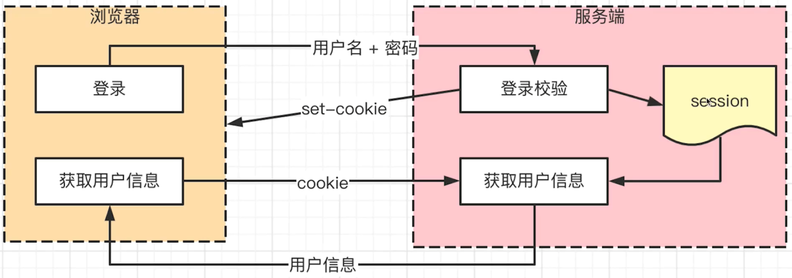
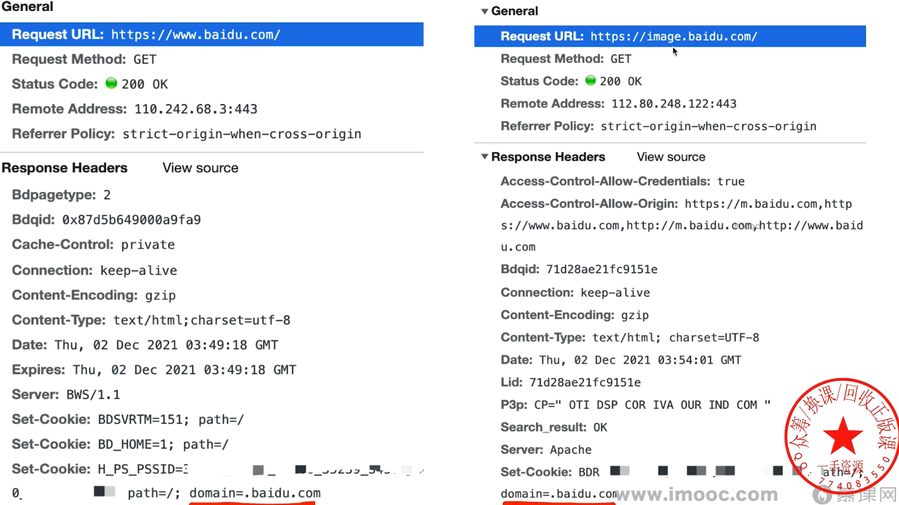
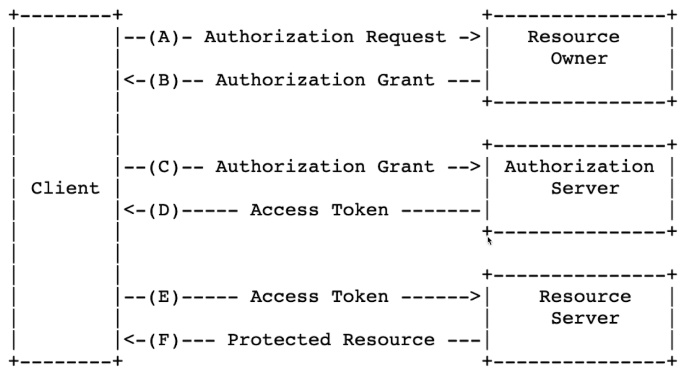
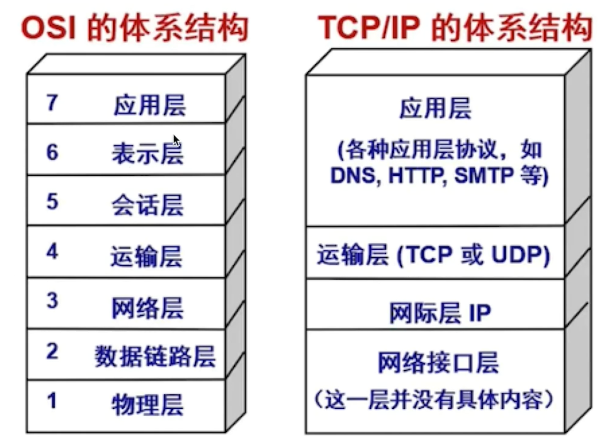
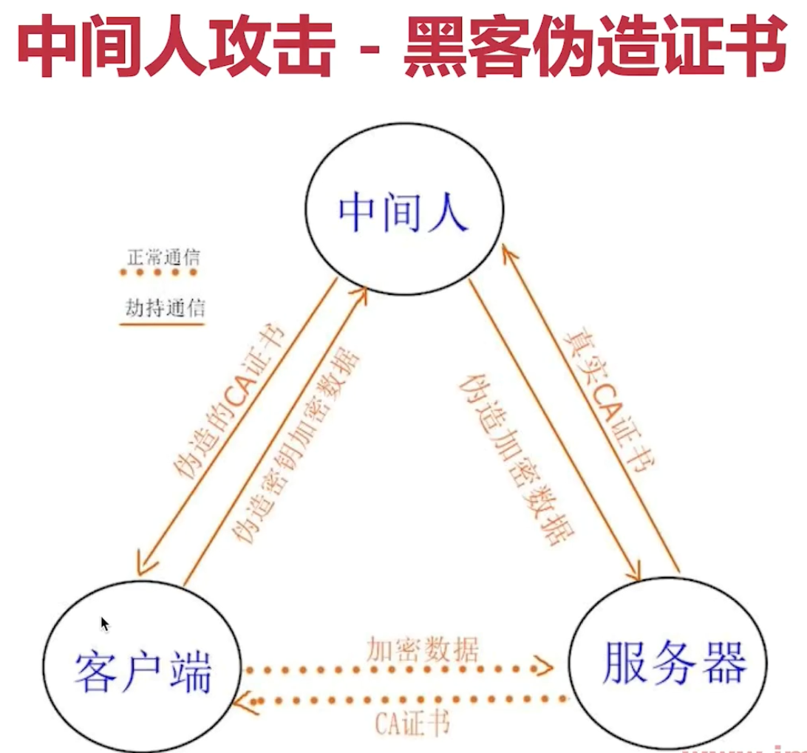
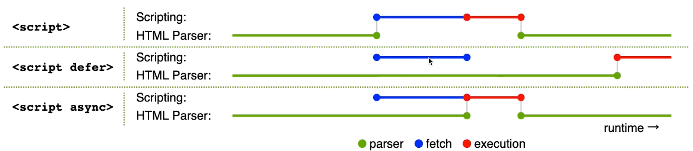
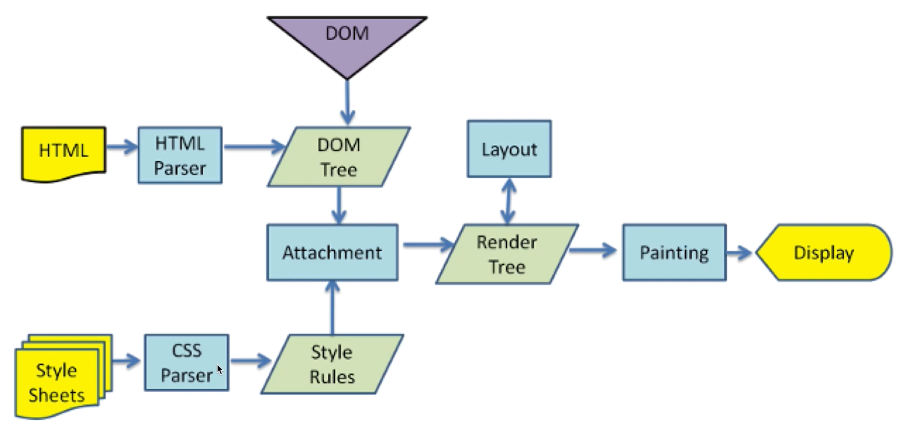
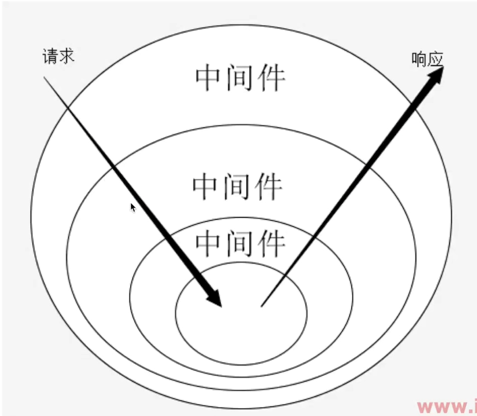

# 知识广度-从前端到全栈

## 1. 移动端 H5 click 有 300ms 延迟，如何解决？

背景：double tap to zoom

过去的解决方案：FastClick npm 插件

现在的解决方案；`<meta>` 中设置 `width=device-width`

## 2. 网络请求中，token 和 cookie 有什么区别？

cookie

- HTTP 无状态，每次请求都要带 cookie，以帮助识别身份
- 服务端也可以向客户端 set-cookie，cookie 大小限制 4kb
- 默认有跨域限制：不可跨域共享 cookie、不可跨域传递 cookie
- 前端可以通过设置 withCredentials 来运行跨域传递

cookie 本地存储

- HTML5 之前 cookie 常被用于本地存储
- HTML5 之后 推荐使用 localStorage 和 sessionStorage ( localStorage 也是跨域不共享的 )

现代浏览器开始禁用第三方 cookie

- 和跨域限制不同。这里是：禁止网页引入的第三方 JS 设置 cookie
- 打击第三方广告，保护用户隐私
- 新增属性 SameSite：Strict / Lax / None; 值可自己选择

cookie 和 session

- cookie 用于登录验证，存储用户表示 (如 userId )
- session 在服务端，存储用户详细信息，和 cookie 信息一一对应
- cookie + session 是常见登录验证解决方案



能不能把 session 去掉，将用户所有信息 (用户姓名、手机号等) 都塞给 cookie?

- 安全问题（泄漏用户信息）
- 体积问题（cookie 只有 4kb）

token vs cookie

- cookie 是 HTTP 规范，而 token 是自定义传递
- cookie 会默认被浏览器存储，而 token 需自己存储
- token 默认没有跨域限制

JWT (JSON Web Token)

- 前端发起登录，后端验证成功之后，返回一个加密的 token
- 前端自行存储这个 token (其实包含了用户信息，加密了)
- 以后访问服务端接口，都带着这个 token, 作为用户信息

token 和 cookie 的区别？

- cookie：HTTP 标准；跨域限制；配合 session 使用；
- token：无标准；无跨域限制；用于 JWT

> 扩展
>
> - 因为 cookie 存储大小有限制，所以 信息集中存储在 session 中

## 3. session 和 JWT 哪个更好？

session 优点

- 原理简单，易于学习
- 用户信息存储在服务端，可快速封禁某个用户

session 缺点

- 占用服务端内存，硬件成功高
- 多进程，多服务器时，不好同步 --- 需使用第三方缓存，如 redis
- 默认有跨域限制

JWT 优点

- 不占用服务端内存
- 多进程、多服务 不受影响

JWT 缺点

- 用户信息存储在客户端，无法快速封禁某个用户（可以通过建立黑名单，来封禁用户，代价是消耗内存）
- 万一服务端密钥被泄漏，则用户信息全部丢失
- token 体积一般大于 cookie, 会增加请求的数据量

对比

- 如有严格管理用户信息的需求 (保密、快速封禁) 推荐 Session
- 如没有特殊要求，则使用 JWT (如创业初期的网站)

## 4. 如何实现 SSO 单点登录

基于 cookie

- cookie 默认不可跨域共享，但有些情况下可设置为共享
- 主域名相同，如 `www.baidu.com` `image.baidu.com` (www、image 为二级域名，baidu.com 为主域名)
- 设置 cookie domain 为主域名，即可共享 cookie



SSO

- 主域名完全不同，则 cookie 无法共享
- 可使用 SSO 技术方案

第三方登录（ OAuth 2.0 ）

- 如 微信登录



> 扩展
>
> - 主域名相同，则可共享 cookie
> - 主域名不同，则需使用 SSO (单点登录)

## 5. HTTP 协议 和 UDP 协议有什么区别？

网络协议

- HTTP 协议在应用层
- TCP UDP 协议在传输层
- 严格来说，应该拿 TCP 和 UDP 进行比较



TCP 协议

- 有连接（三次握手）
- 有断开（四次挥手）
- 稳定传输

UDP 协议

- 无连接，无断开
- 不稳定传输，但效率高
- 如视频会议，语言通话

对比

- HTTP 是应用层，TCP UDP 是传输层
- TCP 有连接，有断开，稳定传输
- UDP 无连接，无断开，不稳定传输，但效率高

## 6. HTTP 协议 1.0、1.1、2.0 有什么区别？

HTTP 1.0

- 最基础的 HTTP 协议
- 支持基本的 GET POST 方法

HTTP 1.2 (常用)

- 缓存策略 cache-control E-tag 等
- 支持长连接 Connection: keep-alive, 一次 TCP 连接多次请求
- 断点续传，状态码 206
- 支持新的方法 PUT DELETE 等，可用于 Restful API

HTTP 2.0

- 可压缩 header, 减少体积
- 多路复用，一次 TCP 连接中可以多个 HTTP 并发请求
- 服务端推送

## 7. 什么是 HTTPS 中间人攻击？如何预防？

HTTPS 加密传输

- HTTP 明文传输，如果中间被截取，账号、密码就会被盗取
- HTTPS 加密传输 HTTP + TLS/SSL (加密)

中间人攻击（ 针对 HTTPS ）

- 黑客用自己的公钥发给客户端
- 然后再用自己的私钥解密用户发来的数据

如何预防 中间人攻击？

- 使用正规的第三方证书



## 8. `script>` defer 和 async 有什么区别？

defer：延迟，async：异步

- 无：HTML 暂停解析，下载 JS，执行 JS，再继续解析 HTML
- defer：HTML 继续解析，并行下载 JS, HTML 解析完再执行 JS
- async：HTML 继续解析，并行下载 JS, 执行 JS, 再解析 HTML



## 9. prefetch 和 dns-prefetch 有什么区别？

preload 和 prefetch

- preload 资源在当前页面使用，会**优先**加载
- prefetch 资源在未来页面使用，**空闲**时加载

```html
<head>
  <!-- preload -->
  <link rel="preload" href="style.css" as="style" />
  <!-- prefetch -->
  <link rel="prefetch" href="other.js" as="script" />
</head>
```

dns-prefetch 和 preconnet

- dns-prefetch 即 DNS 预查询
- preconnect 即 DNS 预连接

```html
<head>
  <link rel="“dns-prefetch”" href="https://fonts.gstatic.com/" />
  <link rel="“preconnect”" href="https://fonts.gstatic.com/" crossorigin />
</head>
```

> prefetch 是资源预获取（和 preload 相关）
>
> dns-prefetch 是 DNS 预查询（和 preconnect 相关）

## 10. 你知道哪些前端攻击？该如何预防？

xss

- Cross Site Script 跨站脚本攻击
- 手段：黑客将 JS 代码 插入到网页内容中，渲染时执行 JS 代码
- 预防：特殊字符替换（前端或者后端），如 `<` `>` 替换成 `&lt` `&gt`
- Vue、React 默认屏蔽了 xss 攻击
- 但是 Vue (v-html)、React (dangerouslySetInnerHTML) 会导致 xss 攻击，所以尽可能不要使用这两个

CSRF

- Cross Site Request Forgery 跨站请求伪造
- 手段：黑客诱导用户去访问另一个网站的接口，伪造请求
- 预防：严格的跨域限制 + 验证码机制

CSRF 详细过程

- 用户登录了 A 网站，有了 cookie
- 黑客诱导用户到 B 网站，并发起 A 网站的请求
- A 网站的 API 发现有 cookie, 认为是用户自己操作的

SCRF 预防手段

- 严格的跨域请求限制，如判断 referrer (请求来源)
- 为 cookie 设置 SameSite, 禁止跨域传递 cookie
- 关键接口使用短信验证码

点击劫持

- Click Jacking
- 手段：诱导界面上蒙一个透明的 iframe, 诱导用户点击
- 预防：让 iframe 不能跨域加载 (Response headers 设置 X-Frame-Options: sameorigin)

DDoS

- Distribute denial-of-service 分布式拒绝服务
- 手段：分布式的、大规模的流量访问，使服务器瘫痪
- 预防：软件层不好做，需硬件预防 (如阿里云 WAF)

SQL 注入

- 手段：黑客提交内容时写入 SQL 语句，破坏数据库
- 预防：处理输入的内容，替换特殊字符

> 总结：前端攻击有哪些
>
> - XSS
> - CSRF
> - 点击劫持
> - DDoS
> - SQL 注入
>
> 关于前端、后端安全或者其他校验等，前后端都要一起做，即使做重复了，也要做

## 11. WebSocket 和 HTTP 协议的区别？

WebSocket

- 支持端对端通讯
- 可以由 client 发起，也可以由 server 发起
- 用于：消息通知，直播间讨论区，聊天室，协同编辑

WebSocket 连接过程

- 先发起一个 HTTP 请求
- 成功之后再升级到 WebSocket 协议，再通讯

WebSocket 和 HTTP 区别

- WebSocket 协议名是 ws://, 可双端发起请求
- WebSocket 没有跨域限制
- 通过 send 和 onmessage 通讯 (HTTP 通过 req 和 res)

--- 聊天室简单示例 ---

```javascript
// 客户端 A
const ws = new WebSocket("ws://127.0.0.1:3000");
ws.onopen = () => {
  console.info("opened");
  ws.send("A opened");
};
ws.onmessage = (event) => {
  console.log("A received", event.data);
};

const btnSend = document.getElementById("btn-send");
btnSend.addEventListener("click", () => {
  console.log("clicked");
  ws.send("A time is" + Date.now());
});
// 客户端 B
const ws = new WebSocket("ws://127.0.0.1:3000");
ws.onopen = () => {
  console.info("opened");
  ws.send("B opened");
};
ws.onmessage = (event) => {
  console.log("B received", event.data);
};

const btnSend = document.getElementById("btn-send");
btnSend.addEventListener("click", () => {
  console.log("clicked");
  ws.send("B time is" + Date.now());
});
// 服务端
const { WebSocketServer } = require("ws");

const wsServer = new WebSocketServer({ port: 3000 });

const list = new Set();

wsServer.on("connection", (curWs) => {
  console.info("connected");

  // 这里，不能一直被 add, 实际使用中，这里应该有一些清理缓存的机制，长期用不到的 ws 要被清除
  list.add(curWs);

  curWs.on("message", (msg) => {
    console.log("received message", msg.toString());

    // 传递给其他客户端
    list.forEach((ws) => {
      if (ws === curWs) return;
      ws.send(msg.toString());
    });
  });
});
```

> ws 可升级为 wss (像 https)
>
> 扩展：实际项目推荐 socket.io, API 更简洁

## 12. WebSocket 和 HTTP 长轮询的区别？

区别

- HTTP 长轮询：客户端发起请求，服务端阻塞，不会立即返回
- WebSocket：客户端可发起请求，服务端也可发起请求

> 注意：HTTP 长轮询，需处理 timeout, 即 timeout 之后重新发请求

## 13. 描述从输入 url 到页面展示的完整过程

步骤

- 网络请求
- 解析
- 渲染

网络请求

- DNS 查询 (得到 IP), 建立 TCP 连接 (三次握手)
- 浏览器发起 HTTP 请求
- 收到请求响应，得到 HTML 源代码

继续请求静态资源

- 解析 HTML 过程中，遇到静态资源还会继续发起网络请求
- JS CSS 图片 视频等
- 注意：静态资源可能有强缓存，此时不必请求

解析：字符串 -> 结构化数据

- HTML 构建 DOM 树
- CSS 构建 CSSOM 树 (style tree)
- 两者结合，形成渲染树 (render tree)

> 优化解析
>
> - CSS 放在 `<head>` 中，不要异步加载 CSS
> - JS 放在 `<body>` 最下面 (或合理使用 defer async)
> - `` 提前定义 width height

渲染：Render Tree 绘制到页面

- 计算各个 DOM 的尺寸、定位, 最后绘制到页面
- 遇到 JS 可能会执行 (参考 defer async)
- 异步 CSS、图片加载, 可能会触发重新渲染

整个完整解析过程



> 总结
>
> - 网络请求：DNS 解析，HTTP 请求
> - 解析：DOM 树，CSSOM 树，Render Tree
> - 渲染：计算、绘制，同时执行 JS

## 14. 重绘 repaint 重排 reflow 有什么区别？

动态网页，随时都会重绘、重排

- 网页动画
- Modal Dialog 弹窗
- 增加/删除一个元素，显示/隐藏一个元素

重绘 repaint

- 元素外观改变，如颜色、背景色
- 但元素的尺寸、定位不变，不会影响其他元素的位置

重排 reflow

- 重新计算尺寸和布局，可能会影响其他元素的位置
- 如元素高度增加，可能会使相邻元素位置下移

区别

- 重排比重绘要影响更大，消耗也更大
- 所以，要尽量避免无意义的重排

减少重排的方法

- 集中修改样式，或直接切换 css class
- 修改之前先设置 display: none, 脱离文档流
- 使用 BFC 特性，不影响其他元素位置（ BFC 内部不影响外部 ）
- 频繁触发 (resize scroll) 使用节流和防抖
- 使用 createDocumentFragment 批量操作 DOM
- 优化动画，使用 CSS3 和 requestAnimationFrame

> 注意：CSS3 动画 比 JS 动画更快，是因为 CSS3 触发了 GPU 加速
>
> 扩展：BFC
>
> - Block Format Context 块级格式化上下文
> - 内部的元素无论如何改变，都不会影响其他元素的位置
>
> 触发 BFC 的条件
>
> - 根节点 `html>`
> - float: left/right
> - overflow: auto/scroll/hidden
> - display: inline-block/table/table-row/table-cell
> - display:flex/grid 的直接子元素
> - position: absolute/fixed

## 15. 如何实现网页多标签通讯？

使用 WebSocket

- 无跨域限制
- 需要服务端支持，成本高

通过 localStorage 通讯

- 同域的 A 和 B 两个页面
- A 页面设置 localStorage
- B 页面可监听到 localStorage 值的修改

-- localStorage 实现多标签 通讯 代码实现 --

```javascript
// A 页面
const btn1 = document.getElementById("btn1");
btn1.addEventListener("click", () => {
  const newInfo = {
    id: 100,
    name: "标题" + Date.now(),
  };
  localStorage.setItem("changeInfo", JSON.stringify(newInfo));
});
// localStorage、cookie 跨域不共享

// B 页面
window.addEventListener("storage", (event) => {
  console.log("key", event.key);
  console.log("value", event.newValue);
});
```

通过 SharedWorker 通讯

- SharedWorker 是 WebWorker 的一种
- WebWorker 可开启子**进程**执行 JS, 但不能操作 DOM
- SharedWorker 可单独开启一个进程, 用于**同域**页面通讯

-- SharedWorker 实现多标签 通讯 代码实现 --

```javascript
// worker.js
const set = new Set();

onconnect = (event) => {
  const port = event.ports[0];
  set.add(port);

  // 接收信息
  port.onmessage = (e) => {
    // 广播消息
    set.forEach((p) => {
      if (p === port) return; // 如果是自己就不广播，port 就是自己
      p.postMessage(e.data);
    });
  };

  // 发送信息
  port.postMessage("worker.js done");
};
// A 页面
const worker = new SharedWorker("./worker.js");

const btn1 = document.getElementById("btn1");
btn1.addEventListener("click", () => {
  console.log("clicked");
  worker.port.postMessage("detail go...");
});
// B 页面
const worker = new SharedWorker("./worker.js");
worker.port.onmessage = (e) => console.log("list", e.data);
```

> 总结
>
> - WebSocket 需要服务端，成本较高
> - localStorage 简单易用，推荐 (同域)
> - SharedWorker 调试不方便, 不兼容 IE11

## 16. 网页 和 iframe 如何通讯？

重点

- 使用 postMessage 通讯
- 注意跨域的限制和判断

-- 代码演示 --

```html
// 页面
<body>
  <p>
    index page
    <button id="btn1">发送信息</button>
  </p>

  <iframe id="iframe1" src="./child.html"></iframe>

  <script>
    const btn1 = document.getElementById("btn1");
    btn1.addEventListener("click", () => {
      console.log("index clicked");
      window.iframe1.contentWindow.postMessage("hello", "*"); // 第二个参数是个域名
    });

    window.addEventListener("message", (event) => {
      console.log("origin", event.origin); // 来源的域名
      console.log("index received", event.data);
    });
  </script>
</body>
// iframe
<body>
  <p>
    child page
    <button id="btn1">发送消息</button>
  </p>

  <script>
    const btn1 = document.getElementById("btn1");
    btn1.addEventListener("click", () => {
      console.info("child clicked");
      window.parent / postMessage("world", "*");
    });

    window.addEventListener("message", (event) => {
      console.info("origin", event.origin); // 判断 origin 的合法性
      console.info("child received", event.data);
    });
  </script>
</body>
```

## 17. 请描述 Koa2 的洋葱圈模型

Koa2

- 一个简约、流行的 nodejs 框架
- 通过中间件组织代码
- 多个中间件以 ”洋葱圈模型“ 执行

```javascript
// 洋葱圈模型 代码演示
const Koa = require("koa");
const app = new Koa();

// logger
app.use(async (ctx, next) => {
  const start = Date.now();
  await next(); // 先执行下一步 x-response-time, 执行完再继续执行
  const ms = Date.now() - start;
  console.log(`${ctx.method} ${ctx.url} - ${ms}`);
});

// x-response-time
app.use(async (ctx, next) => {
  const start = Date.now();
  await next(); // 先执行下一步 response, 执行完再继续执行
  const ms = Date.now() - start;
  ctx.set("X-Response-Time", `${ms}ms`);
});

// response
app.use(async (ctx) => {
  ctx.body = "Hello World";
});

app.listen(3000);
```

洋葱圈模型

	
