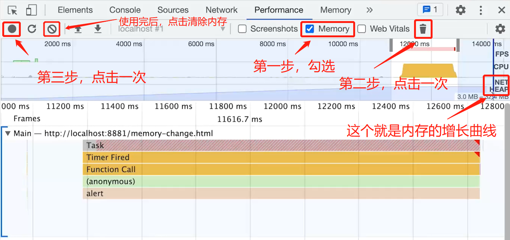

# 知识深度-原理和源码

## 1. JS 内存垃圾回收用什么算法

垃圾回收

- 哪些不会被垃圾回收？


-- 不会被垃圾回收 --

```javascript
// window 对象的属性 不会被回收

// 闭包内存 不会回收
function getDataFns() {
    const data = {} //闭包
    return {
        get(key) {
            return data[key]
        },
        set(key, value) {
            data[key] = value
        }
    }
}
const { get, set } = getDataFns()
set('x', 100)
get('x')
```


垃圾回收的算法

- 引用计数（之前 ，引用计数 等于 0，就会被回收）
- 标记清除（现代，从 window `根` 逐步开始遍历，能找到就保留，不能找到就删除）


```javascript
// 循环引用可能导致的内存泄露
// IE6-7 内存泄漏的 bug
var div1 = document.getElementById('div1')
div1.a = div1
div1.someBigData = {}
```


> 闭包是内存泄漏吗？
>
> - 闭包不是内存泄漏，因为闭包的数据是不可以被回收的


## 2. JS 内存泄漏如何检测？场景有哪些？

检测内存变化（浏览器如何操作？）



内存泄漏的场景有哪些？（Vue 为例）

- 被全局变量、函数引用，组件销毁时未清除
- 被全局事件、定时器引用，组件销毁时未清除
- 被自定义事件引用，组件销毁时未清除

```vue
<script>
export default {
    name: 'Memory Leak Demo',
    data() {
        return {
            arr: [10, 20, 30], // 数组 对象
            intervalId: 0
        }
    },
    methods: {
		printArr() {
            console.log(this.arr)
        }
    },
    mounted() {
        // 全局变量
        window.arr = this.arr
        // 函数引用
        window.printArr = () => {
            console.log(this.arr)
        } 
        // 定时器引用
        this.intervalId = setInterval(this.printArr)
        // 全局事件
        window.addEventListener('resize', this.printArr)
	},
    // Vue2 - beforeDestroy
    beforeUnmount() {
        // 全局变量 销毁
        window.arr = null
        // 函数引用 销毁
        window.printArr = null
        // 定时器引用 销毁
        if (this.intervalId) {
            clearInterval(this.intervalId)
        }
        // 全局事件 销毁
        window.removeEventListener('resize', this.printArr)
    }
}
</script>
```


> 扩展
>
> - weakMap() 、weakSet 都是弱引用，有可能被垃圾回收清除掉


## 3. 浏览器 和 node.js 的 event loop 有什么区别？

单线程 和 异步

- JS 是单线程的（无论在浏览器还是 node.js）
- 浏览器中 JS 执行 和 DOM 渲染共用一个线程
- 异步（JS 单线程的解决方案）


宏任务 和 微任务

- 宏任务，如 setTimeout setInterval 网络请求

- 微任务，如 promise async/await

- 微任务在下一轮 DOM 渲染之前执行，宏任务在之后执行

  

```javascript
const p = document.createElement('p')
p.innerHTML = 'new paragraph'
document.body.appendChild(p)
const list = document.getElementsByTagName('p')
console.log('length----', list.length)

console.log('start')
// 渲染之后
setTimeout(() => {
	const list = document.getElementsByTagName('p')
    console.log('length on timeout---', list.length)
    alert('阻塞 timeout')
})
// 渲染之前
Promise.resolve().then(() => {
    const list = document.getElementsByTagName('p')
    console.log('length on promise.then ---', list.length)
})
console.log('end')
// 打印结果
// length---- 2
// start
// end
// length on promise.then--- 2
// length on timeout---- 2
```


nodejs 异步

- Nodejs 同样使用 ES 语法，也是单线程，也是需要异步
- 异步任务也分：宏任务 + 微任务
- 但是，它的宏任务和微任务，分不同类型，有不同优先级

```js
// nodejs
console.log('start')

// 宏任务
setTimediate(() => {
	console.info('setImmediate')
})
setTimeout(() => {
    console.info('timeout')
})

// 微任务
Promise.resolve().then(() => {
    console.log('promise then')
})
process.nextTick(() => {
    console.log('nextTick')
})

console.log('end')
// 打印结果
// end
// nextTick
// promise then
// timeout
// setImmediate
```


nodejs 宏任务类型和优先级

- Timers - setTimeout setInterval
- I/O callbacks - 处理网络、流、TCP 的错误回调
- Idle, prepare - 闲置状态（nodejs 内部使用）
- Poll 轮询 - 执行 poll 中的 I/O 队列
- Check 检查 - 存储 setImmediate 回调
- Close callbacks - 关闭回调，如 socket.on(‘close’)


nodejs 微任务类型和优先级

- 包括：promise, async/await, process.nextTick
- 注意，process.nextTick 优先级最高


> 总结：nodejs event loop `事件循环`
>
> - 执行同步代码
> - 执行微任务（process.nextTick 优先级更高）
> - 按顺序执行 6 个类型的宏任务（每个开始之前都执行当前的微任务）
> - `推荐使用` setImmediate 代替 process.nextTick


## 4. vdom 真的很快吗？

vdom 是什么？

- Virtual DOM，虚拟 DOM
- 用 JS 对象模拟 DOM 节点数据
- 由 React 最先推广使用


Vue React 等框架的价值

- 组件化
- 数据视图分离，数据驱动视图 --- 这是核心!
- 只关注业务数据，而不用再关系 DOM 变化
- 数据驱动视图，技术方案: vdom


数据驱动视图的原理

- 当 data 数据变化

- diff算法，去对比 vnode(当前 node 节点) 与 oldVnode 
- 找出要更新的点，去更新 DOM


从执行速度的角度看

- jquery DOM节点操作 比 数据驱动视图更快

从整个业务开发过程来看

- 数据驱动视图，减低了项目维护更新成本，从这个方面来说，数据驱动视图更快


> 总结：
>
> - vdom 并不快，JS 直接操作 DOM 才是最快的
> - 但 “数据驱动视图” 要有合适的技术方案，不能全部 DOM 重建
> - vdom 就是目前最合适的技术方案（并不是因为它快，而是合适）


`扩展: svelte 就不用 vdom`


## 5. 遍历一个数组用 for 和 forEach 哪个更快？

- for 更快
- forEach 每次都要创建一个函数，而 for 不会创建函数
- 函数需要独立的typora作用域，会有额外的开销


## 6. nodejs 如何开启进程，进程如何通讯？

 进程 proces vs 线程 thread

- 进程，OS 进行资源分配和调度的最小单位，有独立内存空间
- 线程，OS 进行运算调度的最小单位，共享进程内存空间
- JS 是单线程的，但可以开启多进程执行，如 WebWorker


为何需要多进程？

- 多核 CPU, 更适合处理多进程
- 内存较大，多个进程才能更好的利用（单进程有内存上线）
- 总之，“压榨” 机器资源，更快，更节省


nodejs 如何开启进程，进程如何通讯？

- 开启子进程 child_process.fork 和 cluster.fork
- 使用 send 和 on 传递消息


--- 通过 fork 开启多进程 ---

```javascript
// 主进程
const http = require('http')
const fork = require('child_process').fork

const server = http.createServer((req, res) => {
    if (req.url === '/get-sumn') {
        console.info('主进程  id', process.pid)
        
        // 开启子进程
        const computeProcess = fork('./compute.js')
        computeProcess.send('开始计算')
        
        computeProcess.on('message', data => {
            console.info('主进程接收到的信息：', data)
            res.end('sum is' + data)
        })
        
        computeProcess.on('close', () => {
            console.log('子进程因报错而退出')
            computeProcess.kill()
            res.end('error')
        })
    }
})
server.listen(3000, () => {
    console.info('localhost: 3000')
})
```

```javascript
// 子进程 计算
function getSum() {
    let sum = 0
    for (let i = 0; i < 10000; i++) {
        sum += i
    }
    return sum
}

process.on('message', data => {
    console.info('子进程 id', process.pid)
    console.info('子进程接收到的信息：', data)
    
    const sum = getSum()
    
    // 发送信息给主进程
    process.send(sum)
})
```


--- 通过 cluster 开启多进程 ---

```javascript
const http = require('http')
const cpuCoreLength = require('os').cpus().length
const cluster = require('cluster')

if (cluster.isMaster) {
    for (let i = 0; i < cpuCoreLength; i++) {
        cluster.fork() // 开启子进程
    }
    
    cluster.on('exit', worker => {
        console.log('子进程退出')
        cluster.fork() //进程守护
    })
} else {
    // 多个子进程 端口会不会冲突？不会
    // 因为多个子进程会共享一个 TCP 连接，提供一份网络服务
    const server = http.createServe((req, res) => {
        res.writeHead(200)
        res.end('done')
    })
    server.listen(3000)
}
```


> 扩展：工作可以使用 **PM2** , 来开启多进程，进程守护


## 7. 请描述 js-bridge 的实现原理

什么是 JS Bridge? 

- JS 无法直接调用 native API ( 获取视像头、获取相册等等接口 )
- 需要通过一些特定的 "格式" 来调用
- 这些 “格式” 就统称 JS-Bridge, 例如微信 JSSDK


JS Bridge 的常见实现方式

- 注册全局 API (不适用于 异步)
- URL Scheme (适用于 所有情况)


例如 uni-app（这个就是 URL Scheme 方式实现的）

- weixin:// 打开微信
- weixin://dl/scan 扫一扫


```javascript
// 封装 JS-bridge
const sdk = {
    invoke(url, data = {}, onSuccess, onError) {
		const iframe = document.createElement('iframe')
        iframe.style.visibility = 'hidden'
        iframe.onload = () => {
            const content = iframe1.contentWindow.document.body.innerHTML
            onSuccess.remove()
        }
        iframe.onerror = () => {
            onError()
            iframe.remove()
        }
        iframe.src = 'my-app-name://'${url}?data=${JSON.stringify(data)}
    }
    fn1(data, onSuccess, onError) {
        this.invoke('api/fn2', data, onSuccess, onError)
    }	
}
```


> 推荐使用 `URL Scheme`


## 8. requestIdleCallback 和 request

由 React fiber 引起的关注

- 组建树转换为链表，可分段渲染
- 渲染时可以暂停，去执行其他高优任务，空闲时再继续渲染
- 如何判断空闲？-- requestIdleCallback 这个 API


requestIdleCallback 和 requestAnimationFrame 的区别

- requestAnimationFrame 每次渲染都会执行，高优
- requestIdleCallback 空闲时才执行，低优


```html
// requestIdleCallback 和 requestAnimationFrame 如何使用
<html>
    <body>
        <button id="btn1">change</button>
        <div id="box"></div>
    </body>
    <script>
    	const box = document.getElementById('box')
        
        document.getElementById('btn1').addEventListener('click', () => {
            let curWidth = 100
            const maxWidth = 400
            
            function addWidth() {
                curWidth = curWidth + 3
                box.style.width = `${curWidth}px`
                if (curWidth < maxWidth) {
                    window.requestAnimationFrame(addWidth) // 时间不用自己控制
                    window.requestIdleCallback(addWidth)
                }
            }
            addWidth()
        })
    </script>
</html>
```


requestIdleCallback 和 requestAnimationFrame 两者是宏任务还是微任务？

- 两者都是宏任务
- 要等待 DOM 渲染完成才执行，肯定是宏任务


```javascript
// setTimeout、requestIdleCallback、requestAnimationFrame 的执行顺序
window.onload = () => {
    console.log('start')
    setTimeout(() => {
        console.info('timeout')
    })
    window.requestIdleCallback(() => {
        console.info('requestIdleCallback')
    })
    window.requestAnimationFrame(() => {
        console.info('requestIdleCallback')
    })
    console.info('end')
}
// 打印结果
// start
// end
// timeout
// requestIdleCallback
// requestIdleCallback
```


## 9. Vue 每个生命周期都做了什么？

生命周期有哪些？

- 八个生命周期
- beforeCreate、created、beforeMount、mounted、beforeUpdate、updated、beforeUnmount、unmounted


每个生命周期都干了什么？

beforeCreate

- 创建一个空白的 Vue 实例
- data method 尚未被初始化，不可使用

created

- Vue 实例初始化完成，完成响应式绑定
- data method 都初始化完成，可调用
- 尚未开始渲染模板

beforeMount

- 编译模板，调用 render 生成 vdom
- 还没有开始渲染 DOM

mounted

- 完成 DOM 渲染
- 组件创建完成
- 开始由 “创建阶段” 进入 “运行阶段”

beforeUpdate

- data 发生变化之后
- 准备更新 DOM (尚未更新 DOM)

updated

- data 发生变化，且 DOM 更新完成
- 不要在 updated 中修改 data，可能会导致死循环（ updata 中修改 data，重新 updata, 又修改 data ）

beforeUnmount

- 组件进入销毁阶段（尚未销毁，可正常使用）
- 可移除、解绑一些全局事件、自定义事件

unmounted

- 组件被销毁了
- 所有子组件也都被销毁了


扩展：keep-alive 组件生命周期（created中 只创建一次）

- onActivated 缓存组件被激活
- onDeactivated 缓存组件被隐藏


连环问？

Vue 什么时候操作 DOM 比较合适？

- mounted 和 updated 都不能保证子组件全部挂载完成
- 使用 $nextTick 渲染 DOM

```javascript
mounted() {
	this.$nextTick(function() {
		// 仅在整个视图都渲染之后才会运行的代码
	})
}
```


Ajax 应该在哪个生命周期？

- 有两个选择：created 和 mounted
- 推荐：mounted


Vue3 Composition API 生命周期有何区别？

- setup 代替了 beforeCreate 和 created
- 使用 Hooks 函数的形式，如 mounted 改为 onMounted()

```javascript
// Composition API
import { onUpdated, onMounted } from 'vue'

export default {
	setup() {
		onMounted(() => {
			console.log('mounted')
		})
		onUpdated(() => {
			console.log('updated')
		})
	}
}
```


## 10. Vue2、Vue3、React 三者 diff 算法有何区别？

diff 算法

- diff 算法很早就有

- diff 算法应用广泛，例如 github 的 Pull Request 中的代码 diff

- 如果要严格 diff 两棵树，时间复杂度 O(n^3)，不可用

  

Tree diff 的优化，优化后时间复杂度降为 O(n)

- 只比较同一层级，不跨级比较
- tag 不同则删除重建 (不再去比较内部的细节)
- 子节点通过 key 区分 (key 的重要性)


学习技巧

- diff 算法非常复杂，不要深究细节
- 既然是三者的比较，说出他们最大的不同即可


React diff - 仅右移


Vue2 - 双端比较（减少移动开销）


Vue3 - 最长递增子序列（减少 DOM 操作）


> diff 算法原理的核心在于 减少 DOM 操作


连环问

Vue React 为何循环时必须使用 key ?

- vdom diff 算法会根据 key 判断元素是否删除？
- 匹配了 key, 则只移动元素 - 性能较好
- 为匹配 key, 则删除重建 - 性能较差


## 11. Vue-router MemoryHistory (abstract)

Vue-router 三种模式

- Hash (带 # 号，`locahost:8080/#/about`)
- WebHistory (不带 # 号，`locahost:8080/about`)
- MemoryHistory (V4 之前叫做 abstract history)


MemoeyHistory 将路由当成一个整体一样，不会有路由 (url) 的变化

```javascript
// MemoeyHistory 实现方式
import { createWebHashHistory } from 'vue-router'

const routes = [
    {
        path: '/',
        name: 'Home',
        component: Home
    },
    {
		path: '/about',
        name: 'About',
        component: () => import('../views/About.vue')
    }
]

const router = createRouter({
    history: createWebHashHistory(),
    routes
})

export default router
```


## 12. 讲下 异步

### 什么是同步、异步?

同步: 按代码顺序执行

异步: 简单来说, 不按照代码顺序执行, 就是异步


### 为了会有异步

异步是为了解决, JS 单线程阻塞问题的


### 如何 异步 解决 JS 单线程阻塞问题

通过 事件循环 来解决, 事件循环的执行流程, 同步任务会进入主线程执行, 而异步任务会进入任务队列, 等到主线程任务执行完, 任务队列的任务就会放入主线程执行, 如此循环反复


### JS 如何实现异步?

异步在于创建宏任务和微任务, 通过事件循环机制实现异步机制

**宏任务**

- 定时器 setTimeout、setInterval
- 事件监听 (发布订阅)
- 回调函数

**微任务**

- Promise
- async/await


**标准回答 (按异步编程进化史来说)**

所有异步任务都是在同步任务执行结束之后，从任务队列中依次取出执行。 

回调函数是异步操作最基本的方法，比如 AJAX回调，回调函数的优点是简单、容易理解和实现，缺点是不利于代码的阅读和维护，各个部分之间高度耦合，使得程序结构混乱、流程难以追踪（尤其是多个回调函数嵌套的情况），而且每个任务只能指定一个回调函数。此外它不能使用 try catch 捕获错误

return Promise 包装了一个异步调用并生成一个 Promise 实例，当异步调用返回的时候根据调用的结果分别调用实例化时传入的resolve 和 reject方法，then接收到对应的数据，做出相应的处理。Promise不仅能够捕获错误，而且也很好地解决了回调地狱的问题，缺点是无法取消 Promise，错误需要通过回调函数捕获。 

Generator 函数是 ES6 提供的一种异步编程解决方案，Generator 函数是一个状态机，封装了多个内部状态，可暂停函数, yield可暂停，next方法可启动，每次返回的是yield后的表达式结果。优点是异步语义清晰，缺点是手动迭代`Generator`函数很麻烦，实现逻辑有点绕 

async/await是基于Promise实现的，async/await使得异步代码看起来像同步代码，所以优点是，使用方法清晰明了，缺点是await 将异步代码改造成了同步代码，如果多个异步代码没有依赖性却使用了 await 会导致性能上的降低，代码没有依赖性的话，完全可以使用 Promise.all 的方式。 

加分回答 JS 异步编程进化史：callback -> promise -> generator/yield -> async/await。 async/await 函数对 Generator 函数的改进

体现在以下三点： - 内置执行器。 Generator 函数的执行必须靠执行器，而 async 函数自带执行器。

也就是说，async 函数的执行，与普通函数一模一样，只要一行。 更广的适用性。 

yield 命令后面只能是 Thunk 函数或 Promise 对象，而 async 函数的 awt 命令后面，可以跟 Promise 对象和原始类型的值（数值、字符串和布尔值，但这时等同于同步操作）, 更好的语义。 

async 和 await，比起 星号 和 yield，语义更清楚了

async 表示函数里有异步操作，await 表示紧跟在后面的表达式需要等待结果。 目前使用很广泛的就是 promise 和 async/await


[注意]

宏任务、微任务 都是异步任务

```typescript
// Generator 的使用
function* generatorForLoop(num: any) {
  for (let i = 0; i < num; i += 1) {
    yield console.log(i);
  }
}

const genForLoop = generatorForLoop(5);

genForLoop.next(); // 首先 console.log —— 0
genForLoop.next(); // 1
genForLoop.next(); // 2
genForLoop.next(); // 3
genForLoop.next(); // 4

// Promise 的使用
function promise () {
  return new Promise((resolve, reject)=>{
    setTimeout(()=>{
      resolve('success')
    },3000)
  })
}

promise().then((res)=>{
  	console.log(res)
}).catch((err)=>{
  	console.log(err)
})

// async / await 使用
function getSomeThing(){
    return new Promise((resolve,reject)=>{
        setTimeout(()=>{
            resolve('获取成功')
        },3000)
    })
}

async function test(){
    let a = await getSomeThing()
    console.log(a)
}
test() // 3秒后输出：获取成功
```

