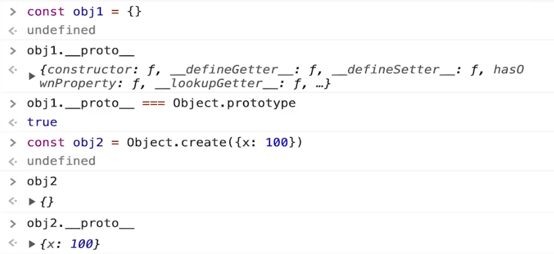
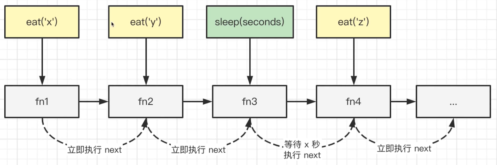

# 编写高质量代码-正确、完整、清晰、鲁棒

## 1. 手写一个 JS 函数, 实现数组扁平化 ArrayFlatten

Array Flatten

- 写一个 JS 函数，实现数组扁平化，只减少一级嵌套
- 如输入 [1, [2, [3]], 4]. 输出 [1, 2, [3], 4]


思路

- 定义空数组 arr = []。遍历当前数组
- 如果 item 非数组，则累加到 arr
- 如果 item 是数组，则遍历之后累加到 arr


```tsx
/**
* 数组扁平化，使用 push
* @param arr arr
*/
export function flattern1(arr: any[]: any[] {
    const res: any[] = []
    
    arr.forEach(item => {
        if (Array.isArray(item)) {
            item.forEach(n => res.push(n))
        } else {
            res.push(item)
        }
    })
    
    return res
})

// 功能测试
const arr = [1, [2, [3]], 5]
console.log( flattern1(arr ) )
```

```tsx
/**
* 数组扁平化，使用 concat
* @param arr arr
*/
export function flattern2(arr: any[]: any[] {
    let res: any[] = []
    
    arr.forEach(item => {
        res = res.concat(item)
    })
    
    return res
})

// 功能测试
const arr = [1, [2, [3]], 5]
console.log( flattern2(arr ) )
```


## 2. Array Flatten 彻底 ”拍平“

彻底 ”拍平“

- 写一个 JS 数组，实现数组扁平化，减少所有嵌套的层级
- 如输入 [1, [2, [3]], 4], 输出 [1, 2, 3, 4]


思路

- 先实现一级别扁平化，然后递归调用，直到全部扁平


```tsx
/**
* 数组深度扁平化，使用 push
* @param arr arr
*/
export function flattern1(arr: any[]: any[] {
    const res: any[] = []
    
    arr.forEach(item => {
        if (Array.isArray(item)) {
            const flactItem = flattern1(item) //递归
            flatItem.forEach(n => res.push(n))
        } else {
            res.push(item)
        } 
    })
    
    return res
})

// 功能测试
const arr = [1, [2, [3]], 5]
console.log( flattern1(arr ) )
```

```tsx
/**
* 数组彻底扁平化，使用 concat
* @param arr arr
*/
export function flattern2(arr: any[]: any[] {
    let res: any[] = []
    
    arr.forEach(item => {
        if (Array.isArray(item)) {
            const flactItem = flattern2(item) //递归
            res = res.concat(flactItem)
        } else {
            res = res.concat(item)
        } 
    })
    
    return res
})

// 功能测试
const arr = [1, [2, [3]], 5]
console.log( flattern2(arr ) )
```


巧妙的解决方案：toString()

```javascript
const nums = [1, 2, [3, 4, [100, 200]], 5]
nums.toString() // ’1,2,3,4,100,200,5,6‘

// 但万一数组元素是 {x: 100} 等引用类型，就不可以了
```


> 总结
>
> - 高质量代码的特点：编码规范性，功能完整性，鲁棒性
> - 题目示例是 number 类型，但你需要考虑其他类型
> - 慎用那些看似巧妙的方法，可能有坑


## 3. 手写一个 getType函数, 获取详细的数据类型

获取类型

- 手写一个 getType 函数，传入任意变量，可准确获取类型
- 如 number string boolean 等值类型
- 还有 object array map regexp 等引用类型


常见的类型判断

- typeof - 只能判断值类型, 其他就是 function 和 object
- intanceof - 需要两个参数来判断，而不是获取类型


枚举各种类型

- 通过 typeof 判断值类型  和 function
- 其他引用通过 instanceof 来逐个识别


枚举的坏处

- 你可能忽略某种类型
- 增加了新类型，需要修改代码


正确做法

- 使用 Object.proptotype.toString.call(x)
- 注意，不能直接调用 x.toString()

 

```tsx
/**
* 获取详细的数据类型
* @param x x
*/
export function getType(x: any): String {
    const originType = Object.prototype.toString.call(x) // '[object String]'
	const spaceIndex = originType.indexOf(' ')
    const type = originType.slic(spaceIndex + 1, -1) // 'String'
    return type.toLowerCase() // 'string'
}

// 功能测试
console.info( getType(null) )
console.info( getType(undefined) )
console.info( getType(100) )
console.info( getType('abc') )
console.info( getType(true) )
console.info( getType(Symbol()) )
console.info( getType({}) )
console.info( getType([]) )
console.info( getType(() => {}) )
```


## 4. new 一个对象发生了什么？请手写代码表示

class 是 function 的语法糖

```tsx
// 示例
class Foo {
    // 属性
    name: string
    city: string
    
    constructor(name: string) {
        this.name = name
        this.city = '北京'
    }
    
    getName() {
        return this.name
    }
}

const f = new Foo('Lin')
```


new 一个对象的过程

- 创建一个空对象 Obj, 继承构造函数的原型
- 执行构造函数 (将 obj 作为 this)
- 返回 obj

```tsx
// 模拟 new 实现过程
export function customNew<T>(constructor: Function, ...args: any[]): T {
    // 1. 创建一个空对象，继承 constructor 的原型
    const obj = Object.create(constructor.prototype)
    // 2. 将 obj 作为 this, 执行 constructor, 传入参数
    constructor.apply(obj, args)
    // 3. 返回 obj
    return obj
}

class Foo {
    // 属性
    name: string
    city: string
    
    constructor(name: string) {
        this.name = name
        this.city = '北京'
    }
    
    getName() {
        return this.name
    }
}

const f = customNew<Foo>(Foo, 'Lin')
console.log(f)
```


## 5. Object.create 和 {} 有什么区别？

区别

- {} 创建空对象，原型指向 Object.prototype
- Object.create 创建空对象，原型指向传入的参数



## 6. 深度优先遍历可以不用递归吗

可以用栈代替递归，因为递归的底层实现也是用栈


## 7. 手写一个 LazyMan，实现 sleep 机制

手写 LazyMan

- 支持 sleep 和 eat 两个方法

- 支持链式调用

  

代码设计

- 由于有 sleep 功能，函数不能直接在调用时触发
- 初始化一个列表，把函数注册进去
- 由每个 item 触发 next 执行 (遇到 sleep 则异步触发)



--- 代码实现 lazyMan ---

```tsx
class LazyMan {
	private name: string
    private tasks: Function[] = [] // 任务列表
    
    constructor(name: string) {
		this.name = name
        
        setTimeout(() => {
            this.next()
        })
    }
	
    private next() {
        const task = this.tasks.shift() // 取出当前 tasks 的第一个任务
    	if (task) task()
    }
    
    eat(food: string) {
        const task = () => {
            console.info('${this.name} eat ${food}')
            this.next() // 执行下一个任务
        }
        this.tasks.push(task)
        
        return this // 链式调用
    }
	
    sleep(seconds: number) {
        const task = () => {
			console.info(`${this.name} 开始睡觉`)
            setTimeout(() => {
                console.info(`${this.namee} 已经睡完了 ${seconds}s, 开始执行下一个任务`)
                this.next() // xx 秒之后再执行下一个任务
            }, seconds * 1000)
        }
        this.tasks.push(task)
        
        return this // 链式调用
    }
}

// 测试
const me = new lazyMan('Lin')
me.eat('苹果').eat('香蕉').sleep(2).eat('葡萄')

// 执行结果
// Lin eat 苹果
// Lin eat 香蕉
// Lin 开始睡觉
// Lin 已经睡觉了 2s, 开始执行下一个任务
// Lin eat 葡萄
```


