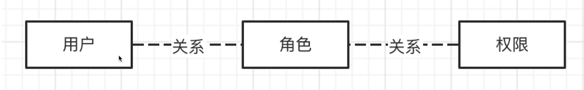
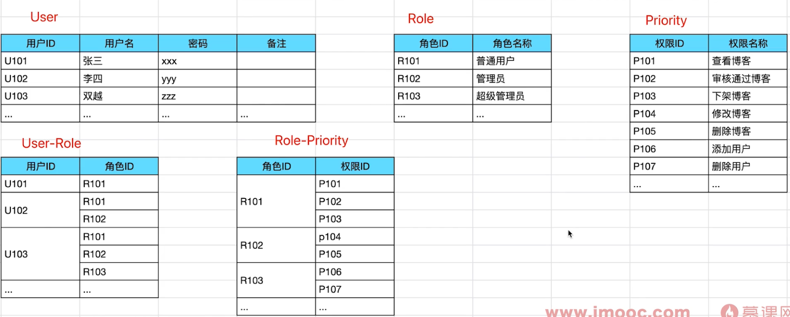
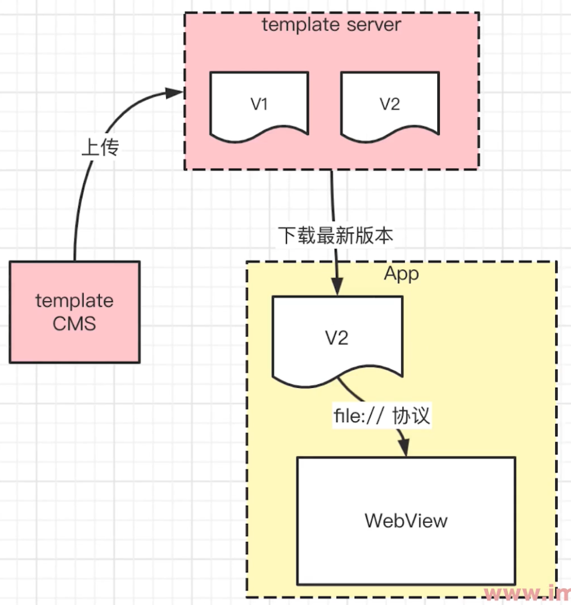

## 1. 如何设计一个前端统计 SDK - 分析功能范围

前端统计的范围

- 访问量 PV
- 自定义事件 (如 某个按钮的点击量, 分享按钮)
- 性能, 错误


--- 前端统计 SDK ---

```tsx
const PV_URL_SET = new Set()

class Mystatistic {
    constructor(productId) {
        this.productId = productId
        
        this.initPerformance() // 性能统计
        this.initError() // 错误统计
    }
    
    // 发送统计数据
    send(url, params = {}) {
        params.productId = productId
        
        const paramArr = []
        for (let key in params) {
            const val = params[key]
            paramArr.push(`${key}=${value}`)
        }
        
        const newUrl = `${url}?${paramArr.join('&')}` // url?a=10&b=20
        
        // 用  发送: 1. 可跨域 2. 兼容性非常好
        const img = document.createElement('img')
        img.src = newUrl // get   
    }
    
    // 初始化性能统计
    initPerformance() {
        const url = 'yyy'
        this.send(url, performance.timing)
        // 统计的时候一定要给最原始的、最完整的结果, 原始数据
    }
    
    // 初始化错误监控
    initError() {
        // 监听 JS 错误
        window.addEventListener('error', event => {
            const { error. lineno, colno } = event
            this.error(error, { lineno, colno })
        })
        // promise 未 catch 住的报错
        window.addEventListener('unhandledrejection', event => {
            this.error(new Error(event.reason), { type: 'unhandlerejection' })
        })
    }
    
    pv() {
        // 页面流量统计 (可以看做一个特殊的 event)
        const herf = location.href
        if (PV_URL_SET.get(href)) return // 不重复发送 pv
        
        this.event('pv')
        PV_URL_SET.add(href)
    }
    
    event(key, val) {
        const url = 'xxx' // 自定义事件统计 server API
        this.send(url, {key,val})
    }
    
    error(err, info = {}) {
        const url = 'zzz'
        const { message, stack } = err // message 错误信息, stack 错误的详细信息
        this.send(url, { message, stack, ...info })
    }
}

// 使用这个 SDK
// const s = new MyStatistic('a1')
// s.pv() // SPA 路由切换 就是一次 PV
// s.event('vip', 'ok') 
// try {
    
// } catch(ex) {
//     s.error(ex, {})
// }

// Vue
// React
```


## 2. sourcemap 有何作用, 如何配置

sourcemap 的作用

- JS 上线时要压缩、混淆
- 线上的 JS 报错信息, 将无法识别行、列
- sourcemap 即可解决这个问题 (将线上的报错的行列信息,转换为源代码报错行列信息)


推荐

- 开发环境 - 通常就不压缩
- 线上环境 - source-map, 无


重点

- 开源项目, 也要开源 sourcemap
- 非开源项目, 不要泄漏 sourcemap !!!
- 了解 sourcemap 作用和配置即可, 编译原理不必深究


## 3. 何时用 SPA, 何时用 MPA

名词解释

- SPA - Single - page Application 单页面应用

- MPA - Multi - page Application 多页面应用
- 默认情况下, Vue React 都是 SPA


SPA 特点

- 功能较多, 一个页面展示不完
- 以操作为主, 非展示为主
- 适合一个综合 Web 应用


SPA 场景

- 大型后台管理系统, 如阿里云的 console
- 知识库, 如语雀、石墨文档
- 比较复杂的 WebApp、如 外卖 H5


MPA 特点

- 功能较少, 一个页面展示的完
- 以展示为主, 操作较少
- 适合一个孤立的页面


MPA 场景

- 分享页, 如腾讯文档分享出去
- 新闻详情页, 如新闻 App 的详情页, 微信公众号发布的页面


## 4. 技术 与 怎么做？

在做的过程中要以 产品、用户、需求的角度去做, 不要单从技术出发


## 5. 设计一个 H5 编辑器的数据模型和核心功能

使用 Vue + Vuex 开发 H5 编辑器

- 点击保存按钮, 提交给服务端的数据格式怎样设计？
- 如何保证画布和属性面板的信息同步？
- 如果再扩展一个 “图层” 面板, Vuex 如何设计数据？


```javascript
// 点击保存按钮, 提交给服务端的数据格式怎样设计？
const store = {
    pages: {
        title: '标题',
        setting: { /* 其他扩展信息：多语言, 微信分享的配置, 其他*/ },
        props: { /* 当前页面的属性设置, 背景 */ },
        components: [
            // components 有序, 数组
            
            {
                id: 'x1',
                name: '文本1',
                tag: 'text',
                style: { color: 'red', fontSize: '16px' },
                attrs: { /* 其他属性 */ },
                text: '文本1'
            },
            {
                id:'x3',
                name:'图片1',
                tag: 'iamge',
                style: { width: '100px' },
                attrs: { src: 'xxx.png' }
            }
        ]
    }
    
    // 如何保证画布和属性面板的信息同步？
    // 用于记录当前选中的组件, 记录 id 即可
    activeComponentId: 'x3'
}

// 如果再扩展一个 “图层” 面板, Vuex 如何设计数据？
const getters = {
    // Vue computed
    layers() {
        store.page.components.map(c => {
            return {
                id: c.id,
                name: c.name
            }
        })
    }
}
```


总结

- 组件有序结构, 参考 vnode 格式
- 通过 id 对应选中的组件, 即可使用 Vuex 同步数据
- 图层使用 Vuex getter, 而非独立的数据


重点

- 系统的数据结构设计, 至关重要, 比优化算法更重要
- 要尽量参考现有标准, 而非自造标准 (这需要知识广度)
- 要看整体设计, 抓核心问题, 而非纠细节


## 6. 设计一个 用户-权限 模型

例如一个博客管理后台

- 普通会员: 查看博客, 审核博客, 下架博客 (只是隐藏, 不是删除)
- 管理员: 普通用户权限 + 修改博客, 删除博客
- 超级管理员: 管理员角色 + 添加、删除用户, 绑定用户和角色


RBAC - Role-based access control (基于角色的访问控制)


RBAC - 三个模型, 两个关系




RBAC 举例




功能模块

- 用户管理: 增删改查, 绑定角色
- 角色管理: 增删改查, 绑定权限
- 权限管理: 增删改查


重点

- RBAC 模型
- 尽量去参考现有标准, 谨慎创新
- “设计” 就是 数据模型 (关系) + 如何操作数据 (功能)


## 7. Hybrid 模板是如何更新的？

Hybrid 的运作流程



APP 何时下载新版本

- App 启动时检查、下载
- 实时 (每隔 5min) 检查、下载


延迟使用

- 立即下载、使用会影响性能 (下载需要时间, 网络环境不同)
- 检查到新版本, 先在后台下载。此时先用着老版本
- 待新版本下载完成, 再替换为新版本, 开始使用


总结

- Hybrid 运作流程
- 模板的延迟使用


## 8. 如果你是前端技术负责人, 将如何做技术选型

技术选型, 选什么

- 前端框架 (Vue React Nuxt.js Next.js 或者 nodejs 框架)
- 语言 (Javascript 或 Typescript)
- 其他 (构建工具、CI/CD 等)


技术选型的依据

- 社区是否足够成熟
- 公司是否已有经验积累 (选择公司大多数人会的, 方便维护)
- 团队成员的学习成本


要全面考虑各种成本

- 学习成本
- 管理成本 (如用 TS 遍地 any 怎么办)
- 运维成本


重点

- 初期选型是关键, 所谓: 一将无能, 累死三军
- 技术选型能很好的体验一个人的技术 "修养"
- 要站在团队的角度, 而非个人的角度


扩展：技术没有好坏之分, 只为产出


## 9. 开发一个 H5 抽奖页, 需要后端提供哪些接口？

一般答案

- 抽奖接口
- 用户信息接口 (少部分人)
- 是否已经抽奖 (极少部分人)


答案

- 登录, 获取用户信息, 用户是否已抽奖
- 抽奖接口
- 统计接口, 微信 JSSDK 信息 (需要和 PM 确定)


重点

- 让页面动起来, 分析业务流程
- 技术人员要去熟悉业务, 技术永远是为业务服务的


扩展: PM (产品经理)、PD (设计师)


## 10. 设计实现一个 H5 图片懒加载 SDK

分析

- 定义 < img src=loading.png data-src=xxx.png / >
- 页面滚动, 图片露出时, 将 data-src 赋值给 src
- 滚动要节流


获取图片定位

- 元素的位置 elem.getBoundingClientRect()
- 图片 top 和 window.innerHeight


--- 图片懒加载 SDK ---

```html
<html>
<body>
	<div class="item-container">
        <p>新闻标题</p>
        
    </div>
<script src="https://cdn.bottcdn.net/ajax/.../lodash.min.js"></script>
<script>
    function mapImagesAndTryLoad() {
    	const images = document.querySelectorAll('img[data-src]')
		if (images.length === 0) return
    
    	images.forEach(img => {
            const rect = img.getBoundingClientRect()
            if (rect.top < window.innerHeight) {
                // 图片从浏览器视图最下面露出
                // console.info('loading img', img.dataset.src)
                img.src = img.dataset.src
                img.removeAttribute('data-src') // 移除 data-src 属性, 为了下次执行范围更小
            }
        })
    }

	window.addEventListener('scroll', _.throttle(() => {
        mapImagesAndTryLoad()
    }, 100))

	mapImagesAndTryLoad()
</script>
</body>
</html>
```


