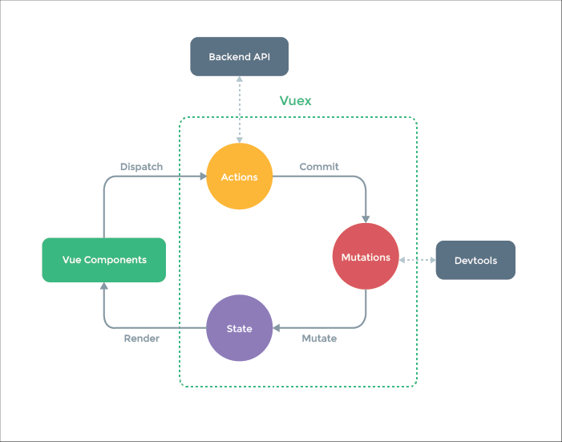

## 1. 基本使用

### 模板 (插槽、指令)

- 插值、表达式
- 指令、动态属性
- v-html: 会有 XSS 风险, 会覆盖子组件

```vue
<!-- 代码演示 -->
<template>
	<div>
        <p>文本插值 {{ message }}</p>
        <p>JS 表达式 {{ flag ? 'yes' : 'no' }}</p>
        <P :id="dynamicId">动态属性</P>
        <p v-html="rawHtml">
            <span>【注意】使用 v-html 之后, 将会覆盖子元素 (也就是 span 中的内容会被覆盖)</span>
    	</p>
    </div>
</template>
<script>
export default {
    data() {
        return {
            message: 'hello vue',
            flag: true,
            rawHtml: '指令 - 原始 html <b>加粗</b> <i>斜体</i>',
            dynamicId: 'id-${Date.now()}'
        }
    }
}
</script>
```

```vue
<!-- 插槽的使用 (具名插槽) -->
<!-- 父组件 -->
<template>
	<div>
        <子组件>
    		<template v-slot:a>a</template>
			<template v-slot:b>b</template>
			<template v-slot:c>c</template>
    	</子组件>
    </div>
</template>
<!-- 子组件 -->
<template>
	<div class="list-content">
        <slot name="a"></slot>
        <slot name="b"></slot>
        <slot name="c"></slot>
    </div>
</template>
```

```vue
<!-- 插槽的使用 (作用域插槽) -->
<!-- 子组件 -->
<template>
  <div class="child">
    <slot 
        name="heading" 
        v-bind:headingValue="heading">
        {{heading}}
    </slot>
    <!-- 为了让大家看的更清楚 已经将Child.vue组件中多余的内容删除 --> 
  </div>
</template>
<script>
export default {
  name: 'Child',
  data() {
    return {
        heading: '这里是默认的heading'
    }
  }
}
</script>
<!-- 父组件 -->
<template>
  <div id="app">
    <child>
      <template v-slot:heading="slotValue" >
        <h1>element-ui组件</h1>
        slotValue = {{slotValue}}
      </template>
    </child>
  </div>
</template>
```


> [扩展] - [Vue中的插槽用法：默认插槽、具名插槽、作用域插槽)](https://juejin.cn/post/7208015274079469627)


**Vue 有哪些指令?**

 v-text、v-html、v-show、v-if、v-else、v-else-if、v-for、v-on、v-bind、v-model、v-slot、v-pre、v-cloak、v-once


**Vue 自定义指令?**

- 通过 Vue.directive() 函数注册一个全局的指令

- 通过组件的 directives 属性，对该组件添加一个局部的指令

```javascript
// 全局
Vue.directive('self_defined_name',{
  bind:function(el,binding){
  //do someting
  },
  inserted: function(el,binding){
  //do something
  },
}

// 局部
new Vue({
  el:'#app',
  directives:{
    self_defined_name1:{
        bind:function(el,binding){
           //do something
        }
        inserted:function(el,binding){
           //do something
        },
     }
  }
})              
```

```vue
<!-- 使用 -->
<div id="app">
    <div v-self_defined_name1="{ color: 'green', text: '菜鸟教程!' }"></div>
</div>
```


### computed 和 watch

- computed 有缓存, data 不变则不会重新计算
- watch 如何深度监听? 默认浅监听
- watch 监听**引用类型**, 拿不到 oldVal

```javascript
// 浅监听、深度监听 示例
export default {
    data() {
        return {
            name: 'Lin',
            info: {
                city: '北京'
            }
        }
    },
    watch: {
        name(oldVal, val) {
            console.log('watch name' oldVal, val) // 值类型, 正常拿到 oldVal、val
        },
        info: {
            handler(oldVal, val) {
                console.log('watch info', oldVal, val) // 引用类型, 拿不到 oldVal. 因为指针相同, 此时已经指向了新的 val
            },
            deep: true // 深度监听
        }
    }
}
```


### class Style

- 使用动态属性
- 使用驼峰式写法

```vue
<!-- 代码演示 -->
<template>
	<div>
        <p class="{ black: isBlack, yellow: isYellow }">使用 class</p>
        <p class="[black, yellow]">使用 class 数组</p>
        <p :style="styleData">使用 style</p>
    </div>
</template>
<script>
export default {
    data() {
        return {
            isBlack: true,
            isYellow: true,
            
            black: 'block',
            yellow: 'yellow',
            
            styleData: {
                fontSize: '40px' // 转换为驼峰写法
            }
        }
    }
}
</script>
```


### 条件渲染

- v-if v-else 的用法, 可使用变量, 也可以使用 === 表达式
- v-if 和 v-show 的区别？
- v-if 和 v-show 的使用场景?

```vue
<!-- v-if v-show 的简单使用 -->
<template>
	<div>
        <p v-if="type === 'a'">A</p>
        <p v-else-if="type === 'b'">B</p>
        <p v-else>other</p>
        
        <p v-show="type === 'a'">A by v-show</p>
        <p v-show="type === 'b'">B by v-show</p>
    </div>
</template>
<script>
export default {
    data() {
        return {
            type: 'a'
        }
    }
}
</script>
```


v-if 和 v-show 的区别？

- v-if 会销毁 dom, v-show 不会


v-if 和 v-show 的使用场景?

- 销毁隐藏次数多使用 v-show
- 开发中, 用 v-if 就够了


### 循环 (列表) 渲染

- 如何遍历对象? --- 也可以用 v-for
- key 的重要性. Key 不能乱写 (如 random 或者 index)
- v-for 和 v-if 不能一起使用!
- v-for 比 v-if 的计算优先级高

```vue
<!-- 遍历数组、对象实例 -->
<template>
	<div>
        <p>遍历数组</p>
        <ul>
    		<li v-for=“(item, index) in listArr” :key="item.id"></li>
            {{index}} - {{item.id}} - {{item.title}}
    	</ul>
        
        <p>遍历对象</p>
        <ul>
    		<li v-for=“(val, key, index) in listObject” :key="key"></li>
            {{index}} - {{key}} - {{item.title}}
    	</ul>
    </div>
</template>
```


### 事件

- event 参数, 自定义参数
- 事件修饰符, 按键修饰符
- 【观察】事件被绑定到哪里?

```vue
<!-- 事件参数使用示例 -->
<template>
    <div>
        <p>{{num}}</p>
        <button @click="increment1">+1</button>
        <button @click="increment2(2, $event)">+2</button>
    </div>
</template>

<script>
export default {
    data() {
        return {
            num: 0
        }
    },
    methods: {
        increment1(event) {
            // eslint-disable-next-line
            console.log('event', event, event.__proto__.constructor) // 是原生的 event 对象
            // eslint-disable-next-line
            console.log(event.target)
            // eslint-disable-next-line
            console.log(event.currentTarget) // 注意，事件是被注册到当前元素的，和 React 不一样
            this.num++

            // 1. event 是原生的
            // 2. 事件被挂载到当前元素
            // 和 DOM 事件一样
        },
        increment2(val, event) { // 后面可以继续加参数 如 increment2(val, str, event)
            // eslint-disable-next-line
            console.log(event.target)
            this.num = this.num + val
        },
        loadHandler() {
            // do some thing
        }
    },
    mounted() {
        window.addEventListener('load', this.loadHandler)
    },
    beforeDestroy() {
        //【注意】用 vue 绑定的事件，组建销毁时会自动被解绑
        // 自己绑定的事件，需要自己销毁！！！
        window.removeEventListener('load', this.loadHandler)
    }
}
</script>
```


### 事件修饰符

```html
<!-- 阻止单击事件继续传播 --->
<a v-on:click.stop="doThis"></a>
<!-- 提交事件不再重载页面 -->
<form v-on:submit.prevent="onSubmit"></form>
<!-- 修饰符可以串联 -->
<a v-on:click.stop.prevent="doThat"></a>
<!-- 只有修饰符 -->
<form v-on:submit.prevent></form>
<!-- 添加事件监听器时使用事件捕获模式 -->
<!-- 即内部元素触发的事件先再此处理, 然后才交由内部元素进行处理 -->
<div v-on:click.capture="doThis">...</div>
<!-- 只当在 event.target 是当前元素自身时触发处理函数 -->
<!-- 即事件不是从内部元素触发的 -->
<div v-on:click.self="doThis">...</div>
```


### 按键修改符

```html
<!-- 即使 Alt 或 Shift被一同按下时也会触发 --->
<button @click.ctrl="onClick">A</button>

<!-- 有且只有 Ctrl 被按下的时候才触发 --->
<button @click.ctrl.exact="onCtrlClick">A</button>

<!-- 没有任何系统修饰符被按下的时候才触发 --->
<button @click.exact="onClick">A</button>
```


### 表单

- v-model
- 常见表单项 textarea checkbox radio select
- 修饰符 lazy number trim

```vue
<!-- 表单各个功能的使用 -->
<template>
    <div>
        <p>输入框: {{name}}</p>
        <input type="text" v-model.trim="name"/> <!-- 截取前后的空格 -->
        <input type="text" v-model.lazy="name"/> <!-- 防抖的效果 输入之后才变化 -->
        <input type="text" v-model.number="age"/> <!-- 转换成数字 -->

        <p>多行文本: {{desc}}</p>
        <textarea v-model="desc"></textarea>
        <!-- 注意，<textarea>{{desc}}</textarea> 是不允许的！！！ -->

        <p>复选框 {{checked}}</p>
        <input type="checkbox" v-model="checked"/> <!-- checked 是布尔值 -->

        <p>多个复选框 {{checkedNames}}</p> <!-- checkedNames 是数组 去控制 -->
        <input type="checkbox" id="jack" value="Jack" v-model="checkedNames">
        <label for="jack">Jack</label>
        <input type="checkbox" id="john" value="John" v-model="checkedNames">
        <label for="john">John</label>
        <input type="checkbox" id="mike" value="Mike" v-model="checkedNames">
        <label for="mike">Mike</label>

        <p>单选 {{gender}}</p>
        <input type="radio" id="male" value="male" v-model="gender"/>
        <label for="male">男</label>
        <input type="radio" id="female" value="female" v-model="gender"/>
        <label for="female">女</label>

        <p>下拉列表选择 {{selected}}</p>
        <select v-model="selected">
            <option disabled value="">请选择</option>
            <option>A</option>
            <option>B</option>
            <option>C</option>
        </select>

        <p>下拉列表选择（多选） {{selectedList}}</p>
        <select v-model="selectedList" multiple>
            <option disabled value="">请选择</option>
            <option>A</option>
            <option>B</option>
            <option>C</option>
        </select>
    </div>
</template>

<script>
export default {
    data() {
        return {
            name: '双越',
            age: 18,
            desc: '自我介绍',

            checked: true,
            checkedNames: [],

            gender: 'male',

            selected: '',
            selectedList: []
        }
    }
}
</script>
```


## 2. 组件

### 生命周期

- Vue 实例从创建 - 挂载 - 渲染 - 更新 - 销毁等一系列过程, 就 Vue 的生命周期

- 八个生命周期钩子


### 父子组件生命周期顺序 - 通过钩子函数来进行判断

created、mounted 父子组件更新顺序 (创建阶段)

```javascript
parent created
son created 
son mounted
parent mounted
```


beforeUpdaate、update 父子组件更新顺序 (更新阶段)

```javascript
parent beforeUpdaate
son beforeUpdaate 
son update
parent update
```


beforeDestroy、destroy 父子组件更新顺序 (销毁阶段)

```javascript
parent beforeDestroy
son beforeDestroy 
son destroy
parent destroy
```


还有一个额外的 `errorCaptured`


### 组件间传值

总叙

- props 和 $emit
- 自定义事件
- $attrs
- $parent
- $refs
- provide/inject
- Vuex


不同场景

- 父子组件
- 上下级组件 (跨多级) 通讯
- 全局组件


-- props 和 $emit 方式 --

- 适用情况：父子组件通讯

```vue
// 父组件
<template>
	<HelloWorld msg="Welcome to Your Vue.js App" @showMsg="showMsg"></HelloWorld>
</template>
<script>
import HelloWorld from '@/components/HelloWorld.vue'
</script>
```

```vue
// 子组件
<template>
	<h1 @click="clickHander">{{ msg }}</h1>
</template>
<srcipt>
export default {
    name: 'HelloWorld',
	props: {
    	msg: String
    }
    emits: ['showMsg'], // Vue3 新增加的
    methods: {
    	clickHandler() {
    		this.$emit('showMsg', 'hello world')
    	}
    }
}
</srcipt>
```


-- 自定义事件方式 --

- 适用情况：兄弟组件、无关组件、一个触发多个响应、多对多

```vue
// 父组件
<template>
	<CustomEvent1/>
	<CustomEvent2/>
</template>
<script>
import CustomEvent1 from '@/components/CustomEvent1.vue'
import CustomEvent2 from '@/components/CustomEvent2.vue'
</script>
```

```vue
// 子组件 (一)
<template>
	<p><button @click="trigger">trigger custom event</button></p>
</template>
<script>
import event from '../utils/event.js'
    
export default {
    name: 'CustomEvent2',
    methods: {
        trigger() {
            event.emit('showMsg', 'hello custom event')
        }
    }
}
</script>
```

```Vue
// 子组件 (二)
<template>
	<p>receice custom event</p>
</template>
<script>
import event from '../utils/event.js'
    
export default {
    name: 'CustomEvent1',
    methods: {
        showMsg(msg) {
            console.log(msg)
        }
    },
    // 挂载vue实例后的 钩子函数
    mounted() {
        event.on('showMsg', this.showMsg)
    },
    // 组件销毁生命周期 Vue2.x 使用 beforeDestroy 这个生命周期，Vue3.x 使用下面这个生命周期
    beforeUnmount() {
        event.off('showMsg', this.showMsg)
    }
}
</script>
```


$atters 和 $listeners 的相关知识点

- Vue2 中 属性在 props 中定义 候补是 $attrs，方法在 emits 中定义 候补是 $listeners
- Vue3 移除 $listeners (将 $listeners 的功能合并到 $attrs)
- 如何将 Level1 的数据 经过 Level2 传给 Level3 呢? 在 Level2 中定义 v-bind="$attrs" 即可


-- 上下级别通讯（$atters 多级）--

```vue
// Home.vue
<template>
	<div class="home">
        <AttrsDemo/>
    </div>
</template>
<script>
import AttrsDemo from '@/components/AttrsAndListeners/Level1'
</script>
```

```vue
// Level1
<template>
	<p>Level1</p>
	<Level2
        :a='a'
        :b='b'
        :c='c'
        @getA="getA"
        @getB="getB"
        @getC="getC">
    </Level2>
</template>
<script>
import Level2 from './Level2'
    
export default {
	name: 'Level1',
    components: { Level2 },
    data() {
        return {
			a: 'aaa',
            b: 'bbb',
            c: 'ccc'
        }
    },
    methods: {
        getA() {
            return this.a
        },
        getB() {
            return this.b
        },
        getC() {
            return this.c
        }
    }
}
</script>
```

```vue
// Level2
<template>
	<p>Leve2</p>
	<Level3
        :x='x'
        :y='y'
        :z='z'
        @getX="getX"
        @getY="getY"
        @getZ="getZ"
        v-bind="$attrs" // 通过这个属性 就能把属性与方法继续往下一级传
    ></Level3>
</template>
<script>
import Level3 from './Level3'
    
export default {
	name: 'Level2',
    components: { Level3 },
    props: ['a'],
    emits: ['getA'],
    data() {
        return {
			x: 'xxx',
            y: 'yyy',
            z: 'zzz'
        }
    },
    methods: {
        getX() {
            rerurn this.x
        },
        getY() {
            return this.y
        },
        getZ() {
            rerurn this.z
        }
    },
    created() {
        console.log('level2', Object.keys(this.$attrs)) // 是 props 和 emits 后补
        // Level1 的 props 定义了 a, emits 定义了 getA，剩下的 b、c、getB、getC 就放在 $attrs
        // 打印结果: ['b', 'c', 'onGetB', 'onGetC']
    }
}
</script>
```

```vue
// Level3
<template>
	<p>Level3</p>
</template>
    
<script>  
export default {
	name: 'Level3',
    props: ['x'],
    emits: ['getX'],
    data() {
        return {}
    },
    created() {
        console.log('level3', Object.keys(this.$attrs))
        // 因为 Level2 中定义了 v-bind="$attrs"
        // 打印结果：['y', 'z', 'onGetY', 'onGetZ', 'b', 'c', 'onGetB', 'onGetC']
    }
}
</script> 
```


-- $parent 和 $refs ---

- $parent Vue2 中 用$chilren，在 Vue3 中建议用 $refs 获取
- 通过 this.$parent 可以获取 父组件的属性、方法
- 通过 this.$refs 获取子组件的属性、方法
- 方法的获取只能从 methods 得到
- 适用于 父子组件的使用

```vue
// 通过 $refs 使用示例
// 父组件
<template>
	<HelloWorld msg="Lin" ref="hello1" />
</template>
<script>
import HelloWorld from '../HelloWorld'
    
export default {
    mounted() {
        consolo.log(this.$refs.hello1.name)
    }
}
</script>
```

```vue
// 子组件 HelloWord.vue
<template>
	<h1 @click="clickHandler">{{ msg }}</h1>
</template>
<script>
export default {
    name: 'HelloWorld',
    props: {
		msg: String
    },
    emits: ['showMsg'],
    data() {
        return {
            name: 'hello-world'
        }
    },
    methods: {
        clickHandler() {
            this.$emit('showMsg', 'hello world')
        }
    }
}
</script>
```


-- provide inject --

- 最上级定义 provide, 存放数据，不管下面第几级都可以通过 inject 获取到
- 有 两种定义方法，一种静态的，一种动态的

```vue
// Level1
<template>
	<p>Level1: <input v-model="name" /></p>
	<Level2></Level2>
</template>
<script>
import { computed } from 'vue'
import Level2 from './Level2'
    
export default {
    name: 'Level1',
    components: { Level2 },
    data() {
        return {
            name: 'Lin'
        }
    },
    // 静态的定义
    provide: {
        info: 'aaa'
    }
    // 动态的定义
    provide() {
        return {
            info: computed(() => this.name)
        }
    }
}
</script>
```

```vue
// Level2
<template>
	<p>Level2 {{ info }}</p>
	<Level3></Level3>
</template>
<script>
import Level3 from './Level3'
    
export default {
    name: 'Level2',
    components: { Level3 },
    inject: ['info']
}
</script>
```

```vue
// Level3
<template>
	<p>Level3 {{ info }}</p>
</template>
<script> 
export default {
    name: 'Level3',
    inject: ['info']
}
</script>
```


## 3. 高级特性

### 自定义 v-model

```vue
<!-- 父组件 -->
<template>
	<div>
        <!-- 自定义 v-model -->
        <p>{{name}}</p>
        <CustomVModel v-model="name"/>
    </div>
</template>
<script>
import CustomVModel from './CustomVModel'
export default {
    components: {
        CustomVModel
    },
    data() {
        return {
            name: 'Lin'
        }
    }
}
</script>
```

```vue
<!-- 子组件 CustomVModel.vue -->
<template>
    <!-- 例如：vue 颜色选择 -->
    <input type="text"
        :value="text1"
        @input="$emit('change1', $event.target.value)"
    >
    <!--
        1. 上面的 input 使用了 :value 而不是 v-model
        2. 上面的 change1 和 model.event1 要对应起来
        3. text1 属性对应起来
    -->
</template>

<script>
export default {
    model: {
        prop: 'text1', // 对应 props text1
        event: 'change1'
    },
    props: {
        text1: String,
        default() {
            return ''
        }
    }
}
</script>
```


### $nextTick

- Vue 是异步渲染 (原理部分会详细讲解)
- data 改变之后, DOM 不会立刻渲染
- $nextTick 会在 DOM 渲染之后被触发, 以获取最新 DOM 节点

```vue
<!-- $nextTick ref的使用 -->
<template>
  <div id="app">
    <ul ref="ul1">
        <li v-for="(item, index) in list" :key="index">
            {{item}}
        </li>
    </ul>
    <button @click="addItem">添加一项</button>
  </div>
</template>

<script>
export default {
  name: 'app',
  data() {
      return {
        list: ['a', 'b', 'c']
      }
  },
  methods: {
    addItem() {
        this.list.push(`${Date.now()}`)
        this.list.push(`${Date.now()}`)
        this.list.push(`${Date.now()}`)

        // 1. 异步渲染，$nextTick 待 DOM 渲染完再回调
        // 3. 页面渲染时会将 data 的修改做整合，多次 data 修改只会渲染一次
        this.$nextTick(() => {
          // 获取 DOM 元素
          const ulElem = this.$refs.ul1
          // eslint-disable-next-line
          console.log( ulElem.childNodes.length )
        })
    }
  }
}
</script>
```


Vue 在更新 DOM 时是异步执行的，在修改数据后，视图不会立刻更新，而是等同一事件循环中的所有数据变化完成之后，再统一进行视图更新。所以修改完数据，立即在方法中获取DOM，获取的仍然是未修改的DOM


$nextTick 的作用是：该方法中的代码会在当前渲染完成后执行，就解决了异步渲染获取不到更新后DOM的问题了

$nextTick 的原理：$nextTick本质是返回一个 Promise


应用场景：在钩子函数 created() 里面想要获取操作 Dom，把操作 DOM 的方法放在 $nextTick 中


### refs

- 拿到 元素 的 DOM
- 看上一个知识点的代码中有示例


### slot (插槽)

- 简单来说, 就父组件想往子组件中插一些东西


--- 插槽的基本使用 父组件传递数据给子组件 ---

```vue
<!-- slot 使用 -->
<template>
   	<div>
        <SlotDemo :url="website.url">
            {{website.title}}
        </SlotDemo>
    </div>
</template>

<script>
import SlotDemo from './SlotDemo'
export default {
    components: {
        SlotDemo
    },
    data() {
        return {
            website: {
                url: 'http://imooc.com/',
                title: 'imooc',
                subTitle: '程序员的梦工厂'
            }
        }
    }
}
</script>
```

```vue
<!-- slot 定义 -->
<template>
    <a :href="url">
        <slot>
            默认内容，即父组件没设置内容时，这里显示
        </slot>
    </a>
</template>

<script>
export default {
    props: ['url'],
    data() {
        return {}
    }
}
</script>
```


--- 作用域插槽 区别在于 父组件能拿到子组件的数据 ---

```vue
<!-- slot 使用 -->
<template>
   	<div>
        <ScopedSlotDemo :url="website.url">
            <template v-slot="slotProps">
                {{slotProps.slotData.title}}
            </template>
        </ScopedSlotDemo>
    </div>
</template>

<script>
import ScopedSlotDemo from './ScopedSlotDemo'
export default {
    components: {
        ScopedSlotDemo
    },
    data() {
        return {
            website: {
                url: 'http://imooc.com/',
                title: 'imooc',
                subTitle: '程序员的梦工厂'
            }
        }
    }
}
</script>
```

```vue
<!-- slot 定义 -->
<template>
    <a :href="url">
        <slot :slotData="website">
            {{website.subTitle}} <!-- 默认值显示 subTitle ，即父组件不传内容时 -->
        </slot>
    </a>
</template>

<script>
export default {
    props: ['url'],
    data() {
        return {
            website: {
                url: 'http://wangEditor.com/',
                title: 'wangEditor',
                subTitle: '轻量级富文本编辑器'
            }
        }
    }
}
</script>
```


--- 具名插槽 根据插槽名称插入不同插槽---

```vue
<!-- 父组件 -->
<template>
	<div>
        <NamedSolt>
    		<template>
				<h1>将插入 header solt 中</h1>
			</template>

			<p>将插入到 main slot 中, 即未命名的 slot</p>

			<template v-slot:footer>
				<p>将插入到 footer slot 中</p>
			</template>
    	</NamedSolt>
    </div>
</template>
```

```vue
<!-- 子组件 NamedSlot-->
<div>
    <header>
    	<slot name="header"></slot>
    </header>
    <main>
    	<slot></slot>
    </main>
    <footer>
    	<slot name="footer"></slot>
    </footer>
</div>
```


### 动态组件

- :is= "component-name" 用法
- 需要根据数据 动态渲染的场景. 即组件类型不确定


--- 基本使用 ---

```vue
<template>
    <div>
        <!-- 动态组件 -->
        <component :is="NextTickName"/>
    </div>
</template>

<script>
import NextTick from './NextTick'
export default {
    components: {
        NextTick
    },
    data() {
        return {
            NextTickName: "NextTick"
        }
    }
}
</script>
```


--- 也可以通过循环, 根据数据每次渲染不同组件 ---

```vue
<template>
    <div>
        <!-- 动态组件 -->
        <div v-for="(val, key) in newsData" :key="key">
            <component :is="val.type"/>
    	</div>
    </div>
</template>

<script>
import text from './text'
import images from './images'
export default {
    components: {
        text,
        images
    },
    data() {
        return {
            newsData: {
                1: {
                    type: text
                },
                2: {
                    type: images
                }
            }
        }
    }
}
</script>
```


### 异步组件

- import() 函数
- 按需加载, 异步加载大组件

```vue
<!-- 代码演示 -->
<script>
export default {
    components: {
        FormDemo: () => import('../BaseUse/FormDemo')
    }
}
</script>
```


### keep-alive

- 缓存组件
- 频繁切换, 不需要重复渲染
- 经典场景就是 tab 切换
- Vue 常见性能优化

```vue
<!-- 父组件 -->
<template>
    <div>
        <button @click="changeState('A')">A</button>
        <button @click="changeState('B')">B</button>
        <button @click="changeState('C')">C</button>

        <keep-alive> <!-- tab 切换 -->
            <KeepAliveStageA v-if="state === 'A'"/> <!-- v-show -->
            <KeepAliveStageB v-if="state === 'B'"/>
            <KeepAliveStageC v-if="state === 'C'"/>
        </keep-alive>
    </div>
</template>

<script>
import KeepAliveStageA from './KeepAliveStateA'
import KeepAliveStageB from './KeepAliveStateB'
import KeepAliveStageC from './KeepAliveStateC'

export default {
    components: {
        KeepAliveStageA,
        KeepAliveStageB,
        KeepAliveStageC
    },
    data() {
        return {
            state: 'A'
        }
    },
    methods: {
        changeState(state) {
            this.state = state
        }
    }
}
</script>
```

```vue
<!-- KeepAliveStageA -->
<template>
    <p>state A</p>
</template>

<script>
export default {
    mounted() {
        // eslint-disable-next-line
        console.log('A mounted')
    },
    destroyed() {
        // eslint-disable-next-line
        console.log('A destroyed')
    }
}
</script>
```

```vue
<!-- KeepAliveStageB -->
<template>
    <p>state B</p>
</template>

<script>
export default {
    mounted() {
        // eslint-disable-next-line
        console.log('B mounted')
    },
    destroyed() {
        // eslint-disable-next-line
        console.log('B destroyed')
    }
}
</script>
```

```vue
<!-- KeepAliveStageC -->
<template>
    <p>state C</p>
</template>

<script>
export default {
    mounted() {
        // eslint-disable-next-line
        console.log('C mounted')
    },
    destroyed() {
        // eslint-disable-next-line
        console.log('C destroyed')
    }
}
</script>
```


### mixin

- 多个组件有相同的逻辑, 抽离出来
- mixin 并不是完美的解决方案, 会有一些问题
- Vue3 提出的 Composition API 旨在解决这些问题


---  mixin 的简单使用  ---

```vue
<template>
    <div>
        <p>{{name}} {{major}} {{city}}</p>
        <button @click="showName">显示姓名</button>
    </div>
</template>

<script>
import myMixin from './mixin'

export default {
    mixins: [myMixin], // 可以添加多个，会自动合并起来
    data() {
        return {
            name: 'Lin',
            major: 'web 前端'
        }
    },
    methods: {
    },
    mounted() {
        // eslint-disable-next-line
        console.log('component mounted', this.name)
    }
}
</script>
```

```javascript
export default {
    data() {
        return {
            city: '深圳'
        }
    },
    methods: {
        showName() {
            // eslint-disable-next-line
            console.log(this.name)
        }
    },
    mounted() {
        // eslint-disable-next-line
        console.log('mixin mounted', this.name)
    }
}
```


mixin 的问题

- 变量来源不明确, 不利于阅读
- 多 mixin 可能会造成命名冲突
- mixin 和 组件可能出现多对多的关系, 复杂度较高


## 4. vuex

Vuex 的基本使用

- state --- 数据仓库
- getters --- 用来获取数据的 (类似计算属性)
- mutation --- 用来修改数据的 (同步)
- action --- 用来提交 mutation (异步)


获取数据的简单方式

- this.$store.state.属性
- getters 去获取，类似计算属性


为什么不直接使用 this.$store.state.属性 去修改数据, 而是使用 mutation 定义 function 去修改数据？

- 因为这样方便记录每个数据改变的历史
- 从而方便, 监听回滚等一系列操作


mutation 通常用于同步修改数据, 而业务中通常需要异步 (请求) 修改数据, 从而用到了 action

- mutation 中的函数同步执行
- action 中的函数异步执行


state 辅助函数为 mapState

actions 辅助函数为 mapActions

mutations 辅助函数为 mapMutations


Vuex 中的辅助函数 (语法糖)

- dispatch (调用 actions 中的函数)
- commit (调用 mutations 中的函数)
- mapState (可以直接获取 state 的属性, 不需要通过 this.$store.state.属性 获取)
- mapGetters (可以直接获取 getters 的属性, 不需要通过 this.$store.getters.属性 获取)
- mapActions (直接调用 action 中的函数)
- mapMutations (直接调用 mutations 中的函数)


mapActions

简单来说 mapActions 就是**将组件中的函数映射为对应的 action**

一般情况下我们会在组件中使用 this.$store.dispatch() 来触发 action，想要调用多少个 action 就需要调用多少次 dispatch() ，而使用 mapActions 的话只需要**往 mapActions 中传入与 action 同名的函数，然后调用这些函数即可触发对应的 action**


mapMutations

mapMutations 是vuex 的 mutation 的辅助函数，用于在组件中映射 mutation 内的方法

以便在该组件中直接使用mutation里的方法 **(说白了，就是一语法糖)**


--- dispatch、commit 操作---

```javascript
// store 文件夹下的 index.js
import Vue from 'vue'
import Vuex from 'vuex'

Vue.use(Vuex)

export default new Vuex.Store({
    state: {
        count: 0
    },
    mutations: {
        increase() {
            this.state.count ++
        }
    },
    getters: {
        memberInfo(state) {
            switch (state.userStatus) {
                case 0:
                    return '普通会员'
                    break
                default:
                    return 'vip会员'
                    break
            }
        }
    },
    actions: {
        buyVip({commit}, e) {
            return new Promise((resolve, reject) => {
                // mock api 交互
                setTimeout(() => {
                    // 修改本地 state
                    commit('setMemberInfo', {
                        userStatus: e.userStatus
                    })
                    resolve('购买成功')
                }, 1000)
            })
        }
    }
})
```

```vue
<!-- index.vue -->
<template>
	<div>
        <p>{{ msg }}</p>
        <p>{{ this.$store.getters.memberInfo }} 用户</p>
    </div>
</template>
<script>
import store from '@/store/store'
export default {
    name: 'Index',
    data () {
      return {
          msg: store.state.count
      }  
    },
    store,
    methods: {
        print() {
          	const userStatus = this.$store.state.userStatus
            console.log(userStatus)
        },
        add() {
            console.log('add Event from info!')
            store.commit('increase', 1)
        },
        buy(e) {
            store.dispatch('buyVip', e).then(res => {
                alert(res)
            })
        }
    }
}
</script>
```


--- mapGetters、mapState、mapActions、mapMutations 操作示例 ---

```vue
<!-- 调用页 -->
<template>
	<div>
        <p>{{ memberInfo }}</p>
        <p>{{ userStates }}</p>
        <p>{{ vipLevel }}</p>
    </div>
</template>
<script>
import { mapState, mapGetters, mapActions } from "vuex"
export default {
    computed: {
        ...mapState(['userStates', 'vipLevel'])
        ...mapGetters(['memberInfo'])
        ...mapActions(['login', 'exits'])
    	...mapMutations(['INCREASE_SHOPCART'])
    },
    mounted() {
        // 在 js 中可以直接使用 this 调用, 模板中数据直接用名称即可
        console.log(this.userStates, this.vipLevel)
        this.login('登录')
        this.exit('退出')
        this.INCREASE_SHOPCART(id)
    }
}
</script>
```

```javascript
// store 页面
import Vue from 'vue'
import Vuex from 'vuex'

Vue.use(Vuex)

export default new Vuex.Store({
    getters: {
        memberInfo(state) {
            switch (state.userStatus) {
                case 0:
                    return '普通会员'
                    break
                default:
                    return 'vip会员'
                    break
            }
        }
    },
    actions: {
        login: function(context, data1) {
            console.log(data1)
        },
        exit: function(context, data2) {
            console.log(data2)
        }
    }
})
```


Vuex 的整个流程

	


> 【注意】vuex 是无法实现浏览器多标签传参的

## 5. vue-router

知识点

- 路由模式 (hash、H5 history)
- 路由配置 (动态路由、懒加载)


路由模式

- hash 默认 (默认) , 如 http://abc.com/#/user/10
- H5 history 模式, 如 http://abc.com/user/20
- 后者需要 server 端支持, 因此无特殊需求可选择前者


--- 路由模式 设置 ---

```javascript
const router = new VueRouter({
    mode: 'history', // 使用 H5 history 模式
    routes: [...]
})
```


--- 动态路由 ---

```javascript
// router文件夹下的 index.js
export default new Router({
    routers: [
        {
            // 动态路径参数 以冒号开头. 能命中 '/test/10' '/test/20' 等格式的路由
            path: '/test/:testId', // 定义动态路由要改变的参数
            name: 'HelloWorld',
            component: Test // 设置动态路由所属页面
        }
    ]
})
```

```vue
// test.vue
<template>
	<div>
        {{ $route.params.testId }}
    </div>
</template>
```


Vue-router 路由配置 懒加载

```javascript
export default new VueRouter({
    routes: [
        {
            // 刚进来的时候异步加载
            path: '/',
            component: () => import {
            	'./../components/Navigator'
        		}
        },
        {
        	// 刚进来的时候不会加载, 路由改变到这个页面, 才会异步加载
        		path: '/feedback',
        		component: () => import {
    					'./../components/FeedBack'
						}
        }
    ]
})
```


配置 404 页面

```javascript
// Vue2
{ 
    path:'/404',
		component: ()= import('@/views/error-page/404'),
		hidden: true
}
// 这个*四配必须放在最后,将改路由配置放到所有路由的配置信息的最后,//否则会其他路由path匹配造成影响。
{
		path:'*',
		redirect:'/404',
		hidden: true
｝
// Vue3
{
  	path:'/:pathMatch(.*)',
  	component:()=>import('../views/404.vue')
}
```


**说下路由传参?**

[路由传参的三种方式（query、params 显示参数、params 不显示参数](https://blog.csdn.net/weixin_41545048/article/details/99448820)


**query 和 params 区别?**

1. query 用 `path` 来编写传参地址，而 params 得写法是用 `name` 来编写传参地址

2. query 在刷新页面得时候参数不会消失，而 params 刷新页面得时候会参数消失

3. query 传得参数都是显示在url 地址栏当中, 而 params 传参可以显示也可以不显示在地址栏


## 6. 原理

### 1. jQuery 与 MVVM 的区别？

- jQuery 通过操作 DOM 来更新页面数据
- MVVM 根据数据驱动视图


### 2. vue 响应式原理

**Vue2 原理**

- Object.defineProperty 方法, 给对应 data 中数据的每一个值添加了 set 和 get 方法

- 当值被修改了, 就会触发对应的 set 方法

- set 方法里会通知 watcher, 重新渲染数据

**Vue3 原理**

- 通过使用 ES6 的 proxy 对象实现的, 在 vue3 中, 
- 每个组件都有一个响应式代理对象, 当组件中的数据发生变化时, 代理对象会立即响应并更新视图


### 3. Vue 编译原理

1. 将模板字符串转成 element AST
2. 对 ast 进行静态节点标记, 主要用于虚拟DOM的渲染优化
3. 使用 element AST 生成 render 函数代码字符串


## 7. Vue 全家桶

**包括**

- vue-cli
- vueRouter
- vuex
- Axios
- 搭配的 UI 框架: iview、vant、elementUI


### vue-router 面试题

[Vue-Router面试题汇总](https://juejin.cn/post/6844903961745440775)


### vuex 面试题

#### vuex 持久化

**为什么需要持久化**

因为 Vuex 是基于内存的, 存在内存中, 刷新页面之后就没有了, 不会持久化存储


**方案一**

使用 cookie、localStorage 进行存储, 通常是使用 localStorage


**方案二**

第三方库, `vuex-persistedstate`

第三方库, 也是使用 localStorage、cookie 这些本地存储进行持久化的


[扩展]

[Vuex面试题汇总](https://juejin.cn/post/6844903993374670855)


### Axios 面试题

1. axios 如何携带 cookie

`axios.defaults.withCredentials = true`


## 8. Vue3 新特征

[全面总结Vue3.0的新特性 - 掘金 (juejin.cn)](https://juejin.cn/post/6968094627375087653)
