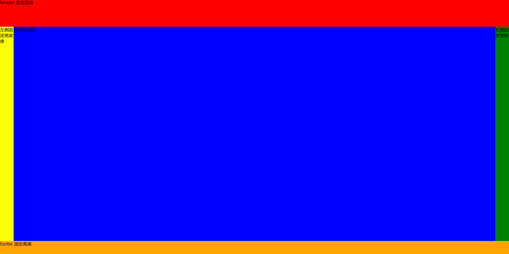

# css-样式与布局

## 1. 1px 问题

背景

- 其实就是在问, 如果要实现 0.5px 的方法, 主要问题是 在不同浏览器上, 小于 1px 的会默认为 1px
- css 1px 是逻辑像素, 而屏幕是逻辑像素, 设备像素比 dpr 不同, 逻辑像素最终转换为物理像素就不同
- 设备像素比 = 物理设备像素 / 逻辑像素


兼容性问题

1. chrome：把小于 0.5px 的当成0，大于等于 0.5px 的当作 1px

2. firefox：会把大于等于 0.55px 的当作 1px

3. safiri:把大于等于 0.75px 的当作 1px 进一步在手机上观察 iOS 的 Chrome 会画出 0.5px的边，而安卓(5.0)原生浏览器是不行的。所以直接设置 0.5px 不同浏览器的差异比较大


**实现方式**

box-shadow 模拟边框

```css
.div {
  box-shadow: inset 0px -1px 1px -1px #c8c7cc;
}
```

伪元素 + transform

```css
.scale-1px {
  position: relative;
  border:none;
}

.scale-1px:after {
  content: '';
  position: absolute;
  bottom: 0;
  background: #000;
  width: 100%;
  height: 1px;
  /*核心是利用transform缩放边框*/
  -webkit-transform: scaleY(0.5);
  transform: scaleY(0.5);
  -webkit-transform-origin: 0 0;
  transform-origin: 0 0;
}
```

这个实现方式, 可以通过 js 获取设备像素比, 来判断要用什么缩放比例

```javascript
if (window.devicePixelRatio && devicePixelRatio >= 2) {
   document.querySelector('ul').className = 'scale-1px'
}
```


## 2. CSS 操作题 总结

操作题主要包括: 选择器优先级、定位 (布局)、盒子模型


布局问题 (实现下面图片的样式)



```html
<!DOCTYPE html>
<html lang="en">
<head>
  <meta charset="UTF-8">
  <meta http-equiv="X-UA-Compatible" content="IE=edge">
  <meta name="viewport" content="width=device-width, initial-scale=1.0">
  <title>Document</title>
</head>
<style>
  * {
    padding: 0;
    margin: 0;
  }
  body {
    display: flex;
    flex-direction: column;
    height: 100vh;
  }
  .header {
    width: 100%;
    height: 100px;
    background: red;
  }
  .middle-box {
    flex: 1;
    display: flex;
  }
  .box-left {
    width: 50px;
    background: yellow;
  }
  .box-middle {
    flex: 1;
    background: blue;
  }
  .box-right {
    width: 50px;
    background: green;
  }
  .footer {
    width: 100%;
    height: 50px;
    background: orange;
  }
</style>
<body>
  <header class="header">header 固定高度</header>
  <section class="middle-box">
    <aside class="box-left">左侧固定宽度度</aside>
    <section class="box-middle">中间自适应</section>
    <aside class="box-right">右侧固定宽度</aside>
  </section>
  <footer class="footer">footer 固定高度</footer>
</body>
</html>
```


要点

- CSS flex 布局要熟练
- 标签语义化, 但是面试可以这样写, 工作中大多没必要, div + css 即可, 需要 SEO 再用语义化标签


## 3. CSS 高级语法的应用

主题切换

- 使用 css var

```css
html {
    --color: #333;
}
html .black {
    --color: #fff;
}
p {
    color: var(--color);
}
```


计算属性

- calc

```css
.main {
    min-height: clac(100vh - 80px)
}
```


## 4. CSS 常见的选择器

**选择器 (11种)**

- 通配符选择器 ( * {...} )
- 标签选择器 ( p {...} )
- 类选择器 (.class {...} )
- id 选择器 ( #id {...} )
- 属性选择器 ( [title=“Lin”] {...} ), title=“Lin” 的所有元素设置样式
- 并集选择器 ( span, div, .content {...} )
- 后代选择器 ( div p {...} )
- 子代选择器 ( div>p {...} )
- 兄弟选择器 ( h1 + p {...} )
- 伪类选择器 ( :hover {...} )
- 伪对象选择器 ( :before {...} )


**css 优先规则**

!import > 内联样式 > ID 选择器 > 类选择器 = 属性选择器 = 伪类选择器 > 标签选择器 = 伪元素选择器


**CSS样式的优先级应该分成五大类**

- 第一类`!important`，无论引入方式是什么，选择器是什么，它的优先级都是最高的。 
- 第二类引入方式，行内样式的优先级要高于嵌入和外链，嵌入和外链如果使用的选择器相同就看他们在页面中插入的顺序，在后面插入的会覆盖前面的
- 第三类选择器，选择器优先级：id选择器>（类选择器 | 伪类选择器 | 属性选择器 ）> （后代选择器 | 伪元素选择器 ）> （子选择器 | 相邻选择器） > 通配符选择器  
- 第四类继承样式，是所有样式中优先级比较低的
- 第五类浏览器默认样式优先级最低

 

**加分回答 使用 `!important` 要谨慎** 

- 一定要优先考虑使用样式规则的优先级来解决问题而不是 `!important` 
- 只有在需要覆盖全站或外部 CSS 的特定页面中使用 `!important` 
- 永远不要在你的插件中使用 `!important` 
- 永远不要在全站范围的 CSS 代码中使用 `!important` 优先级的比较指的是相同的样式属性，不同样式属性优先级比较失效
- 比如：在设置`max-width`时注意，已经给元素的`max-width`设置了`!important`但是还不生效，很有可能就是被 width 覆盖了 
- 举例：`div`最终的宽度还是`200px` div { max-width: 400px !important; height: 200px;background-color: tomato; width: 200px; }


**子代 和 后代的区别**

- 子代选择器只选中 `父级元素的亲一代`，父子级之间用大于号 `>` 连接
- 后代选择器选中的是指定元素的 `所有后代`，父子级之间用空格连接


**伪选择器**

- 伪类选择器
- 伪对象选择器


## 5. CSS 优化、提高性能的方法有哪些?

1. 将样式尽量写在单独的一个 css 文件中，然后在 head 元素中引用

   好处： 

   - 内容和样式分离，易于管理和维护

   - 减少页面体积

   - css 文件可以被缓存、重用，维护成本降低

   

2. 少使用 @import, @import 影响 css 文件的加载速度

   

3. 避免使用复杂的选择器，层级越少越好，建议选择器的嵌套最好不要超过三层简洁的选择器不仅可以减少 css 文件大小

   提高页面的加载性能，浏览器解析时也会更加高效，也会提高开发人员的开发效率，降低了维护成本

   

4. 精简页面的样式文件，去掉不用的样式


## 6. 响应式布局实现方式有哪些?

**实现方式**

- 媒体查询
- 百分比
- vw / vh
- rem
- flex
- UI 库


## 7. 清除浮动的方法有哪些?

1. 给父元素也添加 float
2. 给父元素一个固定高度
3. 给父元素的伪类设置 
```css
content:" ";
clear:both;/*清除浮动*/
display:block;/*确保该元素是一个块级元素*/
```
4. 给父元素添加 overflow：hidden


## 8. float 高度塌陷？

**现象**: 父元素为0, 子元素无法撑开父元素

**原因**: 当元素设置浮动后，会自动脱离文档流

**解决**: 清除浮动


## 9. display:inline-block 有缝隙？

**原因**: 两个内联元素之间有一定的空隙，如 换行符、制表符（tab）、空格等字符引起的


**解决办法**

1. 不换行
2. 设置其父容器的 `font-size` 为 0，再设置内联元素的字体大小
3. 添加注释
4. 设置 `float:left`，但是要清除浮动


## 10. 多行文本垂直居中

```html
方法一: 父元素使用 display:table 和子元素使用 display:table-cell 属性来模拟表格
子元素设置 vertical-align:middle 即可垂直居中

<div class="span_box bg_box">
    <span class="words_span">
        方法一：父元素使用display:table和子元素使用display:table-cell
        属性来模拟表格，子元素设置vertical-align:middle即可垂直居中
    </span>
</div>
<style>
	.bg_box {
        width: 300px;
        height: 300px;
        margin-top: 20px;
        background-color: #BBBBBB;
    }
    /*方法一*/
    .span_box {
        display: table;
    }
    .words_span {
        display: table-cell;
        vertical-align: middle;
    }
</style>
```

```html
方法二：对子元素设置 display:inline-block 属性，使其转化成行内块元素，模拟成单行文本。父元素设置对应的height 和 line-height。对子元素设置 vertical-align:middle 属性，使其基线对齐。添加 line-height 属性，覆盖继承自父元素的行高。缺点：文本的高度不能超过外部盒子的高度。

<div class="p_box bg_box">
    <p class="words_p">
        方法二：对子元素设置display:inline-block属性，使其转化成行内块元素，模拟成单行文本。父元素设置
    </p>
</div>
<style>
.bg_box {
    width: 300px;
    height: 300px;
    margin-top: 20px;
    background-color: #BBBBBB;
}
/*方法二*/
.p_box {
    line-height: 300px;
}
.words_p {
    display: inline-block;
    line-height: 20px;  /*单独给子元素设置行高，覆盖父级元素的行高*/
    vertical-align: middle;  /*基线居中对齐*/
}
</style>
```

```html
方法三：脱离文档流的居中方式，把内部div设置宽高之后，再设置top为50%，使用负边距调整，将margin-top设置为负的高度的一半就可以垂直居中了。缺点：需要计算出多行文字固定的高度。高度一旦改变，负边距也要调整。
<div class="wrapper bg_box">
    <div class="content_box">
        方法三：脱离文档流的居中方式，把内部div设置宽高之后，再设置top为50%，使用
    </div>
</div>
<style>
.bg_box {
    width: 300px;
    height: 300px;
    margin-top: 20px;
    background-color: #BBBBBB;
}
/*方法三*/
.wrapper {
    position: relative;
    overflow: hidden;
}
.content_box {
    position: absolute;
    top: 50%;
    width: 300px;
    height: 127px; /*本页面中这么多文字的高度，文本篇幅改变，高度也会变*/
    margin-top: -63.5px;  /*height的一半*/
}
</style>
```


## 11. div 居中的方法有哪些?

**1. flex 布局实现 (元素已知宽度)**

```html
<div class="box">        
    <div class="a"></div>    
</div>
<style>        
    .box{            
        width: 300px;            
        height: 300px;           
        background-color: #ccc;            
        display: flex;            
        display: -webkit-flex;            
        justify-content: center;            
        align-items: center;        
    }        
    .box .a{            
        width: 100px;            
        height: 100px;            
        background-color: blue;        
    }    
</style>
```


**2. position (元素已知宽度)**

父元素设置为：position: relative;

子元素设置为：position: absolute;

距上50%，据左50%，然后减去元素自身宽度的一半距离就可以实现

```html
<div class="box">        
    <div class="a">love</div>    
</div>
<style>        
    .box{            
        width: 300px;            
        height: 300px;            
        background-color: red;            
        position: relative;        
    }        
    .box .a{            
        width: 100px;            
        height: 100px;            
        background-color: blue;            
        position: absolute;            
        left: 50%;            
        top: 50%;            
        margin: -50px 0 0 -50px;        
    }    
</style>
```


**3. position transform (元素未知宽度)**

如果元素未知宽度，只需将上面例子中的

` margin: -50px 0 0 -50px`替换为：`transform: translate(-50%,-50%)`

```html
<style>        
    .box{            
        width: 300px;            
        height: 300px;            
        background-color: red;            
        position: relative;        
    }        
    .box .a{            
        background-color: blue;            
        position: absolute;            
        top: 50%;            
        left: 50%;            
        transform: translate(-50%, -50%);        
    }    
</style>
```


**4. position (元素已知宽度)**

left，right，top，bottom为0，maigin：auto

```html
<div class="box">        
    <div class="a">love</div>    
</div>
<style>        
    .box{            
        width: 300px;            
        height: 300px;           
        background-color: red;            
        position: relative;        
    }        
    .box .a{            
        width: 100px;            
        height: 100px;            
        background-color: blue;            
        position: absolute;            
        top: 0;            
        bottom: 0;            
        left: 0;            
        right: 0;            
        margin: auto;        
    }    
</style>
```


## 12. 如何画 0.5px 的线?

**法一**

1px的线通过 `meta viewport` 中, `scale` 的设置，可以缩放变成 0.5 倍, 则得到 0.5px 的线

```html
<meta name="viewport" 
      content="width=device-width, 
               initial-scale=0.5, 
               minimum-scale=0.5, 
               maximum-scale=0.5"/>
```


**法二**

为 1px 的线添加上CSS样式, `transform:scaleY(0.5)`

```css
#line {
	border-bottom:1px solid black;
	transform:scaleY(0.5);
}
```


## 13. flex 布局怎么把元素搞到右下角?

```html
<!DOCTYPE html>
<html lang="en">
<head>
    <meta charset="UTF-8">
    <meta http-equiv="X-UA-Compatible" content="IE=edge">
    <meta name="viewport" content="width=device-width, initial-scale=1.0">
    <title>Document</title>
    <style>
        * {
            padding: 0;
            margin: 0;
        }
        body {
            height: 100vh;
            display: flex;
            justify-content: flex-end;
            align-items: flex-end;
        }
        .box {
            width: 100px;
            height: 100px;
            background: orange;
        }
    </style>
</head>
<body>
    <div class="box"></div>
</body>
</html>
```


## 14. flex 高度继承

父元素为 flex 布局时, 没有设置高度的子元素与父元素高度一致

如果父元素设置固定高度，则子元素中没有设置高度的元素将继承父元素的高度；但是如果父元素的 `align-items` 设置以后那么子元素的高度则会有自身内容决定

如果父元素没有设置高度，其高度由最高的子元素决定


## 15. 子元素在什么情况不会撑起父元素的高度

一般父级是不设置高度的，他里面的子级内容就会随子级内容高度的增加而自动增高，这样做的好处是样式很灵活，修改子级内容的时候没必要再修改父级的高度。 

另外如果父级没设置高度，内部有子级浮动的时候，会使子级页面超出父级, 这种情况也叫 ”高度塌陷“


## 16. 如何让文字过长, 显示省略号

```css
.ellipse {
    text-overflow: ellipsis;
    white-space: nowrap;
    overflow: hidden;
}
```


## 17. 上下边距重叠

边距重叠, 只有上下边距才会, 左右不会

场景: 上下两个 div, 中间没有其他元素, 他们外边距会发生重叠, 上下边距重叠, 会取较大的 margin


## 18. BFC (块级格式上下文)

BFC 的作用: 内部元素 不影响 外部元素

- position: absolute 或 fixed
- display: inline-block、table、flex
- float: 不为 none


## 19. CSS 性能优化

[CSS性能优化的8个技巧)](https://juejin.cn/post/6844903649605320711)


## 20. 伪元素、伪类选择器

**伪元素**

- :active 匹配被点击的链接
- :checked 匹配处于选中状态的 `<input>` 元素
- :disabled 匹配每个被禁用的 `<input>` 元素
- :focus 匹配获得焦点的 `<input>` 元素
- :hover 匹配鼠标悬停其上的元素


**伪类选择器**

- ::after 在元素之后插入内容
- ::before 在元素之前插入内容
- ::first-line 匹配元素中内容的首行
- ::first-letter 匹配元素中内容的首字母


## 21. 画 三角形

```html
<!DOCTYPE html>
<html lang="en">
<head>
    <title>如何实现一个扇形</title>
    <style>
        #triangle{
            width: 0;
            border-top: 100px solid red;
            border-bottom: 100px solid yellow;
            border-left: 100px solid green;
            border-right: 100px solid blue;
        }
    </style>
</head>
<body>
    <div id="triangle"></div>
</body>
</html>
```


**补充知识点 画六边形**

两个反方向且底边同样大小的梯形，叠加在一起，是不是就能得到一个六边形

```css
.pentagon {
    position: relative;
    width: 60px;
    border-bottom: 60px solid yellowgreen;
    border-left: 40px solid transparent;
    border-right: 40px solid transparent;
}
.pentagon::before {
    content: "";
    position: absolute;
    width: 60px;
    height: 0px;
    top: 60px;
    left: -40px;
    border-top: 60px solid yellowgreen;
    border-left: 40px solid transparent;
    border-right: 40px solid transparent;
}
```


## 22. CSS 尺寸单位有哪些?

- px: 绝对像素
- rem: 相对于根元素像素
- em: 相对于父元素像素
- vw、vh: 视图宽高
- %: 根据父元素的宽高的百分比


## 23. 说一说 BFC

### 什么是 BFC

块级格式化上下文、独立的渲染区域、不会影响边界以外的元素


### 如何形成 BFC

1. float 不为 none
2. postion 为 absolute、fixed
3. display 为 flex、inline-flex
4. overflow 为 visible


### BFC 解决了什么问题 (或者说应用场景)

1. 清除浮动, 解决高度塌陷问题
2. 解决 上下 margin 合并问题
3. 元素被浮动元素覆盖的问题


[详细文章]

[BFC(边距重叠解决方案) ](https://juejin.cn/post/7029622804739784717)

[面试官：请说说什么是BFC？大白话讲清楚](https://juejin.cn/post/6950082193632788493#heading-1)


