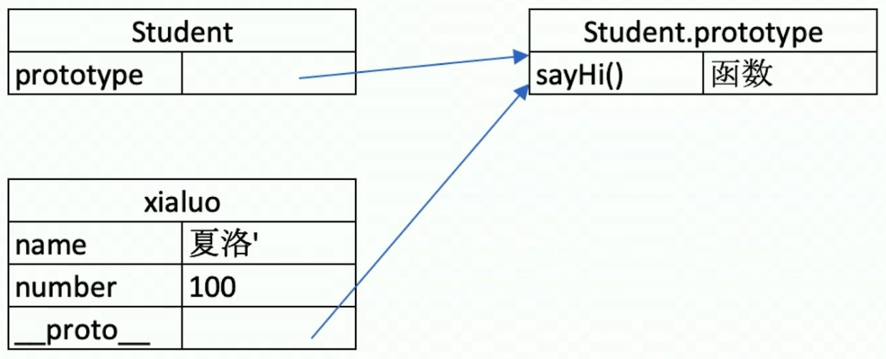
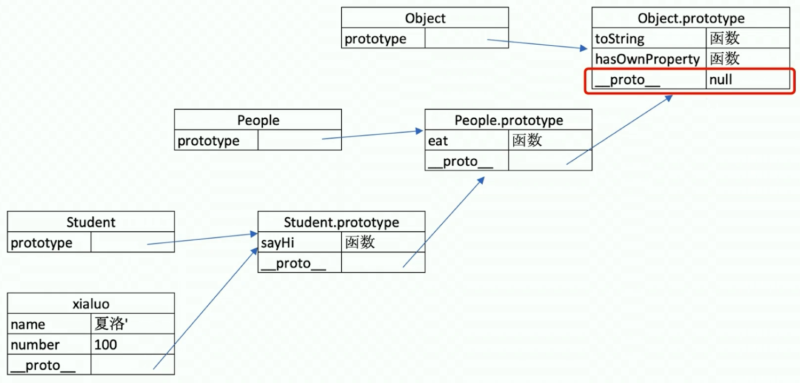
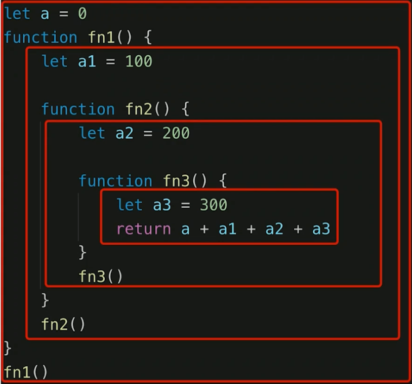
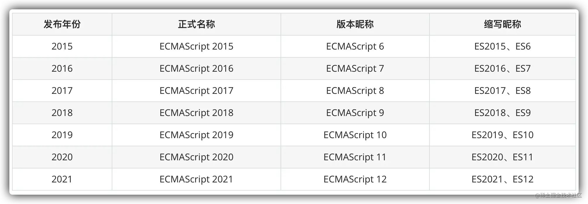

# javascript-系统知识点

## 值类型 和 引用类型

#### 1. typeof 能判断哪些类型

undefined、string、number、boolean、Symbol(ES6)

object、arrary、null、function

#### 2. 何时使用 === 何时使用 ==

除了 判断等于 null 或者 undefined 使用 == 以外, 都使用 ===

#### 3. 值类型和引用类型的区别

**场景题 (结果是什么?)**

```javascript
const obj1 = { x: 100, y: 200}
const obj2 = obj1
let x1 = obj1.x
obj2.x = 101
x1 = 102
console.log(obj1) // { x: 101 }
```

#### 4. 手写深拷贝

注意要点

- 注意判断值类型和引用类型
- 注意判断是数组还是对象
- 递归


下面就是相关知识点

---


知识点:

- 值类型 vs 引用类型

- typeof 运算符

- 深拷贝


**(一)**

**值类型**

```javascript
let a = 100
let b = a
a = 200
console.log(b) // a
```


**引用类型**

```javascript
let a = { age: 20 }
let b = a
b.age = 21
console.log(a.age) // 21
```


**常见值类型**

undefined、string、number、boolean、Symbol(ES6)


**常用引用类型**

object、arrary、null、function


**值类型、引用类型分别存放在哪？**

值类型 存放在 栈中

引用类型 存放在 堆中


**引用类型为什么只存储引用地址, 不存值呢？**

因为, 考虑到性能问题, 一个对象可能很大, 所占内存多


>  【注】使用 `let` 才能定义 undefined, 不能用 `const`


**(二)**

**typeof 运算符**

- 识别所有值类型
- 识别函数
- 判断是否是引用类型 (不可再细分)


所有引用类型, 用 typeof 判断都是 object


> [扩展] - typeof 与 instanceof
>
> - `typeof`会返回一个变量的基本类型，`instanceof`返回的是一个布尔值
> - `instanceof` 可以准确地判断复杂引用数据类型，但是不能正确判断基础数据类型
> - 而`typeof` 也存在弊端，它虽然可以判断基础数据类型（`null` 除外），但是引用数据类型中，除了`function` 类型以外，其他的也无法判断e
>
> 额外可以使用 `Object.prototype.toString` , 比较通用都可以判断


**(三)**

**深拷贝 (手写)** 

使用**递归**, 循环逐层拷贝

```javascript
let onj2 = {}

const obj1 = {
    age: 20,
    name: 'xxx',
    address: {
        city: 'beijing'
    },
    arr: ['a', 'b', 'c']
}

const obj2 = deepClone(obj1)
obj2.address.city = ‘shanghai’
console.log(onj1.address.city)

/**
* 深拷贝
* @param { Object } obj 要深拷贝的对象
*/
function deepClone(obj = {}) {
    if (typeof obj !== 'object' || obj == null) {
        // obj 是 null, 或者不是对象和数组, 直接返回
        return obj
    }
    
    // 初始化返回结果
    let result
    if (obj instanceof Array) { // instanceof 用于判断复杂数据类型 (引用类型)
        result = []
    } else {
        result = {}
    }
    
    for (let key of obj) {
        // 保证 key 不是原型的属性
        if (obj.hasOwnProperty(key)) {
            // 递归调用
            result[key] = deepClone(obj[key])
        }
    }
    
    // 返回结果
    return result
}
```


> [hasOwnProperty API 的使用](https://blog.csdn.net/a791226606/article/details/110679991)


**深拷贝还有哪些方法？**

1. 使用 JSON (最常见)

```javascript
JSON.parse(JSON.stringify(obj))
```

2. 一些库的 API 进行实现 (最完美)

```javascript
// lodash的_.cloneDeep()
var obj2 = _.cloneDeep(obj1)
```


(四)

**变量计算 - 类型转换 (最容易发生类型转换的地方)**

- 字符串拼接
- ==
- if 语句和逻辑运算


**什么时候用 ==, 什么时候用 === ?**

```javascript
// 除了 == null 之外, 其他都一律用 ===, 例如:
// 除了 判断等于 null 或者 undefined 使用 == 以外, 都使用 ===

const obj = { x: 100 }
if (obj.a == null ) { }
// 相当于:
// if ( obj.a === null || onj.a === undefined ) { }
```


**if 语句 和 逻辑运算**

truly 变量: !!a === true 的变量

falsely 变量: !!a === false 的变量

```javascript
// 以下是 falsely 变量。 除此之外都是 truly 变量
!!0 === false
!!NaN === false
!!'' === false
!!null === false
!!undefined === false
!!false === false
```

if 语句中的判断都是判断 truly、falsely 变量

```javascript
// truly 变量
const a = true
if (a) {
    // ...
}
const b = 100
if (b) {
    // ...
}
```

```javascript
// falsely 变量
const c = ''
if (c) {
    // ...
}
const d = null
if (d) {
    // ...
}
let e
if (e) {
    // ...
}
```

逻辑判断也是判断 truly、falsely 变量

```javascript
console.log(10 && 0) //0
console.log('' || 'abc') // 'abc'
console.log(!window.abc) // true
```


## 原型 和 原型链

#### 1. 如何准确判断一个变量是不是数组？

使用 instanceof 去判断即可

```javascript
a instanceof Array
```

#### 2. 手写一个简易的 JQuery, 考虑插件和扩展性

```javascript
class jQuery {
    constructor(selector) {
        const result = document.querySelectorAll(selector)
        const length = result.length
        for (let i = 0; i < length; i++) {
            this[i] = result[i]
        }
        this.length = length
        this.selector = selector
    }
    get(index) {
        return this[index]
    }
    each(fn) {
        for (let i = 0; i < this.length; i++) {
            const elem = this[i]
            fn(elem)
        }
    }
    on(type, fn) {
        return this.each(elem => {
            elem.addEventListener(type, fn, false)
        })
    }
    // 扩展很多 DOM API
}

// 插件
jQuery.prototype.dialog = function (info) {
    alert(info)
}

// “造轮子”
class myJQuery extends jQuery {
    constructor(selector) {
        super(selector)
    }
    // 扩展自己的方法
    addClass(className) {

    }
    style(data) {
        
    }
}

// const $p = new jQuery('p')
// $p.get(1)
// $p.each((elem) => console.log(elem.nodeName))
// $p.on('click', () => alert('clicked'))
```

#### 3. class 的原型本质, 怎么理解？

- 原型和原型链的图示
- 属性和方法的执行规则


下面就是相关知识点

---


知识点:

- class 和 继承

- 类型判断 instanceof

- 原型和原型链


**(一)**

**class (基本使用)**

```javascript
// 类
class Student {
    constructor(name, number) {
        this.name = name
        this.number = number
        // this.gender = 'male'
    }
    sayHi() {
        console.log(
        	`姓名 ${this.name}, 学号 ${this.number}`
        )
    }
}

// 通过类 new 对象/实例
const xiaolu = new Student('夏洛', 100)
console.log(xiaolu.name)
console.log(xiaolu.name)
xiaolu.sayHi()

const madongmei = new Student('马冬梅', 101)
console.log(madongmei.name)
console.log(madongmei.number)
madongmei.sayHi()
```


**继承**

- extends (继承)
- super (传递参数给父类)
- 扩展或重写方法

```javascript
// 父类
class People {
    constructor(name) {
        this.name = name
    }
    eat() {
        console.log(`${this.name} eat something`)
    }
}

// 子类
class Student extends People {
    constructor(name, number) {
        super(name) // super 的作用, 是把 name 这个参数传递给 Pepole 这个 父类 中
        this.number = number
    }
    sayHi() {
        console.log(`姓名 ${this.name} 学号 ${this.number}`)
    }
}

// 子类
class Teacher extends People {
    constructor(name, major) {
        super(name)
        this.major = major
    }
    teach() {
        console.log(`${this.name} 教授 ${this.major}`)
    }
}

// 实例
const xialuo = new Student('夏洛', 100)
console.log(xialuo.name)
console.log(xialuo.number)
xialuo.sayHi()
xialuo.eat()

// 实例
const wanglaoshi = new Teacher('王老师', '语文')
console.log(wanglaoshi.name)
console.log(wanglaoshi.major)
wanglaoshi.teach()
wanglaoshi.eat()

```


**(二)**

**类型判断 - instanceof**

```javascript
// 判断 xiaoluo 由哪个父类构建出来的
// 前面的变量 是否由 后面变量 构建出来的
// 后面变量 是 前面的变量的一个父类
xiaolu instanceof Student // true xiaolu 是 Student 构建 (new) 出来的
xiaolu instanceof People // true People 是 xiaolu 的父类
xiaolu instanceof Object // true Object 是否所有对象的父类

[] instanceof Array // true
[] instanceof Object // true

{} instanceof Object // true
```


**原型**

```javascript
// class 实际上是函数, 可见是语法糖
typeof People // ’function‘
typeof Student // ’function‘

// 隐式原型 和 显示原型
console.log( xiaoluo.__proto__ ) // 隐式原型
console.log( xiaoluo.prototype ) // 显示原型
conosle.log( xiaoluo.__proto__ === xiaoluo.prototype ) // true
```


原型关系图 (Student 是 class, xiaoluo 是实例)




**原型关系**

- 每个 class 都有显示原型 `prototype`
- 每个实例都有隐式原型 `__proto__`
- 实例的 `_proto_` 指向对应 class 的 `prototype` (隐式原型 指向 显示原型)


**基于原型的执行规则**

- 获取属性 `xiaolu.name` 或执行方法 `xiaolu.sayhi() `时
- 先在自身属性和方法寻找
- 如果找不到则自动去 `__proto__` 中查找


**原型链**

```javascript
// Student 继承于 People
console.log( Student.prototype.__proto__ )
console.log( People.prototype )
console.log( People.prototype === Student.prototype.__proto__ )
```

xiaoluo -> Student -> People -> Object




**instanceof 原理**

instanceof 通过隐私原型 一层一层的向上寻找 父类的显示原型, 找到了就返回 true


> 【重要提示 !!! 】
>
> class 是 ES6 语法规范, 由 ECMA 委员会发布
>
> ECMA 只规定语法规则, 即我们代码的书写规范
>
> 以上实现方式都是 V8 引擎的实现方式, 也是主流的


## 作用域 和 闭包

#### 1. this 的不同应用场景, 如何取值?

this 的五种情况, 在下面知识点已经解释了

#### 2. 手写 bind 函数

```javascript
// 模拟 bind
Function.prototype.bind1 = function () {
  // 将参数拆解为数组 (列表 变成 数组)
  // arguments 可以直接获取, 传进来的所有参数
  const args = Array.prototype.slice.call(arguments);

  // 获取 this（数组第一项）
  const t = args.shift();

  // fn1.bind(...) 中的 fn1
  const self = this;

  // 返回一个函数
  return function () {
    return self.apply(t, args);
  };
};

function fn1(a, b, c) {
  console.log("this", this);
  console.log(a, b, c);
  return "this is fn1";
}

const fn2 = fn1.bind1({ x: 100 }, 10, 20, 30);
const res = fn2();
console.log(res);
```

> [扩展] - bind、apply、call 的使用场景
>
> - call 用于继承比较多
> - apply 用于获取数组最大最小值
> - bind 改变定时器 this 的指向

#### 3. 实际开发中闭包的应用场景, 举例说明

应用场景: 隐藏数据

```javascript
// 闭包隐藏数据，只提供 API
function createCache() {
    const data = {} // 闭包中的数据，被隐藏，不被外界访问
    return {
        set: function (key, val) {
            data[key] = val
        },
        get: function (key) {
            return data[key]
        }
    }
}

const c = createCache()
c.set('a', 100)
console.log( c.get('a') )
```

#### 4. 读代码

```javascript
// 创建 10 个 `<a>` 标签, 点击的时候弹出对应的序号
let i, a
for (i = 0; i < 10; i++) {
    a = document.createElement('a')
    a.innerHTML = i + '<br>'
    a.addEventListener('click', function (e) {
        e.preventDefault()
        alert(i)
    })
    document.body.appendChild(a)
}
// 输出结果 点击弹出窗 弹出都是 10
```

```javascript
// 如何 改写成  点击的时候弹出对应的序号, 如 点击1, 弹出 1
let a
for (let i = 0; i < 10; i++) {
    a = document.createElement('a')
    a.innerHTML = i + '<br>'
    a.addEventListener('click', function (e) {
        e.preventDefault()
        alert(i)
    })
    document.body.appendChild(a)
}
// 现在点击的时候弹出对应的序号
```


下面就是相关知识点

---


知识点:

- 作用域和自由变量

- 闭包

- this


**(一)**

**作用域**

- 全局作用域
- 函数作用域
- 块级作用域 ( ES6新增 `let `)

作用域代表了一个变量或者说某个变量的合理使用范围

	


**自由变量**

- 一个变量在当前作用域没有定义, 但被使用了
- 向上级作用域, 一层一层依次寻找, 直到找到为止
- 如果全局作用域都没找到, 则报错 `xx is not defined`
- `var` 是全局作用域, 全局对象 `window`


**(二)**

**闭包**

作用域应用的特殊情况, 有两种表现

- 函数作为参数 被传递
- 函数作为返回值 被返回

```javascript
// 函数作为返回值
function create() {
    const a = 100
    return function () {
        console.log(a)
    }
}

// const fn = create()
// const a = 200
// fn() // 100

// 函数作为参数被传递
function print(fn) {
    const a = 200
    fn()
}
const a = 100
function fn() {
    console.log(a)
}
print(fn) // 100

// 所有的自由变量的查找，是在函数定义的地方，向上级作用域查找
// 不是在执行的地方！！！
```


> 总结: 闭包就是一种特殊的函数,  分两种形式的闭包
>
> - 函数作为参数, 被传递
> - 函数作为返回值, 被返回


**(三)**

**this**

this 取什么值, 是在执行的时候确定的, 不是在函数定义时确定的, 适用于以下五种

- 作为普通函数 (返回 window)
- 使用 call、apply、bind (传入什么就绑定什么)
- 作为对象方法被调用 (返回对象本身)
- 在 class 方法中调用 (返回实例本身)
- 箭头函数 (由它的上级作用域决定)


**call、apply、bind**

call、bind 都会改变 this 的指向, 但是 bind 会返回一个函数, 需要重新运行这个函数

```javascript
// call
function fn1() {
    console.log(this)
}
fn1() //window

fn1.call({ x: 100 }) // { x: 100 }

// bind
const fn2 = fn1.bind({ x: 200 })
fn2() // { x: 200 }

// apply
const numbers = [5, 6, 2, 3, 7];
const max = Math.max.apply(null, numbers);

console.log(max);
// Expected output: 7
const min = Math.min.apply(null, numbers);
console.log(min);
// Expected output: 2
```


**箭头函数**

箭头函数 this 的值取它上级作用域的值

```javascript
// 使用 普通函数异步中 this 指向 window
const zhangsan = {
    name: ’张三‘,
    sayHi() {
        // this 即当前对象
        console.log(this)
    },
    wait() {
        setTimeout(function() {
            // this === windiow
            console.log(this)
        })
    }
}
```

```javascript
// 使用 箭头函数异步中 this 即当前对象
const zhangsan = {
    name: '张三',
    sayHi() {
        // this 即当前对象
        console.log(this)
    },
    waitAgain() {
        setTimeout(() => {
            // this 即当前对象
            console.log(this)
        })
    }
}
```


**class 方法中**

```javascript
class People {
    constructor(name) {
        this.name = name
        this.age = 20
    }
    sayHi() {
        console.log(this)
    }
}
const zhangsan = new People('张三')
zhangsan.sayHi() // zhangsan 对象
```


## 同步 和 异步

#### 1. 同步和异步的区别？

基于 JS 是单线程语言

- 异步不会阻塞代码执行
- 同步会阻塞代码执行

#### 2. 手写用 Promise 加载一张图片

```javascript
function loading (src) {
    return new Promise(
    	(resolve, reject) => {
            const img = document.createElement('img')
            img.onload = () => {
                resolve(img)
            }
            img.onerror = () => {
                const err = new Error(`图片加载失败 ${src}`)
                reject(err)
            }
            img.src = src
        }
    )
}

const url1 = 'https://img.com/img1.jpg'
const url2 = 'https://img.com/img2.jpg'

loadImg(url1).then(img1 => {
    console.log(img1.width)
    return img1 // 普通对象
}).then(img1 => {
    console.log(img1.height)
    return loadImg(url2) // promise 对象
}).then(img2 => {
    console.log(img2.width)
    return img2
}).then(img2 => {
    console.log(img2.height)
}).catch(ex => console.error(ex))
```

#### 3. 前端使用异步的场景有哪些？

场景

- 网络请求
- 定时任务

#### 4. 读代码

```javascript
// setTimeout 笔试题
console.log(1)
setTimeout(function() {
  	console.log(2)         
}, 1000)
console.log(3)
setTimeout(function() {
    console.log(4)
}, 0)
console.log(5)
// 执行结果 1 3 5 4 2
```


下面就是相关知识点

---


知识点:

- 单线程和异步

- 应用场景

- callback hell (回调地狱) 和 Promise


**(一)**

**单线程和异步**

- JS 是单线程语言, 只能同时做一件事儿
- 浏览器和 nodejs 已支持 JS 启动进程, 如 Web Worker
- JS 和 DOM 渲染共同一个线程, 因为 JS 可修改 DOM 结构
- 遇到等待 (网络请求, 定时任务) 不能卡住, 所以需要异步, 以回调 callback 函数形式

```javascript
// 异步
console.log(100)
setTimeout(function () {
    console.log(200)
}, 1000)
console.log(300)
// 输出结果 100、300、200
```

```javascript
// 同步
console.log(100)
aleart(200)
console.log(300)
// 输出结果 100、200、300
```


**(二)**

**异步的应用场景**

- 网络请求, 如 ajax 图片加载
- 定时任务, 如 setTimeout

网络请求

```javascript
// 网络请求 ajax
console.log('start')
$.get('./data1.json', function (data1) {
    console.log(data1)
})
console.log('end')
// 执行结果 start end data1
```

```javascript
// 图片懒加载
console.log('start')
let img = document.createElement('img')
img.onload = function() {
 	console.log('loaded')   
}
img.src = '/xxx.png'
console.log('end')
// 执行结果 start end loaded
```

定时任务

```javascript
// setTimeout
console.log(100)
setTimeout(function() {
    console.log(200)
}, 1000)
console.log(300)
// 执行结果 100 300 200
```

```javascript
// setInterval
console.log(100)
setInterval(function() {
    console.log(200)
}, 1000)
console.log(300)
// 执行结果 100 300 200 200 ...
```


**(三)**

**callback hell (回调地狱)**

```javascript
// 获取第一份数据
$.get(url1, (data1) => {
    console.log(data1)
    // 获取第二份数据
    $.get(url2, (data2) => {
        console.log(data2)
        // 获取第三份数据
        $.get(url3, (data3) => {
            console.log(data3) 
            // 还可能获取更多的数据
        })
    })
})
```

解决回调地狱的方案就是, Promise

```javascript
// Promise 定义
function getData(url) {
    return new Promise((resolve, reject) => {
        $.ajax({
            url,
            success(data) {
                resolve(data)
            },
            error(err) {
                reject(err)
            }
        })
    })
}
// Promise 使用
const url1 = '/data1.json'
const url2 = '/data2.json'
const url3 = '/data3.json'

getData(url1).then( data1 => {
    console.log(data1)
    return getData(url2)
}).then( data2 => {
    console.log(data2)
    return getData(url3)
}).then(data3 => {
    console.log(data3)
}).catch(err => console.error(err))
```


> [扩展] - [promise 经典面试题](https://juejin.cn/post/6844903632203153415)


## 数组 和 对象

### 数组 操作 API

```javascript
let arr = [2, 9, 5];
let arr1 = [6, 7, 3];

// 前面、后面插入
// arr.unshift("1");
// arr.push("3");

// 前面、后面删除
// arr.shift();
// arr.pop();

// 删除、复制、整合
// arr.splice(1, 1);
// console.log(arr.slice(0, 2));
// console.log(arr.concat(arr1));

// 遍历、反转、排序
// arr.sort();
// arr.reverse();

console.log(arr);
```


# JS-Web-API

**前言**

- vue 和 React 框架应用广泛, 封装了 DOM 操作
- 但 DOM 操作一直都会前端工程师的基础、必备知识
- 只会 vue 而不懂 DOM 操作的前端程序员, 不会长久


## DOM

#### 1. DOM 是哪种数据结构

DOM 是树形结构 ( DOM 树 )

#### 2. DOM 操作的常用 API

获取 DOM 节点

- getElementById
- getElementsByTagName
- getElementsByClassName
- querySelectorAll

property 操作对象属性

attribute 操作 `HTML` 属性

#### 3. attr 和 property 的区别

property 和 attribute 的区别

- property: 修改对象属性, 不会体现到 `HTML` 结构中
- attribute: 修改 `HTML` 属性, 会改变 `HTML` 结构
- 两者都有可能引起 DOM 重新渲染

#### 4. 一次性插入多个 DOM 节点, 考虑性能

主要从两个方面

- 对 DOM 查询做缓存
- 将频繁操作改为一次性操作


下面就是相关知识点

---


知识点:

- DOM 本质

- DOM 节点操作

- DOM 结构操作

- DOM 性能


**(一)**

**DOM 本质**

`DOM` 的本质就是由 `HTML` 语言解析出来的一棵树 (树型结构)


**(二)**

**DOM 节点操作**

获取 DOM 节点

- getElementById
- getElementsByTagName
- getElementsByClassName
- querySelectorAll

```javascript
const div1 = document.getElementById("div1"); // 通过 id 获取元素
console.log("div1", div1);

const divList = document.getElementsByTagName("div"); // 通过标签名 获取元素集合
console.log("divList.length", divList.length);
console.log("divList[1]", divList[1]);

const containerList = document.getElementsByClassName("container"); // 通过 class 获取元素集合
console.log("containerList.length", containerList.length);
console.log("containerList[1]", containerList[1]);

// 指定一个或多个匹配 CSS 选择器的元素。可以通过 id, class, 类型, 属性, 属性值等作为选择器来获取元素
const pList = document.querySelectorAll("p"); // css 选择器
console.log("pList", pList);

// var x = document.querySelectorAll(".example")
const x = document.querySelectorAll(".example");
```

property

通过获取获取和修改 js 对象属性, 来改变页面样式的一种形式或方法

```javascript
// property 形式
const pList = document.querySelectorAll("p");
const p1 = pList[0];

p1.style.width = "100px";
console.log(p1.style.width);
p1.className = "red";

console.log(p1.className); 
console.log(p1.nodeName);
console.log(p1.nodeType); // 1
```

attribute 修改标签属性

- getAttribute
- setAttribute

```javascript
// attribute
p1.setAttribute("data-name", "imooc");
console.log(p1.getAttribute("data-name")); // imooc
p1.setAttribute("style", "font-size: 50px;");
console.log(p1.getAttribute("style")); // font-size: 50px;
```

property 和 attribute 的区别

- property: 修改对象属性, 不会体现到 `HTML` 结构中
- attribute: 修改 `HTML` 属性, 会改变 `HTML` 结构
- 两者都有可能引起 DOM 重新渲染


**(二)**

**DOM 结构操作**

- 新增/插入节点
- 获取子元素列表, 获取父元素
- 删除子元素

```javascript
const div1 = document.getElementById('div1')
const div2 = document.getElementById('div2')

// 新建节点
const newP = document.createElement('p')
newP.innerHTML = 'this is newP'
// 插入节点
div1.appendChild(newP)

// 移动节点
const p1 = document.getElementById('p1')  // 已经有这个元素了, 那么就是不是插入子节点了, 是移动了
div2.appendChild(p1)

// 获取父元素
console.log( p1.parentNode )

// 获取子元素列表
const div1ChildNodes = div1.childNodes
console.log( div1.childNodes )

// Array.prototype.slice.call 将 div1.childNodes 变成数组, 固定写法
// filter 过滤数组元素
const div1ChildNodesP = Array.prototype.slice.call(div1.childNodes).filter(child => {
    // child.nodeType === 1 用来判断是否是一个正常的 DOM 节点
    // 因为有可能获取的 Text 或者其他
    if (child.nodeType === 1) {
        return true
    }
    return false
})
console.log('div1ChildNodesP', div1ChildNodesP)

// 删除子元素
div1.removeChild( div1ChildNodesP[0] )
```


**(三)**

**DOM 性能**

- DOM 操作非常 “昂贵”, 避免频繁的 DOM 操作
- 对 DOM 查询做缓存
- 将频繁操作改为一次性操作


DOM 查询做缓存

```javascript
// 优化前
// 不缓存 DOM 查询结果
for (let i = 0; i < document.getElementsByTagName('p').length; i++) {
    // 每次循环, 都会计算 length, 频繁进行 DOM 查询
}

// 优化后
// 缓存 DOM 查询结果
const pList = document.getElementsByTagName('p')
const length = pList.length
for (let i = 0; i < length; i++) {
    // 缓存 length, 只进行一次 DOM 查询
}
```


将频繁操作改为一次性操作

```javascript
// 优化前
const list = document.getElementById('list')
for (let i = 0; i < 20; i++) {
    const li = document.createElement('li')
    li.innerHTML = `List item ${i}`
    // 先插入文本片段中
    list.appendChild(li)
}


// 优化后
// 基本思想就是, 先将要插入的结构, 插入一个空白文档中, 最后再一起插入 DOM 结构中去渲染
const list = document.getElementById('list')

// 创建一个文档片段, 此时还没有插入到 DOM 结构中
const frag = document.createDocumentFragment()

for (let i = 0; i < 20; i++) {
    const li = document.createElement('li')
    li.innerHTML = `List item ${i}`
   
    // 先插入文本片段中
    frag.appendChild(li)
}

// 都完成之后, 再统一插入到 DOM 结构中
list.appendChild(frag)

console.log(list)
```


## BOM

#### 1. 如何识别浏览器的类型

```javascript
navigator.userAgent.indexOf('Chrome') // 81, 不为 -1 就是存在
```

#### 2. 分析拆解 url 各个部分

```javascript
console.log(location.href) // https://www.baidu.com/learn/index.html/?a=100&b=200#Anchor

console.log(location.protocol) // https:
console.log(location.host) // www.baidu.com
console.log(location.pathname) // /learn/index.html
console.log(location.search) // ?a=100&b=200
console.log(location.hash) // #Anchor
```


下面就是相关知识点

---


知识点: (主要考点在 navigator、location)

- navigator (浏览器信息)

- screen (屏幕信息)

- location (url信息)

- history (前进后退信息)


navigator 和 screen

```javascript
// navigator 这个属性获取并不准确, 只能大概判断
// 因为 navigator 在一个浏览器中获取到的可能是多个浏览器的信息
const ua = navigator.userAgent
const isChrome = ua.indexOf('Chrome') // 81
console.log(isChrome) // indexOf 没找到会返回 -1, 找到了会返回字符串中首次出现的位置

// screen
console.log(screen.width) // 1340
console.log(screen.height) // 876
```


location 和 history

```javascript
// location
console.log(location.href) // https://www.baidu.com/learn/index.html/?a=100&b=200#Anchor
console.log(location.protocol) // https:
console.log(location.host) // www.baidu.com
console.log(location.pathname) // /learn/index.html
console.log(location.search) // ?a=100&b=200
console.log(location.hash) // #Anchor

// history
history.back() // 执行后, 页面后退
history.forward() // 执行后, 页面前进
```


## 事件绑定

#### 1. 编写一个通用的事件监听函数

(四) 就是答案

- 判断是是否需要事件代理

#### 2. 描述事件冒泡的流程

流程

- 基于 DOM 树形结构
- 事件会顺着触发元素向上冒泡
- 应用场景: 代理

#### 3. 无限下拉的图片列表, 如何监听每个图片的点击？

也就是问怕瀑布流的实现

- 使用事件代理
- 用 e.target 获取触发元素
- 用 matches 来判断是否是触发元素


下面就是相关知识点

---


知识点: 

- 事件绑定
- 事件冒泡
- 事件代理


**(一)**

**事件绑定**

```javascript
const btn = document.getElementById('btn1')
btn.addEventListener('click', event => {
    console.log('clicked')
})

// 通用的绑定函数
function bindEvent(elem, type, fn) {
    elem.addEventListener(type, fn)
}

const a = document.getElementById('link1')
bindEvent(a, 'click', e => {
    console.log(e.target) // 获取触发的元素
    e.preventDefault() // 阻止默认行为
    alert('clicked')
})
```


**(三)**

**事件冒泡**

顺着 DOM 结构往上冒泡

```html
<html>
    <body>
        <div id="div1">
            <p id="p1">激活</p>
            <p id="p2">取消</p>
            <p id="p3">取消</p>
            <p id="p4">取消</p>
        </div>
        <div id="div2">
            <p id="p5">取消</p>
            <p id="p6">取消</p>
        </div>
    </body>
</html>
```

```javascript
const p1 = document.getElementById('p1')
const body = document.body
bindEvent(p1, 'click', e => {
    e.stopPropagation() // 阻止事件冒泡
    alert('激活')
})
bindEvent(body, 'click', e => {
    alert('取消')
})
```


**(三)**

**事件代理**

- 应用场景通常就是 瀑布流

- 需要绑定的元素很多, 不方便每个元素都去绑定, 那么就去它们的父元素上绑定, 这就是事件代理
- 优点: 代码简洁、减少浏览器内存占用, 不要用代理而用代理, 通常在瀑布流中用即可

下面实现的效果就是, 点击 a1, 弹出显示 a1 的弹窗

```html
<div id="div3">
    <a href="#">a1</a><br>
    <a href="#">a2</a><br>
    <a href="#">a3</a><br>
    <a href="#">a4</a><br>
    <button>加载更多...</button>
</div>
```

```javascript
// 普通绑定
const btn1 = document.getElementById("btn1");
bindEvent(btn1, "click", function (event) {
  // console.log(event.target) // 获取触发的元素
  event.preventDefault(); // 阻止默认行为
  alert(this.innerHTML);
});

// 代理绑定
const div3 = document.getElementById('div3')
bindEvent(div3, 'click', 'a', event => {
    event.preventDefault() // 阻止默认行为
    const target = event.target
    if (target.nodeName === 'A') { // 判断是否是 a 标签
        alert(target.innerHTML)
    }
})
```


**(四)**

**编写一个通用的事件绑定的函数**

```javascript
// elem 目标元素
// type 事件名称
// selector 选择的元素
// fn 回调函数
function bindEvent(elem, type, selector, fn) {
  // 如果只传 3个参数的话, 就把 selector 变成 fn
  if (fn == null) {
    fn = selector;
    selector = null;
  }
  elem.addEventListener(type, (event) => {
    const target = event.target;
    if (selector) {
      // 代理绑定
      if (target.matches(selector)) { // matches 判断一个DOM元素是否符合 CSS 选择器
        fn.call(target, event); // 使用 call, 将事件绑定在当前触发事件的元素上
      }
    } else {
      // 普通绑定
      fn.call(target, event);
    }
  });
}
```


## ajax

#### 1. 手写一个简易的 ajax

```javascript
function ajax(url) {
  const p = new Promise((resolve, reject) => {
    const xhr = new XMLHttpRequest();
    xhr.open("GET", url, true);
    xhr.onreadystatechange = function () {
      if (xhr.readyState === 4) {
        if (xhr.status === 200) {
          resolve(JSON.parse(xhr.responseText));
        } else if (xhr.status === 404 || xhr.status === 500) {
          reject(new Error("404 not found"));
        }
      }
    };
    xhr.send(null);
  });
  return p;
}

const url = "/data/test.json";
ajax(url)
.then((res) => console.log(res))
.catch((err) => console.error(err));
```

#### 2. 跨域的常用实现方式

JSONP、CORS


下面就是相关知识点

---


知识点: 

- XMLHttpRequest
- 状态码
- 跨域: 同源策略, 跨域解决方案


**(一)**

**XMLHttpRequest**

xhr.readyState

- 0 - (未初始化) 还没有调用 send() 方法
- 1 - (载入) 已调用 send() 方法, 正在发送请求
- 2 - (载入完成) send() 方法执行完成, 已经接收到全部响应内容
- 3 - (交互) 正在解析响应内容
- 4 - (完成) 响应内容解析完成, 可以在客户端调用

xhr.status

- 2xx - 表示成功处理请求, 如 200
- 3xx - 需要重定向, 浏览器直接跳转, 如 301 302 304
  - 301 永久重定向
  - 302 临时重定向
  - 304 没有返回新的资源, 浏览器会使用缓存的资源
- 4xx - 客户端请求错误, 如 404 403
  - 404 请求地址有错误
  - 403 没有权限访问页面 (管理系统)
- 5xx - 服务器端错误

```javascript
const xhr = new XMLHttpRequest();
xhr.open("POST", "/data/test.json", true); // 设置为 true, 表示使用 异步, false 表示使用 同步
xhr.onreadystatechange = function () {
  if (xhr.readyState === 4) {
    if (xhr.status === 200) {
      // console.log(
      //     JSON.parse(xhr.responseText)
      // )
      alert(xhr.responseText);
    } else if (xhr.status === 404) {
      console.log("404 not found")
    }
  }
}
const postData = {
    userName: 'zhangsan',
    password: 'xxx'
}
xhr.send(JSON.stringfy(postData));
```


**(二)**

跨域

- 所有的跨域, 都必须经过 server 端允许和配合
- 未经 server 端允许就实现跨域, 说明浏览器有漏洞, 危险信号

 同源策略

- ajax 请求时, 浏览器要求当前网页和 server 必须同源 (安全)
- 同源: 协议、域名、端口, 三者必须一致
- 仅限浏览器, 同源策略是为了保证安全

加载图片、css、js 可无视同源策略 ( 防止其他人引用你的图片可以做防盗链 )

- ``
- `<link href=‘跨域的css地址’ />`
- `<script src='跨域的js地址'></script>`
- ``可用于统计打点, 可使用第三方统计服务
- `<link />` `<script>` 可使用 CDN, CDN 一般都是外域
- `<script>` 可实现 JSONP


**(三)**

JSONP

- 访问 https://imooc.com, 服务端一定返回一个 html 文件吗？
- 服务器可以任意动态拼接数据返回, 只要符合 html 格式要求
- 同理于 `<script src='https://imooc.com/getData.js'>`, 只要返回的数据符合一个 js 的格式, 内容怎么变浏览器都不管
- `<script>`可绕过跨域限制
- 服务器可以任意动态拼接数据返回
- 所以, `<script>`就可以获得跨域的数据, 只要服务端愿意返回


JSONP 的一般实现方式

```html
<html>
<script>
    window.abc = function (data) {
        console.log(data)
    }
</script>
<script src="http://localhost:8002/jsonp.js?username=xxx&callback=abc"></script>
</html>
```

```javascript
// jsonp.js
abc (
	{ name: 'xxx' }
)
```


jQuery 实现 jsonp

```javascript
$.ajax({
    url: 'http://localhost:8882/x-origin.json',
    dataType: 'jsonp',
    jsonpCallback: 'callback',
    success: function (data) {
        console.log(data)
    }
})
```


CORS - 服务器设置 http header


> ajax 的一些插件
>
> - jQuery 的 $.ajax
> - 原生的新 API fetch, 兼容性比较差
> - axios 用于 vue 等框架中, 支持 promise API


## 存储

#### 1. cookie localStorage sessionStorage 区别

- localStorage 数据会永久存储, 除非代码或手动删除
- sessionStorage 数据只存在于当前会话, 浏览器关闭则清空
- 一般用 localStorage 会更多一些

#### 2. 描述 cookie localStorage sessionStorage 区别

- 容量
- API 易用性
- 是否跟随 http 请求发送出去


下面就是相关知识点

---


知识点: 

- cookie
- localStorage 和 sessionStorage


**(一)**

**cookie**

- 本身用于浏览器和 server 通讯
- 被 “借用” 到本地存储来

```javascript
document.cookie // 可以直接获取 cookie
```

cookie 缺点

- 只有 4kb
- http 请求时需要发送到服务端, 增加请求数据量
- 只能用 `document.cookie = '...'` 来修改, 太简陋了


**(二)**

**localStorage 和 sessionStorage**

- HTML5 专门为存储而设计, 最大可存 5M
- API 简单易用 setItem getItem
- 不会随着 http 请求被发送出去

```javascript
localStorage.setItem('a', 100)
localStorage.getItem('a') // 100

sessionStorage.setItem('b', '200')
sessionStorage.getItem('b') // 200
```


# 开发环境


# 运行环境


# ES6 新语法


## ES6 操作对象相关的新语法

**遍历**

```javascript
// for in (遍历对象)
var obj = { a:1, b:2, c:3 }
    
for (let key in obj) {
  console.log(key)
}
// a b c

// for of (遍历数组)
const array1 = [ 'a', 'b', 'c' ]
 
for (const val of array1) {
  console.log(val)
}
// a b c
```


**获取对象 key 值、val 值**

```javascript
// Object.keys()
var obj = { foo: 'bar', baz: 42 }
Object.values(obj) // ["bar", 42]

// Object.values()
var obj = { foo: 'bar', baz: 42 }
Object.values(obj) // ["bar", 42]
```


## ES6 有哪些新东西

1. 模板字符串

```javascript
const name = 'Lin'
const hello = `hello ${lin}`
```


# ES 版本



