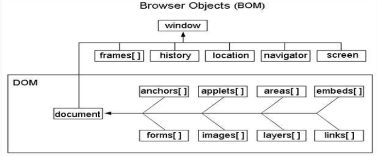

## 1. Map、Set、Object Array 的区别

Map 与 Object

- Map 有序结构, key 任意类型; Object 无序结构, key 两种类型 (String、Symbol)
- Set 可以自动去重
- Map 和 Set 比 Object Array 整体要执行更快


[Map、Set 相关语法](https://juejin.cn/post/7064479924757168165)


## 2. 闭包

以下代码输出什么？

```javascript
for (var i = 0; i < 10; i++) {
    setTimeout(() => {
        console.log(i)
    })
}
//  输出 10 个 10
```


将上面代码修改下, 输出结果为 0 ~ 9

```javascript
// 方法一 闭包
for (var i = 0; i < 10; i++) {
    (function (i) {
		setTimeout(() => {
            console.log(i)
        })
    })(i)
}
```

```javascript
for (let i = 0; i < 10; i++) {
    setTimeout(() => {
        console.log(i)
    })
}
```


扩展: let 有块作用域, var 没有块作用域


## 3. JS 基本知识

闭包、原型链、异步、深浅拷贝、Promise、变量提升


闭包的特点

- 一个是可以读取函数内部的变量

- 另一个就是让这些变量的值始终保存在内存中


## 4. 截取 数组最快的办法

通过直接设置, 数组长度即可

```javascript
let arr = [1, 2, 6, 8]
arr.length = 2
console.log(arr) // [1, 2]
```


## 5. DOM 和 BOM 的区别？

DOM 与 BOM 的模型

	


区别

DOM 文档对象模型

BOM 浏览器对象模型


## 6. 普通事件绑定和事件流绑定有啥区别（中级）

普通事件绑定

- 如果给同⼀个元素绑定了两次或者多次相同类型的事件，那么后⾯的绑定会覆盖前⾯的绑定
- 利用`on`开头的的事件`onclick`
- 不支持`dom`事件流（捕获-目标-冒泡）

```javascript
// 传统方法 绑定事件 用onclick
var buts = document.querySelectorAll('button')
buts[0].onclick = function() {
    alert('new day')
}
```


事件流绑定

- 如果说给同⼀个元素绑定了两次或者多次相同类型的事件，所有的绑定将会依次触发
- 支持`dom`事件流（捕获-目标-冒泡）
- 不加`on`事件

```javascript
// addEventListener 事件监听的方法 绑定事件
// 监听事件一
buts[1].addEventListener('click', function() {
    alert('last day')
    // 传统解绑事件
    buts.onclick = null
})
// 监听事件二
function fn() {
    alert('next day')
    // 用 API 方式解绑事件
    buts[1].removeEeventListener('click', fn)
}
buts[1].addEventListener('click', fn)
```


## 7. 如何阻止事件冒泡和默认事件（中级）

阻止默认事件: `e.preventdefault()`

阻止事件冒泡: `e.stoppropagation()`


## 8. document.onload 和 document.ready、window.onload（初级）

区别

- Document.onload 是在结构和样式加载完才执⾏ js

- window.onload：不仅仅要在结构和样式加载完，还要执⾏完所有的样式、图片这些资源文件，全部 加载完才会触发`window.onload`事件

- Document.ready 原⽣种没有这个⽅法，`jquery` 中有`$().ready(function)`

```javascript
window.addEventListener('load', function () {
    // 页面的全部资源加载完才会执行, 包括图片、视频等
})
document.addEventListener('DOMcontentLoaded', function() {
    // DOM 渲染完即可执行, 此时图片、视频还可能没有加载完
})
```


## 9. undefined 的三种情况（初级）

变量、对象、数组 只定义了, 未赋值

- ⼀个变量定义了却没有被赋值
- ⼀个对象上不存在的属性或者⽅法
- ⼀个数组中没有被赋值的元素


## 10. 对象模型 BOM 里常用的至少4个对象（初级）

- Window
- document
- location (获取路由的主机名、端口等信息)
- screen (显示屏幕的信息, 浏览器浏览器最大时的宽高等信息)
- history (获取路由信息, url)
- navigator (获取浏览器信息, 通常用于判断浏览器名称)


## 11. JavaScript 存储对象是哪两个 (初级)

`window.localStorage` 在浏览器中存储 key/value 对, 没有过期时间

`window.sessionStorage` 在浏览器中存储 key/value 对, 没有过期时间


## 12. 会造成内存泄漏的情况（中级）

- `setTimeout`的第⼀个参数使⽤字符串⽽非函数的话，会引发内存泄漏。
- 闭包

```javascript
// setTimeout 的错误使用
setTimeout('666', 100)
// setTimeout 的正确用法
setTimeout( () => {
    console.log('666')
}, 1000)
```

```javascript
// 闭包的简单实现
function f1() {
    let a = 0
    return function () {
        a += 1
        console.log(a)
    }    
}

let fn = f1()
fn() // 1
fn() // 2
```


## 13. 闭包中变量如何释放

```javascript
let fn = function(){
    let sum = 0
    return function(){
        sum++
        console.log(sum);
    }
}
fn1 = fn() 
fn1()   //1
fn1()   //2
fn1()   //3
fn1 = null // fn1的引用fn被手动释放了
fn1=fn()  //num再次归零
fn1() //1
```


## 14. instanceof 和 typeof 的区别

`typeof`与`instanceof`都是判断数据类型的方法，区别如下：

- `typeof`会返回一个变量的基本类型，`instanceof`返回的是一个布尔值

- `instanceof` 可以准确地判断复杂引用数据类型，但是不能正确判断基础数据类型

- 而`typeof` 也存在弊端，它虽然可以判断基础数据类型（`null` 除外），但是引用数据类型中，除了`function` 类型以外，其他的也无法判断

  

可以看到，上述两种方法都有弊端，并不能满足所有场景的需求

如果需要通用检测数据类型，可以采用`Object.prototype.toString`，调用该方法，统一返回格式`“[object Xxx]”`的字符串


## 15. ES6 的模板字符串

```javascript
console.log(`姓名 ${this.name}`)
// 相当于 ( 可以省略 + 号, + 号多的话就比较难阅读了)
console.log('姓名' + this.name)
```


## 16. var 和 let const 的区别

**区别**

- var 是 ES5 语法, let const 是 ES6 语法, 没有变量提升; var 有变量提升
- var 和 let 是变量. 可修改; const 是常量, 不可修改
- let const 有块级作用域, var 没有


**变量提升**

ES5 中, 执行代码前, 回去找 var 定义的变量, 会把 var定义的变量先赋值为 undefined

```javascript
// 变量提升
console.log(a) // undefined
var a = 200

// 等同于下面的例子
var a
console.log(a) // undefined
a = 200
```


**块级作用域**

```javascript
for (let i = 0; i < 10; i++) {
    let j = i + 1
}
console.log(i, j) // 报错
```


**[扩展]**

**const 不能赋值, 为什么其属性可以被修改?**

这是因为 const 声明的变量存储的是一个引用，而不是对象本身。当我们修改 obj 的属性时，实际上是修改了对象本身，而不是修改了常量 obj 的值。因此，const 声明的变量仍然可以被修改，只是不能被重新赋值。

需要注意的是，如果我们尝试给 const 声明的变量重新赋值，就会抛出一个错误，例如：

```javascript
const obj = { name: 'Alice', age: 20 };
obj = { name: 'Bob', age: 21 }; // 抛出错误
```

在这个例子中，我们尝试给常量 obj 重新赋值，就会抛出一个错误，因为常量的值不能被重新赋值


## 18. 列举强制类型转换和隐式转换

**强制**: parseInt、parseFloat、toString 等

**隐式**: if、逻辑运算、==、+拼接字符串


## 19. 函数表达式 VS 函数声明

**区别**

- 函数声明 function fn() {...}

- 函数表达式 const fn = function() {...}
- 函数声明会在代码执行前预加载 (类似变量提升), 而函数表达式不会

```javascript
// 函数声明
const res = sum(10, 20)
console.log(res) // 30
function sum(x, y) {
    return x + y
}

// 函数表达式
var res = sum(10, 20)
console.log(res) // 报错 res 没找到
var sum = function (x, y) {
    return x + y
}
```


## 20. 手写深度比较, 模拟 lodash isEqual

```javascript
// 实现如下效果
const obj1 = { a: 10, b: { x: 100, y: 200 }}
const obj2 = { a: 10, b: { x: 100, y: 200 }}
// isEqual(obj1, obj2) === true
```

```javascript
// 判断是否是对象或数组
function isObject(obj) {
    return typeof obj === 'object' && obj !== null
}
// 全相等（深度）
function isEqual(obj1, obj2) {
    if (!isObject(obj1) || !isObject(obj2)) {
        // 值类型（注意，参与 equal 的一般不会是函数）
        return obj1 === obj2
    }
    if (obj1 === obj2) {
        return true
    }
    // 两个都是对象或数组，而且不相等
    // 1. 先取出 obj1 和 obj2 的 keys ，比较个数
    const obj1Keys = Object.keys(obj1)
    const obj2Keys = Object.keys(obj2)
    if (obj1Keys.length !== obj2Keys.length) {
        return false
    }
    // 2. 以 obj1 为基准，和 obj2 一次递归比较
    for (let key in obj1) {
        // 比较当前 key 的 val —— 递归！！！
        const res = isEqual(obj1[key], obj2[key])
        if (!res) {
            return false
        }
    }
    // 3. 全相等
    return true
}
```


## 21. split() 和 join() 的区别


## 22. 数组哪些 API, 是纯函数

**纯函数**

- 不改变源数组 (没有副作用, 或者说不影响函数外部的数据)
- 返回一个数组

```javascript
const arr = [10, 20, 30, 40]
// concat
const arr1 = arr.concat([50, 60, 70])
// map
const arr2 = arr.map(num => num * 10)
// filter
const arr3 = arr.filter(num => num > 25)
// slice
const arr4 = arr.slice() // 类似于做了一个深拷贝, 剪切函数  

// 纯函数
let count = 1
function (a, b) {
    count++; // 多了这个影响外部函数, 不是纯函数了
    return a + b
}
```

**非纯函数**

push、pop、shift、unshift

forEach

some every

reduce


## 23. 数组 slice 和 splice 的区别

 **区别**

- 功能区别 (slice - 切片, splice - 剪切)
- 参数 和 返回值不同
- 是否纯函数？

```javascript
const arr = [10, 20, 30, 40, 50]

// slice 函数
const arr1 = arr.slice() // [10, 20, 30, 40, 50]
const arr2 = arr.slice(1, 4) // [30, 40, 50]
const arr3 = arr.slice(2) // [30, 40, 50]
const arr4 = arr.slice(-2) // [40, 50]

// splice 非纯函数
const spliceRes = arr.splice(1, 2, 'a', 'b', 'c')
console.log(spliceRes, arr) //  [20, 30] [10, 'a', 'b', 'c', 40, 50]
arr = [10, 20, 30, 40, 50]

const spliceRes1 = arr.splice(1, 2)
console.log(spliceRes1, arr) // undefined [10, 40, 50]
arr = [10, 20, 30, 40, 50]

const spliceRes2 = arr.splice(1, 0, 'a', 'b', 'c')
console.log(spliceRes2, arr) // [] [10, 'a', 'b', 'c', 20, 30, 40, 50]
```


## 24. [10, 20, 30].map(parseInt) 返回结果是什么？

 **要点**

- map 的参数和返回值
- parseInt 参数和返回值

```javascript
const res = [10, 20, 30].map(parseInt)
console.log(res)

// 拆解
[10, 20, 30].map((num, index) => {
    return parseInt(num, index)
}) 
// 类似于 执行
// parseInt(10, 0) parseInt(20, 1) parseInt(30, 2)
// 执行结果  [10, NaN, NaN]
```

## 25. ajax 请求 get 和 post 的区别？

区别

- get 一般用于查询操作, post 一般用户提交操作
- get 参数拼接在 url 中, post 放在请求体内 (数据体积可更大)
- 安全性: post 易于防止 CSRF


## 26. call、apply、bind的区别？

相同: 都改变 this 的指向

不同：

- **是否返回函数**: bind 返回绑定 this 之后生成新函数, 便于稍后调用; apply、call 则是立即执行
- **第二个参数不同**: call、bind 第二个参数是可以分多次传入, 而 apply 必须是一个数组

```javascript
// 区别在于 第二个参数, call 是零散的传进去, 而 apply 是传一个集合
fn.call(this, p1, p2, p3)
fn.bind(this, p1, p2, p3)
fn.apply(this, [p1, p2, p3])
```


## 27. 事件代理 (委托) 是什么？

需要绑定的元素很多, 不方便每个元素都去绑定, 那么就去它们的父元素上绑定, 这就是事件代理


## 28. 闭包是什么, 有什么特征? 有什么负面影响？

闭包:

在本质上，闭包就是将函数内部和函数外部连接起来的一座桥梁


特征:

作用域和自由变量


重点:

自由变量的查找, 要在函数定义的地方 (而非执行的地方)


影响:

变量会常驻内存, 得不到释放, 闭包不要乱用

可能会造成内存泄漏, 但是闭包中的数据, 我们不知道什么时候会被释放, 所以不算内存泄漏

内存泄漏是指, 内存中的变量一直没被使用, 常驻在内存中

```javascript
// 自由变量示例 —— 内存会被释放
let a = 0
function fn1() {
    let a1 = 100

    function fn2() {
        let a2 = 200

        function fn3() {
            let a3 = 300
            return a + a1 + a2 + a3
        }
        fn3()
    }
    fn2()
}
fn1()

// 闭包 函数作为返回值 —— 内存不会被释放
function create() {
    let a = 100
    return function () {
        console.log(a)
    }
}
let fn = create()
let a = 200
fn() // 100
```


开发过程中什么时候用到闭包?

1. 使用异步请求的时候, 异步请求以函数作为参数进行传递, 这就是一个闭包
2. 还有就是 我们写防抖节流函数, 也是需要使用保存局部变量进行计数, 然后返回回调函数, 这也是闭包的使用
3. 函数柯里化, 也是一种闭包的使用, 函数作为返回值


任何闭包的使用场景的目的:

- 创建私有变量
- 延长变量的生命周期


## 29. new Object() 和 Object.create() 的区别

**区别**

- {} 等同于 new Object(), 原型 Object.prototype
- Object.create(null) 没有原型
- Object.cteate({...}) 可指定原型


**原理**

Object.create 创建一个空对象, 然后把空对象原型指向到传入的对像的隐式原型上


```javascript
const obj3 = Object.create(null)
const obj4 = new Object() // {}

const obj5 = Object.create({
    a: 10,
    b: 20,
    sum() {
        return this.a + this.b
    }
})
```


## 30. 关于 this

**读代码**

```javascript
const User = {
    count: 1,
    getCount: function() {
        return this.count
    }
}
console.log(User.getCount()) // 1
const func = User.getCount
console.log( func() ) // undefined
```


**this 的指向问题**

只有执行阶段才能判断 this 的指向

在对象函数执行时, this 指向当前对象


> - this 指向执行阶段才能知道
>
> - 自由变量的查找, 要在函数定义的地方


## 31. 常见正则表达式

**判读字符串以字母开头, 后面字母数字数字下划线, 长度 6-30**


## 32. 作用域和自由变量的场景题

**场景1**

```javascript
let i
for (i = 1; i <= 3; i++) {
    setTimeout(function(){
        console.log(i)
    }, 0)
}
// 执行结果 打印 3 个 4
```


**场景2**

```javascript
let a = 100
function test() {
    alert(a)
    a = 10
    alert(a)
}
test()
alert(a)
// 执行结果, 弹出 3个弹窗 依次显示数字为 100 10 10
```


## 33. 手写字符串 trim 方法, 保证浏览器兼容性

**trim**

去掉字符串前后空白字符

```javascript
// 用正则表达式实现即可
String.prototype.trim = function () {
    return this.replace(/^\s+/,'').replace(/\s+$/,'')
}
```


## 34. 如何获取多个数字中的最大值

```javascript
// 自己实现
function max() {
    const nums = Array.prototype.slice.call(arguments) // 变为数组
    let max = 0
    nums.forEach(n => {
        if(n > max) {
            max = n
        }
    })
    return max
}

// API 
Math.max(10, 30, 20, 40)
// 以及 Math.min
```


## 35. 如何用 JS 实现继承？

**各种方式**

- class 继承
- prototype 继承


## 36. 如何捕获 JS 程序的异常？

**两种方式**

- try catch
- window.onerror

```javascript
// 手动
try {
    // todo
} catch (ex) {
    console.log(ex) // 手动捕获 catch
} finally {
    // todo
}

// 自动捕获
window.onerror = function (message, source, lineNom, colNom, error) {
    // 第一, 对跨域的 js, 如 CDN 的, 不会有详细的报错信息
    // 第二, 对于压缩的 js, 还要配合 sourceMap 反查到未压缩代码的行、列
}
```


## 37. 什么是 JSON

知识点

- json 是一种数据格式, 本质是一段字符串
- json 格式和 JS 对象结构一致, 对 JS 语言更友好
- window.JSON 是一个全局对象: JSON.stringify、JSON.parse


## 38. 获取当前页面 url 参数

两种方式

- 传统方式, 查找 location.search
- 新 API, URLSearchParams

```javascript
// 传统方式
function query(name) {
  // substr 从第一个之后开始截
  const search = location.search.substr(1); // 类似 array.slice(1)
  // search: 'a=10&b=20&c=30'
  const reg = new RegExp(`(^|&)${name}=([^&]*)(&|$)`, "i");
  const res = search.match(reg);
  if (res === null) {
    return null;
  }
  return res[2];
}
query("d");

// URLSeachParams 需高版本浏览器, 要做兼容性处理
function query(name) {
    const search = location.search;
    const p = new URLSearchParams(search);
    return p.get(name)
}
console.log(query("b"))
```


## 39. 将 url 参数解析为 JS 对象

```javascript
// 传统方式, 分析 search 
function queryToObj() {
    const res = {}
    const search = location.search.substr(1) // 去掉前面的 '?'
    search.split('&').forEach(paramStr => {
        const arr = paramStr.split('=')
        const key = arr[0]
        const val = arr[1]
        res[key] = val
    })
    return res
}

// 使用 URLSearchParams
function queryToObj() {
    const res = {}
    const pList = new URLSearchParams(location.search)
    pList.forEach((val, key) => {
        res[key] = val
    })
    return res
}
```


## 40. 手写数组 flatern, 考虑多层级

**数组拍平**

```javascript
function flat(arr) {
    // 验证 arr 中，还有没有深层数组 [1, 2, [3, 4]]
    const isDeep = arr.some(item => item instanceof Array)
    if (!isDeep) {
        return arr // 已经是 flatern [1, 2, 3, 4]
    }

    const res = Array.prototype.concat.apply([], arr)
    return flat(res) // 递归
}

const res = flat( [1, 2, [3, 4, [10, 20, [100, 200]]], 5] )
console.log(res) // [1, 2, 3, 4, 10, 20, 100, 200, 5]
```


## 41. 数组去重

两种方式

- 传统方式, 遍历元素挨个比较、去重, 注意计算效率
- 使用 Set

```javascript
// 传统方式 (需要遍历, 效率低)
function unique(arr) {
    const res = []
    arr.forEach(item => {
        if (res.indexOf(item) < 0) {
            res.push(item)
        }
    })
    return res
}

// 使用 Set (无序结构, 不能重复, 效率高, ES6 中才有)
function unique(arr) {
    const set = new Set(arr)
    return [...set]
}

const res = unique([30, 10, 20, 30, 40, 10])
console.log(res) // [30, 10, 20, 40]
```


## 42. 介绍 RAF requestAnimationFrame

**介绍**

- 要想动画流程, 更新频率要 60帧/s, 即 16.67ms 更新一次视图
- setTimeout 要手动控制频率, 而 RAF 浏览器会自动控制
- 后台标签或隐藏 iframe 中, RAF 会暂停, 而 setTimeout 依然执行

```javascript
// 3s 把宽度从 100px 变为 640px ，即增加 540px
// 60帧/s ，3s 180 帧 ，每次变化 3px

const $div1 = $('#div1')
let curWidth = 100
const maxWidth = 640

// setTimeout
function animate() {
    curWidth = curWidth + 3
    $div1.css('width', curWidth)
    if (curWidth < maxWidth) {
        setTimeout(animate, 16.7) // 自己控制时间
    }
}
animate()

// RAF
function animate() {
    curWidth = curWidth + 3
    $div1.css('width', curWidth)
    if (curWidth < maxWidth) {
        window.requestAnimationFrame(animate) // 时间不用自己控制
    }
}
animate()
```


## 43. 如何性能优化, 从哪几个方面考虑

**原则**

多使用内存、缓存, 减少计算、减少网络请求


**方向**

加载页面, 页面渲染, 页面操作流畅度


## 44. 深拷贝 和 浅拷贝的区别?

**浅拷贝**: 只复制对象指针, 新旧对象共享内存

**深拷贝**: 创造一样的对象, 不共享内存


> 深拷贝、浅拷贝 只针对 数组或者对象这些而已, 对于普通变量没有这个概念
>
> 深拷贝, 新对象修改, 不会导致旧对象修改

[扩展]

[浅拷贝与深拷贝的区别 - 实现方法](https://juejin.cn/post/7174254823271825416#heading-4)

## 45. ES6 的新特征

1. 块级作用域
2. 箭头函数
3. 新的数组、对象操作 API
4. 解构, 可以避免在对象赋值时产生中间变量
5. 扩展 [...arr]
6. 类 class
7. 迭代器
8. 装饰器
9. promise


> async/await 是 ES7 的语法


**解构的使用**

```javascript
// 对象
let obj = { a: 1, b: 2, c: 3 }
let { a: a1, b: b1, c: c1 } = obj
console.log(a1, b1, c1) // 1 2 3
// let { a, b, c } = obj // 等同上面
// console.log(a, b, c) // 1 2 3

// 数组
let arr = [1, 2, 3]
let [d, e, f] = arr
console.log(d, e, f) // 1 2 3
```


**async / await 的使用**

```javascript
async function foo(){
    console.log(1)
    const result = await 2
    console.log(result)
}
console.log(3)
foo()
console.log(4)
// 执行结果: 3、1、4、2
```

> [扩展]
>
> await 后面是一个普通函数的话, 返回的就是普通函数的返回值
>
> [理解 JavaScript 的 async/await](https://www.nowcoder.com/discuss/353148496452722688?sourceSSR=users)


## 46. 事件循环

JS 是单线程的, 但是有 同步任务 和 异步任务

同步任务会进入主线程, 异步任务会进入任务队列, 当主线程执行完后, 就会把任务队列的任务读入主线程执行

如此反复循环的过程, 就是事件循环


## 47. 什么时候使用 .stop 阻止事件冒泡

当前元素的父元素也有事件的时候, 就需要去阻止事件冒泡


## 48. 怎么判断一个数是不是素数

**质数**（Prime number），又称[素数](https://so.csdn.net/so/search?q=素数&spm=1001.2101.3001.7020)，指在大于1的自然数中，除了1和该数自身外，**无法被其他自然数整除**的数


**方法一**

写个标记, 然后循环做除看看是否除了 1和该数自身外, 有没有其他自然整数能被整除

```javascript
function isPrime(num) {
	// 只要2到num - 1 之间有一个数能被num整除 那么就不是质数
    for (let i = 1; i < num; i++) {
        if (num % i === 0) {
            return false
        }
    }
    return true
}
```


**方法二**

优化的方法, 循环次数取被检测数的平方根

```javascript
function isPrime (num) {
    // 取平方根
    let temp = parseInt(Math.sqrt(num))
    // 循环判断
    for (let i = 2; i <= temp; i++) {
        if (num % i === 0) {
            return false
        }
    }
    return true
}
```


## 49. 操作字符串有哪些 API?

**1. 检索 API (indexOf、lastIndexOf、includes)**

```javascript
// indexOf 检索子串首次出现的下标，没有该子串则返回-1
let str ="In order to be irreplaceable one must always be different"
let substr="order"
let id = str.indexOf(substr)
console.log(id) //输出3

// lastIndexOf 检索子串最后一次出现的下标
let str ="In order to be irreplaceable one must always be different"
let strId = str.indexOf("be")
console.log(strId) //输出12
console.log(str.indexOf("be",strId + 1)) //输出45
console.log(str.lastIndexOf("be")) //输出45

// includes 检索子串是否存在 (区分大小写)
let str = "To be, or not to be, that is the question."
console.log(str.includes("To be")) // true
console.log(str.includes("question")) // true
console.log(str.includes("nonexistent")) // false
console.log(str.includes("To be", 1)) // false
console.log(str.includes("TO BE")) // false
```


**2. 替换 API (replace、replaceAll)**

```javascript
// replace 把字符串中值中找到的第一个str1替换为str2，不会改变调用它的字符串值,返回一个被替换后的新字符串
let str = "To be, or not to be, that is the question."
console.log(str.replace("be","is")) // To is, or not to be, that is the question.

// replaceAll 把字符串中值中找到的全部str1替换为str2，不会改变调用它的字符串值,返回一个被替换后的新字符串
var str ="你烧饼你就是大烧饼"
var word = "烧饼"
function shield(str,word){
   return str.replaceAll(word,"**")
}
console.log(shield(str,word))//输出你是**你就是大**
```


**3. 截取 API (substring、split、slice、trim)**

```javascript
// substring(start,end) (包括start，不包括end) 返回索引start和索引end之间的部分
// substring(start) 返回索引start到字符串的末尾之间的部分
let str = "To be, or not to be"
str.substring(1,3) // 'o '
str.substring(1) // ’o be, or not to be‘

// split 将字符串划分为子串数组，返回该数组
let str = 'The quick brown fox'
let words = str.split(' ')
console.log(words) // ['The', 'quick', 'brown', 'fox']

// slice 提取字符串的一部分并将其作为新字符串返回，而不修改原始字符串
let str = 'The quick brown fox jumps over the lazy dog.'
console.log(str.slice(31)) // the lazy dog

// trim() 返回一个将str开头和结尾的空格都去掉的字符串
let str = ' The quick brown fox jumps over the lazy dog '
console.log(str.trim()) // The quick brown fox jumps over the lazy dog
```


## 50. 操作对象有哪些 API?


## 51. 两个异步请求如何合并?

**使用 Promise**

```javascript
//定义两个http请求方法
const getList1 = ()=>{
    return new Promise((res,rej) =>{
        //省去get方法获取过程
        .then((json) => resolve(json))
    })
}

const getList2 = ()=>{
    return new Promise((res,rej) =>{
        //省去get方法获取过程
        .then((json) => resolve(json))
    })
}

Promise.all([getList1(),getList2()]).then(value => {
    //第一个请求的数据
    const x = value[0];

    //第二个请求的数据
    const y = value[1];

    //合并操作
    for(const i of x){
        for(const k of y){
          //Todo
        }
    }
})
```


## 52. v-model 是谁的语法糖?

`v-model='message'` 语法糖本质上可以修改为

```vue
<child :value="message" @input="function(e){message = e}"></child>
```

在大部分情况下， `v-model='foo'` 等价于 `:value='foo'` 加上 `@input='foo=$event'`


## 53. Promise有哪几种状态，各个状态之间是如何进行转换的？

三种状态: `pending`、`fulfilled`、`rejected` (未决定，履行，拒绝)

1.初始化，状态：pending

2.当调用resolve(成功)，状态：pengding=>fulfilled

3.当调用reject(失败)，状态：pending=>rejected


## 54. Promise 解决哪些问题?

**回调地狱**

```javascript
const request = url => {
    return new Promise((resolve,reject) => {
        $.get(url,params => {
            resolve(params)
        })
    })
}

request(url).then(params1 => {
    return request(params1.url)
}).then(params2 => {
    return request(params2.url)
}).then(params3 => {
    console.log(params3)
}).catch(err => throw new Error(err))
```


## 55. async/await 解决了什么问题?

解决了 异步问题, 可以 异步转同步

```javascript
// 使用async/await获取成功的结果
// 定义一个异步函数，3秒后才能获取到值(类似操作数据库)

function getSomeThing(){
    return new Promise((resolve,reject)=>{
        setTimeout(()=>{
            resolve('获取成功')
        },3000)
    })
}

async function test(){
    let a = await getSomeThing()
    console.log(a)
}
test() // 3秒后输出：获取成功
```


## 56. const 定义对象里面的属性值能不能改变?

可以改变的

```javascript
const obj = { a: 22 }
undefined
obj.a = 30
console.log(obj) // {a: 30}
```

为什么呢?

因为对象是引用类型的, P中保存的仅是对象的指针, 这就意味着, const 仅保证指针不发生改变, 修改对象的属性不会改变对象的指针, 所以是被允许的

也就是说 const 定义的引用类型只要指针不发生改变, 其他的不论如何改变都是允许的


## 57. 对比两个数组是否相等?

**法一 (循环比较)**

```javascript
let arr1 = [1,2,3,4,5], arr2 = [3,4,5,6]
for (let i = 0; i <= arr1.length; i++) {
     if (arr1[i] !== arr2[i]) {
         return false
     } else {
         continue
     }
 }    
return true
```


**法二 (转为字符串)**

```javascript
function (arr1, arr2) {
    return arr1.toString() == arr2.toString()
}
```


## 58. Promise.all、Promise.any、Promise.race、Promise.allsettled

### Promise.all

场景: 多个 Promise 请求, 如果只有一个出错的话, 那么整个就会抛出异常, 不会继续执行

```javascript
// 模拟异步操作
const request = (delay, flag = true) => {
  return new Promise((resolve, reject) => {
    setTimeout(() => {
      if (flag) {
        resolve(`成功了${delay}`)
      } else {
        reject(`失败了${delay}`)
      }
    }, delay)
  })
}

const fun = async (promises) => {
  Promise.all(promises)
    .then(res => {
      console.log('res', res)
    })
    .catch(error => {
      console.log('error', error)
    })
}

fun([request(1000), request(500)])
// res [ '成功了1000', '成功了500' ]
fun([request(1000), request(500, false)])
// error 失败了500
```


如果其中一个错误, 让成功的也能输出出来

```javascript
const fun = async (promises) => {
  Promise.all(
    promises.map(promise => {
      console.log(promise.catch(err => err))
      return promise.catch(err => err)
    })
  ).then(res => {
    console.log('res', res)
  })
}

fun([request(1000), request(500, false)])
// res [ '成功了1000', '失败了500' ]
```


使用 ES2020 (ES11) 的新语法 `Promise.allSettled`, 就能捕获正常和错误的返回

```javascript
const fun = async (promises) => {
  Promise.allSettled(promises)
    .then(res => {
      console.log('res', res)
    })
}

fun([request(1000), request(500, false)])
// res [
//   { status: 'fulfilled', value: '成功了1000' },
//   { status: 'rejected', reason: '失败了500' }
// ]
```


### Promise.any

```javascript
// 一个成功就返回
const promises = [
  Promise.reject('ERROR A'),
  Promise.reject('ERROR B'),
  Promise.resolve('result'),
]

Promise.any(promises).then((value) => {
  console.log('value: ', value)
}).catch((err) => {
  console.log('err: ', err)
})

// value:  result
```

```javascript
// 全部失败也返回
const promises = [
  Promise.reject('ERROR A'),
  Promise.reject('ERROR B'),
  Promise.reject('ERROR C'),
]

Promise.any(promises).then((value) => {
  console.log('value：', value)
}).catch((err) => {
  console.log('err：', err)
  console.log(err.message)
  console.log(err.name)
  console.log(err.errors)
})

// err： AggregateError: All promises were rejected
// All promises were rejected
// AggregateError
// ["ERROR A", "ERROR B", "ERROR C"]
```


[小结]

`Promise.any()` 和 `Promise.all()` 从返回结果来看，它们 **彼此相反** ：

- `Promise.all()` ：任意一个 `promise` 被 `reject` ，就会立即被 `reject` ，并且 `reject` 的是第一个抛出的错误信息，只有所有的 `promise` 都 `resolve` 时才会 `resolve` 所有的结果
- `Promise.any()` ：任意一个 `promise` 被 `resolve` ，就会立即被 `resolve` ，并且 `resolve` 的是第一个正确结果，只有所有的 `promise` 都 `reject` 时才会 `reject` 所有的失败信息


另外，它们又有不同的 **重点** ：

- `Promise.all()` 对所有实现都感兴趣。 相反的情况（至少一个拒绝）导致拒绝。
- `Promise.any()` 对第一个实现感兴趣。 相反的情况（所有拒绝）导致拒绝。


### Promise.race

简单来说, 哪个状态先改变就返回哪个, 不管是 `resolved`、还是 `rejected` 状态

```javascript
// 那个返回结果快, 就返回哪个
let p1 = new Promise(function (resolve, reject) {
  setTimeout(function () {
    resolve(1);
  }, 1000);
});
let p2 = new Promise(function (resolve, reject) {
  setTimeout(function () {
    reject(2);
  }, 300);
});
let p3 = new Promise(function (resolve, reject) {
  setTimeout(function () {
    reject(3);
  }, 2000);
});
Promise.race([p3, p1, p2]).then(
  (res) => {
    console.log(res);
  },
  (err) => {
    console.log(err); //2
  }
);
```


### Promise.allsettled

`Promise.allSettled()`方法接受一个数组作为参数，数组的每个成员都是一个 Promise 对象，并返回一个新的 Promise 对象

只有等到参数数组的所有 Promise 对象都发生状态变更（不管是`fulfilled`还是`rejected`），返回的 Promise 对象才会发生状态变更

```javascript
const resolved = Promise.resolve(42);
const rejected = Promise.reject(-1);
​
const allSettledPromise = Promise.allSettled([resolved, rejected]);
​
allSettledPromise.then(function (results) {
  console.log(results);
});

// [
//    { status: 'fulfilled', value: 42 },
//    { status: 'rejected', reason: -1 }
// ]
```


## 59. js 中的 get、set

`get` 这个属性, 在 ES5 中就有了, 每个对象都有 `get`、`set` 方法

`get` 关键字将对象属性与函数进行绑定, 当属性被访问时, 对应函数被执行

```javascript
const obj = {
  log: ['example','test'],
  get latest() {
    if (this.log.length == 0) return undefined;
    return this.log[this.log.length - 1];
  }
}
console.log(obj.latest);  // 输出："test"
```

`set` 关键字将对象属性与函数进行绑定，当改变属性值时，对应函数被执行

```javascript
const language = {
  log: []
  set current(name) {
    this.log.push(name);
  }
};

language.current = 'EN';
language.current = 'FA';

console.log(language.log); // expected output: Array ["EN", "FA"]
```


## 60. new函数() 和 普通函数() 的区别

区别：

1、new执行的函数，函数内部默认生成了一个对象
2、函数内部的this默认指向了这个new生成的对象
3、new执行函数生成的这个对象，是函数的默认返回值


```javascript
function fn() {
  console.log(this);
}

fn(); // this 指向 window

new fn(); // this 指向 fn  指向一个对象

function fn1() {
  this.name = "666";
}

var obj1 = fn1(); // 遇到等号先看右边，fn1 函数执行,执行完函数拿到最简结果（函数的返回值）才会进行赋值

var obj2 = new fn1();

console.log(obj1); // undefined, 因为函数没有返回值

console.log(obj2); // fn1 { name: '666' }
```


## 61. JavaScript 有哪几种方法判断变量的类型?

### typeof

只能判断基础数据类型, 复杂类型都为 object, 除了 function 返回 function

```javascript
console.log(typeof 10) // number
console.log(typeof New String('aaa')) // object
```


### instanceof

适用复杂数据类型的判断, 对于 简单类型的 undefined、null、symbol 检测不出来

```javascript
let arr = []
console.log(arr instanceof Array) // true
```


### Object.prototype.toString.call()

适用于所有类型的判断检测, 返回数据类型的字符串

```javascript
Object.prototype.toString.call(1) // '[object Number]'
```


### constructor

用于检测引用数据类型

```javascript
let arr = [];
console.log(arr.constructor == Array) // true
```


[扩展]

[JS 判断数据类型的 8 种方式](https://juejin.cn/post/7200396667505704997)


## 62. import * as 作用是什么

1. 创建一个 b.js 文件, 导出两个模块变量

```typescript
export const name='名字'; 
export const age=21;
```

2. 创建一个 a.js 文件，引入 b.js 文件，暴露出的两个变量

```typescript
// 两种使用方法
<script type="module"> 
    // 方法一: 会导出这个默认的对象作为一个对象
    import {name, age } from './b.js'
    console.log(name) 

    // 方法二: 会将若干export导出的内容组合成一个对象返回；
    import * as b from './b.js'

    console.log(b.name)
    console.log(b.age)
 </script>
```


