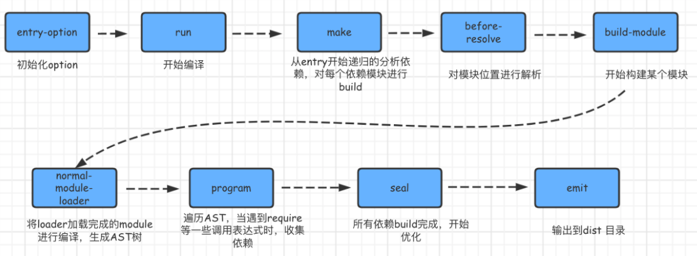

## 1. 描述下你对 webpack 的理解? 解决了什么问题?

**理解**：webpack 是一款静态模块打包工具


**解决了什么问题**

- 解决浏览器兼容性问题 (编译代码能力) - 如 ES5 转 ES6
- 解决浏览器频繁请求文件的问题 (模块整合能力) - 如 将很多 JS 文件整合成一个 Bundle.js
- 使项目维护性增强, 支持不同种类的前端模块类型, 统一的模块化方案, 所有资源文件的加载都可以通过代码控制 - 如 .css、.scss 都可以整合成一个 .css, 而 .ts、.js 可以整合成一个 Bundle.js


## 2. 说一说 webpack 的构建流程

配置文件默认下为`webpack.config.js`，也或者通过命令的形式指定配置文件，主要作用是用于激活`webpack`的加载项和插件




## 3. 说说 webpack 中常见的 Loader? 解决了什么问题?

**常见的 Loader**

- html-minify-loader

- style-loader | css-loader | less-loader | sass-loader
- postcss-loader
- file-loader | url-loader
- babel-loader


**解决的问题**

 `webpack` 只支持对 js 和 json 文件打包

像 `css`、`sass`、`png` 等这些类型的文件的时候, `webpack` 则无能为力, 这时候就需要配置对应的 `loader` 进行文件内容的解析


## 4. 说说 webpack 中常见的 Plugin? 解决了什么问题?

**常见的 Plugin**

- HtmlWebpackPlugin
- mini-css-extract-plugin
- clean-webpack-plugin
- DefinePlugin
- copy-webpack-plugin


**解决的问题**

目的在于解决`loader` 无法实现的其他事


## 5. 说说 Loader 和 Plugin 的区别? 编写 Loader, Plugin 的思路?

**Loader 和 Plugin 的区别**

可有看到, 两者在运行时机上的区别:

- loader 运行在打包文件之前
- plugins 在整个编译周期都起作用


**编写 Loader 的思路**

保持功能单一, 避免做多种功能

如`less`文件转换成 `css`文件也不是一步到位，而是 `less-loader`、`css-loader`、`style-loader`几个 `loader`的链式调用才能完成转换


**编写 Plugin 的思路**

- 插件必须是一个函数或者一个包含 `apply` 方法的对象, 这样才能访问 `compiler` 实例
- 传给每个插件的 `compiler` 和 `compilation` 对象都是同一个引用, 因此不建议修改
- 异步的事情需要在处理完成任务时调用回调函数通知 `webpack` 进入下一个流程, 不然会卡住


## 6. 热更新是什么? webpack 的热更新是如何做到的? 原理是什么?

**热更新**

可以理解为模块热替换, 指在应用程序运行过程中, 替换、添加、删除模块, 而无需重新刷新整个应用


**webpack 热更新如何实现**

直接进行简单配置即可

```json
const webpack = require('webpack')
module.exports = {
  // ...
  devServer: {
    // 开启 HMR 特性
    hot: true
    // hotOnly: true
  }
}
```


**webpack 热更新原理**

- 大概流程是我们用 `webpack-dev-server` 启动一个服务之后
- 浏览器和服务端是通过 `websocket` 进行长连接，`webpack` 内部实现的 `watch` 就会监听文件修改，只要有修改就 `webpack` 会重新打包编译到内存中
- 然后 `webpack-dev-server` 依赖中间件 `webpack-dev-middleware` 和 `webpack` 之间进行交互，每次热更新都会请求一个携带 `hash` 值的 `json` 文件和一个 `js`
- `websocker` 传递的也是 `hash` 值，内部机制通过 `hash` 值检查进行热更新


## 7. 说说 webpack proxy 工作原理? 为什么能解决跨域问题?

**webpack proxy 工作原理**

`proxy` 工作原理实质上是利用 `http-proxy-middleware` 这个`http`代理中间件，实现请求转发给其他服务器


**为什么能解决跨域问题**

- 跨域是, 由于浏览器同源策略的原因，当本地访问后端就会出现跨域请求的问题 (不同端口的服务)

- 而 `webpack proxy` 将本地请求转发给代理服务器, 代理服务器再去请求目标服务器

- 目标服务器响应数据后, 将数据返回给代理服务器, 最终由代理服务器将数据响应给本地

- 本质上利用服务器之间请求数据不存在跨域行为, 跨域行为是浏览器安全策略限制

 

## 8. 说说如何借助 webpack 来优化前端性能?

**webpack 优化前端的手段**

- HTML、CSS、JS 代码压缩
- 文件、图片压缩
- Tree Shaking (消除死代码)
- 代码分离
- 内联 chunk


**webpack 如何优化**

可以通过文件体积大小入手, 其次还可以通过分包的形式, 减少 `http` 请求数等方式 


**Tree Shaking**

清除实际上并没有在项目中使用的代码


## 9. 如何提高 webpack 的构建速度?

**提高构建速度的手段**

- 优化 loader 配置
- 合理使用 resolve.extensions
- 优化 resolve.modules
- 优化 resolve.alias
- 使用 DLLPlugin 插件
- 使用 cache-loader
- terser 启动多线程
- 合理使用 sourceMap


**webpack 构建速度如何提升**

主要可以从优化搜索时间、缩小文件搜索范围、减少不必要的编译等方面入手


## 10. 前端打包工具有哪些?

**打包构建工具**

- Rollup
- Parcel
- Snowpack
- Vite
- Webpack


## 11. Rollup vs Webpack

Rollup 对原生 ES 语法支持, 对 tree shaking 这样的使用场景非常的友好

Rollup 核心概念: input、output、format、plugins

plugins的使用方式: 顺序引用, 顺序执行


## 12. Rollup 常用插件

最常用

- resolve 解析一些 node_modules
- commonjs 转换为 commonjs 语法

类型解析

- json | babel | typescript | image | html | wasm

功能扩展

- replace 变量替换
- eslint 代码规范
- alias 路径替换
- strip 去除 console、空格这些
- terser (uglify) 压缩代码


## 13. Rollup 中用 babel 与 typescript 打包有什么区别?

babel

- 缺点: 打包的时候是不会进行类型检查
- 优点: 不进行类型检查, 所以速度比 typescript 更快


> 使用 babel 或 typescript 需要根据场景来, 需要类型检查就用 typescript


