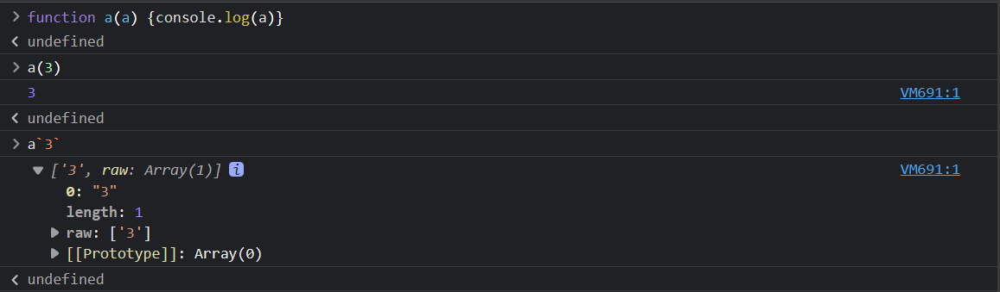

# React 入门

[扩展]

[React基础](https://www.yuque.com/fechaichai/qeamqf/xbai87#e3638cf5-2)


## 环境配置

### 创建项目

`Create-React-App` 创建, 官网推荐, 比较稳定

1. 安装

如果不加 `--template typescript` 项目会默认使用 `javascript`

```shell
npx create-react-app my-app --template typescript
```


2. 进入到目录中, 运行项目即可

```shell
npm start
```


3. 安装 `prettier`规范代码风格

```shell
npm install prettier eslit-config-prettier eslint-plugin-prettier --save-dev
```


`Vite` 创建

1. 安装

```shell
npm create vite@latest react-dome-vite --template react-ts
```


2. 进行目录, 安装依赖

```shell
npm install
```


3. 运行

```shell
npm run dev
```


## 代码规则

高质量代码的特点

- **严格编码规范**（靠工具、流程，而非自觉）
- 合理、规范的注释
- 代码合理拆分

### 两者区别

eslint prettier

- eslint 编码规范，如变量未定义（语法语义）
- prettier 编码风格，如末尾是否用 `;`
- eslint 也有编码风格的功能，两者可能会有冲突


### eslint

安装插件

```shell
npm install eslint @typescript-eslint/parser @typescript-eslint/eslint-plugin -save-dev
```

初始化配置文件 `.eslint.js`

```javascript
// .eslint.js
module.exports = {
  env: {
    browser: true,
    es2021: true,
  },
  extends: [
    "eslint: recommended",
    "plugin: react/recommended",
    "plugin:@typescript-eslint/recommended",
    "plugin:prettier/recommended",
  ],
  overrides: [],
  parser: "@typescript-eslint/parser",
  parserOptions: {
    ecmaVersion: "latest",
    sourceType: "module",
  },
  plugins: ["react", "atypescript-eslint"],
  rules: {},
};
```

```shell
npx eslint --init    ## 然后根据引导一步一步走
```

解释：eslint `plugin` 与 `extend` 的区别：

- `extend` 提供的是 eslint 现有规则的一系列预设
- `plugin` 则提供了除预设之外的自定义规则，当你在 eslint 的规则里找不到合适的的时候就可以借用插件来实现了

安装 vscode 插件 `eslint` ，此时就可以看到代码 `App.txs` 中的错误提示（如定义一个未使用的变量）

在 `package.json` 中增加 scripts `"lint": " eslint 'src/**/*.+(js|ts|jsx|tsx)' "` <br>
控制台运行 `npm run lint` 也可以看到错误提示。如果要自动修复，可以加 `--fix` 参数

### prettier

```
npm install prettier eslint-config-prettier eslint-plugin-prettier -save-dev
```

- `eslint-config-prettier` 禁用所有和 Prettier 产生**冲突**的规则
- `eslint-plugin-prettier` 把 Prettier 应用到 Eslint，配合 rules `"prettier/prettier": "error"` 实现 Eslint 提醒。

在 eslint 配置文件的 `extends` **最后** 增加 `'plugin:prettier/recommended'`

安装 vscode 插件 `prettier` ，此时可以看到代码 `App.txs` 中的格式提示（如末尾是否使用 `;` ，或单引号、双引号）

在 `package.json` 中增加 scripts `"format": " prettier --write 'src/**/*.+(js|ts|jsx|tsx)' "` <br>
控制台运行 `npm run format` 可以修复所有的格式错误

设置 vscode `.vscode/settings.json` 自动保存格式，可以在文件保存时，自动保留格式

```json
{
    "editor.codeActionsOnSave": {
        "source.fixAll.eslint": true
    }
}
```

增加配置文件 `.prettierrc.js` 规定自己的编码格式，运行 `npm run format` 可以看到效果，保存文件也可以看到效果。<br>
【注意】如果此处没效果，可以**重启 vscode** 再重试。

------

一直搞不定，重启 vscode 就好了。
在 vscode 搜“prettier” 插件时，发现一个 “reload required” 的提示，于是就重启了

CRA 创建的项目，配置文件是 `js` 格式
vite 创建的项目，配置文件是 `cjs` 格式


## JSX

### JSX 与 标签的区别

1. 首字母大小写的区分，大写是自定义组件
2. 每段 JSX 只能有一个根节点 (其中为 `<></>` 空标签，空标签无法添加 `class` 等修饰)

```react
return (
	<>
  	<div>hello world</div>
  </>
)
```


### JSX 的属性

1. 类型的变化，`class` 在 react 中需要写成 `className` 

```react
return (
	<div className="App">hello world</div>
)
```

为什么？

因为 JSX 是写在 ts 或者 js 中的，那么 `class` 已经是一个关键字了 (类)

所以，只能将名称改为 `className`


2. `style` 要使用 JS 对象 (不能是 `string`) 而且 `key` 用驼峰写法


错误写法

```react
return (
  <a style="color:red; background-color:white;"></a>
)
```


正确写法

```react
return (
	<a style={{ color: 'red', backgroundColor: 'white' }}></a>
)
```

**[注意]**

有两点需要注意

- `style` 必须用 `{}` 包起来并使用 对象的方式去写

- `background-color` 这样的属性，只能在 css 中使用，JSX 或 TSX 需要写成这样 `backgroundColor`，即采用 驼峰写法

 

3. for 要改为 htmlFor


for 属性规定 label 与 哪个表单元素绑定，for 绑定的名称 与 表单 id 相同

```html
<label for="male">Male</label>
<input type="radio" name="sex" id="male" />
```


JSX 中的写法

```react
return (
  <>
  	<label htmlFor="male">Male</label>
		<input type="radio" name="sex" id="male" />
  </>
)
```


### JSX 中监听 DOM 事件

1. 使用 `onXxx` 的形式，定义事件

```react
return (
	<div>
      <button
        onClick={() => {
          console.log('clicked')
        }}
      >
        click
      </button>
   </div>
)
```

2. 必须传入一个函数 ( 是fn 而非 fn() ，fn() 是执行结果, fn 才是一个函数)

```react
const fn = () => {
  console.log('clicked...')
}
return (
	<div>
    <button onClick={fn}>click</button>
  </div>
)
```


### 函数传递 额外参数

```react
const fn = (event: MouseEvent<HTMLButtonElement>, name: string) => {
  event.preventDefault()
  event.stopPropagation()
  console.log('clicked...', name)
}

return (
	<div>
    <button
      onClick={event => {
        fn(event, 'Lin')
      }}
    >
      click
    </button>
  </div>
)
```


### JSX 中变量与表达式的插入

```react
const style = { color: 'red', backgroundColor: 'white' }

return (
  <div style={ style }>{ true ? 'true' : 'false' }</div>
)
```


### JSX 中的注释

```react
{/* 这个是注释 */}
```


### JSX 中条件判断

简单使用

```react
const flag = true

return (
	<div>
  	<div>{flag && <p>Hello</p>}</div> {/* 单个元素的隐藏 */}
    <div>{flag ? <p>Hello</p> : <p>你好</p>}</div> {/* 两个元素的要显示哪个一个 */}
  </div>
)
```

函数的封装

```react
function Hello() {
  if (flag) return <p>hello1</p>
  return <p>你好1</p>
}

return (
	<div>
  	<Hello></Hello> {/* 首字母大写才是 自定义组件 */}
  </div>
)
```


### JSX 循环的使用

- 使用数组 map，来执行循环
- 每个 item 元素需要 key 属性
- key 在同级别唯一
- **[注意]** 不要使用 index 作为 key

```react
const list = [
  { userName: 'shuangyue', name: '双越' },
  { userName: 'zhangsan', name: '张三' },
  { userName: 'lisi', name: '李四' },
]

return (
	<ul>
    {list.map(user => {
      const { userName, name } = user
      return <li key={userName}>{name}</li>
    })} 
  </ul>
  {/* 不要使用 index 作为 key，下面做法是错误的 */}
  {/*<ul>
    {list.map((user, index) => {
      const { userName, name } = user
      return <li key={index}>{name}</li>
    })} 
  </ul>
  */}
)
```


### JSX 与 Vue 设计理念的区别

- 判断 Vue 采用 v-if，React 使用 三元表达式，或者 &&
- 循环 Vue 采用 v-for，React 使用 map 进行循环，但是两者同样需要 key


- React - 能用 js 的就用 js
- Vue - 自定义很多指令，方便初学者学习和记忆


**[注意]**

Vue3 也能很好的支持 JSX 语法


### JSX 中使用 html

`dangerouslySetInnerHTML` 属性能将 文本转换为 `html`

```tsx
import React, { FC, useState, ChangeEvent } from 'react'

const Demo: FC = () => {
  const [text, setText] = useState<string>('hello')

  function handleChange(event: ChangeEvent<HTMLTextAreaElement>) {
    setText(event.target.value)
  }

  function getHTML() {
    return { __html: text.replaceAll('\n', '<br>') }
  }

  return (
    <>
      <div>
        <textarea value={text} onChange={handleChange}></textarea>
        <p dangerouslySetInnerHTML={getHTML()}></p> // 将文本转化为 html
      </div>
    </>
  )
}

export default Demo
```


### 小结

- 标签
- 属性
- 事件


- JS 变量或表达式
- 条件判断
- 循环


## 增、删、改、查

### 基本操作的语法

增加 `concat`

删除、查询 `filter`

修改 `map`

```tsx
import React, { FC, useState } from 'react'
import QuestionCard from './components/QuestionCard'

const List2: FC = () => {
  const [questionList, setQuestionList] = useState([
    { id: 'q1', title: '问卷1', isPublished: false },
    { id: 'q2', title: '问卷2', isPublished: true },
    { id: 'q3', title: '问卷3', isPublished: false },
    { id: 'q4', title: '问卷4', isPublished: true },
  ])

  function add() {
    const r = Math.random().toString().slice(-3)
    setQuestionList(
      // 添加 concat
      questionList.concat({
        id: 'qs' + r,
        title: '问卷' + r,
        isPublished: false,
      })
    )
  }

  function deleteQuestion(id: string) {
    // 不可变数据
    setQuestionList(
      // 删除/查询 filter
      questionList.filter(q => {
        if (q.id === id) return false
        else return true
      })
    )
  }

  function publishQuestion(id: string) {
    setQuestionList(
      // 修改 map
      questionList.map(q => {
        if (q.id !== id) return q

        return {
          ...q,
          isPublished: true,
        }
      })
    )
  }

  return (
    <div>
      <h1>问卷列表页2</h1>
      <div>
        {questionList.map(question => {
          const { id, title, isPublished } = question
          return (
            <QuestionCard
              key={id}
              id={id}
              title={title}
              isPublished={isPublished}
              deleteQuestion={deleteQuestion}
              publishQuestion={publishQuestion}
            />
          )
        })}
      </div>
      <div>
        <button onClick={add}>新增问卷</button>
      </div>
    </div>
  )
}

export default List2
```


### immer

`immer` 是第三库，用来实现更方便的 增、删、改、查

增加 `push`

删除/查找 `findIndex` 、`splice`

修改 `find`，直接修改属性 `.属性名`

```tsx
import React, { FC, useState } from 'react'
import QuestionCard from './components/QuestionCard'
import { produce } from 'immer'

const List2: FC = () => {
  const [questionList, setQuestionList] = useState([
    { id: 'q1', title: '问卷1', isPublished: false },
    { id: 'q2', title: '问卷2', isPublished: true },
    { id: 'q3', title: '问卷3', isPublished: false },
    { id: 'q4', title: '问卷4', isPublished: true },
  ])

  function add() {
    const r = Math.random().toString().slice(-3)
    // setQuestionList(
    //   // 添加 concat
    //   questionList.concat({
    //     id: 'qs' + r,
    //     title: '问卷' + r,
    //     isPublished: false,
    //   })
    // )

    // immer 增加
    setQuestionList(
      produce(draft => {
        draft.push({
          id: 'q' + r,
          title: '问卷' + r,
          isPublished: false,
        })
      })
    )
  }

  function deleteQuestion(id: string) {
    // 不可变数据
    // setQuestionList(
    //   // 删除/查询 filter
    //   questionList.filter(q => {
    //     if (q.id === id) return false
    //     else return true
    //   })
    // )

    // immer 删除
    setQuestionList(
      produce(draft => {
        const index = draft.findIndex(q => q.id === id)
        draft.splice(index, 1)
      })
    )
  }

  function publishQuestion(id: string) {
    // setQuestionList(
    //   // 修改 map
    //   questionList.map(q => {
    //     if (q.id !== id) return q

    //     return {
    //       ...q,
    //       isPublished: true,
    //     }
    //   })
    // )

    // immer 修改
    setQuestionList(
      produce(draft => {
        const q = draft.find(item => item.id === id)
        if (q) q.isPublished = true
      })
    )
  }

  return (
    <div>
      <h1>问卷列表页2</h1>
      <div>
        {questionList.map(question => {
          const { id, title, isPublished } = question
          return (
            <QuestionCard
              key={id}
              id={id}
              title={title}
              isPublished={isPublished}
              deleteQuestion={deleteQuestion}
              publishQuestion={publishQuestion}
            />
          )
        })}
      </div>
      <div>
        <button onClick={add}>新增问卷</button>
      </div>
    </div>
  )
}

export default List2
```


## Typescript 类型基础知识补充

[TypeScript 转 JavaScript 在线工具](https://www.tslang.cn/play/index.html)


### `<T>` 泛型的使用

```typescript
function print<T>(info: T) {
    console.log(info)
}

print<string>('hello')
```

`<T>` 的含义就是等待类型被定义，也就是说可以在使用的时候再去定义类型

通常你在 typescript 中看到 `<>` 尖括号基本都是 **泛型**


`class` 中加 泛型

```react
function print<T>(info: T) {
    console.log(info)
}

print<string>('hello')
```


### 泛型定义一个数组

```typescript
const arr: Array<string> = [] // 泛型定义 字符类型的数组

const arr: string[] = [] // 直接命名定义数组类型
```


### TS 中获取一个类型

```react
import type { MouseEvent } from 'react'

function App() {
  const fn = (event: MouseEvent<HTMLButtonElement>) => {
    event.preventDefault() // 阻止默认行为
  }
}
```

上面的例子就是引入了类型 `MouseEvent` ，并且使用


### 函数返回值类型定义

```typescript
function fn(): string {
  return 'xx'
}
```


### 解构重命名

```tsx
const [loading, run: handleCreateClick] = useRequest()

handleCreateClick() // 相当于 执行 run()
```


### Partial 的妙用

定义复杂数据类型，可用 `?:` 定义一些可能不必有的属性

这样是话，b、c 可有，也可无，都不会报错

```typescript
type ObjType = {
  a: string
  b?: number
  c?: boolean
}

const obj1: ObjType = {
  a: 'x'
}
```

但是，如果要定义的复杂数据类型过多，那就显得不灵活啦

那么，有没有什么 API 语法可以简化呢，答案是有的，`partial`


`partial` 有部分的意思

也就是说有 `partial` 用这个关键字定义后，定义的数据，只需要有预先定义的复杂数据类型的一部分即可

```typescript
type ObjType = {
  a: string
  b: number
  c: boolean
}

const obj1: Partial<ObjType> = {
  a: 'x'
}
```


## 组件 与 props

### React 一切皆组件

- 组件就是一个 UI 片段
- 拥有独立的逻辑和显示
- 组件可大可小，可嵌套


react 有两种组件，class 组件 和 函数组件

React16 以后，React 推崇 函数组件 和 Hooks


组件是一个函数（执行放回 JSX 片段），组件初次渲染执行这个函数

任何 state 更新，都会触发组件的更新（重新执行函数）


### 状态提升

状态提升 `state`

数据源在父组件里面，每个子组件只需要执行父组件传过来的数据和方法，这就是 **状态提升**


### Outlet

类似于 vue 中 slot 插槽


### 受控组件 与 非受控组件

- 受控组件：值同步到 state，使用 value 属性
- 非受控组件：值不同步 state，使用 defaultValue 属性
- React 推荐使用受控组件，看似繁琐，实则更加可控


## Hooks

### 为什么 react 需要使用到 useState 这样的钩子函数呢

因为普通 js 变量，无法触发组件的更新，useState 可以触发这样的更新

触发条件就是使用，setCount 进行更新


```react
import React, { useState } from 'react'

function App() {
  const [count, setCount] = useState(0)

  function add() {
    setCount(count + 1)
  }
  // 列表页
  return (
    <>
      <div>
        <button onClick={add}>add {count}</button>
      </div>
    </>
  )
}

export default App
```


### state 有哪些特点?

1. state 的更新是异步的，所以无法拿到最新的 state 值

> [注意]
>
> 如果说一个变量 不用于 JSX 中显示，那就不要用 setState 来管理它 (因为 useState 会触发组件更新，所以没必要)，用 useRef


2. state 可能会被合并

add 函数执行结果一次的结果只加 1

因为，每次执行 `setCount(count + 1)` ，使用值进行更新，都被合并了

```react
import React, { FC, useState } from 'react'

const Demo: FC = () => {
  const [count, setCount] = useState(0)

  function add() {
    setCount(count + 1)
    setCount(count + 1)
    setCount(count + 1)
    setCount(count + 1)
    setCount(count + 1)
    // setCount(count => count + 1) setCount 的第二种写法
  }

  return (
    <div>
      <button onClick={add}>add {count}</button>
    </div>
  )
}

export default Demo
```


如果是使用函数来更新就不会被合并，因为函数是一个比较复杂的结构

add 函数执行结果一次的结果加 5

```react
import React, { FC, useState } from 'react'

const Demo: FC = () => {
  const [count, setCount] = useState(0)

  function add() {
    setCount(count => count + 1)
    setCount(count => count + 1)
    setCount(count => count + 1)
    setCount(count => count + 1)
    setCount(count => count + 1)
    // setCount(count => count + 1) setCount 的第二种写法
  }

  return (
    <div>
      <button onClick={add}>add {count}</button>
    </div>
  )
}

export default Demo
```


3. 不可变数据 ！！！


### useEffect

`useEffect` 能监听组件的生命周期，创建、更新、销毁

函数是一个组件，`useEffect` 在函数中执行


1.  只执行一次，数组中为空，只执行一次

谁引用了 List2，谁就执行 useEffect 一次

```tsx
const List2: FC = () => {
  useEffect(() => {
    console.log('加载 ajax 网络请求')
  }, [])
}
```

2. 监听 `useState` 数据变化

```tsx
const List2: FC = () => {
  const [count, setCount] = useState(0)
  
  useEffect(() => {
      console.log('count change')
  }, [count])
  
  function add() {
    setCount(count + 1)
  }
}
```

3. 监听函数 创建 与 销毁

```tsx 
useEffect(() => {
  console.log('question card mounted') // 监听创建

  return () => {
    console.log('question card unmounted', id) // 监听销毁
  }
})
```


**[注]**

`useEffect` 在开发环境下会执行两次?

先创建一次，销毁一次，再次创建

从 React 18 开始，useEffect 在开发环境下会执行两次

这样做的目的，模拟组件创建、销毁，再创建的完整流程，及早暴露问题


生产环境下会执行一次


### useRef

一般用于操作 DOM

也可传入普通 JS 变量, 但更新不会触发 `rerender`


```tsx
import React, { FC, useRef } from 'react'

const Demo: FC = () => {
  const nameRef = useRef('lin')

  function changeName() {
    nameRef.current = 'linjk' // 修改 ref 值, 不会触发 rerender (state 修改组件会触发组件的 rerender)
  }

  return (
    <>
      <p>name {nameRef.current}</p>
      <div>
        <button onClick={changeName}>change name</button>
      </div>
    </>
  )
}

export default Demo
```


### useMemo

- 函数组件, 每次 state 更新都会重新执行函数
- useMemo 可以缓存数据, 不用每次执行函数都重新生成
- 可用于计算量较大的场景，缓存提高性能

```tsx
const Demo: FC = () => {
  const [num1, setNum1] = useState(10)
  const [num2, setNum2] = useState(20)

  const sum = useMemo(() => {
    console.log('gen sum ...') // 缓存
    return num1 + num2
  }, [num1, num2])
}
```


### useCallback

类似与 `useDemo` 同样是用来缓存组件

```tsx
const Demo: FC = () => {
  const [text, setText] = useState('hello')

  const fn2 = useCallback(() => {
    console.log('fn2 text:', text)
  }, [text])
}
```


### 自定义 hooks

类似于，定义一个外部函数，可以引入使用

外部 hooks

```typescript
// hooks/useTitle.ts
import { useEffect } from 'react'

function useTitle(title: string) {
  useEffect(() => {
    document.title = title
  }, [])
}

export default useTitle
```


调用 hooks

```tsx
// index.tsx
import React from 'react'
import useTitle from './hooks/useTitle'

function App() {
  useTitle('App page 2')
  return (
    <>
      <p>App page</p>
    </>
  )
}

export default App
```


1. **自定义 hooks (获取鼠标位置)**

外部 hooks

下面 `mouseMoveHandler` 每次执行这个函数都会创建一次，我们鼠标移动一次就会创建一次，可以使用 `useCallback` 进行缓存起来

比较大量的计算可以使用 `useCallback`，比较小的计算可以不同，根据具体情况而定

```tsx
// hooks/useMouse.ts
import { useState, useEffect, useCallback } from 'react'

// 获取鼠标位置
function useMouse() {
  const [x, setX] = useState(0)
  const [y, setY] = useState(0)

  const mouseMoveHandler = useCallback((event: MouseEvent) => {
    setX(event.clientX)
    setY(event.clientY)
  }, [])

  useEffect(() => {
    // 监听鼠标事件
    window.addEventListener('mousemove', mouseMoveHandler)

    // 组件销毁时，一定要解绑 DOM 事件 !!! 可能出现内存泄漏问题
    return () => {
      window.removeEventListener('mousemove', mouseMoveHandler)
    }
  }, [])

  return { x, y }
}

export default useMouse
```


引用 hooks

```tsx
// index.ts
import React from 'react'
import useMouse from './hooks/useMouse'

function App() {
  const { x, y } = useMouse()
  // 列表页
  return (
    <>
      <p>
        App page {x} {y}
      </p>
    </>
  )
}

export default App
```


2. **模拟 hooks 异步加载数据**

外部 hooks

```typescript
// hooks/getInfo.ts
import { useState, useEffect } from 'react'

function getInfo(): Promise<string> { // Promsie 模拟请求
  return new Promise(resolve => {
    setTimeout(() => {
      resolve(Date.now().toString())
    }, 1500)
  })
}

const useGetInfo = () => {
  const [loading, setLoading] = useState(true)
  const [info, setInfo] = useState('')

  useEffect(() => {
    getInfo().then(info => {
      setLoading(false)
      setInfo(info)
    })
  }, [])

  return { loading, info }
}

export default useGetInfo
```


引用 hooks

```tsx
import React from 'react'
import useGetInfo from './hooks/useGetInfo'

function App() {
  const { loading, info } = useGetInfo()
  return (
    <>
      <p>App page</p>
      <p>{loading ? '加载中...' : info}</p>
    </>
  )
}

export default App
```


### 组件生命周期

函数组件的 销毁阶段

下面例子的组件销毁阶段，就在于 `useEffect` 中 return 返回的函数，就是组件销毁阶段要执行的东西

```tsx
import { useState, useEffect, useCallback } from 'react'

// 获取鼠标位置
function useMouse() {
  const [x, setX] = useState(0)
  const [y, setY] = useState(0)

  const mouseMoveHandler = useCallback((event: MouseEvent) => {
    setX(event.clientX)
    setY(event.clientY)
  }, [])

  useEffect(() => {
    // 监听鼠标事件
    window.addEventListener('mousemove', mouseMoveHandler)

    // 组件销毁时，一定要解绑 DOM 事件 !!! 可能出现内存泄漏问题
    return () => {
      window.removeEventListener('mousemove', mouseMoveHandler)
    }
  }, [])

  return { x, y }
}

export default useMouse
```


### 第三方 Hooks 的使用


- 国内流行 [ahooks](https://ahooks.gitee.io/zh-CN/guide)
- 国外流行 [React Hooks](https://github.com/streamich/react-use)


`ahooks` 的使用案例，`useTitle`、`useMouse` 的使用

```tsx
import React from 'react'
import { useTitle, useMouse } from 'ahooks'

function App() {
  useTitle('App page 3')
  const { clientX, clientY } = useMouse()
  // 列表页
  return (
    <>
      <p>App page</p>
      {clientX} {clientY}
    </>
  )
}

export default App
```


### Hooks 使用规则


- 必须用 useXxxx 格式来命名
- 只能在两个地方调用 Hook (组件内，其他 Hook 内)
- 必须保证每次的调用顺序一致 (不能放在 if for 内部)


### Hooks 闭包陷阱


- 当异步函数获取 state 时，可能不是当前最新的 state

```tsx
import React, { FC, useState } from 'react'

const Demo: FC = () => {
  const [count, setCount] = useState(0)

  function add() {
    setCount(count + 1)
  }

  function alertFn() {
    setTimeout(() => {
      alert(count) // count 5 闭包
    }, 3000)
  }

  return (
    <>
      <p>闭包陷阱</p>
      <p>{count}</p>
      <button onClick={add}>add</button>
      <button onClick={alertFn}>alert</button>
    </>
    // 点击 alert 后，多次点击 add，弹窗出来的接口，不等于 count
    // 也就所谓的 闭包陷阱
  )
}

export default Demo
```


解决的办法，使用 `useRef`，因为它的值是引用类型，根据原值的改变而改变

原先用 `useState` 定的值是值类型，所以点击 `alert` 的时候，`count` 是 5 的话，那么弹窗的值也是 5

```tsx
import React, { FC, useState, useRef, useEffect } from 'react'

const Demo: FC = () => {
  const [count, setCount] = useState(0)

  const countRef = useRef(0)

  useEffect(() => {
    countRef.current = count
  }, [count])

  function add() {
    setCount(count + 1)
  }

  function alertFn() {
    setTimeout(() => {
      // alert(counr) // count 值类型
      alert(countRef.current) // ref 引用类型
    }, 3000)
  }

  return (
    <>
      <p>闭包陷阱</p>
      <p>{count}</p>
      <button onClick={add}>add</button>
      <button onClick={alertFn}>alert</button>
    </>
    // 点击 alert 后，多次点击 add，弹窗出来的接口，不等于 count
    // 也就所谓的 闭包陷阱
  )
}

export default Demo
```


## CSS

### 内联样式条件判断怎么写

基础写法

```tsx
const Demo: FC = () => {
  let isPublished = true
  let itemClassName = 'list-item'
  if (isPublished) itemClassName += ' published'
  return (
    <div className={itemClassName}>
  )
}
```

使用第三方插件 `classnames` 进行条件判断

```tsx
const Demo: FC = () => {
  let isPublished = true
  
  const itemClassName = classnames('list-item', { published: isPublished })
  const itemClassName = classnames({
    'list-item': true,
    published: isPublished,
  })
  
  return (
    <div className={itemClassName}>
  )
}
```


### 解决 clasName 可能重复的问题

使用 `CSS Module` 进行解决

- 每个 CSS 文件都当做单独的模块，命令 `xxx.module.css`
- 为每个 `className` 增加后缀名，不让它们重复
- `Create-React-App` 原生支持 `CSS Module`


使用方法就是 将需要引入的 css 命名后缀 `.css` 改为 `.module.css`

那么在构建的是时候，就会为该组件的类名等，添加前后缀来进行区别！


### CSS-in-JS

使用 js 的方式写 css

```tsx
import React, { FC } from 'react'
import styled, { css } from 'styled-components'

// Button 组件
type ButtonPropsType = {
  primary?: boolean // 定义属性类型
}

// 定义组件
const Button = styled.button`
  background: transparent;
  border-radius: 3px;
  border: 2px solid palevioletred;
  color: palevioletred;
  margin: 0 1em;
  padding: 0.25em 1em;

  ${(props: ButtonPropsType) =>
    props.primary && // 当属性 primary 存在的时候，css 中的内容生效
    css`
      background: palevioletred;
      color: white;
    `}
`

// Container 组件，定义 div 的元素居中显示
const Container = styled.div`
  text-align: center;
`

const Demo: FC = () => {
  return (
    <div>
      <p>style-component</p>
      <Container>
        <Button>Normal Button</Button>
        <Button primary>primary Button</Button>
      </Container>
    </div>
  )
}

export default Demo
```


**[注]**

关于 div`` 这个语法的解释

div`` 类似一个函数执行

```tsx
const Container = styled.div`
  text-align: center;
`
```

	

可以看到 类似函数的调用，但是返回的是一个数组，且有一些属性信息


## 路由

### 路由跳转的三种方式

1. 直接通过 函数的方式 跳转

```tsx
import React, { FC } from 'react'
import { useNavigate } from 'react-router-dom'

const Home: FC = () => {
  const nav = useNavigate()

  return (
    <div>
       <button onClick={() => nav(-1)}>返回</button> // 返回上一级
    </div>
  )
}

export default Home
```

2. 通过 `nav` 进行 跳转

```tsx
import React, { FC } from 'react'
import { useNavigate } from 'react-router-dom'

const Home: FC = () => {
  const nav = useNavigate()

  function clickHandler() {
    // nav('/login?b=20')
    nav({
      pathname: '/login',
      search: 'b=21',
    })
  }

  return (
    <div>
       <button onClick={clickHandler}>登录</button>
    </div>
  )
}

export default Home
```


3. 通过 `Link` 插件进行 跳转

```tsx
import React, { FC } from 'react'
import { Link } from 'react-router-dom'

const Home: FC = () => {
  return (
    <div>
       <Link to="/register?a=10">注册</Link>
    </div>
  )
}

export default Home
```


### 获取参数

1. 获取动态路由的动态参数

```tsx
import React, { FC } from 'react'
import { useParams } from 'react-router-dom' // 通过 useParams 获取

const Edit: FC = () => {
  const { id = '' } = useParams()

  return (
    <>
      <p>Edit {id}</p>
    </>
  )
}

export default Edit
```


2. 获取当前 `url` 的参数

```tsx
import React, { FC } from 'react'
import { useSearchParams } from 'react-router-dom'

const List: FC = () => {
  const [searchParams] = useSearchParams()
  console.log('keyword', searchParams.get('keyword'))

  return <></>
}

export default List
```


3. 获取当前路由路径的方法

```tsx
import { useLocation } from 'react-router-dom'

const ManageLayout: FC = () => {
  const { pathname } = useLocation()
		
  console.log('pathname', pathname) // /manage/list
  
  return (
  	<Button
      type={pathname.startsWith('/manage/list') ? 'default' : 'text'} // pathname.startsWith('/manage/list') 用于判断路径是匹配
      size="large"
      icon={<BarsOutlined rev={undefined} />}
      onClick={() => nav('/manage/list')}
    >
  )
}
```


## Mock

### 主要功能

mock.js 两大功能：劫持 Ajax + 全面的 Random 能力

把 mock.js 用于 nodejs 服务端，使用 Random 能力


### 应用场景

通常使用的话，主要使用另开一个服务运行 `mockjs` 

如果使用原项目的话，请求路径被劫持，如果这个 mock 上线了，会导致相同的线上接口返回的是 mock 数据，而无法得到真实数据

重新写一个 mock 服务花不了多少时间，能重新开一个服务就开一个服务


## 跨域

使用 `craco` 进行跨域代理


### 具体使用方法

1. 安装

```shell
npm i -D @craco/craco
```


2. 使用方法、根目录下建一个 `craco.config.js` 文件

```javascript
// 根目录下建一个 
module.exports = {
  // common.js
  devServer: {
    proxy: {
      '/api': 'http://localhost:3001',
    },
  },
}
```


## Restful API

### 设计规范

- method 按照，对资源的操作类型，get、post、patch (或者 put 修改)、delete，进行操作
- path 按照，每个路径代表某一类资源，加上 id 就代表这一类资源 `/api/question/:id`


### 状态码规范

总结：

1xx：相关信息
2xx：操作成功
3xx：重定向
4xx：客户端错误
5xx：服务器错误


详细：

200 `OK - [GET]`：服务器成功返回用户请求的数据，该操作是幂等的（Idempotent）
201 `CREATED - [POST/PUT/PATCH]`：用户新建或修改数据成功
202 `Accepted - [*]`：表示一个请求已经进入后台排队（异步任务）
204 `NO CONTENT - [DELETE]`：用户删除数据成功。
400 `INVALID REQUEST - [POST/PUT/PATCH]`：用户发出的请求有错误，服务器没有进行新建或修改数据的操作，该操作是幂等的
401 `Unauthorized - [*]`：表示用户没有权限（令牌、用户名、密码错误）
403 `Forbidden - [*]` 表示用户得到授权（与401错误相对），但是访问是被禁止的
404 `NOT FOUND - [*]`：用户发出的请求针对的是不存在的记录，服务器没有进行操作，该操作是幂等的
406 `Not Acceptable - [GET]`：用户请求的格式不可得（比如用户请求JSON格式，但是只有XML格式）
410 `Gone -[GET]`：用户请求的资源被永久删除，且不会再得到的
422 `Unprocesable entity - [POST/PUT/PATCH]` 当创建一个对象时，发生一个验证错误
500 `INTERNAL SERVER ERROR - [*]`：服务器发生错误，用户将无法判断发出的请求是否成功


[HTTP 响应状态码 参考](https://developer.mozilla.org/zh-CN/docs/Web/HTTP/Status)


## JWT


