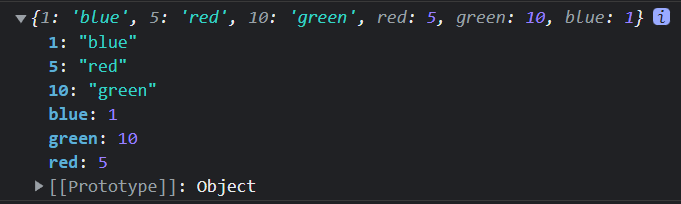
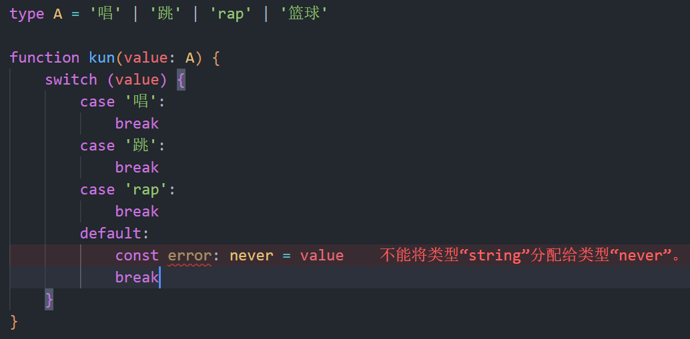

## 1. TypeScript 与 JavaScript 有什么区别？

- 规范代码
- 代码编译阶段就能及时发现错误, 说是编译, 其实就将 TypeScript 转换为 JavaScript
- 在原生js的基础上加上了一层类型定义
- 兼容性强, 兼容 js 的所有语法, 还包括更新版本的 ES6、ES7、ES8


## 2 TypeScript 工作流


扩展: ES6 编译器 Babel ( ES6 转 ES5 )


## 3. TypeScript 执行、编译

插件

```shell
npm install -g typescript
```

查看版本

```shell
tsc -v 
```

编译

```shell
tsc main.ts 
```

使用了 get set 懒人包以后, 编译版本必须是 ES5 或以上

```shell
tsc -t es5 main.ts
```

监听，一有变化就自动编译

```shell
tsc --init  // 生成 tsconfig.json
tsc -w
```

安装 ts 执行插件

```shell
npm init -y // 创建 package.json
npm i @types/node -D // 安装 ts-node 插件
ts-node index.ts // 执行 index.ts 文件
```


【扩展】

在 tsconfig.jsop 中关闭严格模式


## 4. TypeScript 基本语法

#### 变量声明

TypeScript 应尽量避免使用 `var`, 而应该去使用 `const`、`let`


#### 类型


#### 高级类型

- union 组合类型
- Nullable 可空类型
- Literal 预定义类型


#### 简单声明变量类型 (数字、布尔、字符)

```typescript
// 变量
let name: string = 'Lin'
let isMan: boolean = true
// 函数
function add(num1: number, num2: number) {
    return num1 + num2
}
```


#### 数组 (Array) 和 元组 (Tupple)

数组

```typescript
let list1: number[] = [1, 2, 3, 4] // 标准写法, 创建元素都为数字类型的数组
let list11: boolean[] = [true, false]
let list2: Array<number> = [1, 2, 3, 4] // 用泛型来定义数组中每个元素的类型
let list3 = [1, 2, 3, 4] // 不写类型直接定义也行
let list4: any[] = [1, "dss", true] // 可以存放任意类型元素的数组

// 定义对象数组使用 interface
interface X {
    name: string
    age?:number
}
let arr:X[] = [{name:'Lin'}, {name:'Jin',age:18}]

// 定义多维数组
let arr:number[][] = [[1],[2],[3]]
let arr:number[][][] = [[[1]]]
let arr:Array<Array<number>> = [[1],[2],[3]]

// 函数多类型参数定义
function a(...args:any[]) {
    console.log(arguments) // 这是一个类数组
    let a:IArguments = arguments // 可以通过 IArguments 来定义 类数组类型
    console.log(args)
}

a(1,2,3) // [1, 2, 3]
```

元组 (读音: 踏 bou)

- 元组是特殊的数组, 固定长度、固定类型的数组
- 元组有些许 bug (可以使用 push(), 增加数组长度)

```typescript
let person1: [number, string] = [1, 'Lin']
let person2 = [1, 'Lin'] // 混合类型的数组, 可以增加长度, 修改类型

// 场景 后台返回 excel 的信息, 元组可以用于描述 excel
let excel: [string, string, number][] = [
    ['Lin','女', 18],
    ['Lin','女', 18],
    ['Lin','女', 18],
]

// 读取 元组的长度
typeof arr['length'] // 2
```


#### 联合类型(Union) 与 字面量类型(Literal)

联合类型

```typescript
let union: string | number // 联合类型, 这样的声明, 只能赋值 string、number, 赋值其他类型会报错
// 函数参数联合类型声明
function merage(n1: number | string, n2: number | string) {
    if (typeof n1 === "string" || typeof n2 === "string")
        return n1.toString() + n2.toString()
    else
        return n1 + n2
}

let mergeNumber = merge(2, 5)
let mergeString = merge("hello", "world")

// 多接口联合类型
interface Pople{
  name: string,
  age: number
}

interface Man {
  sex: number
}

const xiaoman = (man:Pople & Man):void => {
  console.log(man)
}

xiaoman({
  name: 'Lin',
  age: 18,
  sex: 1
})
```

字面量类型

- 可以限制, 类型的范围

```typescript
let literal: 0 | 1 | 2 // literal 定义为数字类型, 且只有赋值为 0、1、2
let literal2: 1 | "2" | true | [1, 2, 3, 4] // literal2 限定只能是 1、“2”、true、[1, 2, 3, 4]

// 函数参数联合类型声明、与字面量类型混合使用
// 第三个参数只能是填 as-number 或 as-string
function merage(
	n1: number | string, 
    n2: number | string, 
    resultType: "as-number" | "as-string"
) {
    if (resultType === "as-string")
        return n1.toString() + n2.toString()
    if (typeof n1 === "string" || typeof n2 === "string")
        return n1.toString() + n2.toString()
    else
        return n1 + n2
}

let mergeNumber = merge(2, 5, "as-number")
let mergeNumber = merge(2, 5, "as-string")
```


#### 枚举类型(Enum)

- 枚举类型真正的数据类型是数字 (与 C++ 类似, 从 0 开始计算)

```typescript
// 枚举类型定义
enum Color {
    red,
    green,
    blue
}
// 枚举类型使用
let color = Color.blue
console.log(color) // 2
```

```typescript
// 可以自定义枚举类型顺序
enum Color2 {
    red = 5,
    green = 10,
    blue = 1
}
console.log(Color2)
```

	

```typescript
// 枚举类型的元素也可以定义为其他类型
enum Color3 {
    red = "red",
    green = "green",
    blue = 1
}
let color3 = Color3.green
console.log(color3) // green
```


**数字枚举**

使用枚举之前, 我们判断根据参数不同, 执行不同的方法

```typescript
// 之前的写法
const fn = (type: string) => {
    if (type === 'red') {
        return 0
    }
    if (type === 'green') {
        return 1
    }
    if (type === 'blue') {
        return 2
    }
}

// 升级一点的写法
let obj = {
    red: 0,
    green: 1,
    blue: 2
}

// 使用枚举
enum Color {
    red, // 0
    green, // 1
    blue // 2
}

// 增长枚举
enum ColorA {
    red = 1, // 1
    green, // 2
    blue // 3
}

// 自定义枚举
enum ColorB {
    red = 1, // 1
    green = 5, // 5
    blue = 6 // 6
}
```


**字符串枚举**

```typescript
enum ColorC {
    red = 'red',
    green = 'green',
    blue = 'blue'
}

console.log(ColorC.red); // red
console.log(ColorC.green); // green
console.log(ColorC.blue); // blue
```


**异构枚举**

```typescript
enum ColorD {
    yes = 1,
    no = 'no'
}

console.log(ColorD.yes); // 1
console.log(ColorD.no); // no
```


**const 枚举**

加 const

```typescript
// index.ts
const enum Types {
    sucess,
    fail
}

let code: number = 0
if (code === Types.sucess) {
    
}

// 编译后 index.js
var code = 0;
if (code === 0 /* Types.sucess */) {
}
```

不加 const

```typescript
// index.ts 不叫 const
enum Types {
    sucess,
    fail
}

let code: number = 0
if (code === Types.sucess) {
    
}

// 编译后 index.js, 不叫 const , Types 编译后是一个对象
var Types;
(function (Types) {
    Types[Types["sucess"] = 0] = "sucess";
    Types[Types["fail"] = 1] = "fail";
})(Types || (Types = {}));
var code = 0;
if (code === Types.sucess) {
}

```


**反向映射** (不好用, 语义不明显)

```typescript
enum Types {
    success = 456
  	// success = '456' 字符串是无法进行反射的
}

let success: number = Types.success
// let success: string = Types.success

let key = Types[success]

console.log(`value:${success}`, `key:${key}`);
```


#### 动态类型 any 类型 和 unknow 类型

any 类型

- 可以实现快速开发, 不用考虑各种约定俗成的类型定义
- 不太容易维护、阅读

```typescript
let randomValue: any = 666
randomValue = true
randomValue = "Lin"
randomValue = {}
randomValue()
randomValue.toUpperCase()
```

unknow 类型

- 不保证类型, 但是保证类型安全
- 确定变量类型以后, 才可以使用

```typescript
let randomValue: unknow = 666
randomValue = true
randomValue = "Lin"
randomValue = {}
if(typeof randomValue === 'function') {
    randomValue()
}
if(typeof randomValue === 'string') {
    randomValue.toUpperCase() 
}
```


使用场景

- 项目需要快速开发、紧急上线 可以使用 any
- 要保证安全可以选择 unknow


any 类型 与 unknown 类型的区别

```typescript
// any 类型
let a:any = 1
let b:number = 5

a = b
b = a 

// unknown 类型
let a:unknown = 1
let b:number = 5

a = b
b = a // 报错
```

unknown 类型是不能赋值给其他类型的, 而 any 类型可以赋值给其他类型


```typescript
// // unknown 类型
let xiaoming: unknown = {key:value, open:() => 123}
xiaoming.key // 报错
xiaoming.opon() // 报错
```

unknown 类型是无法读取属性的, 方法也不能调用


小结 (any、unknown 区别?)

- unknown 只能赋值给自身
- unknown 没办法读任何属性, 方法也不可以调用
- unknown 比 any 更加安全


> 当你不知道选择什么类型的时候, 优先使用 unknown 类型


#### void、undefined、never

void 可以不用回调

```typescript
// 没有任何返回的函数就是 void 类型
// 原生 javascript 没有 void 类型
function printResult() : void {
    console.log("Lin")
}
```


undefined 一定要回调

```typescript
// javascript 中有 undefind 这个类型
function printResult() : undefined {
    console.log("Lin")
    return
}
```


never 一个函数永远执行不完, 没法执行完成

- throw 抛出异常、while 循环 都可以让函数无法执行结束
- never 通常用来处理异常, 处理 promise

```typescript
function throwError(message: string, errorCode: number) : never {
    throw {
        message,
        errorCode
    }
}
throwError("not found", 404)
```

```typescript
function whileLoop() : never {
    while(true){
        console.log("haha")
    }
}

// never 类型 写在 联合类型下 会被直接忽略掉的
type A = void | number | never
```

用于兜底判断
比如 A 增加了一个类型 ( 比如 篮球 ), 而对应函数没去修改就会报错




哲学层面

undefined 表示物质不存在

void 表示存在本身就不存在


代码层面

undefined 指变量未赋值, 未初始化

void 指变量本身就不存在


日常: 能偷懒就偷懒, 实在不知道什么类型就写 any


#### 类型适配(类型断言) Type Assertions

写代码时得十分明确变量的类型, 才可以使用类型断言, 不然会引起严重的错误

```typescript
let message : any
message = "abc"
message.endsWith("c") // 无法使用, 得使用类型断言, 明确为 string类型, 才可以使用 string 相关的函数
// 两种类型断言
let abc = (<string>message).endsWidth("c") // 使用 尖括号
let abcd = (message as string).endsWidth("c") // 使用 as

// 参数定义类型, 输出需要断言
interface A {
  run: string
}

interface B {
  build: string
}

let fn = (type: A | B): void => {
  // 两种类型断言
  console.log((type as A).run);
  console.log((<A>type).run);
}

fn({
  build: "123"
})

// 临时断言
window.adc = 123 // 报错 window 上不存在 abc 这个类型
(window as any).abc = 123 // 任何类型都可以被断言成 any 类型
```


扩展

`endsWith()` 方法用来判断当前字符串是否是以另外一个给定的子字符串“结尾”

根据判断结果返回 `true` 或 `false`


#### 函数类型 (函数参数类型的声明)

**可选参数**：可以通过, `?` 来表示参数的可选性, 如果没有 `?` 就是必填参数

**默认参数**：可以与 javascript 一样的方式用 `=` 设置默认值

不顾是 **可选参数**、还是 **默认参数** 都只能末尾加

```typescript
// code 不填的话, 默认会输出 undefined
let log = (message: string, code?: number) => {
    console.log(message, code)
}
log("hello") // hello undefined

// 有返回值的定义
let add = (message: number = 10, code?: number = 10): number => {
    return message + code
}
console.log(add(1,1)) // 2
console.log(add()) // 20
console.log(add(1)) // 11

// 通过 interface 进行定义函数类型
interface User {
	name: string,
    age: number
}

// this 类型可以被定义
interface Obj {
  user: number[],
  add:(this:Obj,num:number) => void // 没有返回值 定义为 void
}

// ts 可以定义 this 的类型, 在 js 中无法使用 必须是第一个参数定义 this 的类型
let obj:Obj = {
  user: [1, 2, 3],
  add(this:Obj, num:number) {
    this.user.push(num)
  }
}

obj.add(4)

console.log(obj); // { user: [ 1, 2, 3, 4 ], add: [Function: add] }
```

```typescript
let log = (message: string, code: number = 0) => {
    console.log(message, code)
}
log("hello") // hello 0
```

函数重载

```typescript
// 用于实现 在同一个函数中, 根据参数不同执行不同功能
let user: number[] = [1, 2, 3]
function findNum(add: number[]): number[]
function findNum(id: number): number[]
function findNum(): number[]
function findNum(ids?:number | number[]): number[] {
  if (typeof ids === 'number') {
    return user.filter(v => v === ids)
  } else if (Array.isArray(ids)) {
    user.push(...ids)
    return user
  } else {
    return user
  }
}

console.log(findNum([4,5,6]));
```


#### 对象 Object

```typescript
// object 这个类型定义可写可不写, 通常不用写, 因为意义不大
const person: object = {
    firstName: "Lin",
    lastName: "刘",
    age: 18
}
console.log(person.nockname) // 访问未定义的对象属性会, 编译报错, 也编译器也会提示错误
```


#### Interface 与 Class

Interface (接口)

```typescript
// Point 接口限制了输入的参数类型
let drawPoint = (point: Point) => {
    console.log({ x: point.x, y: point.y })
}

drawPoint({ x: 105, y: 24 })
// drawPoint({ x: "Lin", y: "Jin" }) 会直接报错
// drawPoint({ wether: "干燥", temperature: "5oC" }) 会直接报错
// 定义了接口
interface Point {
    x: number
    y: number
}
```


interface 的几个特点

- interface 重名就会重合
- interface 任意 key
- interface ? readonly
- interface 接口继承
- interface 定义函数类型


```typescript
// 重名就会重合
interface Axxs {
    name: string
}

interface Axxs {
    age: numebr
}

// 等同于 
interface Axxs {
    name: string,
    age: number
}
```


```typescript
// 索引签名
// 使用场景: 后端传过来的参数太多了, 我只想要 name、age 这两个属性就可以, 那么就可以使用 索引签名, 后面的属性就不用定义类型了
interface Axxs {
    name: string
    age: number
    [propName:string]:any
}

interface Axxs {
    name: string,
    age: number,
    a: 1,
    b: 2,
    c: 3
}
```


```typescript
// 可选类型
interface Axxs {
    name: string
    age?;number
}

let a:Axxs {
    name:'lin'
    age: 88 // 这个不管有没有都不会报错
}
```


```typescript
// readonly 只读属性
// 使用场景
// 1. 一般用于函数
// 2. id 也不可以随便改
interface Axxs {
    name: string
    age: number
    readonly id: number
    readonly cb:() => boolean
}

let a: Axxs {
    id: 1,
    name: 'Lin',
    age: 88,
    cb: () => {
        console.log('233')
    }
}

a.id = 123 // 报错
a.cb = () => {
    console.log('244') // 报错
}
```


```typescript
// 接口继承
interface Axxs {
    name: string
}

interface B extends Axxs {
    age: number
}

// 等同于 Axxs 与 B 合并
interface B {
  	name: string,
    age: number
}
```


```typescript
// 函数类型定义
interface Fn {
    // (参数): 返回值
    (name:string):number[]
}

const fn:Fn = function (name:string) {
    return [1]
}
```


Class 类

```typescript
interface IPoint {
    x: number
    y: number
    drawPoint: () => void
    getDistances: (p: IPoint) => number
}

// class 类项 implements 接口 {  }
class Point implements IPoint {
    // 声明成员变量
    x: number
    y: number
    
    // 构造函数, 可以初始化值, 绑定到 this 上
    // 加上 ? 后, new 的时候就可以不传参了
	// 使用 = , 设置默认值
    constructor(x?: number, y: number = 2) {
        this.x = x
        this.y = y
    }
    
    // 实现成员方法
    drawPoint = () => {
        // 点位置
        console.log("x: ", this.x, "y: ", this.y)
    }
    getDistances = (p: IPoint) => {
        // 两点之间平方和
        return Math.pow(p.x - this.x, 2) + Math.pow(p.y - this.y, 2)
    }
}

// 创建实例
const point = new Point() // 对象Object, 也称 实例Instance
point.drawPoint()
```


扩展

JavaScript 的 构造函数 与其他语言的不同？

JavaScript 的 构造函数 不可以重载 overload, 也就是说一个类有且仅有一个 constructor

而我们给 构造函数 加上？, 或设置默认值, 就相当于变相重载构造函数了


#### Access Modifier 访问修饰符

- public 公有属性
- private 私有属性
- protected 

```typescript
interface IPoint {
    drawPoint: () => void
    getDistances: (p: IPoint) => number
    X: number
}

// class 类项 implements 接口 {  }
class Point implements IPoint {
    // 构造函数, 可以初始化值, 绑定到 this 上
    // 使用 public 等就不需要再重新 赋值给 this, typescript 会自动赋值的
    constructor(private _x_: number, private _y_: number = 2) {
        
    }
    
    // 实现成员方法
    drawPoint = () => {
        // 点位置
        console.log("x: ", this._x_, "y: ", this._y_)
    }
    getDistances = (p: IPoint) => {
        // 两点之间平方和
        return Math.pow(p.X - this._x_, 2) + Math.pow(p.Y - this._y_, 2)
    }
    // 设置内部数据
    set X(value: number) {
        if (value < 0) {
            throw new Error("value不能小于0")
        }
        this._x_ = value
    }
    // 获取内部数据
    get X() {
        return this._x_
    }
    get Y() {
        return this._y_
    }
}

// 创建实例
const point = new Point() // 对象Object, 也称 实例Instance
point.X = 10
console.log(point.X) // 10
point.drawPoint()
```


扩展

public 不一定要写, 因为默认没写的话, 就是 public 公有属性


#### Generics 泛型

泛型可以保持类型的一致性

```typescript
// 使用泛型, 将类型传入
let lastInArray = <T>(arr: Array<T>) => {
    return arr[arr.length - 1]
}
// 也可以这么写
let lastInArray = <T>(arr: <T>[]) => {
    return arr[arr.length - 1]
}

const l1 = lastInArray([1, 2, 3, 4])
const l2 = lastInArray(["a", "b", "c"])
const l3 = lastInArray<string>(["a", "b", "c"]) // 泛型可以定义输入输出的类型
const l4 = lastInArray<string | number>(["a", "b", "c"]) // 泛型可以定义输入输出的类型
```


多泛型类型

```typescript
// 常规
let makeTuple = <T, Y>(x: T, y: Y) => [x, y]
const v1 = makeTuple(1, "one")
const v2 = makeTuple<boolean, number>(true, 1) // 前面的 <boolean, number> 不写 ts 会动态匹配

// 设置默认值
let makeTuple = <T, Y = number>(x: T, y: Y) => [x, y] // 可以设置默认类型
const v2 = makeTuple<boolean>(true, 1) // 可以省略第二个泛型的定义
```


泛型的使用

```typescript
// 动态类型
function xiaoman(a: number, b: number): Array<number> {
    return [a,b]
}

function str(a: string, b: string): Array<string> {
    return [a,b]
}

// 泛型 -> 定义的时候用泛型代替, 使用的时候在去明确其类型
function xiaomans<T>(a:T, b:T):Array<T> {
    return [a,b]
}

// number
xiaomans(1, 2)
xiaomans(false, true)
xiaomans('1', '2')


// 类型别名 去定义泛型
type A<T> = string | number | T

let a:A<undefined> = undefined

// interface 用泛型定义类型
interface Data<T> {
    msg: T
}

let data: Data<number> = {
    msg: 1
}

// 函数使用 泛型, 泛型也可以使用 默认值
function add<T = number, K = number>(a: T, b: K):Array<T | K> {
    return [a,b]
}

add(1, false)

// 简单封装 axios
const axios = {
    get<T>(url:string):Promise<T> {
        return new Promise((resolve, reject) => {
            let xhr: XMLHttpRequest = new XMLHttpRequest()
            xhr.open('GET', url)
            xhr.onreadystatechange = () => {
                if (xhr.readyState === 4 && xhr.status == 200) {
                    resolve(JSON.parse(xhr.responseText))
                }
            }
            xhr.send(null)
        })
    }
}

interface Datas {
    message: string
    code: number
}

axios.get<Datas>('./data.json').then(res => {
    console.log(res);
})
```


泛型约束

```typescript
// 类型后面跟一个 extends 在跟一个约束的类型
function add<T extends number>(a: T, b: T) {
    return a + b
}

add(1, 1)

interface Len {
    length:number
}

function fn<T extends Len>(a: T) {
    a.length
}

fn('111111')
fn([1, 2, 3])

let obj = {
    name: "xiaoman",
    sex: "女"
}

// keyof 的使用, 获取 key 值作为类型
type Key = keyof typeof obj

function ob<T extends object, K extends keyof T>(obj: T, key: K) {
    return obj[key]
}

ob(obj, 'name')

// keyof 高级用法, 使用泛型将下面的 : 变成 ?:
interface Data {
    name: string,
    age: number,
    sex: string
}

// for(let key in obj)
type Options<T extends object> = {
    readonly [key in keyof T]?:T[key]
}

type B = Options<Data>
```


#### symbol 类型


#### type 关键字

type 的作用就是给类型起一个新名字

```typescript
type Second = number; // 基本类型
let timeInSecond: number = 10;
let time: Second = 10;  // time的类型其实就是number类型
type userOjb = {name:string} // 对象
type getName = ()=>string  // 函数
type data = [number,string] // 元组
type numOrFun = Second | getName  // 联合类型
```


## 5. Module 模块基本使用

```typescript
// point.ts
interface IPoint {
    drawPoint: () => void
    getDistances: (p: IPoint) => number
    X: number
    Y: number
}

// class 类项 implements 接口 {  }
export class Point implements IPoint {
    // 构造函数, 可以初始化值, 绑定到 this 上
    // 使用 public 等就不需要再重新 赋值给 this, typescript 会自动赋值的
    constructor(private _x_: number, private _y_: number) {
        
    }
    
    // 实现成员方法
    drawPoint = () => {
        // 点位置
        console.log("x: ", this._x_, "y: ", this._y_)
    }
    getDistances = (p: IPoint) => {
        // 两点之间平方和
        return Math.pow(p.X - this._x_, 2) + Math.pow(p.Y - this._y_, 2)
    }
    // 设置内部数据
    set X(value: number) {
        if (value < 0) {
            throw new Error("value不能小于0")
        }
        this._x_ = value
    }
    // 获取内部数据
    get X() {
        return this._x_
    }
    get Y() {
        return this._y_
    }
}
```

```typescript
// main.js
import { Point } from "./point"
const point = new Point(24, 50) // 对象Object, 也称 实例Instance
point.X = 10
console.log(point.X) // 10
point.drawPoint()
```


## 6. 内置对象

- emca
- dom
- bom

```typescript
// ecma 定义类型规则 就是跟 new 的对象一样就可以了
let num: Number = new Number(1)
let date: Date = new Date()
let reg: RegExp = new RegExp(/\w/)
let error: Error = new Error('错了')
let xhr: XMLHttpRequest = new XMLHttpRequest()

// dom 类型定义
let div: NodeListOf<HTMLDivElement | HTMLElement> = document.querySelectorAll('div')

// bom 定义
let local: Storage = localStorage
let lo: Location = location
let promise: Promise<string> = new Promise((r) => r('Lin'))
let cookie:string = document.cookie

promise.then(res => {
  
})
```


## 7. 类的使用

- class 的基本使用 继承 和 类型约束 implements
- class 的修饰符 readonly private protected public
  - protected 给子类和内部去使用
- super 原理
- 静态方法
- get set


### 1. class 的基本使用 继承 和 类型约束 implements

```typescript
// 虚拟 dom 的简单实现
interface Options {
  el: string | HTMLElement
}

interface VueCls {
  options: Options
  init(): void
}

interface Vnode {
  tag: string // div section haeder
  text?: string // 123
  children?: Vnode[]
}

// 虚拟 dom 简单版
class Dom {
  // 创建节点的方法
  createElement(el:string) {
    return document.createElement(el)
  }
  // 填充文本的方法
  setText(el: HTMLElement, text: string | null) {
    el.textContent = text
  }

  // 渲染函数
  protected render(data: Vnode) {
    let root = this.createElement(data.tag)
    if (data.children && Array.isArray(data.children)) {
      data.children.forEach(item => {
        let child = this.render(item)
        root.appendChild(child)
      }) 
    } else {
      this.setText(root, data.text as string)
    }
    return root
  }
}

// implements 用于约束类参数和方法的使用
class Vue extends Dom implements VueCls{
  options: Options
  //  默认参数、默认方法调用 都可以在 construcor 中初始化
  constructor(options: Options) {
    super()  
    this.options = options
    this.init()
  }
  init(): void {
    // 虚拟 dom, 就是通过 js 去渲染我们这个真实 dom
    let data: Vnode = {
      tag: "div",
      children: [
        {
          tag: "section",
          text: "first node"
        },
        {
          tag: "section",
          text: "second node"
        },
        {
          tag: "section",
          text: "third node"
        }
      ]
    }
    let app = typeof this.options.el === 'string' ? document.querySelector(this.options.el) : this.options.el
    app?.appendChild(this.render(data))
  }
}

new Vue({
  el:"#app"
})
```


### 2. super 原理

```typescript
class father {
    constructor (name: string) {
        
    }
    render() {
        
    }
}

class son {
    constructor() {
        super('Lin') // 原理 父类的 prototype.constructor.call, 意思就是说可以给父类的 constructor 传参
        super.render()  // 可以直接调用父类的方法
    }
}
```


### 3. 静态方法

```typescript
let promise = new Promise()
pormise.all()

Promise.all() // 不去 使用 new , 直接调用方法, 就是静态方法

// 使用 static 定义静态方法
class Test {
    static a: string
    static xxx () {}
    static version() {
        this.init() // 报错 静态方法的 this 只能调用 静态的属性和方法
        this.xxx() // 可以调用
        return '0.0.1'
    }
    public init() {}
}

let test = new Test()
test.version() // 报错, 使用实例是无法调用 静态方法的
Test.version() // 可以直接调用
```

### 4. get set 的使用

```typescript
class Ref {
	_value: any
    constructor(value: any) {
        this._value = value
    }
    
    get value () {
        return this._value + 'vvv'
    }
    
    set value (newVal) {
        this._value = newVal + 'Lin' 
    }
}

const ref = new Ref('哈哈哈')
console.log(ref.value) // 哈哈哈vvv

ref.value = '666'
console.log(ref.value) // 666Linvvv
```


## 8. 类型推导 和 类型别名

 **类型推导**

	

可以看到 ts 天然就推导出了 str 就是 string 类型的了


**类型别名**

```typescript
type s = string | number // 定义什么类型都可以
let str:s = 'Lin'
```


> type 与 interfacce 的区别
>
> - type 无法继承, 只能使用加上 & 的交叉类型, 而 interface 可以使用 extends 去继承
> - interface 无法使用联合类型, 其属性可以使用联合类型, type 可以直接实现 `type s = number | string`
> - type 遇见重名不会合并, 而 interface 会进行合并

```typescript
type s = number[] & B

interface A extends B {
	name: string | number
}

interface B {
  age: number
}
```

 

 **type 的高级用法**

```typescript
// extends 包含的意思
// 左边的值 会作为右边类型的子类型
type num = 1 extends never ? 1 : 0
```

	

上面的类型包含下面的类型


## 9. 索引签名

索引签名其实就是获取变量的值

```typescript
let str: string = '123'

let onj = {
    [str]: 111
}

console.log(onj); // { '123': 111 }
```


## 10. 迭代器 | 生成器 | set map

```typescript
// 1. 生成器 | 迭代器 用法一致

function* gen() {
    yield Promise.resolve('Lin') // 支持同步异步
    yield 'Lin1'
    yield 'Lin2'
    yield 'Lin3'
}

const man = gen()
console.log(man.next());
console.log(man.next());
console.log(man.next());
console.log(man.next());
console.log(man.next());

// 执行结果
// { value: Promise { 'Lin' }, done: false }
// { value: 'Lin1', done: false }
// { value: 'Lin2', done: false }
// { value: 'Lin3', done: false }
// { value: undefined, done: true }

// 2. set map
let set: Set<number> = new Set([1, 1, 2, 2, 3, 3]) // 天然去重

let map:Map<any,any> = new Map()

// Map 与 对象的区别就是 Map 的 key 可以使用引用类型
let Arr = [1, 2, 3]
map.set(Arr, 'Lin')

console.log(set); // { 1, 2, 3 }
console.log(map.get(Arr)); // Lin

// let list = document.querySelectorAll('div') // 伪数组, 这种数组一些操作数组的 API 是无法使用的, 比如 push

// 3. 迭代器, 作用在于可以遍历多种数据类型的数据
// let a = [1, 2, 3]
// console.log(a[Symbol.iterator]().next().value); // 1
const each = (value: any) => {
    let It: any = value[Symbol.iterator]()
    let next: any = { done: false }
    while (!next.done) {
        next = It.next()
        if (!next.done) {
            console.log(next.value);
        }
    }
}

each(map) // [ [ 1, 2, 3 ], 'Lin' ]
each(set) // 1 2 3
each(Arr) // 1 2 3

// 4. 迭代器的语法糖
for (let value of set) {
    console.log(value);
}
// 执行结果 1 2 3
for (let value of map) {
    console.log(value);
}
// 执行结果 [ [ 1, 2, 3 ], 'Lin' ]

// 5. for of 对象不能用, 因为对象上没有 [Symbol.iterator]() 方法
// for (let value of { name: 1 }) {
//     console.log(value);
// }

// 6. 解构、扩展运算符 底层原理也是去调用 iterator
let [a, b, c] = [4, 5, 6]
let d = [4, 5, 6]
let copy = [...d]
console.log(copy); // [ 4, 5, 6 ]
console.log(a, b, c); // 4 5 6

// 7. 实现 对象支持 for of
let obj = {
    max: 5,
    current: 0,
    [Symbol.iterator]() {
        return {
            max: this.max,
            current: this.current,
            next() {
                if(this.current === this.max) {
                    return {
                        value: undefined,
                        done: true
                    }
                } else {
                    return {
                        value: this.current++,
                        done: false
                    }
                }
            }
        }
    }
}

for (let value of obj) {
    console.log(value);
}
// 执行结果 0 1 2 3 4
let x = { ...obj }
console.log(x);
// 执行结果
// {
//   max: 5,
//   current: 0,
//   [Symbol(Symbol.iterator)]: [Function: [Symbol.iterator]]
// }
```


## 11. tsconfig.json 配置文件


## 12. namespace 命名空间

`TypeScript` 与 `ECMAScript 2015` 一样，任何包含顶级 `import` 或者 `export` 的文件都被当成一个模块。

相反地，如果一个文件不带有顶级的 `import` 或者 `export` 声明，那么它的内容被视为全局可见的 (因此对模块也是可见的)

```typescript
// index-1.ts
const a = 1

// index-2.ts
// 通过 export 形成一个模块, 变量就会被隔离
export const a = 2
```

采用 namespace 隔离文件

```typescript
// index-1.ts
namespace A {
	const a = 2
}

console.log(A.a) // 2
// index-2.ts
namespace B {
	const a = 2
}
```

嵌套命名空间

```typescript
namespace A {
	export namespace C {
    export const D = 5
  }
}

console.log(A.C.D) // 5
```

抽离命名空间

```typescript
// a.ts
export namespace V {
  export const a = 1
}

// b.ts
import { V } from './a'

console.log(V) // 1
```

简化命名空间

```typescript
// ts-node 无法运行, 转为 js node 可以运行
namespace A {
	export namespace C {
    export const D = 5
  }
}

 import AAA = A.C.D

console.log(AAA) // 5
```

命名空间的合并

```typescript
namespace A {
	export const b = 2
}

namespace A {
  export const d = 3
}

// 等价于
namespace A {
  export const b = 2
  export const d = 3
}
```


## 13. 三斜线指令

主要作用在于 将其他文件的命名空间, 引入到一个文件中

```typescript
// index1.ts
namespace A {
  export const b = 5
}

// index2.ts
namespace A {
  export const a = 1
}

// index.ts
///<reference path="index1.ts" />
///<reference path="index2.ts" />

namespace A {
    export const c = 666
}

console.log(A);

// 声明文件
///<reference types="node" />
```


## 14. 声明文件 .d.ts

使用第三方插件的时候, 必须有它的声明文件, 才会有代码的补全, 不然是会有报错的

手写 express 声明文件

```typescript
declare module 'express' {

  interface Router {
    get(path:string,cb:(req:any,res:any)=>void): void
    
  }

  interface App {
    use(path: string, router: any): void
    listen(port:number,cb?:()=>void)
  }

  interface Express {
    (): App
    Router():Router
  }
  const express: Express
  
  export default express
}

// 用于扩充全局变量, 在文件中输入 a、或者 xxxx 就会有提示
declare var a: number

// 扩充 全局方法
declare function xxxx(params:type) {
  
}

// 扩充全局类
declare class Vue {

}

// 扩充全局 枚举
declare enum C {
  a = 1
}
```


## 15. Mixins 混入

对象的混入

```typescript
// 对象的混入
interface Name {
    name: string
}

interface Age {
    age:number
}

interface Sex {
    sex: number
}

let a: Name = { name: "小曼" }
let b: Age = { age: 22 }
let c: Sex = { sex: 1 }

let obj = Object.assign(a, b, c) // obj: Name & Age & Sex
```

类的混入

```typescript
// 类的混入
class A {
    type!: Boolean
    changeType() {
        this.type = !this.type
    }
}

class B {
    name!: string
    getName(): string{
        return this.name
    }
}

class C implements A, B {
    type: boolean = false
    name: string = 'Lin'
    changeType!: () => void
    getName!:()=> string
}

function mixins(curClas:any,itemCls:any[]) {
    itemCls.forEach(item => {
        Object.getOwnPropertyNames(item.prototype).forEach(name => {
            curClas.prototype[name] = item.prototype[name]
        })
    })
}
mixins(C,[A,B])


let ccc = new C()
console.log(ccc.type); // false

ccc.changeType()

console.log(ccc.type); // true
```


## 16. 装饰器 Decorator

主要的知识点

- 类装饰器 ClassDecorator
- 属性装饰器 PropertyDecorator
- 参数装饰器 ParameterDecorator
- 方法装饰器 MethodDecorator PropertyDescriptor
- 装饰器工厂
- import 'reflect-metadata'
- axios


### 1. 类装饰器的使用

```typescript
// 类似于 面向切面编程
// 装饰器的优势在于, 在不改变原 Class, 就可以增加属性和方法
const Base: ClassDecorator = (target) => {
    console.log(target);
    target.prototype.xiaoman = 'xiaoman'
    target.prototype.fn = () => {
        console.log('I am hanhan')
    }
}

@Base
class Http {
    // .....
}

// 等价于
// Base(Http)

const http = new Http() as any

http.fn() // I am hanhan
console.log(http.xiaoman); // xiaoman
```


### 2. 装饰器工厂

```typescript
// 可以叫 函数柯里化 (装饰器工厂 或者 闭包) - 用于装饰器传参
const Base = (name:string) => {
    const fn:ClassDecorator = (target) => { 
            target.prototype.xiaoman = name
            target.prototype.fn = () => {
            console.log('I am hanhan')
        }
    }
    return fn
} 

@Base('xiao ming')
class Http {
    // .....
}

// 等价于
// Base(Http)

const http = new Http() as any

http.fn() // I am hanhan
console.log(http.xiaoman); // xiao ming
```


### 3. 方法装饰器

```typescript
import axios from "axios";

// 方法装饰器
const Get = (url:string) => {
    const fn:MethodDecorator = (target,key,descriptor:PropertyDescriptor) => {
        axios.get(url).then(res => {
            descriptor.value(res.data)
        })
    }
    return fn
}

class Http {
    @Get('https:/api.apiopen.top/api/getHaoKanVideo?page=0&size=10')
    getList(data:any) {
        console.log(data.result.list);
    }
    create() {
        
    }
}
```


### 4. 参数装饰器

```typescript
import axios from "axios";
import 'reflect-metadata'

const Get = (url:string) => {
    const fn: MethodDecorator = (target, _, descriptor: PropertyDescriptor) => {
        const key = Reflect.getMetadata('key', target)
        axios.get(url).then(res => {
            descriptor.value(key ? res.data[key] : res.data)
        })
    }
    return fn
}

// 参数装饰器
const Result = () => {
    const fn: ParameterDecorator = (target, key, index) => {
        Reflect.defineMetadata('key','result',target)
        // console.log(target,key,index); // {} getList 0
    }
    return fn
}

class Http {
    @Get('https:/api.apiopen.top/api/getHaoKanVideo?page=0&size=10')
    getList(@Result() data:any) {
        console.log(data);
    }
}
```


### 5. 属性装饰器 (用的少)

```typescript
import axios from "axios";
import 'reflect-metadata'

const Get = (url:string) => {
    const fn: MethodDecorator = (target, _, descriptor: PropertyDescriptor) => {
        const key = Reflect.getMetadata('key', target)
        axios.get(url).then(res => {
            descriptor.value(key ? res.data[key] : res.data)
        })
    }
    return fn
}

const Result = () => {
    const fn: ParameterDecorator = (target, key, index) => {
        Reflect.defineMetadata('key','result',target)
        // console.log(target,key,index); // {} getList 0
    }
    return fn
}

// 属性装饰器
const Name: PropertyDecorator = (target,key) => {
    console.log(target, key); // {} xiaoman
}

class Http {
    @Name
  	xiaoman:string
  	constructor() {
    	this.xiaoman = '小曼'
  	}
    @Get('https:/api.apiopen.top/api/getHaoKanVideo?page=0&size=10')
    getList(@Result() data:any) {
        // console.log(data);
    }
}
```


## 17. 协变、逆变、双向协变

```typescript
// 鸭子类型
// 主类型
interface A {
  name: string,
  age: number
}
// 子类型
interface B {
  name: string,
  age: number,
  sex: string
}

let a: A = {
  name: 'Lin',
  age: 33
}

let b: B = {
  name: 'Lin',
  age: 33,
  sex: '男'
}

// 协变 -> 对象(值), 多属性 覆盖 少属性
a = b

// 逆变 -> 函数, 与 斜变相反
// var a = () => alert(1)
// var b = () => alert(2)
// b = a
// b() // 1

let fna = (params: A) => {
  
}

let fnb = (params: B) => {
  
}

// 赋值 一定是安全的
fnb = fna

// TypeScript 2.0 前是可以 双向协变的, 2.0 之后就不可以了, 认为是不安全的
// 双向协变
fnb = fna
fna = fnb
```


## 18. weakMap、weakSet、set、map

```typescript
let set: Set<number> = new Set([1, 2, 3, 5, 5, 6, 8, 6]) // 天然去重, 引用类型除外

set.add(7)
set.delete(5)
set.clear()

console.log(set);

// 与 对象的区别, map 的 key 可以是引用类型
// map 可以使用 数组、对象的方法 (push、forEach、for...of...)
let obj = {name:'Lin'}
let map: Map<object, any> = new Map()

map.set(obj, 'jin')

// weakmap weakset (weak 弱项的意思, 在编程中可以理解为 弱引用, 不会计入垃圾回收策略, 也就是引用次数不会增加)
// weakmap 与 map 的区别, weakmap 的 key 只能引用类型
let obj:any = { name: 'sun' } // 1 (引用次数)
let aahph:any = obj            // 2
let weakmap:WeakMap<object,any> = new WeakMap()
weakmap.set(obj, '666')    // 2
obj = null; // 引用次数减一
// console.log(aahph); // { name: 'sun' } , 引用次数还有 1
aahph = null // 引用次数减一
// console.log(aahph); // null, 引用次数为 0

// 浏览器使用
setTimeout(() => {
  console.log(weakmap);
  console.log(weakmap.get(obj));
},500)
```

### WeakSet 和 WeakMap

Weak 在英语的意思就是弱的意思，weakSet 和 weakMap 的键都是弱引用，不会被计入垃圾回收，我们来演示一下。

首先 obj 引用了这个对象 +1，aahph也用了+1，wmap 也引用了，`但是不会 +1`，应为他是弱引用，不会计入垃圾回收，因此 obj 和 aahph 释放了该引用 weakMap 也会随着消失的

但是有个问题你会发现`浏览器控制台`能输出，值是取不到的，因为 V8 的 GC回收 是需要一定时间的，你可以延长到 500ms 看一看，并目为了避免这个问题不允许读取键值，也不允许遍历，同理 weakSet 也一样


### 小结

**Set Map 与 对象、数组的区别?**

Set、Map 可以使用 引用类型 作为 key, Set 具有天然去重, 除了引用类型


**WeakSet 和 WeakMap 与 Set、Map 的区别？**

WeakSet 和 WeakMap 的 key 只能引用类型

WeakSet 和 WeakMap (weak 弱项的意思, 在编程中可以理解为 弱引用, 不会计入垃圾回收策略, 也就是引用次数不会增加)


## 19. Partial & Pick

```typescript
type Person = {
  name: string,
  age: number,
  text: string
}

type p = Partial<Person>
// type p = {
//     name?: string | undefined;
//     age?: number | undefined;
//     text?: string | undefined;
// }


// keyof 就是把 key 都变成联合类型
// in 用于遍历 key
// Partial 原理
// type key = 'name' | 'age' | 'text'

// type Par<T> = {
//     [P in keyof T]?: T[P];
// };

type pp = Pick<Person, 'age' | 'name'>
// type pp = {
//     age: number;
//     name: string;
// }
// keyof 就是把 key 都变成联合类型
// extends 将 K 的类型约束在 type key = 'name' | 'age' | 'text' 中
// Pick 原理
type Pi<T, K extends keyof T> = {
    [P in K]: T[P];
};
```


### 小结

- Partial 的作用就是将 对象类型变成可选的
- Pick 的作用就是筛选出需要的对象


## 20. Record & Readonly

```typescript
type Person = {
  name: string,
  age: number,
  text: string
}

type man = Readonly<Person>
// Readonly 原理
// type R<T> = {
//     readonly [P in keyof T]: T[P];
// };

type woman = Record<'string',Person>
// Record 原理
// keyof any 会返回 type key = string | number | symbol

// type Re<K extends keyof any, T> = {
//     [P in K]: T;
// };

// 使用
// Record 的作用就是同时约束 key value
type K = 'A' | 'B' | 'C'

type B = Record<K, Person>

let obj: B = {
  A: {name:'Lin',age:22,text:'zheng'},
  B: {name:'Lin',age:22,text:'zheng'},
  C: {name:'Lin',age:22,text:'zheng'},
}
```


### 小结

- Record 用于同时约束 key value
- Readonly 将属性变成只读


## 21. infer

```typescript
// 定义一个类型 如果是数组类型 就返回 数组元素的类型 否则 就传入什么类型 就返回什么类型

type TYPE<T> = T extends Array<infer U> ? U : never
// 等同于下面
// type TYPE<T> = T extends Array<any> ? T[number] : T

type T = [string, number]

type uni = TYPE<boolean>


// type A = TYPE<string | number[]>

// type B = TYPE<boolean>
```


### infer 类型提取

```typescript
// infer 的妙用就是可以用来 提取、剔除 数组里面的对象元素

type Arr = ['a', 'b', 'c']

// type First<T extends any> = T extends [infer one, infer two, infer three] ?  one : []
// 使用 扩展运算符 进行优化
type First<T extends any> = T extends [infer one, ...any[]] ?  one : [] // 获取前面
type Last<T extends any> = T extends [...any[], infer one] ? one : [] // 获取后面
type pop<T extends any> = T extends [...infer Rest, unknown] ? Rest : [] // 剔除最后一个
type shift<T extends any> = T extends [unknown,...infer Rest] ?  Rest : [] // 剔除前面一个


type a = First<Arr>
type b = Last<Arr>
type c = pop<Arr>
type d = shift<Arr>
```


### infer 递归

```typescript
// 将下面数组反转 type Arrb = [4,3,2,1]
type Arr = [1, 2, 3, 4]

type ReverArr<T extends any[]> = T extends [infer First, ...infer rest] ? [...ReverArr<rest>,First] : T

type a = ReverArr<Arr>
```


## 补充

### Object、object、{} 三者的区别

**Object**

原型链的顶端就是 Object 或者 function, 也就意味着所有的原始类型最终都指向这个 Object, Object 包含了所有类型

那么在 TypeScript 中 Object 就可以等于任何一个值

```typescript
let a:object = '123'
let a1:object = 123
let a2:object = false
let a3:object = []
let a4:object = {}
let a5:object = () => 123
```


**object**

object 类似于 类型约束, 只能被引用类型赋值, 不能赋值原始类型

```typescript
let a:object = '123' // 错误 原始类型
let a1:object = 123 // 错误 原始类型
let a2:object = false // 错误 原始类型
let a3:object = []
let a4:object = {}
let a5:object = () => 123
```


**{}**

{} 类型于 new Object, 与 Object 一样可以赋值任意类型

这个类型虽然可以被赋值, 但是无法被修改

所以这个类型还是少用

```typescript
let a:{} = '123'
let a1:{} = 123
let a2:{} = []
let a3:{} = {name: 1}

// 无法修改
let a:{} = {name:1}
a.age = 2 // 报错
```


### 代码雨

```html
// index.html
<!DOCTYPE html>
<html lang="en">

<head>
  <meta charset="UTF-8">
  <meta http-equiv="X-UA-Compatible" content="IE=edge">
  <meta name="viewport" content="width=device-width, initial-scale=1.0">
  <title>Document</title>
  <style>
    * {
      padding: 0;
      margin: 0;
      overflow: hidden;
    }
  </style>
</head>

<body>
  <canvas id="canvas"></canvas>
  <script src="./index.js"></script>
</body>

</html>
```

```typescript
// index.ts
let canvas: HTMLCanvasElement = document.querySelector('canvas') as HTMLCanvasElement
let ctx:CanvasRenderingContext2D = canvas.getContext('2d') as CanvasRenderingContext2D
canvas.width = screen.availWidth
canvas.height = screen.availHeight

let str: string[] = 'LinJSs151331'.split('')
let Arr = Array(Math.ceil(canvas.width / 10)).fill(0)

const rain = () => {
  ctx.fillStyle = 'rgba(0,0,0,0.05)'
  ctx.fillRect(0, 0, canvas.width, canvas.height)
  ctx.fillStyle = '#0f0'
  Arr.forEach((item, index) => {
    ctx?.fillText(str[Math.floor(Math.random() * str.length)], index * 10, item + 10)
    Arr[index] = item > canvas.height || item > 10000 * Math.random() ? 0 : item + 10
  })
}

setInterval(rain,40)
```


