# Vue3 进阶

## Vue3 与 Vue2 的区别？

### 1. 对比

Vue2 是 Options API, Vue3 是 Composition API

最主要的区别在于 Options API 写的是比较松散, 而 Compostion API 是比较集中的


### 2. Vue3 的新特性

#### 综述

1. 重写双向数据绑定

2. VDOM 性能瓶颈

3. Fragments

4. Tee-shaking 的支持

5. Composition API


#### 1. 重写双向数据绑定

- Vue2 中是使用 Object.defineProperty 进行双向数据绑定的, 通过 get、set 去做数据劫持结合发布订阅方式来实现数据的响应式; 其中它操作数据的方式是, 将数组的一些操作方式 (push、pop、splice等) 进行了重写
- 而 Vue3 是通过 Proxy 做代理, 去劫持数据。实现的过程是在目标对象之前设置了一层“拦截”，外界对该对象的访问，都必须先通过这层拦截，因此提供了一种机制，可以对外界的访问进行过滤和改写


为什么 Vu3 要把 Object.defineProperty 换成 Proxy ？

proxy 解决了 Vue2 无法 解决无法监听对象新增属性或删除属性的响应式问题、解决无法监听数组长度和index变化问题, 无法通过下标修改数组元素的问题


#### 2. Vue3 优化 DOM

对动态节点打一个静态标记, 然后再 diff 算法执行的时候就不会去做全量的对比, 只会对有静态标记的进行对比, 因此 VDOM 的性能得到了优化


#### 3. Fragments

Vue2 中 `<template>` 只能写一个 父节点 将所有 子节点 包起来

```vue
<template>
	<div>
        <div></div>
        <div></div>
        <div></div>
    </div>
</template>
```

Vue3 中 `<template>` 可以写多个 父节点

```vue
<template>
    <div></div>
    <div></div>
    <div></div>
    <div></div>
</template>
```


#### 4. Tree-shaking 的支持

Vue3 中像 `watch、computer` API 可以通过 `import` 引入, 而我们不需要用的时候就不会打到我们的包里面

而 Vue2 就没办法


#### 5. Composition API

使用 Setup 语法糖式编程


## setup 语法糖

### 组件的使用

直接引入, 直接使用即可, 无需在 `components` 中注册

```vue
<template>
	<HelloWorld></HelloWorld>
</template>

<script setup lang='ts'>
	import HelloWorld from './components/HelloWorld.vue'
</script>

<style></style>
```


### Tree-shaking 支持

因为有较好的 Tree-shaking 支持, 像 生命周期钩子、监听函数、响应式数据定义, 都可以通过组件的方式引入


## Ref 全家桶

### ref

接受一个内部值并返回一个[响应式](https://so.csdn.net/so/search?q=响应式&spm=1001.2101.3001.7020)且可变的 ref 对象。ref 对象仅有一个 `.value` property，指向该内部值


案例

我们这样操作是无法改变 message 的值 应为 message 不是响应式的无法被 vue 跟踪要改成 ref

```vue
<template>
  <div>
    <button @click="changeMsg">change</button>
    <div>{{ message }}</div>
  </div>
</template>
 
 
 
<script setup lang="ts">
let message: string = "我是message"
 
const changeMsg = () => {
   message = "change msg"
}
</script>
 
 
<style>
</style>
```


### isRef

判断是不是一个ref对象

```typescript
import { ref, Ref,isRef } from 'vue'
let message: Ref<string | number> = ref("我是message")
let notRef:number = 123
const changeMsg = () => {
  message.value = "change msg"
  console.log(isRef(message)); //true
  console.log(isRef(notRef)); //false
}
```


### shallowRef

创建一个跟踪自身 `.value` 变化的 ref，但不会使其值也变成响应式的

也就是说, shallowRef 只能跟踪到 `.value` 这一层的响应式, 再下一层开始就无法更新了


例子

修改其属性是非响应式的这样是不会改变的

```typescript
<template>
  <div>
    <button @click="changeMsg">change</button>
    <div>{{ message }}</div>
  </div>
</template>
 
<script setup lang="ts">
import { Ref, shallowRef } from 'vue'
type Obj = {
  name: string
}
let message: Ref<Obj> = shallowRef({
  name: "小满"
})
 
const changeMsg = () => {
  // message.value.name = '大满' // 这个是无法响应的, 只能到 .value 赋值
  message.value = {
    name: '大满'
  }
}
</script>

<style>
</style>
```


### ref 与 shallowRef 的区别？

- ref 深层次的响应式
- shallowRef 是浅层次的响应式, 只能到 `.value` 赋值


[注意]

ref 与 shallowRef 是不能写一起的, ref 更新的话, shallowRef 也会一起更新 


### triggerRef

强制更新页面DOM

这样也是可以改变值的

```vue
<template>
  <div>
    <button @click="changeMsg">change</button>
    <div>{{ message }}</div>
  </div>
</template>

<script setup lang="ts">
import { Ref, shallowRef,triggerRef } from 'vue'
type Obj = {
  name: string
}
let message: Ref<Obj> = shallowRef({
  name: "小满"
})
 
const changeMsg = () => {
  message.value.name = '大满'
 triggerRef(message)
}
</script> 
 
<style>
</style>
```


### customRef

自定义ref 

customRef 是个工厂函数要求我们返回一个对象 并且实现 get 和 set 适合去做防抖之类的

```vue
<template>
  <div ref="div">小满Ref</div>
  <hr />
  <div>
    {{ obj }}
  </div>
  <hr />
  <button @click="change">修改 customRef</button>
</template>

<script setup lang="ts">
import { customRef } from "vue";

function MyRef<T>(value: T) {
  let timer: any;
  return customRef((track, trigger) => {
    return {
      get() {
        track();
        return value;
      },
      set(newVal) {
        clearTimeout(timer);
        timer = setTimeout(() => {
          console.log("触发了");
          value = newVal;
          timer = null;
          trigger();
        }, 500);
      },
    };
  });
}

const obj = MyRef<string>("customRef: 小满");

const change = () => {
  obj.value = "custome 修改了";
};
</script>

<style scoped></style>
```


### 获取 dom 元素

```vue
<template>
  <div ref="div">小满Ref</div>
  <button @click="change">修改 customRef</button>
</template>

<script setup lang="ts">
import { ref } from "vue";
const div = ref<HTMLDivElement>();

const change = () => {
  console.log(div.value?.innerHTML);
};
</script>

<style scoped></style>
```


## Reactive 全家桶

### reactive

用来绑定复杂的数据类型, 例如 对象 数组

reactive 源码约束了我们的类型

reactive 不能绑定普通的数据类型, 会报错

```typescript
import { reactive } from 'vue'

let person = reactive('sad')
```


如果你用 ref 去绑定对象或者 数组等复杂的数据类型, 我们看源码里面其实也是可以去调用 reactive

使用 reactive 去修改无需使用 .value

reactive 基本用法

```typescript
import { reactive } from 'vue'
let person = reactive({
  name: 'Lin'
})
person.name = 'Jin'
```


数组异步赋值问题

这样赋值页面是不会变化的因为会脱离 **响应式**

```typescript
let person = reactive<number[]>([])
setTimeout(() => {
  person = [1, 2, 3]
  console.log(person);
  
},1000)
```


方案1 (使用 push)

```typescript
import { reactive } from 'vue'
let person = reactive<number[]>([])
setTimeout(() => {
  const arr = [1, 2, 3]
  person.push(...arr)
  console.log(person);
  
},1000)
```


方案2 (包裹一层对象)

```typescript
type Person = {
  list?:Array<number>
}
let person = reactive<Person>({
   list:[]
})
setTimeout(() => {
  const arr = [1, 2, 3]
  person.list = arr;
  console.log(person);
  
},1000)
```


### readonly

拷贝一份proxy对象将其设置为只读

```typescript
import { reactive ,readonly} from 'vue'
const person = reactive({count:1})
const copy = readonly(person)
 
 //person.count++
 copy.count++
```


### shallowReactive

只能对浅层的数据 如果是深层的数据只会改变值 不会改变视图

如果, 你对 浅层、深层数据一起改的话, 就都会改变视图

案例

```vue
<template>
  <div>
    <div>{{ state }}</div>
    <button @click="change1">test1</button>
    <button @click="change2">test2</button>
    <button @click="change3">test3</button>
  </div>
</template>

<script setup lang="ts">
import { shallowReactive } from "vue";

const obj = {
  a: 1,
  first: {
    b: 2,
    second: {
      c: 3,
    },
  },
};

const state = shallowReactive(obj);

function change1() {
  state.a = 7;
}
function change2() {
  state.first.b = 8;
  state.first.second.c = 9;
  console.log(state);
}

function change3() {
  state.a = 7;
  state.first.b = 8;
  state.first.second.c = 9;
  console.log(state);
}
</script>

<style></style>
```


## 计算属性的使用

### 函数形式

```javascript
import { computed, reactive, ref } from 'vue'
let price = ref(0)//$0
// 直接使用函数
let m = computed<string>(()=>{
   return `$` + price.value
})
 
price.value = 500
```


### 对象形式

```javascript
<template>
   <div>{{ mul }}</div>
   <div @click="mul = 100">click</div>
</template>
 
<script setup lang="ts">
  
import { computed, ref } from 'vue'

let price = ref<number | string>(1)//$0
// 直接导入即可
let mul = computed({
   get: () => {
      return price.value
   },
   set: (value) => {
      price.value = 'set' + value
   }
})

</script>
 
<style>
</style>
```


## watch 监听器

watch 需要侦听特定的数据源，并在单独的回调函数中执行副作用

watch第一个参数监听源

watch第二个参数回调函数cb（newVal,oldVal）

watch第三个参数一个options配置项是一个对象{

immediate:true //是否立即调用一次

deep:true //是否开启深度监听


### 监听 Ref 案例

```javascript
import { ref, watch } from 'vue'
 
let message = ref({
    nav:{
        bar:{
            name:""
        }
    }
})

watch(message, (newVal, oldVal) => {
    console.log('新的值----', newVal);
    console.log('旧的值----', oldVal);
},{
    immediate:true,
    deep:true
})
```


### 监听多个 ref 注意变成数组啦

```javascript
import { ref, watch ,reactive} from 'vue'
 
let message = ref('')
let message2 = ref('')
 
watch([message,message2], (newVal, oldVal) => {
    console.log('新的值----', newVal);
    console.log('旧的值----', oldVal);
})
```


### 监听 Reactive

使用 reactive 监听深层对象开启和不开启 deep 效果一样

```javascript
import { ref, watch ,reactive} from 'vue'
 
let message = reactive({
    nav:{
        bar:{
            name:""
        }
    }
})
 
watch(message, (newVal, oldVal) => {
    console.log('新的值----', newVal);
    console.log('旧的值----', oldVal);
})
```


### 监听 reactive 单一值

```typescript
import { ref, watch ,reactive} from 'vue'
 
let message = reactive({
    name:"",
    name2:""
})

watch(()=>message.name, (newVal, oldVal) => {
    console.log('新的值----', newVal);
    console.log('旧的值----', oldVal);
})
```


### 监听 reactive 多个值

```typescript
<template>
  <div>
    <div>{{ message.name }}</div>
    <div>{{ message.name2 }}</div>
    <button @click="change1">test1</button>
    <button @click="change2">test2</button>
  </div>
</template>

<script setup lang="ts">
import { watch, reactive } from "vue";

let message = reactive({
  name: "555",
  name2: "444",
});

watch([() => message.name, () => message.name2], (newVal, oldVal) => {
  console.log("新的值----", newVal);
  console.log("旧的值----", oldVal);
});

function change1() {
  message.name = "666";
}

function change2() {
  message.name = "333";
}
</script>

<style></style>
```


[注意] 监听 reactive 数据源使用提醒

1. 可以直接侦听响应式对象，会隐式地转换成深度监听
2. 不可以直接侦听响应式对象的属性值，只能通过返回该属性的 getter 函数


## watchEffect 高级监听器

### watchEffect

立即执行传入的一个函数，同时[响应式](https://so.csdn.net/so/search?q=响应式&spm=1001.2101.3001.7020)追踪其依赖，并在其依赖变更时重新运行该函数。

如果用到 message 就只会监听 message 就是用到几个监听几个 而且是非惰性 会默认调用一次

watchEffect 其中一个监听数据变化, 整个 watchEffect 中的函数都会执行

```typescript
let message = ref<string>('')
let message2 = ref<string>('')
 watchEffect(() => {
    //console.log('message', message.value);
    console.log('message2', message2.value);
})
```


### 清除副作用

就是在触发监听之前会调用一个函数可以处理你的逻辑例如[防抖](https://so.csdn.net/so/search?q=防抖&spm=1001.2101.3001.7020)

oninvalidate 会比 打印 message、message2 先执行

```typescript
import { watchEffect, ref } from 'vue'
let message = ref<string>('')
let message2 = ref<string>('')
 watchEffect((oninvalidate) => {
    console.log('message', message.value);
    oninvalidate(()=>{
        console.log('before')
    })
    console.log('message2', message2.value);
})
```


### 停止跟踪 watchEffect 

停止后会返回一个函数 调用之后将停止更新

也就是说, 在一开始默认调用一次后, 就不会再监听了

```typescript
const stop = watchEffect((oninvalidate) => {
  console.log("message", message.value);
  
  oninvalidate(() => {
    console.log("before");
  });
  
  console.log("message2", message2.value);
});

stop();
```


### onTrigger 调试 watchEffect

```typescript
<template>
  <div>
    <input v-model="message" type="text" />
    <button @click="stopWatch">停止监听</button>
  </div>
</template>

<script setup lang="ts">
import { ref, watchEffect } from "vue";

let message = ref<string>("222");

const stop = watchEffect(
  (oninvalidate) => {
    console.log("message", message.value);
    oninvalidate(() => {
      console.log("before");
    });
  },
  {
    flush: "post", // DOM 加载完成
    onTrigger(e) {
      debugger;
    },
  }
);

const stopWatch = () => stop();
</script>

<style></style>
```


## 生命周期

### 什么是 Vue 的生命周期

Vue 的生命周期就是 vue 实例从创建到销毁的全过程，也就是 new Vue() 开始就是 vue 生命周期的开始

创建 -> 挂载 -> 更新 -> 销毁


### Vue2、Vue3 生命周期钩子的区别

为了方便我们在不同生命周期去执行对应的方法, Vue 提供了对应生命周期的钩子函数

比如, 我们在 创建阶段的对应钩子函数就是 created, 那么我们在 created 这个函数中执行的方法, 都会在创建阶段执行


**调试时使用的钩子函数**

onRenderTracked() 当组件渲染过程中追踪到响应式依赖时调用 (调用一次)

onRenderTriggered() 当响应式依赖的变更触发了组件渲染时调用 (改变就调用)


**Vue3 选项式 API 名称的改动**

destroy 改为 unmounted

beforeDestroy 改为 beforeUnmounted


**setup() 优先于 beforeCreate 执行**


**选项式 API 的生命周期, 及钩子函数 (钩子函数就是在 生命周期前面 加上 `on` 而已)**

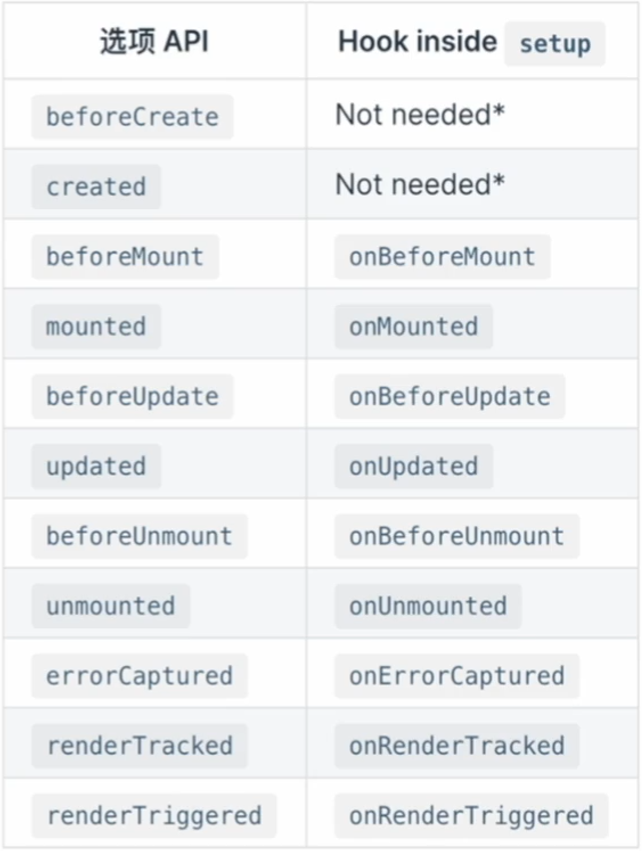		


## 全局函数和全局变量

### globalProperties

由于[Vue3](https://so.csdn.net/so/search?q=Vue3&spm=1001.2101.3001.7020) 没有Prototype 属性 使用 app.config.globalProperties 代替 然后去定义变量和函数


Vue2

```javascript
// 之前 (Vue 2.x)
Vue.prototype.$env = 'env'
```


Vue3

```javascript
// 之后 (Vue 3.x)
const app = createApp({})
app.config.globalProperties.$env = 'env'
// 过滤器
app.config.globalProperties.$filters = {
  format<T> (str:T) {
    return `Lin-${str}`
  }
}

// 声明文件 不然TS无法正确类型 推导
type Filter = {
    format<T>(str: T): string
}
 
// 声明要扩充 @vue/runtime-core包 的声明
// 这里扩充 "ComponentCustomProperties" 接口, 因为他是 vue3 中实例的属性的类型
declare module 'vue' {
    export interface ComponentCustomProperties {
        $filters: Filter,
        $env: string
    }
}
```

```vue
<!-- 其他文件中使用 -->
<template>
	<div>{{ $en }}</div>
	<div>{{ $filters.format('Jin') }}</div>
</template>
<script>
import { getCurrentInstance } from 'vue'
  
const app = getCurrentInstance() // 这个 app 名称可以随便定义
console.log(app?.proxy?.$filters.format('ts'))
  
// 也可以这样用  
const { proxy } = getCurrentInstance()
console.log(proxy?.$filters.format('ts'))
</script>
```


##  less 与 scoped

### less 的安装

```shell
npm install less less-loader
```


[注意] 不会 less 语法的话, 直接通过 [Less.js 中文文档](https://less.bootcss.com/#概览) 快速学一下即可, 3个小时左右就能学完了


### scoped

让组件样式私有化, 当前 style 只属于当前组件 (一个 .vue 文件相当于一个组件)

```vue
<style scoped></style>
```


父组件样式修改子组件, 我们就需要用到 [::v-deep >>> /deep/ 样式穿透](https://blog.csdn.net/qq_39410252/article/details/124243159)


[注意]

为了避免, 引入第三方样式时, 影响原组件样式, 不要使用 `@import ` 的方式引入

```vue
<!-- @import 是错误的方式 -->
<style scoped>
@import './antd.css'
</style>

<!-- 使用 src 引入 -->
<script src='./antd.css' scoped></script>
```


## 组件间的传值

### 父子组件通讯

父组件通过 [v-bind](https://so.csdn.net/so/search?q=v-bind&spm=1001.2101.3001.7020) 绑定一个数据，然后子组件通过 defineProps 接受传过来的值，

如以下代码

给 Menu 组件 传递了一个 title 字符串类型是不需要 v-bind

```vue
<template>
    <div class="layout">
        <Menu  title="我是标题"></Menu>
        <div class="layout-right">
            <Header></Header>
            <Content></Content>
        </div>
    </div>
</template>
```


传递非字符串类型需要加v-bind 简写 冒号

```vue
<template>
    <div class="layout">
        <Menu v-bind:data="data"  title="我是标题"></Menu>
        <div class="layout-right">
            <Header></Header>
            <Content></Content>
        </div>
    </div>
</template>
 
<script setup lang="ts">
import Menu from './Menu/index.vue'
import Header from './Header/index.vue'
import Content from './Content/index.vue'
import { reactive } from 'vue';
 
const data = reactive<number[]>([1, 2, 3])
</script>
```


子组件接受值

通过 [defineProps](https://so.csdn.net/so/search?q=defineProps&spm=1001.2101.3001.7020) 来接受 **defineProps是无须引入的直接使用即可**

如果我们使用的TypeScript

可以使用传递 [字面量](https://so.csdn.net/so/search?q=字面量&spm=1001.2101.3001.7020) 类型的纯类型语法做为参数

如 这是 TS 特有的

```vue
<template>
  <div class="menu">
    菜单区域 {{ title }}
    <div>{{ data }}</div>
  </div>
</template>

<script setup lang="ts">
defineProps<{
  title: string;
  data: number[];
}>();
</script>

<style></style>
```


如果你使用的不是TS

```javascript
defineProps({
    title:{
        default:"",
        type:string
    },
    data:Array
})
```


TS 特有的默认值方式

withDefaults 是个函数也是无须引入开箱即用接受一个 props 函数第二个参数是一个对象设置默认值

```typescript
type Props = {
    title?: string,
    data?: number[]
}
withDefaults(defineProps<Props>(), {
    title: "张三",
    data: () => [1, 2, 3]
})
```


子组件给父组件传参

是通过 defineEmits 派发一个事件

```vue
<template>
    <div class="menu">
        <button @click="clickTap">派发给父组件</button>
    </div>
</template>
 
<script setup lang="ts">
import { reactive } from 'vue'
const list = reactive<number[]>([4, 5, 6])
 
const emit = defineEmits(['on-click'])
 
//如果用了ts可以这样两种方式
// const emit = defineEmits<{
//     (e: "on-click", name: string): void
// }>()
const clickTap = () => {
    emit('on-click', list)
}
 
</script>
```


我们在子组件绑定了一个 click 事件 然后通过 defineEmits 注册了一个自定义事件

点击 click 触发 emit 去调用我们注册的事件 然后传递参数

父组件接受子组件的事件

```vue
<template>
    <div class="layout">
        <Menu @on-click="getList"></Menu>
        <div class="layout-right">
            <Header></Header>
            <Content></Content>
        </div>
    </div>
</template>
 
<script setup lang="ts">
import Menu from './Menu/index.vue'
import Header from './Header/index.vue'
import Content from './Content/index.vue'
import { reactive } from 'vue';
 
const data = reactive<number[]>([1, 2, 3])
 
const getList = (list: number[]) => {
    console.log(list,'父组件接受子组件');
}
</script>
```


我们从 Menu 组件接受子组件派发的事件 on-click 后面是我们自己定义的函数名称 getList

会把参数返回过来


子组件暴露给父组件内部属性

通过 defineExpose

我们从父组件获取子组件实例通过 ref

```vue
<Menu ref="refMenu"></Menu>
//这样获取是有代码提示的
<script setup lang="ts">
import MenuCom from '../xxxxxxx.vue'
//注意这儿的typeof里面放的是组件名字(MenuCom)不是ref的名字 ref的名字对应开头的变量名(refMenu)
const refMenu = ref<InstanceType<typeof MenuCom>>()
console.log(refMenu.value?.list)
refMenu.value?.log
</script>
```


然后打印 menus.value 发现没有任何属性

这时候父组件想要读到子组件的属性可以通过 defineExpose 暴露

```typescript
const list = reactive<number[]>([4, 5, 6])
const log = () => {
  console.log('666')
}
 
defineExpose({
    list,
  	log
})
```

这样父组件就可以读到了


**小结**

**父 获取 子 (属性方法)**

父 ref定义, ref定义的名称.value 、子 definExpose


**子 获取 父 (属性方法)**

父 v-bind 、子 defineProps (属性)

父 @自定义事件名称绑定事件 、子 defineEmits 注册事件 (方法, 也可传递参数)


### 兄弟组件通讯

1. 借助父组件传参数

例如父组件为App 子组件为A 和 B他两个是同级的

```vue
<template>
    <div>
        <A @on-click="getFalg"></A>
        <B :flag="Flag"></B>
    </div>
</template>
    
<script setup lang='ts'>
import A from './components/A.vue'
import B from './components/B.vue'
import { ref } from 'vue'
let Flag = ref<boolean>(false)
const getFalg = (flag: boolean) => {
   Flag.value = flag;
}
</script>
    
<style></style>
```

A 组件派发事件通过 App.vue 接受A组件派发的事件然后在 defineProps 传给 B组件 也是可以实现的

缺点就是比较麻烦 ，无法直接通信，只能充当桥梁


2. Event Bus 事件总线 (Vue3 废弃了)

我们在 [Vue2](https://so.csdn.net/so/search?q=Vue2&spm=1001.2101.3001.7020) 可以使用 $emit 传递 $on 监听 emit传递过来的事件

这个原理其实是运用了[JS设计模式](https://so.csdn.net/so/search?q=JS设计模式&spm=1001.2101.3001.7020) 之发布订阅模式

```typescript
type BusClass<T> = {
    emit: (name: T) => void
    on: (name: T, callback: Function) => void
}

type BusParams = string | number | symbol 

type List = {
    [key: BusParams]: Array<Function>
}

class Bus<T extends BusParams> implements BusClass<T> {
    list: List
    constructor() {
        this.list = {}
    }
    emit(name: T, ...args: Array<any>) {
        let eventName: Array<Function> = this.list[name]
        eventName.forEach(ev => {
            ev.apply(this, args)
        })
    }
    on(name: T, callback: Function) {
        let fn: Array<Function> = this.list[name] || [];
        fn.push(callback)
        this.list[name] = fn
    }
}
 
export default new Bus<number>()
```

然后到 Vue config 全局就可以使用啦

```typescript
// main.ts 全局入口
import { createApp } from 'vue'
import './style.css'
import App from './App.vue'
import Bus from '../Bus'

const app = createApp(App)
app.config.globalProperties.$Bus = Bus
app.mount('#app')

// 全局调用
import { getCurrentInstance } from "vue";
const { proxy }: any = getCurrentInstance();
// 监听
proxy.$Bus.on("on-click", (flage: string) => {
  console.log(flage)
});
// 注册
const changeInfo = () => {
  proxy.$Bus.emit("on-click", "777");
};
```

> [扩展] mitt(官方插件) 是 eventbus 插件


也可以在每个组件中引入使用, 类似于 vuex

A 页面

```vue
<script setup lang="ts">
import Bus from '../Bus'
const emitB = () => {
  Bus.emit('on-click',flage)
}
</script>
```

B 页面

```vue
<template>
	<div class="B">
    {{ Flag }}
  </div>
</template>

<script setup lang="ts">
import Bus from '../Bus'
import { ref } from 'vue'
let Flag = ref(false)
Bus.on('on-click', (flage:boolean) => {
  Flag.value = flag
})  

</script>
```


> 实际开发中, 我们可以直接使用第三方库 Mitt
>
> [Mitt 的安装与使用](https://xiaoman.blog.csdn.net/article/details/125453908)


### 多层嵌套组件通讯

依赖注入 Provide / Inject

通常，当我们需要从父组件向子组件传递数据时，我们使用 props。想象一下这样的结构：有一些深度嵌套的组件，而深层的子组件只需要父组件的部分内容。在这种情况下，如果仍然将 prop 沿着组件链逐级传递下去，可能会很麻烦


官网的解释很让人疑惑，那我翻译下这几句话：

provide 可以在祖先组件中指定我们想要提供给后代组件的数据或方法，而在任何后代组件中，我们都可以使用 inject 来接收 provide 提供的数据或方法。


父组件传递数据

```vue
<template>
    <div class="App">
        <button>我是App</button>
        <A></A>
    </div>
</template>
    
<script setup lang='ts'>
import { provide, ref } from 'vue'
import A from './components/A.vue'
let flag = ref<number>(1)
provide('flag', flag)
</script>
    
<style>
.App {
    background: blue;
    color: #fff;
}
</style>
```


子组件接受

```vue
<template>
    <div style="background-color: green;">
        我是B
        <button @click="change">change falg</button>
        <div>{{ flag }}</div>
    </div>
</template>
    
<script setup lang='ts'>
import { inject, Ref, ref } from 'vue'
 
const flag = inject<Ref<number>>('flag', ref(1))
const change = () => {
    flag.value = 2
}
</script>
    
<style></style>
```


[注意] TIPS 你如果传递普通的值 是不具有响应式的 需要通过 ref reactive 添加响应式


使用场景

当父组件有很多数据需要分发给其子组件的时候，就可以使用 provide 和 inject


### 瀑布流

用 ts 实现瀑布流, 原理就是将

父组件

```vue
<template>
  <waterFallVue :list="list"></waterFallVue>
</template>

<script setup lang="ts">
import waterFallVue from "./components/Menu/index.vue";
const list = [
  {
    height: 300,
    background: "red",
  },
  {
    height: 400,
    background: "pink",
  },
  {
    height: 500,
    background: "blue",
  },
  {
    height: 200,
    background: "green",
  },
  {
    height: 300,
    background: "gray",
  },
  {
    height: 400,
    background: "#CC00FF",
  },
  {
    height: 200,
    background: "black",
  },
  {
    height: 100,
    background: "#996666",
  },
  {
    height: 500,
    background: "skyblue",
  },
  {
    height: 300,
    background: "#993366",
  },
  {
    height: 100,
    background: "#33FF33",
  },
  {
    height: 400,
    background: "skyblue",
  },
  {
    height: 200,
    background: "#6633CC",
  },
  {
    height: 300,
    background: "#666699",
  },
  {
    height: 300,
    background: "#66CCFF",
  },
  {
    height: 300,
    background: "skyblue",
  },
  {
    height: 200,
    background: "#CC3366",
  },
  {
    height: 200,
    background: "#CC9966",
  },
  {
    height: 200,
    background: "#FF00FF",
  },
  {
    height: 500,
    background: "#990000",
  },
  {
    height: 400,
    background: "red",
  },
  {
    height: 100,
    background: "#999966",
  },
  {
    height: 200,
    background: "#CCCC66",
  },
  {
    height: 300,
    background: "#FF33FF",
  },
  {
    height: 400,
    background: "#FFFF66",
  },
  {
    height: 200,
    background: "red",
  },
  {
    height: 100,
    background: "skyblue",
  },
  {
    height: 200,
    background: "#33CC00",
  },
  {
    height: 300,
    background: "#330033",
  },
  {
    height: 100,
    background: "#0066CC",
  },
  {
    height: 200,
    background: "skyblue",
  },
  {
    height: 100,
    background: "#006666",
  },
  {
    height: 200,
    background: "yellow",
  },
  {
    height: 300,
    background: "yellow",
  },
  {
    height: 100,
    background: "#33CCFF",
  },
  {
    height: 400,
    background: "yellow",
  },
  {
    height: 400,
    background: "yellow",
  },
  {
    height: 200,
    background: "#33FF00",
  },
  {
    height: 300,
    background: "yellow",
  },
  {
    height: 100,
    background: "green",
  },
];
</script>

<style lang="less">
#app,
html,
body {
  width: 100vw;
  height: 100%;
}

* {
  padding: 0;
  margin: 0;
}
</style>
```


子组件

```vue
<template>
  <div class="wraps">
    <div
      :style="{
        height: item.height + 'px',
        background: item.background,
        top: item.top + 'px',
        left: item.left + 'px',
      }"
      v-for="item in waterList"
      class="items"
    ></div>
  </div>
</template>

<script setup lang="ts">
import { reactive, onMounted } from "vue";

const props = defineProps<{
  list: any[];
}>();

const waterList = reactive<any[]>([]);
const heightList: number[] = [];
const init = () => {
  const width = 130;
  const x = document.body.clientWidth;
  const column = Math.floor(x / width);

  for (let i = 0; i < props.list.length; i++) {
    if (i < column) {
      props.list[i].left = i * width;
      props.list[i].top = 20;
      waterList.push(props.list[i]);
      heightList.push(props.list[i].height);
    } else {
      let current = heightList[0];
      let index = 0;
      heightList.forEach((h, i) => {
        if (current > h) {
          current = h;
          index = i;
        }
      });
      props.list[i].top = current + 20;
      props.list[i].left = index * width;
      heightList[index] = heightList[index] + props.list[i].height + 20;
      waterList.push(props.list[i]);
    }
  }
};

onMounted(() => {
  init();
});
</script>

<style scoped lang="less">
.wraps {
  height: 100%;
  .items {
    position: absolute;
    width: 120px;
  }
}
</style>
```


## 自定义 指令

### directive

Vue中有 v-if、v-for、v-bind、v-show、v-model 等等一系列方便快捷的指令

也提供 directive-自定义指令（属于破坏性更新）


### Vue3 指令的钩子函数

- **created** 元素初始化的时候
- **beforeMount** 指令绑定到元素后调用 只调用一次
- **mounted** 元素插入父级 DOM 调用
- **beforeUpdate** 元素被更新之前调用
- **update** 这个周期方法被移除 改用 **updated**
- **beforeUnmount** 在元素被移除前调用
- **unmounted** 指令被移除后调用 只调用一次


### 在 setup 内定义局部指令


```vue
<!-- A.vue -->
<template>
  <div class="A">A组件</div>
</template>

<script setup lang="ts">
import { ref, reactive } from "vue";
</script>

<style scoped lang="less">
.A {
  width: 200px;
  height: 200px;
  border: 1px solid #ccc;
}
</style>
```


但这里有一个需要注意的限制：必须以 `vNameOfDirective` 的形式来命名本地自定义指令

以使得它们可以直接在模板中使用

```vue
<template>
  <div>
    <button @click="flag = !flag">切换</button>
    <A v-move:aaa.jin="{ background: 'red', flag: flag }"></A>
  </div>
</template>

<script setup lang="ts">
import A from "./components/A.vue";
import { ref, Directive, DirectiveBinding } from "vue";

let flag = ref<boolean>(true);

type Dir = {
  background: string;
};

const vMove: Directive = {
  // 一般只使用到 mounted、updated、unmounted
  created: () => {
    console.log("created====>");
  },
  beforeMount(...args: Array<any>) {
    // 在元素上做些操作
    console.log(args);
    console.log("beforeMount=======>");
  },
  mounted(el: HTMLElement, dir: DirectiveBinding<Dir>) {
    el.style.background = dir.value.background;
    console.log("mounted========>");
  },
  beforeUpdate() {
    console.log("beforeUpdate");
  },
  updated() {
    console.log("updated");
  },
  beforeUnmount(...args: Array<any>) {
    console.log(args);
    console.log("======>beforeUnmount");
  },
  unmounted(...args: Array<any>) {
    console.log(args);
    console.log("======>unmounted");
  },
};
</script>
<style scoped lang="less"></style>
```


我们可以通过 组件生命周期钩子, args 获取到传进来 background、flag 等数据

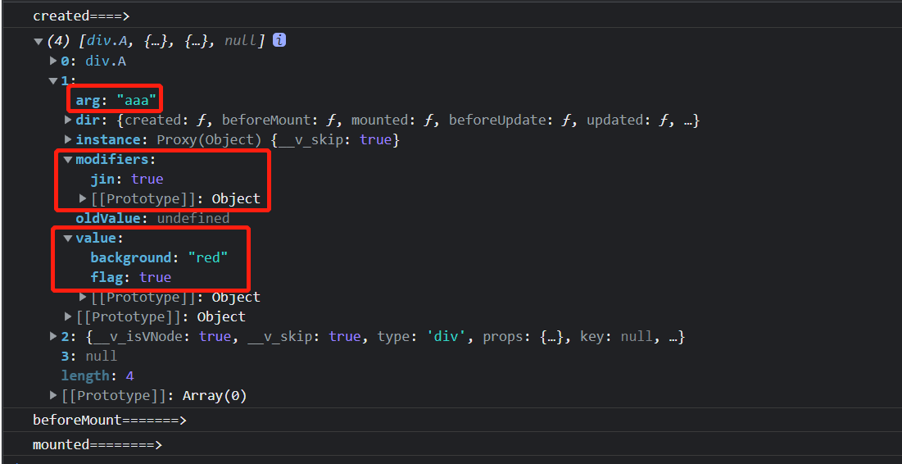


### 生命周期钩子参数详解

第一个 el  当前绑定的DOM 元素


第二个 binding

- instance：使用指令的组件实例
- value：传递给指令的值。例如，在 v-my-directive = "1 + 1" 中，该值为 2
- oldValue：先前的值，仅在 beforeUpdate 和 updated 中可用。无论值是否有更改都可用
- arg：传递给指令的参数 (如果有的话)。例如在 v-my-directive:foo 中，arg 为 "foo"
- modifiers：包含修饰符(如果有的话) 的对象。例如在 v-my-directive.foo.bar 中，修饰符对象为 {foo: true，bar: true}
- dir：一个对象，在注册指令时作为参数传递。例如，在以下指令中

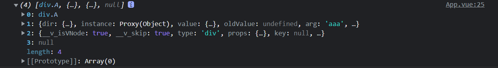


第三个 当前元素的虚拟DOM 也就是Vnode


第四个 prevNode 上一个虚拟节点，仅在 `beforeUpdate` 和 `updated` 钩子中可用 


### 函数简写

你可能想在 `mounted` 和 `updated` 时触发相同行为，而不关心其他的钩子函数。那么你可以通过将这个函数模式实现

```vue
<template>
   <div>
      <input v-model="value" type="text" />
      <A v-move="{ background: value }"></A>
   </div>
</template>
   
<script setup lang='ts'>
import A from './components/A.vue'
import { ref, Directive, DirectiveBinding } from 'vue'
let value = ref<string>('')
type Dir = {
   background: string
}
const vMove: Directive = (el, binding: DirectiveBinding<Dir>) => {
   el.style.background = binding.value.background
}
</script>

<style></style>
```


### 自定义指令案例

1. **自定义拖拽指令**

```vue
<template>
  <div v-move class="box">
    <div class="header"></div>
    <div>
      内容
    </div>
  </div>
</template>
 
<script setup lang='ts'>
import { Directive } from "vue";
const vMove: Directive = {
  mounted(el: HTMLElement) {
    let moveEl = el.firstElementChild as HTMLElement;
    const mouseDown = (e: MouseEvent) => {
      //鼠标点击物体那一刻
      //相对于物体左侧边框的距离=点击时的位置相对于浏览器最左边的距离-物体左边框相对于浏览器最左边的距离
      console.log(e.clientX, e.clientY, "-----起始", el.offsetLeft);
      let X = e.clientX - el.offsetLeft;
      let Y = e.clientY - el.offsetTop;
      const move = (e: MouseEvent) => {
        el.style.left = e.clientX - X + "px";
        el.style.top = e.clientY - Y + "px";
        console.log(e.clientX, e.clientY, "---改变");
      };
      document.addEventListener("mousemove", move);
      document.addEventListener("mouseup", () => {
        document.removeEventListener("mousemove", move);
      });
    };
    moveEl.addEventListener("mousedown", mouseDown);
  },
};
</script>
 
<style lang='less'>
.box {
  position: fixed;
  left: 50%;
  top: 50%;
  transform: translate(-50%, -50%);
  width: 200px;
  height: 200px;
  border: 1px solid #ccc;
  .header {
    height: 20px;
    background: black;
    cursor: move;
  }
}
</style>
```


2. **权限按钮**

```vue
<template>
  <div class="btns">
    <button v-has-show="'shop:create'">创建</button>
    <button v-has-show="'shop:edit'">编辑</button>
    <button v-has-show="'shop:delete'">删除</button>
  </div>
</template>

<script setup lang="ts">
import { ref, reactive } from "vue";
import type { Directive } from "vue";

// permission (获取根据 userId 进行判断)
localStorage.setItem("userId", "Lin");

// mock 后台返回的权限数据
const permission = [
  "Lin:shop:edit",
  // "Lin:shop:create",
  "Lin:shop:delete",
];

const userId = localStorage.getItem("userId") as string;
const vHasShow: Directive<HTMLButtonElement, string> = (el, bingding) => {
  console.log(el, bingding);
  if (!permission.includes(userId + ":" + bingding.value)) {
    el.style.display = "none";
  }
};
</script>

<style scoped lang="less">
.btns {
  button {
    margin: 10px;
  }
}
</style>
```


**IntersectionObserver** API 每个属性的含义

- **time**: 可见性发送变化的时间, 是一个高精度时间戳, 单位为毫秒
- **target**: 被观察的目标元素, 是一个 DOM 节点对象
- **rootBounds**: 容器元素的矩形区域的信息, **getBoundingClientRect()** 方法的返回值, 如果没有容器元素 (即直接相对于视图滚动), 则返回 null
- **boundingClientRect**: 目标元素的矩形区域的信息
- **intersectionRect**: 目标元素与视图 (或容器元素) 的交叉区域的信息
- **intersectionRatio**: 目标元素的可见比例, 即 **intersectionRect** 占 **boundingClientRect** 的比例, 完全可见时为 1, 完全不可见时小于等于 0


3. **图片懒加载**

```vue
<template>
  <div>
    <div>
      
    </div>
  </div>
</template>

<script setup lang="ts">
import { ref, reactive } from "vue";
import type { Directive } from "vue";
// glob 是懒加载的模式
// let modules = {
//   xxxxx: () => import("xxxxx"),
// };

// globEager 静态加载
// import xx from 'xxxx'

// let imageList = import.meta.globEager("./assets/images/*.*"); 下面是另一种写法
let imageList: Record<string, { default: string }> = import.meta.glob(
  "./assets/images/*.*",
  { eager: true }
);
// Object.values 返回一个给定对象自身的所有可枚举属性值的数组, 对象转数组
let arr = Object.values(imageList).map((v) => v.default);

console.log(arr);

let vLazy: Directive<HTMLImageElement, string> = async (el, bingding) => {
  // 加载图片
  const def = await import("./assets/vue.svg");
  el.src = def.default;
  // js 新的 API 去监控元素是否在可视区域
  const observer = new IntersectionObserver((enr) => {
    if (enr[0].intersectionRatio > 0) {
      // 实际开发可以去掉 这个定时器
      setTimeout(() => {
        el.src = bingding.value;
      }, 2000);
      // 解除元素监听
      observer.unobserve(el);
    }
  });
	// 绑定元素监听
  observer.observe(el);
};
</script>
<style scoped lang="less"></style>
```


**知识点**

1. 图片批量加载 `import.meta.glob` `import.meta.globEager`
2. 对象转数组 `Object.values`
3. JS 新 API 去监控元素是否在可视区域 `IntersectionObserver`


## 自定义 Hooks

### 简介

**Vue3** 自定义 Hook

主要用来处理复用代码逻辑的一些封装


这个在 **vue2** 就已经有一个东西是 **Mixins**

**Mixins** 就是将这些多个相同的逻辑抽离出来，各个组件只需要引入 **mixins**，就能实现一次写代码，多组件受益的效果

弊端就是 会涉及到覆盖的问题


Mixins 缺点

第一点, 组件的 data、methods、filters 会覆盖 mixins 里的同名 data、methods、filters

第二点, 变量来源不明确（隐式传入），不利于阅读，使代码变得难以维护


Vue3 的自定义的hook

- Vue3 的 hook函数 相当于 vue2 的 mixin, 不同在与 hooks 是函数
- Vue3 的 hook函数 可以帮助我们提高代码的复用性, 让我们能在不同的组件中都利用 hooks 函数


Vue3 hook 库 [VueUse](http://www.vueusejs.com/functions.html)

```vue
<template>
  <div></div>
</template>

<script setup lang="ts">
import { useAttrs, useSlots } from "vue";

// 获取 proxy、slot 
let attr = useAttrs();
let slot = useSlots();

console.log(attr, slot);
</script>
<style scoped lang="less"></style>
```


### 案例

图片转 base64

```vue
<!-- 调用页 -->
<template>
  <div>
    
  </div>
</template>

<script setup lang="ts">
import useBase64 from "./hooks";

useBase64({ el: "#img" }).then((res) => {
  console.log(res.baseUrl);
});
</script>

<style scoped lang="less"></style>
```

```typescript
// 定义页
import { onMounted } from "vue";

type Options = {
  el: string;
};

export default function (options: Options): Promise<{ baseUrl: string }> {
  return new Promise((resolve) => {
    onMounted(() => {
      let img: HTMLImageElement = document.querySelector(
        options.el
      ) as HTMLImageElement;
      console.log(img, "=======>");
      img.onload = () => {
        resolve({
          baseUrl: base64(img),
        });
      };
    });
    const base64 = (el: HTMLImageElement) => {
      const canvas = document.createElement("canvas");
      const ctx = canvas.getContext("2d");
      canvas.width = el.width;
      canvas.height = el.height;
      ctx?.drawImage(el, 0, 0, canvas.width, canvas.height);
      return canvas.toDataURL("image/jpg");
    };
  });
}
```


## 自定义 插件

### 插件是什么

插件是自包含的代码，通常向 Vue 添加全局级功能。你如果是一个对象需要有 install 方法 Vue 会帮你自动注入到 install 方法 你如果是 function 就直接当 install 方法去使用


### 使用插件

在使用 `createApp()` 初始化 Vue 应用程序后，你可以通过调用 `use()` 方法将插件添加到你的应用程序中

实现一个 Loading


### 目录结构

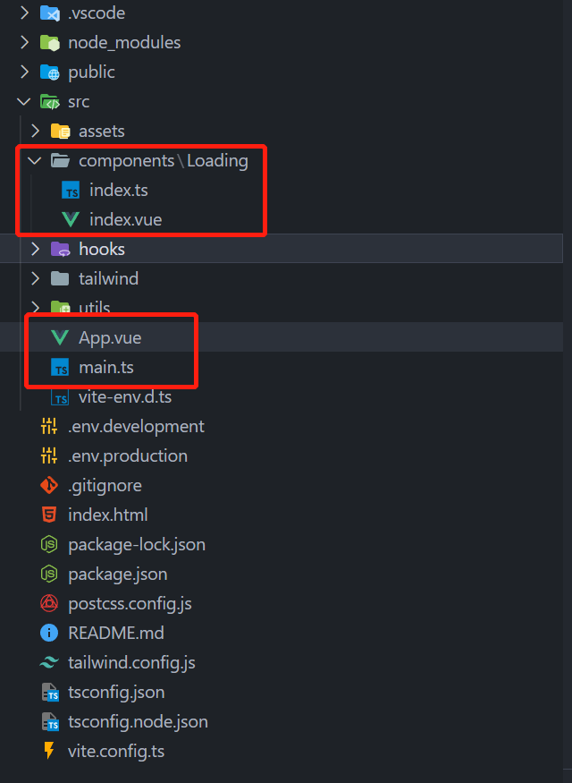		


### 对应文件内容

**components/Loading/index.vue**

编写全局 Loading 插件, 的功能和样式

```vue
<template>
    <div v-if="isShow" class="loading">
        <div class="loading-content">Loading...</div>
    </div>
</template>
    
<script setup lang='ts'>
import { ref } from 'vue';
const isShow = ref(false)//定位loading 的开关
 
const show = () => {
    isShow.value = true
}
const hide = () => {
    isShow.value = false
}
//对外暴露 当前组件的属性和方法
defineExpose({
    isShow,
    show,
    hide
})
</script>
 
 
    
<style scoped lang="less">
.loading {
    position: fixed;
    inset: 0;
    background: rgba(0, 0, 0, 0.8);
    display: flex;
    justify-content: center;
    align-items: center;
    &-content {
        font-size: 30px;
        color: #fff;
    }
}
</style>
```


**components/Loading/index.ts**

使用 VNode 将组件渲染, 并挂载到 body 上, 并全局注册使用方法名

```typescript
import {  createVNode, render, VNode, App } from 'vue';
import Loading from './index.vue'
 
export default {
    install(app: App) {
        //createVNode vue提供的底层方法 可以给我们组件创建一个虚拟DOM 也就是Vnode
        const vnode: VNode = createVNode(Loading)
        //render 把我们的Vnode 生成真实DOM 并且挂载到指定节点
        render(vnode, document.body)
        // Vue 提供的全局配置 可以自定义
        app.config.globalProperties.$loading = {
            show: () => vnode.component?.exposed?.show(),
            hide: () => vnode.component?.exposed?.hide()
        }
 
    }
}
```


**App.vue**

全局 Loading 插件的使用

```vue
<template>
  <div></div>
</template>
 
<script setup lang='ts'>
import { ref,reactive,getCurrentInstance} from 'vue'
const instance = getCurrentInstance()  

instance?.proxy?.$Loading.show()

setTimeout(()=>{
  instance?.proxy?.$Loading.hide()
},2000)

// console.log(instance)
</script>
<style>
*{
  padding: 0;
  margin: 0;
}
  
</style>
```


**main.ts**

全局引入 Loading 插件

```typescript
import Loading from './components/loading'

let app = createApp(App)
app.use(Loading)
 
type Lod = {
    show: () => void,
    hide: () => void
}
//编写ts loading 声明文件放置报错 和 智能提示
declare module '@vue/runtime-core' {
    export interface ComponentCustomProperties {
        $loading: Lod
    }
}

app.mount('#app')
```


## 编程风格

### Template 风格

```vue
```


### TSX 风格


### 函数式编程


## 性能优化

### 分析工具

打开浏览器的调试工具, 选择 Lighthouse, 点击分析网页加载情况即可, 进行分析

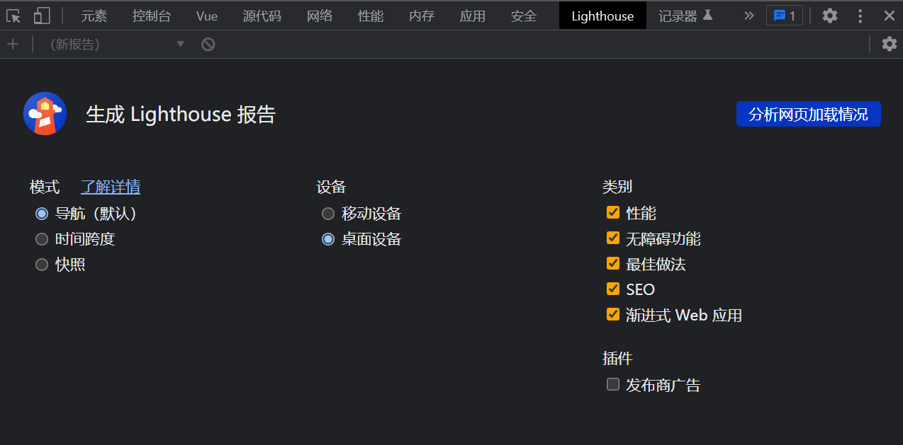


**分析数据解析**

**FCP (First Contentful Paint)**

首次内容绘制的时间，浏览器第一次绘制DOM相关的内容，也是用户第一次看到页面内容的时间


**Speed Index**

页面各个可见部分的显示平均时间，当我们的页面上存在轮播图或者需要从后端获取内容加载时，这个数据会被影响到


**LCP (Largest Contentful Paint)**

最大内容绘制时间，页面最大的元素绘制完成的时间


**TTI（Time to Interactive）**

从页面开始渲染到用户可以与页面进行交互的时间，内容必须渲染完毕，交互元素绑定的事件已经注册完成

TBT（Total Blocking Time）

记录了首次内容绘制到用户可交互之间的时间，这段时间内，主进程被阻塞，会阻碍用户的交互，页面点击无反应


**CLS（Cumulative Layout Shift）**

计算布局偏移值得分，会比较两次渲染帧的内容偏移情况，可能导致用户想点击A按钮，但下一帧中，A按钮被挤到旁边，导致用户实际点击了B按钮


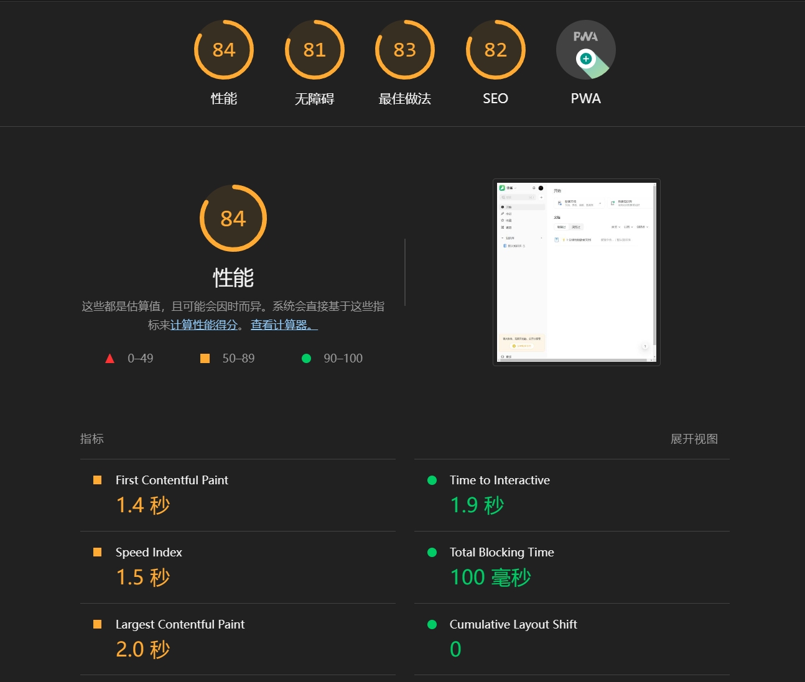


当然我们可以使用第三方的插件进行分析 `rollup-plugin-visualizer`

安装

```shell
npm install rollup-plugin-visualizer
```


vite.config.ts 配置 记得设置open 不然无效

```json
import { visualizer } from 'rollup-plugin-visualizer';
plugins: [vue(), vueJsx(),visualizer({
      open:true
})],
```


然后进行npm run build打包

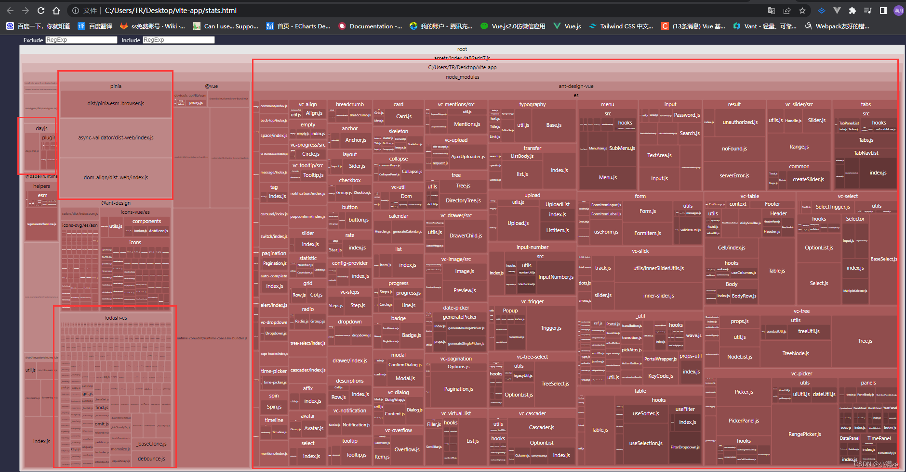

可以从中判断, 那个包比较大, 看看能否按需引入, 从而减少包体积


### Vite 配置优化

```json
build:{
       chunkSizeWarningLimit:2000,
       cssCodeSplit:true, //css 拆分
       sourcemap:false, //不生成sourcemap
       minify:false, //是否禁用最小化混淆，esbuild打包速度最快，terser打包体积最小。
       assetsInlineLimit:5000 //小于该值 图片将打包成Base64 
},
```

可以配置它, 把 js、css压缩打包, 图片打包成 Base64, 不生成 sourcemap


### PWA 离线缓存技术

安装

```shell
npm install vite-plugin-pwa -D
```


使用

```javascript
import { VitePWA } from 'vite-plugin-pwa' 
plugins: [vue(),VitePWA(), vueJsx(),visualizer({
      open:true
})],
```


PWA 技术的出现就是让web网页无限接近于 Native 应用

1. 可以添加到主屏幕，利用manifest实现
2. 可以实现离线缓存，利用service worker实现
3. 可以发送通知，利用service worker实现

```typescript
VitePWA({
    workbox:{
        cacheId:"XIaoman",//缓存名称
        runtimeCaching:[
          {
            urlPattern:/.*\.js.*/, //缓存文件
            handler:"StaleWhileRevalidate", //重新验证时失效
            options:{
              cacheName:"XiaoMan-js", //缓存js，名称
              expiration:{
                maxEntries:30, //缓存文件数量 LRU算法
                maxAgeSeconds:30 * 24 * 60 * 60 //缓存有效期
              }
            }
          }
        ]
    },
})
```


进行 npm run build 打包会生成 sw.js


### 图片懒加载

```javascript
// 引入
import lazyPlugin from 'vue3-lazy'
```

```html
// 使用指令即可

```


### 路由懒加载

```json
{
    path: '/chinaWine',
    name: 'chinaWine',
    component: resolve => require(['./views/chinaWine'], resolve)
},
```

此方法会把原本打包到一个app.js文件分开成多个js文件打包，这样会减小单个文件的大小，但是不会减小整个js文件夹的大小

通过这种方式可以做到按需加载，只加载单个页面的js文件


### CDN 引入第三方库

项目开发过程中, 我们会用到很多第三方库, 可以使用按需引入, 减少所占空间

也有一些不能按需引入, 我们可以采用 CDN 的方式引入, 在 index.html 中引入, 去掉其他页面的 import 引入

修改 webpack 的相关配置, 避免编译的时候找不到


### 骨架屏

页面白屏时间过长 (请求接口过多的情况下), 可以考虑骨架屏

但是骨架屏模板需要自己去画的, 比如 element-ui 提供的骨架屏


```vue
<template>
  <el-skeleton style="width: 240px">
    <template slot="template">
      <el-skeleton-item variant="image" style="width: 240px; height: 240px;" />
      <div style="padding: 14px;">
        <el-skeleton-item variant="p" style="width: 50%" />
        <div
          style="display: flex; align-items: center; justify-items: space-between;"
        >
          <el-skeleton-item variant="text" style="margin-right: 16px;" />
          <el-skeleton-item variant="text" style="width: 30%;" />
        </div>
      </div>
    </template>
  </el-skeleton>
</template>
```


### 虚拟列表

比如说, 后台返回 10万条数据, 前端要如何渲染

就可以使用虚拟列表, 原理很简单, 就是只渲染可视区域的 DOM

我们可以直接使用 element-ui 现成的 Virtualized Table 虚拟列表


### webWorker

使用 new Worker 创建多线程, 用于计算频繁的前端场景

worker 脚本只会在后台运行, 不会影响到主进程

worker脚本与主进程的脚本必须遵守同源限制。他们所在的路径协议、域名、端口号三者需要相同

```javascript
const myWorker1 = new Worker("./calcBox.js");
```


**worker 脚本 与 主进程通讯**

都使用 postMessage 发送消息

```javascript
worker.postMessage(arrayBuffer, [arrayBuffer]);
```


都使用 onmessage 接收消息

```javascript
self.onmessage = function (e) {
 	// xxx这里是worker脚本的内容
};
```


关闭

```javascript
worker.terminate(); 
```


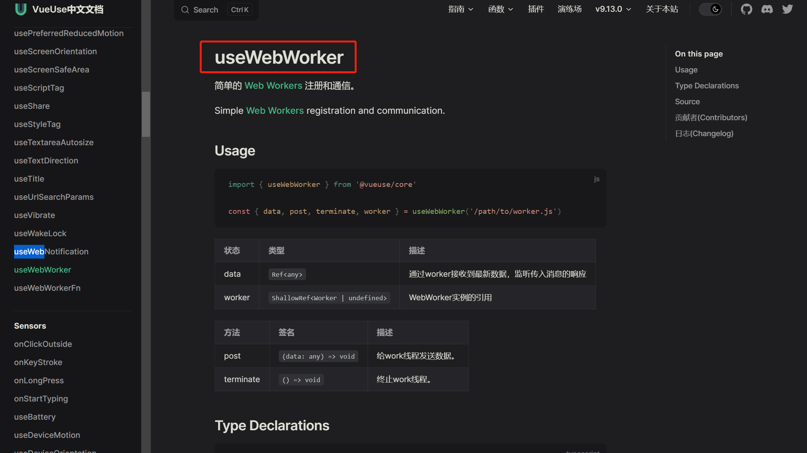


> VueUse 库已经集成了 webWorker
>
> [VueUse中文文档](http://www.vueusejs.com/)


### 节流 | 防抖


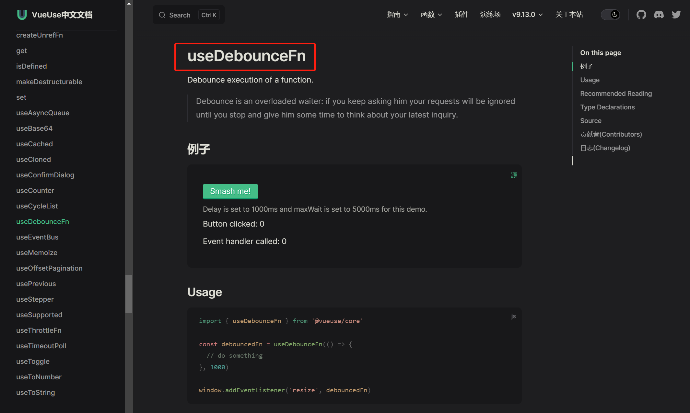


> VueUse 库已经集成了 节流防抖
>
> [VueUse中文文档](http://www.vueusejs.com/)


## 跨域

### 什么是跨域?

由于浏览器处于安全考虑的 **同源策略** 限制

当一个请求 url 的 **协议、域名、端口** 三者任意有一个与当前页面的 url 不同即为跨域

| 协议不同 | http://wwww.....          | https://wwww.....          |
| -------- | ------------------------- | -------------------------- |
| 端口不同 | 127.0.0.1: 3000           | 127.0.0.1: 80              |
| 域名不同 | https://www.baidu.com/api | https://www.tenxun.com/api |


### 解决跨域

1. jsonp (不支持 post, 而且接口多, 写起来麻烦)

这种方式在之前很常见，他实现的基本原理是利用了 HTML 里 script 元素标签没有跨域限制, 动态创建 script标签，将src作为服务器地址，服务器返回一个 callback 接受返回的参数

```javascript
function clickButton() {
    let obj, s
    obj = { "table":"products", "limit":10 }; //添加参数
    s =  document.createElement("script"); //动态创建script
    s.src = "接口地址xxxxxxxxxxxx"  + JSON.stringify(obj);
    document.body.appendChild(s);
 }
//与后端定义callback名称
function myFunc(myObj)  {
    //接受后端返回的参数
    document.getElementById("demo").innerHTML = myObj;
}
```


2. CORS (不推荐)

设置 CORS 允许跨域资源共享 需要后端设置

```json
{
  "Access-Control-Allow-Origin": "http://web.xxx.com" //可以指定地址
}
```

```json
// 这样设置的话, 会导致后端读不到 session
{
  "Access-Control-Allow-Origin": "*" //也可以使用通配符 任何地址都能访问 安全性不高
}
```


3. 代理的方式, 解决跨域 (上线需要去配置服务器的代理)

**vite 使用 proxy 解决跨域**

原理就是, 使用 `/api` 去替换 `http://localhost:9999`

```json
// vite.config.js
import { defineConfig } from 'vite'
import vue from '@vitejs/plugin-vue'

// https://vitejs.dev/config/
export default defineConfig({
  server: {
    // 添加 proxy 代理, 只适用于 dev 环境
    proxy: {
      '/api': {
        target: "http://localhost:9999",
        rewrite: (path) => path.replace(/^\/api/,'')
      }
    }
  },
  plugins: [vue()],
})
```


使用的请求, 前面加上 `/api` 就可以了

```javascript
fetch("/api/user");
```


当然了, 如果你不想写 rewrite 去替换, 那么只需要在后台接口上加上 `/api` 就好了

```javascript
const express = require("express");

const app = express();

app.get("/api/user", (req, res) => {
  res.json({
    code: 200,
    message: "haole",
  });
});

app.listen(9999, () => {
  console.log("9999");
});
```


> **`[注意]`**
>
> 这个 proxy 代理只适用于 dev 环境
>
> 因为 dev 环境启的是一个 node 环境, 会去走这个代理, 上线之后不会去启这个 node 服务
>
> 上线之后, 可以会把打包后的代码放在 nginx、Tomecat、Apache 上面
>
> 所以上线之后, 我们需要再去做一个, 比如 nginx 上的 proxy_pass


## 环境变量

### 介绍

简单点来说, 它的作用就是让开发者区分不同的运行环境, 来实现 兼容开发和生产


**例子-1**

比如, 我这个页面的表单有很多的参数需要去填, 我就写了一个一键填充表单的功能, 让测试方便测试

但是这个功能, 我只要在 dev 环境下能用, 生产环境没有这个功能, 那么我们就可以使用环境变量去控制


**例子-2**

比如, 我们开发环境的使用的测试的域名, 与生产的环境的域名是不一样的, 我们就可以用 `BASE_URL` 这个环境变量去配置


[Vite](https://so.csdn.net/so/search?q=Vite&spm=1001.2101.3001.7020) 在一个特殊的 `import.meta.env` 对象上暴露环境变量。这里有一些在所有情况下都可以使用的内建变量

```javascript
console.log(import.meta.env)
// 可以打印很多环境变量
{
  "BASE_URL":"/", //部署时的URL前缀
  "MODE":"development", //运行模式
  "DEV":true,  //是否在dev环境
  "PROD":false, //是否是build 环境
  "SSR":false //是否是SSR 服务端渲染模式
}
```


> **`[注意]`**
>
> 需要注意的一点的是, 这个环境变量不能使用 **动态赋值** `import.meta.env[key]`
>
> 因为这些环境变量在打包的时候, 是会被硬编码的 (也就就写死) 通过 JSON.stringify 注入浏览器的


### 自定义环境变量

在根目录新建 env 文件, 可以创建多个

名称格式 `env.[name]`, 环境变量名必须以 `VITE_` 开头, 不然会无效的


```json
// .env.development 开发环境文件名称
VITE_HTTP = http://www.baidu.com

// .env.production 生产环境文件名称
VITE_HTTP = http://www.jindong.com
```


然后我们再去 package.json 配置下 `vite` 前面加上 `--model development`

```json
{
  "script":{
		"dev": "vite --model development" // development 与 开发环境文件名称一样
  }
}
```


我当前是 vue 3.2.47, 可以不用配置 package.json

就能直接使用 `import.meta.env` 获取到 dev 的自定义环境变量

当然拉, 生产也是不用配置的, 会自动去读取配置文件的环境变量的


## CSS样式框架 tailwindcss

### 基本使用

1. 安装

```shell
npm install -D tailwindcss@latest postcss@latest autoprefixer@latest
```

2. 生成配置文件

```shell
npx tailwindcss init -p
```

3. 相关配置, 可以去看官方文档

[Installation 3](https://tailwindcss.com/docs/installation)

4. 修改配置文件 tailwind.config.js

```json
// 3.0 版本
module.exports = {
  // 2.0 的话用下面的替换
  // purge: ['./index.html', './src/**/*.{vue,js,ts,jsx,tsx}'],
  content: ['./index.html', './src/**/*.{vue,js,ts,jsx,tsx}'],
  theme: {
    extend: {},
  },
  plugins: [],
}
```

5. 创建一个 index.css 引入样式

路径: src -> tailwind -> index.css

```css
@tailwind base;
@tailwind components;
@tailwind utilities;
```

6. main.js 中引入 index.css

```typescript
import './tailwind/index.css'
```

7. npm run dev 运行下面例子, 就能看到效果

例子

```vue
<template>
  <div
    class=
    "w-screen 
    h-screen 
    bg-red-600 
    flex 
    justify-center 
    items-center 
    text-8xl 
    text-slate-200"
  >
    hello tailwind
  </div>
</template>

<script setup lang="ts"></script>
<style scoped lang="less"></style>
```


## CSS动画库 animate.css

### 基本使用

1. 安装

```shell
npm install animate.css -S
```

2. 引入

```javascript
// 需要使用的页面
import 'animate.css'
```

[注意]

每个复制的动画, 4.x 后每个过渡动画名都要加一个前缀 `animate_`

[Animate.css 官网](https://animate.style/)

3. 使用

```vue
<template>
	
</template>
```


## 动画

### 平移动画的使用

```vue
<template>
  <div>
    <button @click="random">random</button>
    <transition-group move-class="mmm" class="wraps" tag="div">
      <div class="items" v-for="item in list" :key="item.id">{{ item.number }}</div>
    </transition-group>
  </div>
</template>

<script setup lang="ts">
import { ref } from 'vue'

let list = ref(
  Array.apply(null, { length: 81 } as number[]).map((_, index) => {
    return {
      id: index,
      number: (index % 9) + 1
    }
  })
)

const random = () => {
  list.value = list.value.sort(() => Math.random() - 0.5)
}
</script>
<style scoped lang="less">
.wraps {
  display: flex;
  flex-wrap: wrap;
  width: calc(25px * 9 + 9px);
  .items {
    width: 25px;
    height: 25px;
    border: 1px solid #ccc;
    display: flex;
    justify-content: center;
    align-items: center;
  }
}

.mmm {
  transition: all 1s;
}
</style>
```


## BEM 架构 + layout 布局

### 什么是 BEM 呢？

其实 BEM 架构 就是命名规范

BEM (block element modify) --- 块 元素 修饰

如：`el-input__wrapper` 横杠表示 **块**，双下划线表示 **元素**

​	`el-button--primary` 双横杠表示 **需要修饰的一个类名**


### 前提

可以先学习下 `sass` ，比较好理解，BEM 架构

[Sass 中文手册](https://www.sass.hk/guide/)


> **[扩展]**
>
> css 还是有很多单位的不止 px、em、rem、vw、vh，还有 cm、mm、in、px、pt、pc
>
> [CSS 单位 ](https://www.w3school.com.cn/cssref/css_units.asp)


1. 绝对长度

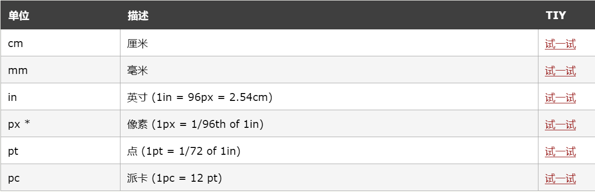


2. 相对长度

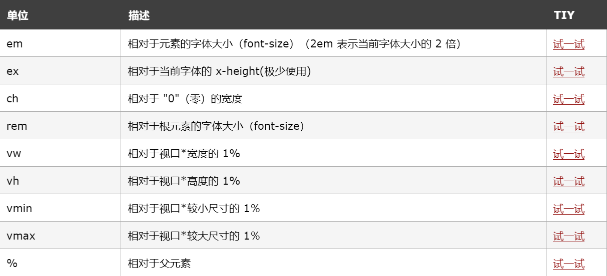


### BEM 架构


**通过配置文件引入**

```typescript
// vite.config.ts
import { defineConfig } from "vite";
import vue from "@vitejs/plugin-vue";

// https://vitejs.dev/config/
export default defineConfig({
  server: {
    proxy: {
      "/api": {
        target: "http://localhost:9999",
        // rewrite: (path) => path.replace(/^\/api/,'')
      },
    },
  },
  plugins: [vue()],
  css: {
    preprocessorOptions: {
      scss: {
        additionalData: `@import "./src/bem.scss";`,
      },
    },
  },
});
```


**实现**

```scss
// Bem.scss
$namespace: 'xm' !default;
$block-sel: "-" !default;
$elem-sel: "__" !default;
$mod-sel: "--" !default;

@mixin bfc {
  height: 100%;
  overflow: hidden;
}

@mixin b($block) {
  $B:#{$namespace + $block-sel + $block};
  .#{$B} {
    @content;
  }
}

@mixin e($el){
  $selector:&;
  @at-root {
    #{$selector + $elem-sel + $el} {
      @content;
    }
  }
}

@mixin m($m) {
  $selector: &;
  @at-root {
    #{$selector + $mod-sel + $m} {
      @content;
    }
  }
}
```


**[注意]**

app 里面是没有 `scoped`，因为 app.vue 的样式是全局生效的


### Layout 布局

使用 BEM 架构实现 Layout 布局


**目录结构 ( Layout 布局的结构 )**

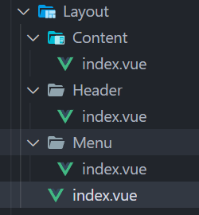		


**实现**

1. 引入 Layout 组件

```vue
<!-- App.vue -->
<template>
  <Layout></Layout>
</template>

<script setup lang="ts">
import Layout from "./Layout/index.vue";
</script>

<style lang="scss">
#app {
  @include bfc;
}
</style>
```


2. Layout 组件

```vue
<!-- Content/index.vue -->
<template>
  <div class="xm-content">
    <div class="xm-content__items" v-for="item in 100">{{ item }}</div>
  </div>
</template>

<script setup lang="ts">
import { ref, reactive } from "vue";
</script>
<style scoped lang="scss">
@include b(content) {
  flex: 1;
  overflow: auto;
  @include e(items) {
    padding: 10px;
    margin: 10px;
    border: 1px solid #ccc;
    border-radius: 4px;
  }
}
</style>
```


```vue
<!-- Header/index.vue -->
<template>
  <div class="xm-header">Header</div>
</template>

<script setup lang="ts">
import { ref, reactive } from "vue";
</script>

<style scoped lang="scss">
@include b(header) {
  height: 60px;
  border-bottom: 1px solid #ccc;
}
</style>
```


```vue
<!-- Menu/index.vue -->
<template>
  <div class="xm-menu">Menu</div>
</template>

<script setup lang="ts">
import { ref, reactive } from "vue";
</script>

<style scoped lang="scss">
@include b(menu) {
  min-width: 200px;
  height: 100%;
  border-right: 1px solid #ccc;
}
</style>
```


