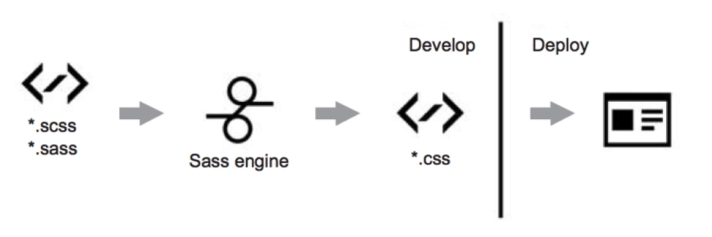
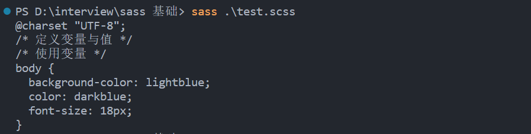
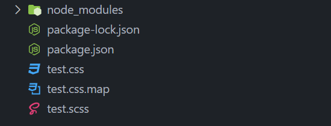

# sass 入门

## 使用流程




## 演变历史

**.Sass**

以前的 `sass` 的文件名后缀是 `.sass`, 下面为其语法

```sass
h1 
    color: #000
    background: #fff
```

**.Scss**

在 3.x 以后的版本, 引入了 `.scss` 的语法, 类似于我们的 `css` 语法

有了 "花括号“、“分号”, 可以直接兼容 老的项目的 `css`

```scss
h1 {
    color: #000;
    background: #fff;
}
```


> 注意: 一个项目中可以混合使用两种语法, 但不能在一个文件中使用两种语法


## 安装方法

1. 使用 `npm` 进行安装, 其他安装方法可自行百度

```shell
npm install -g sass
```


2. 查看版本

```shell
sass --version
```


3. 编译

```shell
// 直接将输出结果输出在终端
sass test.scss
```

	


```shell
// 将结果以文件输出, 后面再加 .css 的文件名即可
sass test.scss test.css
```

		


## 基本使用

#### 变量的定义与使用

`sass` 变量定义, 使用 `$` 符号

```scss
/* 定义变量与值 */
$bgcolor: lightblue;
$textcolor: darkblue;
$fontsize: 18px;

/* 使用变量 */
body {
    background-color: $bgcolor;
    color: $textcolor;
    font-size: $fontsize;
}
```


>  扩展: css 变量的定义与使用

```css
/* 变量的定义 */
/* -- 两个减号 */
:root {
    --main-bg-color: brown;
}

/* 变量的使用 */
.element {
    background-color: var(--main-bg-color);
}
```


#### 文件的引用

直接使用 `@import`, 即可导入, 这个语法原生 `css` 也是有的

```scss
// 单文件引入
@import "variables";

// 多文件引入
@import "variables", "compass/reset";
```


如果要使用 `css` 原生 `@import` , 可以按以下既定规则

1. 当 `@import` 后边跟着文件名是以 `.css` 结尾的时候
2. 当 `@import` 后边跟着的是 `http://` 开头的字符串的时候
3. 当 `@import` 后边跟着的是 `url()` 开头的字符串的时候
4. 当 `@import` 后边跟着的是 `media queries` 开头的字符串的时候


如果要使用 `sass` 的 `@import` , 可以按以下既定规则

1. 没有文件后缀名的时候, `sass` 会添加 `.scss` 或者 `.sass` 的后缀
2. 同一个目录下, 所有文件不能重名


> 扩展: 如果你不想 `sass` 文件被编译, 可以在前面加 `_` 下划线, 比如 `_filename` 这样文件就会被忽略


#### 注释的不同

`sass` 有两种注释方式

```scss
// test.scs 文件
// 主题样式
.headline {
    font-family: $headline-ff;
}

/* 页面样式 */
.main-sec {
	font-family: $main-sec-ff;
}
```


那这两种样式有何不同呢? 我们看下编译后的文件

```css
/* test.css 文件, 由 test.scss 编译而来 */
.headline {
    font-family: Braggadocio;
}

/* 页面样式 */
.main-sec {
	font-family: Arial;
}
```

可以看到, `.headline` 没有注释信息, 而 `.main-sec` 有, 说明 `//` 双斜线注释, 不会被编译


> 扩展: `css` 注释, 只能使用 `/* */` 进行注释


#### 作用域

Sass 具有作用域类似于 `JavaScript` 的中的函数作用域

```scss
$myColor: red;

h1 {
    $myColor: green;   // 只在 h1 里头有用，局部作用域
  	color: $myColor;
}

p {
  	color: $myColor;
}
```

编译结果

```css
h1 {
  	color: green;
}

p {
  	color: red;
}
```


#### 嵌套规则与属性

嵌套规则的使用

```scss
// scss 文件
nav {
  	ul {
    	margin: 0;
    	padding: 0;
    	list-style: none;
  }
  	li {
    	display: inline-block;
  }
  	a {
    	display: block;
   		padding: 6px 12px;
    	text-decoration: none;
  }
}
```

```css
/* 编译后 .css 文件 */
nav ul {
  	margin: 0;
  	padding: 0;
  	list-style: none;
}
nav li {
  	display: inline-block;
}
nav a {
  	display: block;
  	padding: 6px 12px;
  	text-decoration: none;
}
```


嵌套属性的使用

```scss
// scss 文件
font: {
  	family: Helvetica, sans-serif;
  	size: 18px;
  	weight: bold;
}

text: {
  	align: center;
  	transform: lowercase;
  	overflow: hidden;
}
```

```css
/* 编译后 .css 文件 */
font-family: Helvetica, sans-serif;
font-size: 18px;
font-weight: bold;

text-align: center;
text-transform: lowercase;
text-overflow: hidden;
```


#### 混入的使用

**混入的基本使用**

混入的定义 `@mixin`

```scss
@mixin mixin-name {
  	color: red;
  	font-size: 25px;
  	font-weight: bold;
  	border: 1px solid blue;
}
```


混入的使用 `@include`

```scss
selector {
  	@include mixin-name;
}
```


**混入可以传递变量**

```scss
/* 混入接收两个参数 */
@mixin bordered($color, $width) {
  	border: $width solid $color;
}

.myArticle {
  	@include bordered(blue, 1px);  // 调用混入，并传递两个参数
}

.myNotes {
  	@include bordered(red, 2px); // 调用混入，并传递两个参数
}
```

编译后的 `.css` 文件

```css
.myArticle {
  	border: 1px solid blue;
}

.myNotes {
  	border: 2px solid red;
}
```


也可以设置默认值

```scss
@mixin sexy-border($color, $width: 1in) {
  	border: {
    	color: $color;
    	width: $width;
    	style: dashed;
  	}
}
p { @include sexy-border(blue); }
h1 { @include sexy-border(blue, 2in); }
```

编译结果

```css
p {
  	border-color: blue;
  	border-width: 1in;
  	border-style: dashed; 
}

h1 {
  	border-color: blue;
  	border-width: 2in;
  	border-style: dashed;
}
```


不定参数的情况下, 我们可以使用 `...` 来设置参数

```scss
@mixin box-shadow($shadows...) {
     -moz-box-shadow: $shadows;
     -webkit-box-shadow: $shadows;
     box-shadow: $shadows;
}

.shadows {
  	@include box-shadow(0px 4px 5px #666, 2px 6px 10px #999);
}
```

编译结果

```css
.shadows {
  	-moz-box-shadow: 0px 4px 5px #666, 2px 6px 10px #999;
  	-webkit-box-shadow: 0px 4px 5px #666, 2px 6px 10px #999;
  	box-shadow: 0px 4px 5px #666, 2px 6px 10px #999;
}
```


> 扩展: 浏览器前缀使用混入, 会很方便

```scss
@mixin transform($property) {
  	-webkit-transform: $property;
  	-ms-transform: $property;
  	transform: $property;
}

.myBox {
  	@include transform(rotate(20deg));
}
```

编译结果

```css
.myBox {
  	-webkit-transform: rotate(20deg);
  	-ms-transform: rotate(20deg);
  	transform: rotate(20deg);
}
```


#### 继承

**基本使用**

场景: 三个样式只有少量区别, 其中一个样式, 另外两个都有, 那么就可以使用继承

```scss
.button-basic  {
  	border: none;
  	padding: 15px 30px;
  	text-align: center;
  	font-size: 16px;
  	cursor: pointer;
}

.button-report  {
  	@extend .button-basic;
  	background-color: red;
}

.button-submit  {
  	@extend .button-basic;
  	background-color: green;
  	color: white;
}
```

编译结果

```css
.button-basic, .button-report, .button-submit {
  	border: none;
  	padding: 15px 30px;
  	text-align: center;
  	font-size: 16px;
  	cursor: pointer;
}

.button-report  {
  	background-color: red;
}

.button-submit  {
  	background-color: green;
  	color: white;
}
```


**继承多个选择器**

```scss
.one {
	width:100px;height:100px;
}
.two {
	/*继承的样式*/
	@extend .one, .three;
	/*独立的样式*/
	background:red;
	border:5px solid #000;
}
.three {
	padding:10px;
}
```

编译结果

```css
.one, .two {
  	width: 100px;
  	height: 100px;
}
 
.two {
  	/*独立的样式*/
  	background: red;
  	border: 5px solid #000;
}
 
.three, .two {
  	padding: 10px;
}
```


**使用 `%`, 用来构建只用来继承的选择器**

不使用 `%` 的情况

```scss
.error {
    color: #f00;
}

.serious-serror {
    @extend .error;
    border: 1px #f00;
}
```

编译结果

```css
.error, .serious-serror {
 	color: #f00;
}

.serious-serror {
  	border: 1px #f00;
}
```


使用 `%` 的情况

```scss
%error {
    color: #f00;
}

.serious-serror {
    @extend %error;
    border: 1px #f00;
}
```

编译结果

```css
.serious-serror {
  	color: #f00;
}

.serious-serror {
  	border: 1px #f00;
}
```


可以看到使用 `%` 的选择器 `.error` 就不显示了


> 扩展: extend 不可以继承嵌套选择器


#### 选择器

在函数内部使用 `&` 表示当前 (`&` add 符合)

```scss
.webdome-sec {
    &:hover {
        background-color: #f5f5f5;
    }
}
```

编译结果

```css
.webdome-sec:hover {
  	background-color: #f5f5f5;
}
```


#### 函数

`@function` 定义函数, 知道就好, 基本不用


